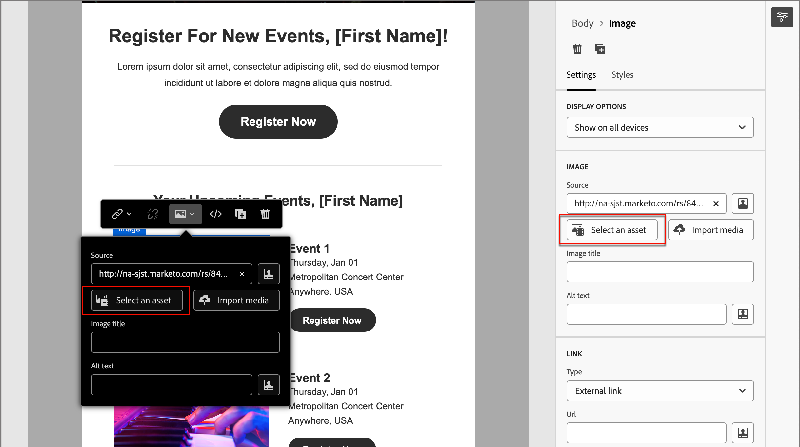

# Création de contenu - ressources

Dans l’éditeur de contenu visuel, sélectionnez l’icône _Assets_ (  ) qui s’affiche à gauche.

>[!NOTE]
>
>Si vous disposez d’un abonnement pour Experience Manager Assets as a Cloud Service avec Adobe Marketo Engage Design Studio par défaut, vous choisissez la [source d’image](../user/content/assets-overview.md#choose-an-asset-source) au moment de la création pour un email, un modèle de courrier électronique ou un fragment visuel. Vous pouvez également sélectionner la source de l’image avant d’ouvrir le concepteur visuel en vue de la modifier.

L’exemple suivant décrit les étapes à suivre pour ajouter des ressources au contenu du modèle :

1. Pour ouvrir la bibliothèque de ressources, cliquez sur l’icône _Assets_ .

   À partir du sélecteur de ressources, vous pouvez sélectionner directement des ressources stockées dans la bibliothèque source.

1. Ajoutez une nouvelle ressource en la faisant glisser dans un composant de structure.

   {width="800" zoomable="yes"}

   Pour plus d’informations sur l’utilisation des ressources de votre type source, voir [Ajout de ressources à votre contenu](../user/content/assets-overview.md#add-assets-to-your-content).

1. Remplacez une ressource image existante en la sélectionnant sur la zone de travail, puis en cliquant sur **[!UICONTROL Sélectionner une ressource]** dans les outils de source d’image.

   {width="600" zoomable="yes"}
