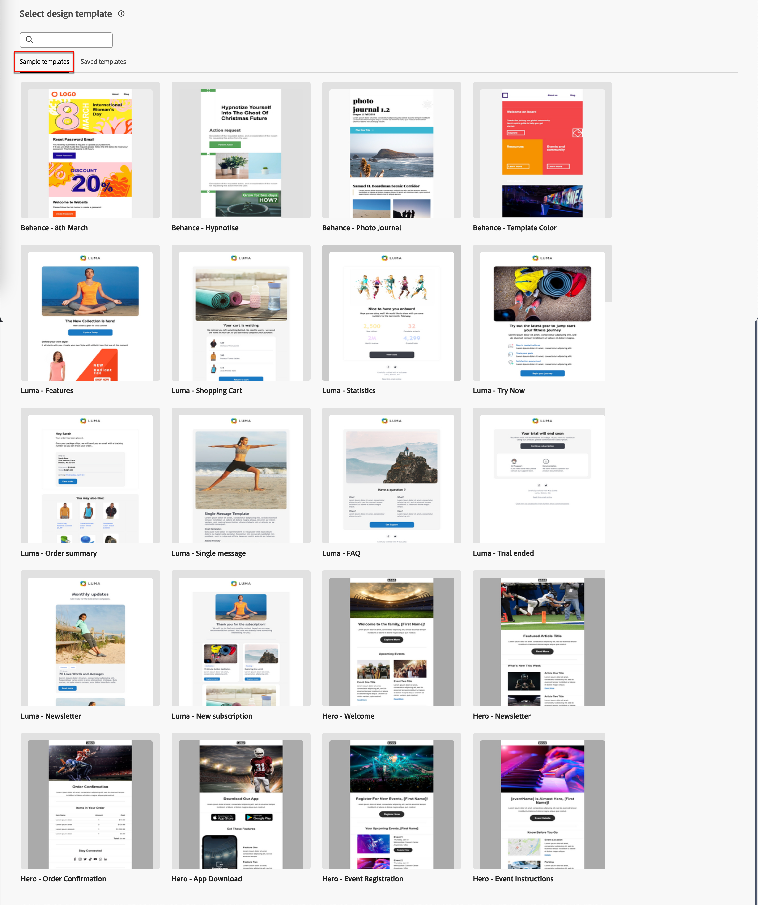

# Création de contenu - Sélectionner le modèle d’e-mail

Vous pouvez choisir parmi les options suivantes :

* **Exemples de modèles**. L’interface de Journey Optimizer propose 20 modèles d’e-mail prêts à l’emploi que vous pouvez choisir.

* **Modèles enregistrés**. Utilisez un modèle personnalisé enregistré que vous avez créé de toutes pièces à l’aide du menu _[!UICONTROL Modèles]_ ou enregistré dans un e-mail dans un parcours à l’aide de l’option _[!UICONTROL Enregistrer en tant que modèle de contenu]_.

Utilisez la section _[!UICONTROL Sélectionner un modèle de conception]_ pour commencer à créer le contenu à partir d’un modèle. Vous pouvez utiliser un modèle type ou un modèle d’e-mail personnalisé enregistré à partir de votre instance Journey Optimizer B2B edition.

>[!BEGINTABS]

>[!TAB Modèles enregistrés]

Sur la page d’accueil _Concevoir votre modèle_, l’onglet _Exemples de modèles_ est sélectionné par défaut. Pour utiliser un modèle personnalisé, sélectionnez l’onglet **[!UICONTROL Modèles enregistrés]**.

La liste de tous les modèles d’e-mail créés sur le sandbox actuel s’affiche. Vous pouvez les trier par _[!UICONTROL Nom]_, _[!UICONTROL Dernière modification]_ et _[!UICONTROL Dernière création]_.

{width="800" zoomable="yes"}

Sélectionnez le modèle de votre choix dans la liste.

Une fois la sélection effectuée, un aperçu du modèle s’affiche. En mode Aperçu , vous pouvez naviguer entre tous les modèles d’une catégorie (exemple ou modèle enregistré, selon votre sélection) à l’aide des flèches droite et gauche.

{width="800" zoomable="yes"}

Lorsque l’affichage correspond à ce que vous souhaitez utiliser, cliquez sur **[!UICONTROL Utiliser ce modèle]** en haut à droite de la fenêtre d’aperçu.

Cette action copie le contenu dans le concepteur de contenu visuel, où vous pouvez modifier le contenu selon vos besoins.

>[!TAB Exemples de modèles]

Adobe Journey Optimizer B2B edition propose une sélection de modèles d’email prêts à l’emploi _prêts à l’emploi_ qui peuvent être utilisés pour créer des e-mails et des modèles d’email.

{width="800" zoomable="yes"}

>[!ENDTABS]