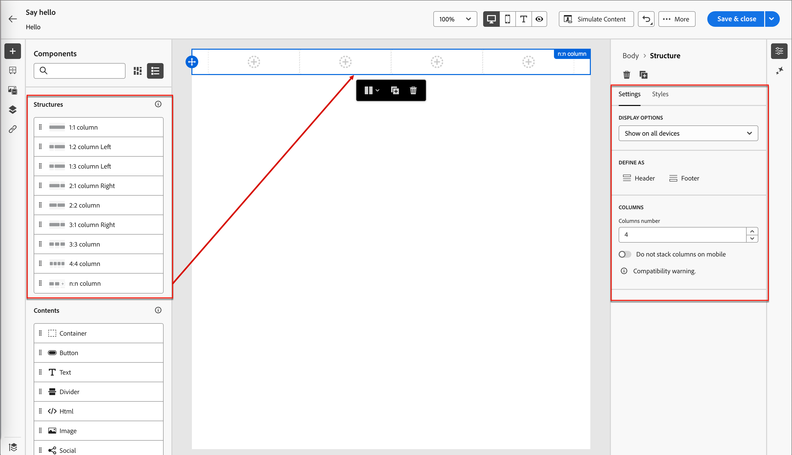
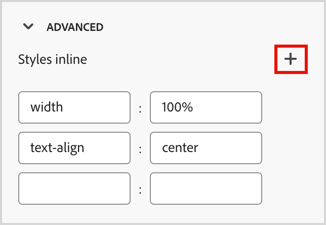

# Extraits

<!-- Content authoring steps for reuse -->

## Configuration des données d’intention {#intent-data-note}

>[!NOTE]
>
>Les données d’intention sont incluses lorsqu’elles sont configurées pour votre instance Journey Optimizer B2B edition. Elle nécessite également un ou plusieurs parcours publiés **ou** groupes d&#39;achats créés. Pour plus d’informations sur le modèle de détection d’intention et sur la manière d’envoyer des mots-clés, des produits et des catégories, voir [Données d’intention](../user/admin/intent-data.md).

## Remarque sur les licences AEM Assets {#aem-assets-licensing-note}

>[!NOTE]
>
>Des licences pour AEM Assets as a Cloud Service et Dynamic Media sont des prérequis pour l’intégration. Assurez-vous que [Dynamic Media avec API ouverte](https://experienceleague.adobe.com/fr/docs/experience-manager-cloud-service/content/assets/dynamicmedia/dynamic-media-open-apis/dynamic-media-open-apis-overview){target="_blank"} est activé. L’intégration est limitée aux référentiels du niveau _Diffusion_. Si vous utilisez le _niveau Auteur_ et souhaitez le convertir, contactez l’assistance Adobe Experience Manager. 
>>Selon votre contrat et la configuration, vous pouvez accéder directement à Adobe Experience Manager Assets as a Cloud Service à partir de Adobe Journey Optimizer B2B edition lors de la conception de contenu visuel.

## Étape Création de contenu - composants - structures {#structures-step}

1. Pour commencer la conception de votre contenu, faites glisser un élément du **[!UICONTROL Structures]** et déposez-le sur la zone de travail.

   Ajoutez autant d’éléments de _[!UICONTROL Structures]_ que nécessaire et modifiez les paramètres de chacun dans le volet de droite.

   >[!TIP]
   >
   >Sélectionnez le composant _[!UICONTROL n:n colonne]_ pour définir le nombre de colonnes de votre choix (entre trois et 10). Vous pouvez également définir la largeur de chaque colonne en déplaçant les flèches situées sous celle-ci.

   {width="800" zoomable="yes"}

   La taille de chaque colonne ne peut pas être inférieure à 10 % de la largeur totale du composant de structure. Seules les colonnes vides peuvent être supprimées.

## Création de contenu - Composants - Étape du contenu {#contents-step}

1. Développez la section **[!UICONTROL Contenu]** et ajoutez autant d’éléments que nécessaire dans un ou plusieurs composants de structure.

   {width="800" zoomable="yes"}
   <!--
   reference to the contents elements--->

## Création de contenu - Composants - Étape des paramètres {#settings-step}

1. Si nécessaire, vous pouvez effectuer des personnalisations supplémentaires pour chaque composant dans les onglets _[!UICONTROL Paramètres]_ ou _[!UICONTROL Style]_.

   Par exemple, vous pouvez modifier le style de texte, la marge intérieure ou la marge de chaque composant.

## Création de contenu - Étape Ressources {#assets-step}

1. Dans le sélecteur _Ressource_, vous pouvez sélectionner directement les ressources stockées dans la bibliothèque de ressources.

   Double-cliquez sur le dossier contenant vos ressources. Faites glisser et déposez les éléments dans un composant de structure.

   Pour plus d’informations sur l’utilisation des ressources de votre type de source, voir [ Ajouter des ressources à votre contenu ](../user/content/assets-overview.md#use-assets-for-content-authoring).

   {width="800" zoomable="yes"}

## Création de contenu - étape de personnalisation {#personalization-step}

1. Insérez des champs de personnalisation pour personnaliser votre contenu à partir des attributs de profil, des appartenances aux audiences, des attributs contextuels, etc.

## Création de contenu - Activer l’étape de contenu de condition {#dynamic-content-step}

1. Cliquez sur **[!UICONTROL Activer le contenu conditionnel]** pour ajouter du contenu dynamique et adapter le contenu aux profils ciblés selon des règles conditionnelles.

## Création de contenu - étape de suivi des liens {#links-tracking-step}

1. Sélectionnez l’onglet **[!UICONTROL Liens]** dans le volet de gauche pour afficher toutes les URL du contenu qui fait l’objet d’un suivi.

   Vous pouvez modifier le _Type de tracking_ ou le _Libellé_ et ajouter des balises si nécessaire.

## Composants de contenu - styles avancés {#styles-advanced}

Pour appliquer d’autres attributs compatibles CSS avec les valeurs , utilisez les paramètres de style **[!UICONTROL Avancé]**. Vous pouvez modifier les valeurs des attributs existants ou en ajouter de nouveaux. La mise en forme est appliquée au composant à l’aide du modèle d’héritage CSS pour les composants parents-enfants (éléments).

Les attributs affichés reflètent les styles actuellement définis pour le composant. Vous pouvez modifier les valeurs en fonction des [ définitions CSS ](https://www.w3schools.com/CSSref/index.php){target="_blank"}. Cliquez sur l’icône _Ajouter_ (**+**) pour ajouter un nouvel attribut de style au composant.

{width="250"}

## Composants de contenu - styles d’alignement horizontaux {#styles-alignment-h}

Développez la section **[!UICONTROL Alignement]** et sélectionnez l’alignement horizontal à utiliser : gauche, centre ou droite. Ce style se traduit par un style CSS `text-align` standard et affecte la manière dont le composant est positionné dans le composant conteneur.

{width="250"}

## Composants de contenu - styles d’alignement vertical {#styles-alignment-v}

Développez la section **[!UICONTROL Alignement]** et sélectionnez l’alignement vertical à utiliser : haut, milieu ou bas. Ce style se traduit par un style CSS `vertical-align` standard et affecte le positionnement dans le composant conteneur.

{width="250"}

## Composants de contenu : styles d’alignement horizontal et vertical {#styles-alignment-h-v}

Développez la section **[!UICONTROL Alignement]** et choisissez l’alignement horizontal et vertical à utiliser. Les styles d’alignement affectent la manière dont le composant HTML est positionné dans le composant conteneur (structurel ou conteneur).

L’alignement horizontal se traduit par un style CSS `text-align` standard et vous pouvez choisir entre gauche, centre ou droite. L’alignement vertical se traduit par le style standard `vertical-align` CSS et vous pouvez choisir entre le haut, le milieu et le bas.

{width="300"}

## Composants de contenu - styles d’arrière-plan {#styles-background}

Une fois l’onglet _[!UICONTROL Styles]_ sélectionné dans le panneau de droite, utilisez la section **[!UICONTROL Arrière-plan]** pour définir la couleur d’arrière-plan du composant.

Cochez la case et cliquez sur le carré de couleur pour choisir une couleur dans le sélecteur. Vous pouvez choisir une couleur en entrant une valeur RGB, HSL, HSB ou hexadécimale connue. Vous pouvez également utiliser le curseur de couleur et le champ de couleur pour sélectionner la couleur.

{width="300"}

## Composants de contenu - styles de bordure {#styles-border}

1. Dans le panneau de droite avec l’onglet _[!UICONTROL Styles]_ sélectionné, développez la section **[!UICONTROL Bordure]** et définissez les options d’affichage d’une bordure pour le composant :

1. Déplacez le bouton (bascule) vers la droite pour activer les options d’affichage des bordures et les définir en fonction de vos critères de conception :

   * Pour définir la **[!UICONTROL couleur de la bordure]**, cochez la case et cliquez sur le carré de couleur pour choisir une couleur dans le sélecteur. Vous pouvez choisir une couleur en entrant une valeur RGB, HSL, HSB ou hexadécimale connue. Vous pouvez également utiliser le curseur de couleur et le champ de couleur pour sélectionner la couleur.

   {width="300"}

   * Pour définir la **[!UICONTROL Taille de la bordure]** (largeur de ligne), cliquez sur les icônes de flèche vers le haut et vers le bas pour augmenter ou réduire le nombre de pixels.

   * Pour définir le **[!UICONTROL style de bordure]**, choisissez une valeur dans la liste des valeurs de `border-style` CSS standard.

   * Pour déterminer l’emplacement d’affichage de la bordure, cochez chaque case **[!UICONTROL Position de la bordure]**.

   {width="250"}

1. Pour le **[!UICONTROL rayon de la bordure]**, définissez la valeur numérique en fonction de la courbe que vous souhaitez pour les coins.

   Une valeur de 0 (par défaut) génère un coin carré.

## Composants de contenu - styles de marge {#styles-margin}

Dans le panneau de droite avec l’onglet _[!UICONTROL Styles]_ sélectionné, développez la section **[!UICONTROL Marge]** et définissez les options d’espacement des marges dans le composant structurel. Ce style réplique le paramètre `margin` CSS, qui contrôle l’espace à l’extérieur d’une bordure de composant, le séparant des autres composants. Cela crée un espace autour du composant afin d’influencer son positionnement et la mise en page du contenu environnant.

Définissez les valeurs de marge en pixels en fonction de vos besoins de conception. Vous pouvez définir la marge pour tous les côtés, le coin supérieur inférieur, le coin gauche droit ou chaque côté du composant indépendamment :

* **Tous les côtés** - Pour définir une valeur à appliquer à tous les côtés, désélectionnez la case **[!UICONTROL Marge différente pour chaque côté]**. Cliquez sur les icônes fléchées vers le haut et vers le bas pour augmenter ou réduire le nombre de pixels.

  {width="250"}

* **Haut et bas** - Pour définir les marges supérieure et inférieure sur la même valeur, définissez l’icône _Verrouillé_ entre les paramètres supérieur et inférieur. Cliquez sur les icônes fléchées vers le haut et vers le bas pour augmenter ou réduire le nombre de pixels.

* **Gauche-droite** - Pour définir les marges gauche et droite sur la même valeur, définissez l’icône _Verrouillé_ entre les paramètres gauche et droite. Cliquez sur les icônes fléchées vers le haut et vers le bas pour augmenter ou réduire le nombre de pixels.

  {width="250"}

* **Indépendant** - Pour définir chaque marge sur une valeur indépendante, définissez l’icône _Déverrouillé_ entre les paramètres supérieur et inférieur et entre la gauche et la droite. Pour chaque paramètre, cliquez sur les icônes fléchées vers le haut et vers le bas pour augmenter ou réduire le nombre de pixels.

  {width="250"}

## Composants de contenu - Marge intérieure des styles {#styles-padding}

Dans le panneau de droite avec l’onglet _[!UICONTROL Styles]_ sélectionné, développez la section **[!UICONTROL Marge intérieure]** et définissez les options de marge intérieure dans le composant structurel. Ce style réplique le paramètre `padding` CSS, qui correspond à l’espace entre le contenu d’un composant et sa bordure. La marge intérieure fournit un espacement interne que vous pouvez utiliser pour contrôler la distance entre le contenu et la bordure du composant.

Définissez les valeurs de marge intérieure en pixels en fonction de vos besoins de conception. Vous pouvez définir la marge intérieure pour tous les côtés, le coin supérieur inférieur, le coin gauche droit ou chaque côté du composant indépendamment :

* **Tous les côtés** - Pour définir une valeur à appliquer à tous les côtés, désélectionnez la case **[!UICONTROL Marge intérieure différente pour chaque côté]**. Cliquez sur les icônes fléchées vers le haut et vers le bas pour augmenter ou réduire le nombre de pixels.

  {width="250"}

* **Haut et bas** - Pour définir la marge intérieure supérieure et inférieure sur la même valeur, définissez l’icône _Verrouillé_ entre les paramètres supérieur et inférieur. Cliquez sur les icônes fléchées vers le haut et vers le bas pour augmenter ou réduire le nombre de pixels.

* **Gauche-droite** - Pour définir la marge intérieure gauche et droite sur la même valeur, définissez l’icône _Verrouillé_ entre les paramètres gauche et droite. Cliquez sur les icônes fléchées vers le haut et vers le bas pour augmenter ou réduire le nombre de pixels.

  {width="250"}

* **Indépendant** - Pour définir la marge intérieure de chaque côté sur une valeur indépendante, définissez l’icône _Déverrouillé_ entre les paramètres supérieur et inférieur et entre la gauche et la droite. Pour chaque paramètre, cliquez sur les icônes fléchées vers le haut et vers le bas pour augmenter ou réduire le nombre de pixels.

  {width="250"}

## Composants de contenu - Styles de taille {#styles-size}

Dans le panneau de droite avec l’onglet _[!UICONTROL Styles]_ sélectionné, développez la section **[!UICONTROL Taille]** et définissez les options de hauteur et de largeur du composant :

* **[!UICONTROL Hauteur]** - Cliquez sur les icônes fléchées vers le haut et vers le bas pour augmenter ou réduire le nombre de pixels. Une valeur vide (Auto) est la valeur par défaut et dimensionne la hauteur de l’élément en fonction de son contenu.

* **[!UICONTROL Largeur]** - Utilisez le bouton (bascule) pour définir la largeur en pixels ou en pourcentage.

   * Pour un pourcentage de largeur, utilisez le curseur pour définir la valeur de pourcentage. Le pourcentage détermine la taille de l’élément en fonction de la zone de contenu du bloc conteneur, ce qui exclut la marge intérieure et les bordures. Par exemple, une valeur de 50 définit la largeur de l’élément sur 50 % de la largeur du contenu du bloc qui le contient.

     {width="250"}

   * Pour une largeur en pixels, cliquez sur les icônes fléchées vers le haut et vers le bas pour augmenter ou réduire le nombre de pixels. Une valeur vide (Auto) est la valeur par défaut et dimensionne la largeur de l’élément en fonction de son contenu.

     {width="250"}

## Composants de contenu - Styles de texte {#styles-text}

Dans le panneau de droite avec l’onglet _[!UICONTROL Styles]_ sélectionné, développez la section **[!UICONTROL Texte]** et définissez les options des styles de texte des composants :

* **[!UICONTROL Famille de polices]** - Cliquez sur l’icône de flèche vers le bas pour sélectionner une famille de polices pour le texte au sein du composant.

* **[!UICONTROL Taille de police]** - Cliquez sur les icônes fléchées vers le haut et vers le bas pour augmenter ou réduire la taille de la police, ou saisissez une valeur. Pour les valeurs saisies, vous pouvez utiliser des décimales.

* **[!UICONTROL Hauteur de la ligne]** - Cliquez sur les icônes fléchées vers le haut et vers le bas pour augmenter ou diminuer la hauteur de la ligne, ou saisissez une valeur. Pour les valeurs saisies, vous pouvez utiliser des décimales.

  {width="250"}

* **[!UICONTROL Styles de texte]** - Sélectionnez l’icône du style de texte : _Gras_, _Italique_, _Souligné_ ou _Barré_.

* **[!UICONTROL Alignement du texte]** - Sélectionnez l’icône pour l’alignement horizontal du texte : _Gauche_, _Centré_, _Droite_ ou _Justifié_.

* **[!UICONTROL Couleur de la police]** - Cliquez sur le carré de couleur pour choisir une couleur de police dans le sélecteur. Vous pouvez choisir une couleur en entrant une valeur RGB, HSL, HSB ou hexadécimale connue. Vous pouvez également utiliser le curseur de couleur et le champ de couleur pour sélectionner la couleur.

  {width="300"}

## Contenu - sélection d’images - Marketo DAM {#me-dam}

Choisissez ce type pour parcourir et sélectionner une ressource d’image dans la bibliothèque B2B edition Journey Optimizer ou dans l’instance Market Engage connectée.

{width="700" zoomable="yes"}

Dans la boîte de dialogue, vous pouvez choisir une image dans le référentiel et l’espace de travail sélectionnés. Cliquez sur **[!UICONTROL Sélectionner]** pour ajouter la ressource.

Plusieurs outils sont disponibles pour vous aider à localiser la ressource dont vous avez besoin :

* Cliquez sur l’icône _Filtrer_ en haut à gauche pour filtrer les éléments affichés en fonction de vos critères.

* Saisissez du texte dans le champ _Rechercher_ pour filtrer les éléments affichés afin qu’ils correspondent au nom de la ressource.

  {width="700" zoomable="yes"}

## Contenu - sélection d’images - AEM Assets {#aem-assets-dam}

Choisissez ce type pour parcourir et sélectionner une ressource image dans un référentiel [Experience Manager Assets configuré](../user/admin/configure-aem-repositories.md).

Dans la boîte de dialogue _[!UICONTROL Sélectionner Assets]_, choisissez une image à l’aide des outils disponibles pour localiser la ressource dont vous avez besoin, puis cliquez sur **[!UICONTROL Sélectionner]**. :

* Modifiez le **[!UICONTROL Référentiel]** en haut à droite.

* Cliquez sur **[!UICONTROL Gérer les ressources]** en haut à droite pour ouvrir le référentiel Assets dans un autre onglet du navigateur et utiliser les outils de gestion d’AEM Assets.

* Cliquez sur le sélecteur _Type de vue_ en haut à droite pour remplacer l’affichage par **[!UICONTROL Vue Liste]**, **[!UICONTROL Vue Grille]**, **[!UICONTROL Vue Galerie]** ou **[!UICONTROL Vue Cascade]**.

* Cliquez sur l’icône _Ordre de tri_ pour modifier l’ordre de tri entre croissant et décroissant.

  {width="700" zoomable="yes"}

* Cliquez sur la flèche du menu **[!UICONTROL Trier par]** pour remplacer les critères de tri par **[!UICONTROL Nom]**, **[!UICONTROL Taille]** ou **[!UICONTROL Modifié]**.

* Cliquez sur l’icône _Filtrer_ en haut à gauche pour filtrer les éléments affichés en fonction de vos critères.

* Saisissez du texte dans le champ _Rechercher_ pour filtrer les éléments affichés afin qu’ils correspondent au nom de la ressource.

  {width="700" zoomable="yes"}

## Contenu - chargement d’images {#image-upload}

Choisissez ce type pour sélectionner un fichier dans votre système et l’importer dans la bibliothèque de ressources Journey Optimizer B2B edition.

Dans la boîte de dialogue _[!UICONTROL Télécharger l’image]_, effectuez un glisser-déposer d’un fichier de votre système dans la zone de fichier. La taille de fichier maximale est de 100 Mo.

{width="450"}

Les noms de fichier des images sélectionnées s’affichent dans la boîte de dialogue. Les noms de fichiers de ressources doivent être uniques (dans plusieurs dossiers) et, si un fichier portant ce nom existe déjà, un message s’affiche. Les noms peuvent contenir au maximum 100 caractères et ne peuvent pas contenir de caractères spéciaux (par exemple `;`, `:`, `\` et `|`).

Cliquez sur **[!UICONTROL Importer]**.

## Activités de score d’engagement {#engagement-activities}

| Nom de l’activité | Description | Type d’engagement | Fréquences quotidiennes maximales | Poids d’activité du modèle par défaut |
| --- | --- | --- | --- | --- |
| [!UICONTROL Participer à un événement] | Un membre a participé à un événement. | Événement | 20 | 60 |
| [!UICONTROL E-mail cliqué] | Un membre clique sur un lien dans un e-mail. | E-mail | 20 | 30 |
| [!UICONTROL E-mail ouvert] | Un membre ouvre un e-mail. | E-mail | 20 | 30 |
| [!UICONTROL Formulaire complété] | Un membre remplit et envoie un formulaire sur une page web. | Web | 20 | 40 |
| [!UICONTROL Moment significatif] | Un membre vit un moment significatif. | Organisé | 20 | 60 |
| [!UICONTROL Clics sur les liens] | Un membre clique sur un lien d’une page web. | Web | 20 | 40 |
| [!UICONTROL Pages vues] | Un membre consulte une page web | Web | 20 | 40 |
| [!UICONTROL S’inscrire à l’événement] | Un membre inscrit à un événement | Événement | 20 | 60 |
