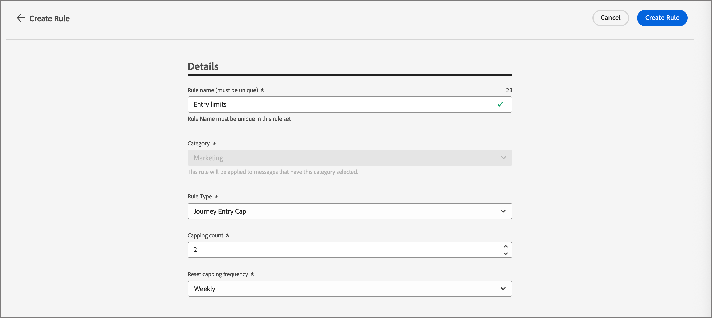
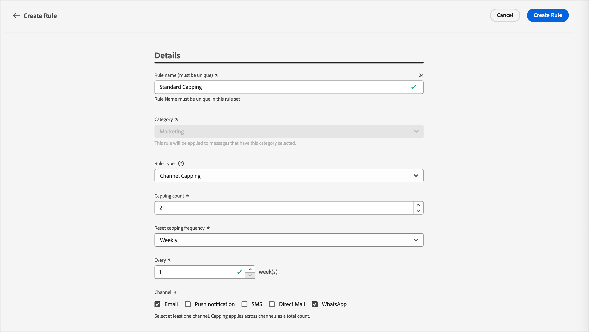
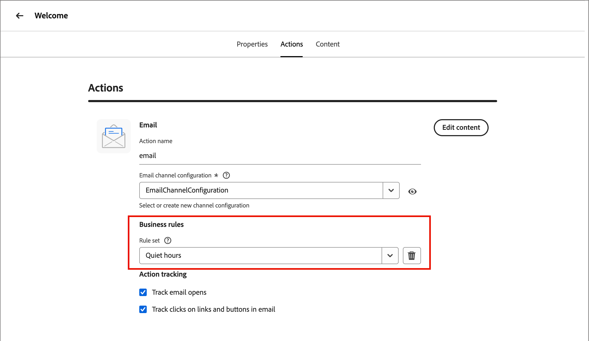

# Règles métier {#business-rules}

>[!CONTEXTUALHELP]
>id="ajo-b2b-prime_business_rules_rule_sets"
>title="Jeux de règles"
>abstract="Utilisez des jeux de règles pour appliquer un capping de fréquence à différents types de communications marketing. Vous pouvez également créer des jeux de règles pour exclure des parcours d’une partie de votre audience en fonction des règles de limitation de fréquence."

Les règles métier permettent à votre organisation de définir et de regrouper plusieurs règles dans des ensembles de règles afin que les spécialistes marketing puissent les appliquer à leurs e-mails, si nécessaire. Cela permet d’obtenir une granularité améliorée afin de limiter la fréquence et le nombre de parcours qu’un client peut entrer au cours d’une certaine période ou de contrôler la fréquence à laquelle les utilisateurs et utilisatrices reçoivent des messages en fonction du type de communication.

Vous pouvez créer deux types de jeux de règles :

* Les jeux de règles de **Canal** appliquent des règles aux canaux de communication. Ils vous permettent de définir les éléments suivants :

   * **Règles de limitation de la fréquence** - Exemple : *n’envoyez pas plus d’une communication par e-mail, SMS, notification push, courrier ou WhatsApp par jour.*
   * **Règles relatives aux heures calmes** - Exemple : *n’envoyez pas d’e-mails en dehors de l’intervalle de 8 h à 21 h.*

* Les jeux de règles de **Parcours** appliquent des règles de limitation d’entrée et de simultanéité à un parcours. (Pas encore pris en charge pour la version Beta.)

>[!PREREQUISITES]
>
>Pour utiliser les règles métier, vous avez besoin des autorisations CX Enterprise suivantes :
>
>* **[!UICONTROL Afficher les règles de fréquence]** : accédez aux règles métier et affichez-les.
>* **[!UICONTROL Gérer les règles de fréquence]** : créez, modifiez ou supprimez des règles métier.

## Accès et gestion des ensembles de règles {#access-manage}

Pour accéder à tous les ensembles de règles existants, développez **[!UICONTROL Administration]** dans le volet de navigation de gauche, puis sélectionnez **[!UICONTROL Règles métier]**.

{width="800" zoomable="yes"}

### Jeux de règles globaux et personnalisés {#global-custom}

Lors de l’accès initial à _Jeux de règles_, un jeu de règles par défaut est précréé et actif : **_[!UICONTROL JEU DE RÈGLES GLOBAL]_**. Il s’agit d’un ensemble de règles global que vous pouvez appliquer pour contrôler la fréquence à laquelle les utilisateurs et utilisatrices reçoivent des messages sur un ou plusieurs canaux. Les règles définies dans cet ensemble de règles s’appliquent à tous les canaux sélectionnés.

{width="700" zoomable="yes"}

Outre cet ensemble de règles par défaut, vous pouvez créer vos propres ensembles de règles personnalisés et les appliquer à un nœud de parcours ou de canal pour utiliser des règles spécifiques de limitation et d’arrêt des heures.

### Ouvrir un ensemble de règles {#open-rule-set}

Cliquez sur le nom d’un ensemble de règles pour afficher et modifier ses définitions. Toutes les règles incluses dans ce jeu de règles sont répertoriées. Utilisez le menu _Plus_ ( **...** ) en haut à droite pour l’activer, le désactiver ou le supprimer.

{width="700" zoomable="yes"}

### Modifier les règles {#edit-rules}

Pour un brouillon de règle dans l’ensemble de règles, cliquez sur l’icône _Modifier_ (  ) à côté du nom de la règle pour modifier les paramètres de la règle. Vous pouvez également cliquer sur l’icône _Menu Plus_ ( **...** ) pour activer ou supprimer la règle.

{width="500" zoomable="yes"}

Pour désactiver une règle, cliquez sur l’icône _Désactiver_ (  ) en regard de la règle active. Dans la boîte de dialogue de confirmation, cliquez sur **[!UICONTROL Désactiver]**. Le statut passe à **_[!UICONTROL Inactif]_** et la règle ne s’applique pas aux futures exécutions de messages. Les messages en cours d’exécution ne sont pas affectés.

>[!NOTE]
>
>La désactivation d’une règle ou d’un jeu de règles n’affecte ou ne réinitialise aucun comptage sur les profils individuels.

## Création et activation d’ensembles de règles personnalisés {#create}

>[!CONTEXTUALHELP]
>id="ajo-b2b-prime_rule_set_domain"
>title="Domaine du jeu de règles"
>abstract="Lors de la création d’un jeu de règles, vous devez indiquer si les règles du jeu de règles appliqueront les règles de limitation spécifiques aux canaux de communication ou aux parcours."

>[!CONTEXTUALHELP]
>id="ajo-b2b-prime_rule_sets_category"
>title="Sélectionner la catégorie de règle relative aux messages"
>abstract="Lorsqu’elle sont activées et appliquées à un message, toutes les règles de fréquence correspondant à la catégorie sélectionnée seront automatiquement appliquées à ce message. Actuellement, seule la catégorie Marketing est disponible."

>[!CONTEXTUALHELP]
>id="ajob2b-prime_rule_type"
>title="Type de règle"
>abstract="Sélectionnez le type de règle souhaité pour votre jeu de règles de canal : utilisez le type **Capping de la fréquence** pour appliquer des règles de limitation aux canaux de communication. Par exemple, n’envoyez pas plus d’une communication par e-mail ou SMS par jour. Sélectionnez **Heures creuses** pour définir des exclusions basées sur l’heure afin de vous assurer qu’aucun message n’est envoyé pendant certaines périodes."

>[!CONTEXTUALHELP]
>id="ajo-b2b-prime_rule_sets_duration"
>title="Réinitialiser la fréquence de limitation"
>abstract="Sélectionnez la période de calendrier utilisée pour réinitialiser le compteur de limitation : horaire, quotidien, hebdomadaire ou mensuel. Le compteur se réinitialise automatiquement à 0 au début de chaque nouvelle période."

>[!CONTEXTUALHELP]
>id="ajo-b2b-prime_rule_set_rule_capping"
>title="Limitation des règles"
>abstract="Définissez la limitation de votre règle. En fonction du domaine du jeu de règles et de la sélection dans le champ Type de règle, ce champ peut définir le nombre maximal de messages qui peuvent être envoyés à un profil, ou le nombre maximal de parcours que le profil peut rejoindre ou auxquels il peut être inscrit simultanément."

>[!CONTEXTUALHELP]
>id="ajo-b2b-prime_journey_business_rules"
>title="Jeu de règles"
>abstract="Sélectionnez le jeu de règles à appliquer à votre action personnalisée."

>[!NOTE]
>
>Vous pouvez créer jusqu’à 10 ensembles de règles pour le domaine de canal et 10 ensembles de règles pour le domaine de parcours, pour un total de 20 ensembles de règles.

1. Développez **[!UICONTROL Administration]** dans le volet de navigation de gauche, puis sélectionnez **[!UICONTROL Règles métier]**.

1. Sur la page de liste _[!UICONTROL Jeux de règles]_, cliquez sur **[!UICONTROL Créer un jeu de règles]** en haut à droite.

   {width="400"}

1. Saisissez un **[!UICONTROL Nom]** unique (obligatoire) pour le jeu de règles et ajoutez un **[!UICONTROL Description]** (facultatif).

1. Sélectionnez l’ensemble de règles **[!UICONTROL Domaine]**.

   * **[!UICONTROL Canal]** - Appliquez des règles de limitation ou des règles relatives aux heures creuses aux canaux de communication.
   * **[!UICONTROL Parcours]** - Appliquez des règles de limitation d&#39;entrée et de simultanéité à un parcours.

   >[!IMPORTANT]
   >
   >Les règles de parcours ne sont pas encore prises en charge dans cette version de Beta.

1. Cliquez sur **[!UICONTROL Enregistrer]**

   {width="700" zoomable="yes"}

### Ajouter les règles {#add-rules}

Après avoir créé l’ensemble de règles, ajoutez chaque règle à inclure.

1. Cliquez sur **[!UICONTROL Ajouter une règle]**.

1. Configurez les paramètres de la règle en fonction de son objectif.

   Les paramètres disponibles pour la règle dépendent du domaine du jeu de règles sélectionné à sa création.

   {width="700" zoomable="yes"}

   Vous trouverez des informations détaillées sur la configuration du parcours et des règles de canal dans les sections suivantes :

   <!-- * [Journey capping](../conflict-prioritization/journey-capping.md) -->
   * [Capping de la fréquence par canal et type de communication](#frequency-capping)
   * [Heures creuses](#quiet-hours)

1. Cliquez sur **[!UICONTROL Créer une règle]** pour confirmer la création de la règle.

   La nouvelle règle est répertoriée dans l’ensemble de règles avec le statut _Brouillon_.

1. Répétez les étapes précédentes pour ajouter autant de règles que nécessaire pour l’ensemble de règles.

   Une fois créée, une règle a le statut _[!UICONTROL Brouillon]_ et ne peut pas encore avoir d’impact sur un message.

   {width="700" zoomable="yes"}

1. Pour activer une règle pour l’ensemble de règles, cliquez sur l’icône _Plus_ ( **...** ) à côté du nom de la règle et choisissez **[!UICONTROL Activer]**.

   Dans la boîte de dialogue de confirmation, cliquez sur **[!UICONTROL Activer]**.

### Activer l’ensemble de règles {#activate-rule-set}

L’activation de l’ensemble de règles le rend disponible pour application à un message de parcours ou de canal. Lorsqu’un ensemble de règles est actif, vous ne pouvez pas y ajouter d’autres règles. Vous pouvez la désactiver pour apporter des modifications, puis l’activer à nouveau.

1. Ouvrez l’ensemble de règles à partir de la page de liste _Ensembles de règles_.

1. Cliquez sur le menu _Plus_ ( **...** ) en haut à droite et choisissez **[!UICONTROL Activer le jeu de règles]**.

   {width="700" zoomable="yes"}

1. Dans la boîte de dialogue de confirmation, cliquez sur **[!UICONTROL Activer]**.

   >[!NOTE]
   >
   >L’activation complète d’un jeu de règles peut prendre jusqu’à 10 minutes. Vous n’avez pas besoin de modifier des messages ou de republier des parcours pour qu’une règle prenne effet.

Vous pouvez appliquer l’ensemble de règles actif à un message ou à un parcours, selon le paramètre de domaine de l’ensemble de règles.

## Capping de la fréquence par canal {#frequency-capping}

Définissez des limites de fréquence par canal et type de communication pour limiter le nombre de messages reçus par un profil et éviter de surcharger les clients avec des communications similaires. Les ensembles de règles de canal appliquent des règles de limitation aux canaux de communication. Par exemple, n’envoyez pas plus d’une communication par e-mail ou SMS par jour.

L’utilisation des jeux de règles de canal vous permet de définir un capping de fréquence par type de communication afin d’éviter d’envoyer trop de messages similaires aux clientes et aux clients. Vous pouvez par exemple créer un jeu de règles pour limiter le nombre de _communications promotionnelles_ envoyées à votre clientèle et créer un autre jeu de règles pour limiter le nombre de _newsletters_ qu’elle reçoit. Vous pouvez ensuite choisir d’appliquer l’ensemble de règles de communication promotionnelle ou de newsletters.

>[!IMPORTANT]
>
>Pour garantir le bon fonctionnement de la limitation au niveau des canaux, veillez à choisir l’espace de noms avec la priorité la plus élevée lors de la création d’un parcours. Pour en savoir plus sur la priorité des espaces de noms, consultez le [guide sur le service d’identités Platform](https://experienceleague.adobe.com/fr/docs/experience-platform/identity/features/identity-graph-linking-rules/namespace-priority){target="_blank"}.

### Créer une règle de limitation de canal {#create-capping-rule}

>[!CONTEXTUALHELP]
>id="ajo-b2b-prime_rule_sets_channel"
>title="Définir les canaux auxquels la règle s’applique"
>abstract="Sélectionnez au moins un canal. La limitation est calculée sur l’ensemble des canaux."

1. Sélectionnez l’ensemble de règles de canal auquel vous souhaitez ajouter la règle de limitation ou créez un ensemble de règles de canal.

1. Sur la page de l’ensemble de règles, cliquez sur **[!UICONTROL Ajouter une règle]** et saisissez un nom unique pour la règle.

   >[!NOTE]
   >
   > Le champ _[!UICONTROL Catégorie]_ indique la catégorie de messagerie de la règle. Actuellement, ce champ est en lecture seule et seule la catégorie **[!UICONTROL Marketing]** est disponible.

1. Pour le _[!UICONTROL Type de règle]_, choisissez **[!UICONTROL Limitation des canaux]**.

   {width="700" zoomable="yes"}

1. Dans le champ **[!UICONTROL Nombre de limitations]** définissez la valeur de limitation de votre règle.

   Cette valeur correspond au nombre maximal de messages qui peuvent être envoyés à un profil utilisateur individuel chaque mois, semaine, jour ou heure, en fonction de votre sélection dans les autres champs.

1. Pour **[!UICONTROL Réinitialiser la fréquence de limitation]**, choisissez si vous souhaitez que la limitation soit appliquée.

   La limite de fréquence est basée sur la période calendaire sélectionnée. Elle est réinitialisée au début de la période correspondante. Choisissez la date d&#39;expiration du compteur pour chaque période :

   * **[!UICONTROL Horaire]** : le capping de la fréquence est valide pour le nombre d’heures sélectionné. Le compteur est automatiquement réinitialisé au début de chaque période. Pour un capping de la fréquence de 1 heure, la réinitialisation se produit toutes les heures, ce qui coïncide avec la fin d’une heure UTC.
   * **[!UICONTROL Journalière]** : le capping de la fréquence journalière est valable pour la journée jusqu’à 23:59:59 UTC et est remise à 0 au début de la journée suivante.
   * **[!UICONTROL Hebdomadaire]** : la limite de fréquence est valide jusqu’au samedi, 23 :59: 59 UTC de cette semaine. La date d’expiration s’applique quelle que soit la date de création de la règle. Par exemple, si la règle est créée le jeudi, cette règle est valide jusqu’au samedi à 23:59:59.
   * **[!UICONTROL Mensuelle]** : le capping de la fréquence est valable jusqu’au dernier jour du mois à 23:59:59 UTC. Par exemple, la date d’expiration mensuelle pour janvier est le 31 janvier à 23:59:59 UTC.

   >[!IMPORTANT]
   >
   >* Pour garantir la précision, veillez à choisir l’espace de noms de priorité la plus élevée lors de la création d’un parcours. Pour en savoir plus sur la priorité des espaces de noms, consultez le [guide sur le Service d’identités Platform.](https://experienceleague.adobe.com/fr/docs/experience-platform/identity/features/identity-graph-linking-rules/namespace-priority){target="_blank"} 
   >
   >* La valeur du compteur de profil est mise à jour lorsque la communication est diffusée. Tenez compte de cela lorsque vous envoyez de grands volumes de communications, car le débit peut entraîner l’obtention de l’e-mail par le destinataire quelques minutes, voire plusieurs heures après le début de la communication (dans le cas où vous envoyez des millions de communications simultanément). Cela est important dans le cas où une personne destinataire reçoit deux communications rapprochées. Il est recommandé d’espacer les communications d’au moins deux heures dans la mesure du possible afin de laisser suffisamment de temps au destinataire pour recevoir la communication et à la valeur du compteur pour se mettre à jour en conséquence.

1. Utilisez le champ **[!UICONTROL Toutes les]** pour définir la fréquence de la règle de limitation sur plusieurs heures, jours, semaines ou mois (selon la période spécifiée).

   Veillez à saisir une valeur correspondant au type de durée sélectionné : 1-23 pour _Horaire_, 1-30 pour _Quotidien_, 1-4 pour _Hebdomadaire_ et 1-3 pour _Mensuel_.

   Le compteur se remet automatiquement à 0 lorsqu’une nouvelle période commence. Pour une limitation de fréquence de deux jours, cette réinitialisation se produit tous les deux jours à minuit UTC.

1. Sélectionnez les canaux à utiliser pour cette règle :

   * **[!UICONTROL E-mail]**
   * **[!UICONTROL SMS]** (actuellement non pris en charge pour cette version de Beta)
   * **[!UICONTROL Notification push]** (actuellement non prise en charge pour cette version de Beta)
   * **[!UICONTROL Publipostage direct]** (actuellement non pris en charge pour cette version de Beta)
   * **[!UICONTROL WhatsApp]** (actuellement non pris en charge pour cette version de Beta)

   {width="700" zoomable="yes"}

   Sélectionnez plusieurs canaux si vous souhaitez appliquer une limitation sur tous les canaux sélectionnés en tant que nombre total.

   Par exemple, définissez la limitation sur 5 et sélectionnez les canaux E-mail et SMS. Si un profil a déjà reçu trois e-mails marketing et deux SMS marketing pour la période sélectionnée, ce profil est exclu de la prochaine diffusion de tout e-mail ou SMS marketing.

1. Cliquez sur **[!UICONTROL Enregistrer]** pour confirmer la création de la règle.

   Votre règle de fréquence est ajoutée à l’ensemble de règles avec le statut _[!UICONTROL Brouillon]_.

1. Répétez les étapes ci-dessus pour ajouter autant de règles que nécessaire au jeu de règles.

1. Lorsque la règle de limitation est prête à être appliquée aux messages, activez la règle et l’ensemble de règles.

### Appliquer l’ensemble de règles de limitation de canal {#apply-capping-rule}

1. Lors de la création d’un parcours, ajoutez l’un des [nœuds d’action](../marketing/action-nodes.md) Envoyer pour un canal que vous avez sélectionné pour votre règle et modifiez le contenu de votre message.

1. Dans l’onglet _[!UICONTROL Actions]_, définissez l’option **[!UICONTROL Règles métier]** sur l’ensemble de règles avec la règle de limitation de la fréquence.

   {width="600" zoomable="yes"}

   >[!NOTE]
   >
   >Seuls les ensembles de règles activés sont disponibles dans la liste.

   <!--Messages where the category selected is **[!UICONTROL Transactional]** will not be evaluated against business rules.-->

1. Avant d’activer votre parcours, veillez à planifier son exécution à une date ultérieure d’au moins 10 minutes.

   Cela donne le temps nécessaire pour remplir les valeurs de compteur sur le profil pour la règle métier que vous avez sélectionnée. Si vous activez le parcours immédiatement, les valeurs du compteur de l’ensemble de règles ne peuvent pas être renseignées sur les profils des destinataires et le message n’est pas comptabilisé dans leurs règles de limitation de la fréquence pour les ensembles de règles personnalisés.

<!-- 
1. You can view the number of profiles excluded from delivery in the [Customer Journey Analytics report](../reports/report-gs-cja.md), and in the [Live report](../reports/live-report.md), where frequency rules will be listed as a possible reason for users excluded from delivery.

-->

>[!NOTE]
>
>Plusieurs règles peuvent s’appliquer au même canal, mais une fois la limite inférieure atteinte, le profil sera exclu des prochaines diffusions.

Lors du test des règles de fréquence, il est recommandé d’utiliser un nouveau profil de test, car lorsque la limitation de fréquence d’un profil est atteinte, il n’est pas possible de réinitialiser le compteur avant la période suivante. La désactivation d’une règle permet aux profils limités de recevoir des messages, mais elle ne supprime pas les incréments de compteur.

## Définir des heures creuses {#quiet-hours}

Les **_heures de silence_** vous permettent de définir des exclusions temporelles pour les canaux e-mail, SMS, notification push et WhatsApp. EIles garantissent qu’aucun message n’est envoyé pendant des périodes spécifiques, ce qui vous aide à respecter les préférences de la clientèle et les exigences de conformité.

>[!NOTE]
>
>Dans la version Beta actuelle, seuls les canaux e-mail et WhatsApp sont pris en charge dans parcours.

Vous pouvez appliquer des heures calmes par le biais d’ensembles de règles et les affecter à des actions de canal individuelles dans les parcours pour un contrôle précis. En rationalisant ces normes, vous pouvez améliorer l’expérience client, gagner du temps et garantir la conformité aux règles de communication :

* **Ne réveillez pas votre client** - *Le bon client, le bon canal, le bon moment* est le mantra de nombreux professionnels du marketing. Il est donc logique que le timing soit une partie essentielle du parcours client. En définissant une règle « Heures calmes », les marques contrôlent mieux le moment où les contacts reçoivent les messages, s&#39;assurant qu&#39;ils les reçoivent lorsqu&#39;ils sont plus susceptibles d&#39;agir sur votre message.
* **Commodité** : interceptez facilement les communications entre les campagnes et les parcours lorsque vous devez empêcher une audience de recevoir un message sans avoir à arrêter l’ensemble du parcours ou de la campagne.
* **Gain de temps** : gérez les exclusions au même endroit en créant une **règle temporelle**, au lieu d’ajouter plusieurs nœuds de condition avec des expressions personnalisées.\
  <!--* **Extra Safeguard** - Benefit from an extra safeguard in case audience criteria or time-window configurations were incorrectly set, ensuring individuals are still excluded when they should be.-->

>[!BEGINSHADEBOX]

**Mécanismes de sécurisation et limitations**

* **Délai de propagation** : les mises à jour d’une règle d’heures creuses peuvent prendre jusqu’à 12 heures pour être appliquées aux actions de canal qui utilisent déjà cette règle.
* **Latence de volume élevé** : en cas de communications à volume élevé, le système peut nécessité un délai supplémentaire pour commencer à appliquer les suppressions liées aux heures creuses.

>[!ENDSHADEBOX]

<!--* **Custom actions** – For custom actions, only quiet hours rules are enforced. If a rule set also includes other rules (e.g., frequency capping), those rules are ignored.-->
<!--* **Pre-suppression window** – The system begins suppressing communications 30 minutes before quiet hours start, ensuring that no messages are delivered once the quiet period begins.-->

### Créer des règles d’heures creuses {#create-quiet-hour-rules}

>[!NOTE]
>
>Les heures creuses ne peuvent être définies que dans des **_ensembles de règles personnalisés_**. L’ensemble de règles global ne prend pas en charge la configuration des heures creuses.

1. Sélectionnez l’ensemble de règles de canal auquel vous souhaitez ajouter la règle ou créez un ensemble de règles de canal.

1. Sur la page de l’ensemble de règles, cliquez sur **[!UICONTROL Ajouter une règle]** et saisissez un nom unique pour la règle.

   >[!NOTE]
   >
   > Le champ _[!UICONTROL Catégorie]_ indique la catégorie de messagerie de la règle. Actuellement, ce champ est en lecture seule et seule la catégorie **[!UICONTROL Marketing]** est disponible.

1. Pour le _[!UICONTROL Type de règle]_ sélectionnez **[!UICONTROL Heures creuses]**.

   {width="700" zoomable="yes"}

1. Dans la section **[!UICONTROL Dates et heures]**, définissez quand appliquer des heures creuses :

   * Pour **[!UICONTROL Fuseau horaire]**, choisissez un fuseau horaire standard pour tous les destinataires de l’audience, quels que soient leurs fuseaux horaires individuels.

     Pour utiliser le champ de fuseau horaire de chaque profil, sélectionnez **[!UICONTROL Utiliser le fuseau horaire local des destinataires]**.

     >[!IMPORTANT]
     >
     >Si un profil ne dispose d’aucune valeur de fuseau horaire, les heures creuses ne sont pas appliquées pour celui-ci.

   * Cliquez sur l’icône _Calendrier_ et indiquez la période pendant laquelle les heures calmes doivent s’appliquer.

      * **[!UICONTROL Hebdomadaire]** : sélectionnez des jours spécifiques de la semaine et un créneau horaire. Vous pouvez également appliquer la règle **[!UICONTROL Toute la journée]**.

      * **[!UICONTROL Date personnalisée]** : sélectionnez des dates spécifiques dans le calendrier et un créneau horaire. Vous pouvez également appliquer la règle **[!UICONTROL Toute la journée]**.

     {width="450"}

   * Cliquez sur le bouton **[!UICONTROL Ajouter d’autres dates]** pour ajouter jusqu’à cinq périodes distinctes.

1. Dans la section **[!UICONTROL Gestion des actions pendant les heures creuses]**, choisissez comment les messages sont traités pendant la période sélectionnée :

   

   * **[!UICONTROL Message en file d’attente]** : les messages sont envoyés à la fin de la période d’heures creuses, sauf s’ils sont en pause.

     >[!NOTE]
     >
     >Si un message reste dans la file d’attente pour un profil pendant plus de 7 jours, le message est ignoré.

   * **[!UICONTROL Ignorer le message]** : les messages ne sont jamais envoyés.

     >[!NOTE]
     >
     >Si vous sélectionnez **[!UICONTROL Ignorer]** et appliquez cette règle à une action de parcours, le profil est supprimé de la diffusion du message et quitté le parcours.

1. Cliquez sur **[!UICONTROL Enregistrer]** pour confirmer la création de la règle.

   Votre règle d’heures creuses est ajoutée à l’ensemble de règles avec le statut _[!UICONTROL Brouillon]_.

1. Répétez les étapes ci-dessus pour ajouter autant de règles que nécessaire au jeu de règles.

1. Lorsque la règle est prête à être appliquée aux messages, activez la règle et l’ensemble de règles.

### Application d’heures creuses à une action de parcours {#apply-quiet-hours}

Une fois la règle enregistrée et l’ensemble de règles activé, vous pouvez l’appliquer aux actions de canal dans les parcours.

1. Lors de la création d’un parcours, ajoutez l’un des [nœuds d’action](../marketing/action-nodes.md) Envoyer pour un canal que vous avez sélectionné pour votre règle et modifiez le contenu de votre message.

1. Dans l’onglet _[!UICONTROL Actions]_, définissez l’option **[!UICONTROL Règles métier]** sur l’ensemble de règles comportant la règle Heures creuses.

   {width="600" zoomable="yes"}

   >[!NOTE]
   >
   >Seuls les ensembles de règles activés sont disponibles dans la liste.

1. Terminez et publiez le parcours lorsque vous êtes prêt.
