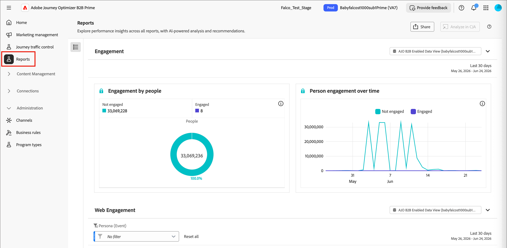

# Scores d’engagement des personnes {#engagement-scores}

>[!CONTEXTUALHELP]
>id="ajo-b2b-prime_person_engagement_score"
>title="Score d’engagement de la personne"
>abstract="Les scores d’engagement des personnes reflètent le niveau d’engagement des prospects individuels en fonction de leurs activités récentes."

Un score d’engagement de la personne est un nombre qui reflète le niveau d’engagement d’un prospect individuel. Les scores sont basés sur les activités qu’une personne effectue, chaque type d’activité comportant une valeur pondérée. Les scores sont normalisés au sein de votre instance (client) pour permettre une comparaison cohérente et obtenir des informations exploitables.

Le calcul des scores s’exécute quotidiennement. Toute activité pondérée par l’engagement effectuée par la personne au cours des 30 derniers jours contribue au score. Avec cette période mobile de 30 jours, les occurrences des activités plus anciennes expirent et les scores peuvent diminuer au fil du temps (décroissance du score). Les scores affichés sont arrondis (par exemple, un score de 75,89999 s’affiche en tant que 76).

Les données de score de l’engagement sont disponibles à partir de **[!UICONTROL Rapports]**.

{width="800" zoomable="yes"}

Le score d’engagement de la personne est un attribut que vous pouvez utiliser comme [condition de filtrage](#engagement-score-filter) dans les listes de personnes et dans les nœuds de chemin de division au sein des parcours de personnes.

## Activités utilisées pour la notation de l’engagement {#activities}

La notation de l’engagement n’est pas _basée sur un déclencheur_. Il s’agit d’un processus quotidien qui évalue l’activité de tous les prospects et recalcule les scores. Les activités utilisent _poids_ pour éclairer la notation en fonction du modèle de pondération actif, qui détermine dans quelle mesure chaque type d’activité contribue au score global.

Il existe une limite de fréquence quotidienne de 20 pour chaque type d’activité. Si une personne effectue la même activité plus de 20 fois au cours d’une seule journée, le nombre correspondant à cette activité est limité à 20.

| Nom de l’activité | Direction | Description | Poids par défaut |
|---|---|---|---|
| Assister à la conférence | Entrant | Signal d’engagement en personne à forte intention | 60 |
| Cliquer sur l’e-mail | Entrant | Clic actif = engagement significatif | 30 |
| Cliquer sur l’e-mail commercial | Entrant | Clic actif sur la portée des ventes | 30 |
| Cliquez sur Marketo Email | Entrant | Clic actif = engagement significatif | 30 |
| Communiqué avec le concierge | Entrant | Engagement en direct via l’outil de concierge | 60 |
| Engagé avec le chat en direct dans Concierge | Entrant | Chat en direct = forte intention d’achat | 60 |
| Remplir le formulaire Marketo | Entrant | Remplissage du formulaire = intention explicite du prospect | 40 |
| Moment intéressant | Entrant | Déclencheur comportemental de grande valeur | 60 |
| Nouveau lead | Entrant | Point d’entrée — score de référence | 30 |
| Ouvrir e-mail | Entrant | Engagement passif ; inférieur au clic | 30 |
| Ouvrir l’e-mail Marketo | Entrant | Engagement passif ; inférieur au clic | 30 |
| Ouvrir l’e-mail commercial | Entrant | Engagement passif ; inférieur au clic | 30 |
| Lire le message WhatsApp | Entrant | Lecture passive ; canal de poids inférieur | 30 |
| E-mail de transfert à un ami reçu | Entrant | Signal viral ; légèrement positif | 30 |
| Répondre au courrier électronique de vente | Entrant | Réponse directe = signal d’achat fort | 40 |
| Demander une campagne | Entrant | Action auto-initiée — intention élevée | 30 |
| Demander une campagne Marketo | Entrant | Action auto-initiée — intention élevée | 30 |
| Réunion programmée au Concierge | Entrant | Action de conversion de la plus haute intention | 60 |

>[!NOTE]
>
>Les activités Score d’engagement sont enregistrées dans le journal d’activité Marketo Engage d’une personne. Vous pouvez accéder à ce journal dans l’instance Marketo Engage associée. Pour plus d’informations, voir [Rechercher le journal d’activité d’une personne](https://experienceleague.adobe.com/fr/docs/marketo/using/product-docs/core-marketo-concepts/smart-lists-and-static-lists/managing-people-in-smart-lists/locate-the-activity-log-for-a-person){target="_blank"} dans la documentation de Marketo Engage.

## Logique de notation {#scoring-logic}

Le système applique un processus de normalisation à plusieurs étapes pour produire un score cohérent sur tous les prospects de votre instance.

1. Identifier tous les types d’activité _pondérés par l’engagement_ associés à un poids et à un quota quotidien, tels que les clics sur les e-mails, les remplissages de formulaires et la participation à des événements.

1. Identifier toutes les actions _pondérées par l’engagement_ effectuées par la personne dans l’intervalle de recherche en amont, qui est actuellement de 30 jours.

1. Normalisez les pondérations des types d’activité sur tous les types d’activité _pondérés par l’engagement_ identifiés à l’étape 1, en ignorant les types qui ne se sont pas produits dans l’intervalle de recherche en amont.

   Cette étape utilise la normalisation _Min-Max_ et réduit la dilution artificielle du poids du type d&#39;activité pour les instances qui n&#39;utilisent pas la plupart des types d&#39;activité.

1. Appliquez la limite de fréquence quotidienne par personne et type d&#39;activité.

   Cette étape réduit l’influence des activités à volume élevé et à faible valeur sur le score global.

1. Calculez le score brut d’engagement en additionnant l’activité quotidienne par type d’activité, en la multipliant par le poids associé, puis en additionnant les résultats pour tous les jours de l’intervalle de recherche en amont.

1. Appliquez une _Transformation de puissance_ (racine carrée) pour stabiliser la variance en réduisant l’impact des valeurs aberrantes.

   Cette transformation réduit l’asymétrie et rend les modèles des données plus linéaires.

1. Appliquez une transformation _Normalisation mise à l’échelle_ pour vous assurer que les scores utilisent la plage complète comprise entre 0 et 100.

## Filtrer par score d’engagement {#engagement-score-filter}

Vous pouvez utiliser les scores d’engagement des personnes comme filtre lors de la définition de l’audience pour une liste de personnes ou pour la segmentation dans un parcours de personnes.

Le filtre _[!UICONTROL Score d’engagement de la personne]_ s’affiche dans le panneau de filtrage sous la catégorie **[!UICONTROL Attributs de personne]**.

### Listes de personnes {#people-lists}

Lorsque vous ajoutez ou supprimez des membres d’une [liste de personnes statique](./people-lists.md#static-list), ou lorsque vous définissez les règles d’appartenance à une [liste de personnes dynamique](./people-lists.md#dynamic-lists), vous pouvez filtrer par score d’engagement de la personne afin de cibler toutes les personnes dont les attributs correspondent à vos critères de score.

{width="700" zoomable="yes"}

**Liste statique — Ajouter des membres**

1. Ouvrez la liste statique et cliquez sur **[!UICONTROL Ajouter des personnes]** en haut à droite.

1. Dans la boîte de dialogue de filtre, développez **[!UICONTROL Attributs de personne]** et faites glisser **[!UICONTROL Score d’engagement de personne]** sur la zone de travail.

1. Dans la condition de filtrage, choisissez un opérateur et saisissez une valeur correspondant aux scores que vous souhaitez cibler.

1. Cliquez sur **[!UICONTROL Terminé]** pour appliquer le filtre et qualifier les personnes correspondantes dans la liste.

**Liste dynamique — Définit les règles d&#39;appartenance**

1. Ouvrez la liste dynamique et sélectionnez l’onglet **[!UICONTROL Règles]**.

1. Cliquez sur **[!UICONTROL Modifier les règles]**.

1. Dans la boîte de dialogue de filtre, développez **[!UICONTROL Attributs de personne]** et faites glisser **[!UICONTROL Score d’engagement de personne]** sur la zone de travail.

1. Dans la condition de filtrage, choisissez un opérateur et saisissez une valeur correspondant aux scores que vous souhaitez cibler.

1. Cliquez sur **[!UICONTROL Terminé]** pour enregistrer la règle.

   L’appartenance est automatiquement mise à jour lorsque les enregistrements de la personne sont évalués par rapport à la règle.

### Parcours de personne {#person-journeys}

Lorsque vous configurez la segmentation d’un parcours de personne dans un nœud [_Partage de chemins_ &#x200B;](../marketing/split-merge-paths-nodes.md), vous pouvez utiliser le score d’engagement de la personne comme filtre de profil de personne pour contrôler quelles personnes rejoignent le chemin du parcours.

{width="700" zoomable="yes"}

1. Cliquez sur le nœud **[!UICONTROL Chemins fractionnés]** dans la zone de travail du parcours.

1. Dans le panneau des propriétés de nœud à droite, cliquez sur **[!UICONTROL Appliquer la condition]** ou **[!UICONTROL Modifier la condition]** pour un chemin d’accès.

1. Dans la boîte de dialogue de filtre, développez **[!UICONTROL Attributs de personne]** et faites glisser **[!UICONTROL Score d’engagement de personne]** sur la zone de travail.

1. Dans la condition de filtrage, choisissez un opérateur et saisissez une valeur correspondant aux scores que vous souhaitez cibler.

1. Cliquez sur **[!UICONTROL Terminé]** pour enregistrer le filtre du chemin d’accès.

## Configurer la pondération du score d’engagement {#configure-weighting}

Dans [!DNL Journey Optimizer B2B Prime], vous pouvez configurer la pondération du score d’engagement directement à partir de l’interface de chat de l’assistant [AI](../agents/chat-interface.md).

Pour obtenir des informations sur les modèles de score d’engagement, les bandes de pondération et les poids d’activité, voir [Configurer la pondération de score d’engagement personnalisé](https://experienceleague.adobe.com/en/docs/journey-optimizer-b2b/user/admin/configurations/engagement-score-weighting).

1. Ouvrez le panneau de conversation **[!UICONTROL Assistant AI]** dans la partie gauche de l’écran (icône de conversation).

1. Dans le champ d’entrée de conversation, saisissez la commande de barre oblique, suivie de votre intention. Par exemple :

   ```text
   /engagement-configuration Configure activity weights for the person engagement score model
   ```

   Lorsque vous tapez `/`, l’assistant AI affiche une liste des commandes et compétences de barre oblique disponibles. La commande de configuration de l’engagement est acheminée directement vers la page Pondération de score de l’engagement .

   {width="700" zoomable="yes"}

1. Cliquez sur l’icône _Envoyer_ (flèche vers le haut) ou appuyez sur Entrée.

   L’assistant AI traite la demande et ouvre un onglet **[!UICONTROL Configuration de l’engagement]** dans la zone de contenu principale à côté du panneau de conversation.

### Examiner la liste de pondération du score de l’engagement {#review-weighting-list}

Une fois l’onglet ouvert, la page _Pondération de score de l’engagement_ affiche tous les modèles de score existants dans un tableau avec les colonnes suivantes :

| Colonne | Description |
|---|---|
| **Nom** | Nom du modèle (cliquez pour ouvrir les détails) |
| **Statut** | Active, Draft ou Archived |
| **Date de création** | Date de création du modèle |
| **Dernière mise à jour** | Date et heure d’enregistrement les plus récentes |
| **Dernière mise à jour par** | Dernier utilisateur à avoir enregistré les modifications |

{width="700" zoomable="yes"}

À un moment donné, un seul modèle **one** peut être actif. Le modèle actuellement actif est appliqué à tous les calculs de score d’engagement.

### Ouvrir un modèle de notation {#open-scoring-model}

Cliquez sur le nom d’un modèle de la liste pour ouvrir sa page de détails.

La page de détails affiche :

* Nom du modèle et badge d’état actuel (_Actif_, _Brouillon_ ou _Archivé_)
* Champ _Search_ pour filtrer la liste des activités
* Le tableau complet des activités avec les colonnes **[!UICONTROL Activité d’engagement]**, **[!UICONTROL Pondération]**, **[!UICONTROL Dernière mise à jour]** et **[!UICONTROL Dernière mise à jour par]**

{width="700" zoomable="yes"}

Pour les modèles archivés, **[!UICONTROL Supprimer]** et **[!UICONTROL Dupliquer]** sont affichés en haut à droite. Pour les brouillons de modèles, **[!UICONTROL Activer]** s’affiche également.

### Modifier les poids d’activité d’un modèle de brouillon {#edit-activity-weights}

Les brouillons de modèles comportent des options modifiables _[!UICONTROL Pondération]_ pour chaque activité d’engagement. Pour modifier un poids :

1. Cliquez sur le nom du modèle de brouillon dans la liste.

1. Dans le tableau des activités, recherchez l&#39;activité d&#39;engagement à mettre à jour.

1. Cliquez sur la flèche vers le bas **[!UICONTROL Pondération]** pour cette activité et sélectionnez la plage de pondération appropriée (par exemple, `Important`, `Trivial`, `Minor`, `Normal` et `Vital`).

   Les modifications sont enregistrées automatiquement. Aucune action d’enregistrement explicite n’est requise.

>[!NOTE]
>
>Pour modifier un modèle actif ou archivé, vous pouvez le dupliquer afin de créer un nouveau brouillon de modèle, puis modifier et activer le doublon. Vous ne pouvez pas modifier un modèle actif sur place.

### Activer un modèle de brouillon {#activate-weighting-model}

L’activation d’un brouillon archive automatiquement le modèle précédemment actif. Le modèle nouvellement activé s’applique ensuite à tous les calculs de score d’engagement futurs. Lorsque votre modèle de brouillon est configuré avec les poids d’activité corrects :

1. Cliquez sur le nom du modèle de brouillon dans la liste.

1. Cliquez sur **[!UICONTROL Activer]** en haut à droite.

1. Confirmez dans la boîte de dialogue.
