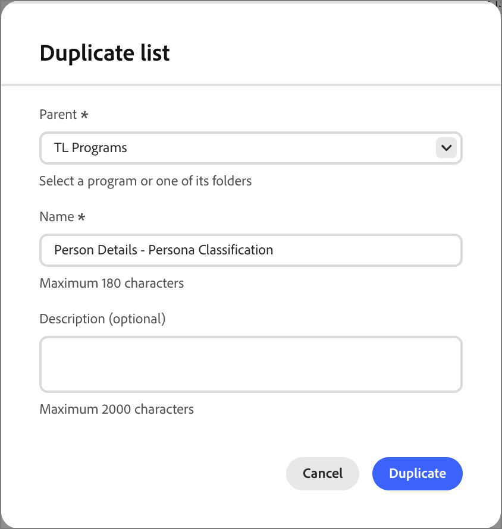

# Listes de personnes

Dans [!DNL Adobe Journey Optimizer B2B Prime], les listes de personnes sont les conteneurs d’audience au niveau de la personne pour le ciblage et l’entrée de parcours de personnes, avec des listes dynamiques pour la qualification en direct basée sur des règles et des listes statiques pour l’appartenance fixe ou gérée par parcours.

## Accès et navigation dans les listes de personnes {#access-and-browse}

1. Dans le volet de navigation de gauche, développez **[!UICONTROL Gestion marketing]**.

1. À droite dans la liste de ressources **[!UICONTROL Marketing]**, sélectionnez **[!UICONTROL Listes des personnes]**.

   {width="800" zoomable="yes"}

La page comporte deux onglets pour l’affichage et la gestion des **[!UICONTROL listes dynamiques]** et **[!UICONTROL listes statiques]**. Cliquez sur l’onglet pour basculer dans la vue Liste entre chaque type.

Vous pouvez saisir du texte dans l’outil _Rechercher_ en haut de la liste pour filtrer la liste affichée par nom. Utilisez les outils de liste pour personnaliser la liste affichée :

* Cliquez sur l’icône _Personnaliser le tableau_ (  ) pour contrôler les colonnes affichées.
* Cliquez sur l’icône _Réinitialiser les colonnes_ (  ) pour réinitialiser les largeurs de colonne.

À partir de cet espace, vous pouvez également :

* Création de listes dynamiques et statiques
* Accéder aux listes pour vérifier l’appartenance actuelle
* Appliquer des filtres d’abonnement

<!--
## Audience Hub

The AI Audience Hub is a centralized, AI-driven starting point for all audience-related capabilities across [!DNL Adobe Journey Optimizer B2B Prime]. It is designed to accelerate first-time user success while progressively unlocking advanced intelligence, insights, and control for returning and power users.

The Hub acts as:

* A guided starting point for discovering, creating, and refining person lists, account lists, and buying groups

* A visibility layer for audience health, coverage, overlap, engagement patterns, and AI-driven insights

* A control center for audience governance, optimization, reuse, and readiness for activation across journeys and sales workflows

### High level structure

Prompt-based starting point - Quick Start prompts and freeform input to help users discover, create, or optimize audiences.

1. AI insights feed - Surfaces key audience signals such as overlap, gaps, saturation risk, and optimization opportunities.

1. Adaptive audience library - A personalized view of people lists, account lists, and buying groups that adapts based on usage, relevance, and activation.

1. Optimization and arbitration nudges - Guides users to refine, split, or reuse audiences before activation.

1. Audience visibility and reporting - High-level insight into audience health, engagement patterns, and usage across active journeys.

### Empty and Error States (High-Level)

No audiences / no data - Show Quick Start prompts to help first-time users create or import person lists

Low data or incomplete audience - Explain what's missing (e.g., insufficient contacts, missing persona coverage, or low engagement data) and suggest next steps.

AI insights unavailable - Provide a graceful fallback with a clear explanation, so users understand why insights aren't shown and what actions they can take manually.
-->

## Créer une liste de personnes {#create-people-list}

1. Cliquez sur **[!UICONTROL Créer une liste]** en haut à droite de la page _[!UICONTROL Listes de personnes]_.

1. Dans la boîte de dialogue, sélectionnez un programme comme **[!UICONTROL Parent]** pour la liste.

1. Saisissez une **[!UICONTROL Nom]** et une **[!UICONTROL Description]** dans la liste (facultatif).

1. Choisissez puis listez **[!UICONTROL Type]** :

   * **[!UICONTROL Statique]** - L’appartenance est déterminée par les filtres de qualification évalués lors de la création de la liste. L’appartenance à la liste ne se met pas à jour, sauf si vous qualifiez ou disqualifiez manuellement des enregistrements.
***[!UICONTROL Dynamique]** - L’appartenance est déterminée dynamiquement par des filtres admissibles. L’appartenance à la liste s’actualise automatiquement.

   {width="450"}

1. Cliquez sur **[!UICONTROL Créer]**.

>[!NOTE]
>
>La suppression et la duplication ne sont actuellement pas prises en charge pour les listes de personnes dans cette version de Beta.

## Listes statiques {#static-list}

L’appartenance à une liste statique est définie par des filtres simples qui référencent les attributs et les activités des personnes. L&#39;adhésion ne change que si vous remplissez ou disremplissez manuellement les conditions d&#39;adhésion.

>[!NOTE]
>
>Les définitions de filtre de liste statique sont appliquées une seule fois lorsque vous ajoutez ou supprimez des membres de la liste. Le filtre défini n’est pas disponible par la suite. Si vous souhaitez conserver une définition d’audience cohérente à l’aide de filtres, utilisez plutôt une liste dynamique .

<!--
What internet says about Marketo static lists -- which of these is also true in AJO B2B Prime?

* Manual Targeting: Storing fixed cohorts, such as attendees of a specific webinar, people who purchased a certain product, or a list of competitors.
* Third-Party Syncing: Allowing external platforms (like Amplitude or Twilio Segment) to automatically sync and export groups of users directly into Marketo as targeted audiences.
* Status Tracking: Helping marketers organize leads into specific categories or track multi-value interests without needing to create new, permanent database fields.List 
* Segmentation: Acting as a reliable, unchanging recipient or suppression list for email campaigns and engagement programs. Unlike a Smart List—which dynamically adds or removes people based on changing criteria or rules—a static list serves as a reliable snapshot. People remain on the list until explicitly added or removed by you or a backend flow.

So far, activating to a destination is the only thing that they are used for that I have found.
-->

### Ajouter des membres {#static-list-add-members}

1. Ouvrez la liste statique et cliquez sur **[!UICONTROL Ajouter des personnes]** en haut à droite.

1. Dans la boîte de dialogue, définissez les règles de qualification de vos prospects en glissant-déposant des filtres depuis la gauche.

   Vous pouvez filtrer les personnes à l’aide de n’importe quelle combinaison des éléments suivants :

   * Historique des activités
   * Attributs de la société
   * Attributs de la personne
   * Filtres spéciaux tels que l’appartenance à un parcours

1. Pour enregistrer vos modifications, cliquez sur **[!UICONTROL Terminé]**.

1. Sélectionnez l’onglet **[!UICONTROL Membres]**.

   Après un bref instant, les membres admissibles apparaissent dans la liste.

### Supprimer des membres {#static-list-remove-members}

1. Ouvrez la liste statique et cliquez sur **[!UICONTROL Supprimer des personnes]** en haut à droite.

1. Dans la boîte de dialogue, ajoutez les filtres pour faire correspondre les membres que vous souhaitez disqualifier.

1. Pour enregistrer vos modifications, cliquez sur **[!UICONTROL Terminé]**.

1. Sélectionnez l’onglet **[!UICONTROL Membres]**.

   Après un court laps de temps, les membres disqualifiés quittent la liste.

### Activer vers une destination {#static-list-activate}

Lorsque vous activez une liste statique, elle est exploitable dans les systèmes en aval, avec une synchronisation continue au lieu d’exportations manuelles. Cela s’avère utile pour le ciblage, la suppression et l’orchestration des médias achetés en aval.

* La liste statique agit comme un conteneur pour les personnes.
* L’activation envoie/synchronise cet abonnement vers une destination.
* La destination peut ensuite faire quelque chose avec ces personnes, par exemple les cibler sur LinkedIn ou les supprimer d’une audience externe.

Étant donné que le modèle d’activation est conçu pour être persistant, et non pour une exportation ponctuelle :

* Les personnes ajoutées ultérieurement à la liste sont propagées automatiquement.
* Les personnes supprimées ultérieurement sont automatiquement désactivées.
* Les marketeurs évitent les exportations répétées de fichiers CSV et les chargements manuels.
* Les parcours peuvent actualiser l’audience au fil du temps pour une orchestration continue.

1. Sélectionnez l’onglet **[!UICONTROL Listes statiques]**.

1. Recherchez la liste statique que vous souhaitez activer vers une destination.

1. Cliquez sur l’icône _Activer_ (  ) en regard du nom de la liste statique.

1. Cochez la case correspondant à la connexion de destination configurée.

   {width="600" zoomable="yes"}

1. Cliquez sur **[!UICONTROL Enregistrer]**

## Listes dynamiques {#dynamic-lists}

L’appartenance à une liste dynamique est définie à l’aide de filtres simples qui référencent les attributs et les activités des personnes. L’appartenance est automatiquement maintenue en qualifiant et en disqualifiant les prospects selon la logique du filtre.

### Définir des règles d’appartenance

1. Ouvrez la liste dynamique et sélectionnez l’onglet **[!UICONTROL Règles]**.

1. Cliquez sur le bouton **[!UICONTROL Modifier les règles]**.

1. Dans la boîte de dialogue, définissez les règles de qualification de vos prospects en glissant-déposant des filtres depuis la gauche.

   Vous pouvez qualifier des prospects pour la liste à l’aide de n’importe quelle combinaison des éléments suivants :

   * Historique des activités
   * Attributs de la société
   * Attributs de la personne
   * Filtres spéciaux tels que l’appartenance à un parcours

1. Pour enregistrer vos modifications, cliquez sur **[!UICONTROL Terminé]**.

1. Sélectionnez l’onglet **[!UICONTROL Membres]**.

   Après un bref instant, les membres admissibles apparaissent dans la liste.

Pour ouvrir la page [détails de la personne](./person-details.md) où vous pouvez afficher le résumé et les activités récentes, cliquez sur le nom d’une personne dans la liste.

### Duplication de liste dynamique

Pour une liste dynamique, une action en double est similaire à une fonction de clonage. Utilisez cette fonction pour répliquer le filtrage d’appartenance et l’ajouter à un autre programme.

1. Dans l’onglet _[!UICONTROL Listes dynamiques]_, cliquez sur l’icône _Dupliquer_ ( **...** ) en regard de la liste à dupliquer.

1. Dans la boîte de dialogue, sélectionnez le programme **[!UICONTROL Parent]** pour le parcours dupliqué.

1. Saisissez un **[!UICONTROL Nom]** unique (obligatoire) et un **[!UICONTROL Description]** (facultatif).

   Par défaut, la boîte de dialogue utilise le nom de la liste d’origine suivie de `_copy`. Saisissez un nom unique différent pour la liste, le cas échéant.

   {width="375"}

1. Cliquez sur **[!UICONTROL Dupliquer]**.
