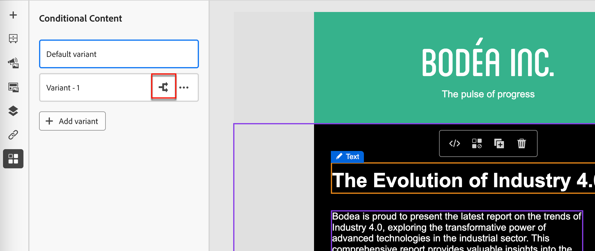

# Contenu conditionnel

Le contenu conditionnel vous permet d’adapter le contenu de l’e-mail et du fragment en fonction de règles conditionnelles. Ces règles sont définies à l’aide d’attributs de profil ou d’événements contextuels. Vous pouvez créer des règles conditionnelles dans le créateur de règles et les stocker pour les réutiliser dans les parcours de votre personne.

Pour ajouter du contenu conditionnel à vos fragments et messages e-mail, [!DNL Journey Optimizer B2B Prime] vous permet d’appliquer des règles conditionnelles stockées dans la bibliothèque _Conditions_. Appliquez des règles conditionnelles dans l’espace de conception visuelle lorsque vous créez [du contenu d’e-mail](./email-authoring.md) ou un [fragment](./fragment-authoring.md).

## Ajouter du contenu conditionnel {#add-conditional-content}

>[!CONTEXTUALHELP]
>id="ajo-b2b-prime_conditional_content"
>title="Contenu conditionnel"
>abstract="Utilisez des règles conditionnelles pour créer plusieurs variantes d’un composant de contenu. Si aucune des conditions n’est remplie lors de l’envoi du message, le contenu de la variante par défaut s’affiche."

>[!CONTEXTUALHELP]
>id="ajo-b2b-prime_conditional_rule_select"
>title="Contenu conditionnel"
>abstract="Utilisez une règle conditionnelle enregistrée dans la bibliothèque ou créez-en une."

Lorsque vous créez un [fragment](./fragment-authoring.md) ou un [e-mail](./email-authoring.md) dans l’espace de conception visuelle, utilisez des règles conditionnelles pour définir plusieurs variantes pour un composant de contenu.

1. Sélectionnez un composant de contenu et cliquez sur l’icône **[!UICONTROL Activer le contenu conditionnel]** dans la barre d’outils du composant.

   Voir [Barres d’outils des composants de contenu](./content-components.md#content-component-toolbars).

   Le composant est indiqué en orange pour indiquer qu’il est activé en tant que composant conditionnel. Le volet **[!UICONTROL Contenu conditionnel]** s’affiche à gauche avec la _Variante par défaut_ et la _Variante - 1_.

   {width="700" zoomable="yes"}

   Le contenu d’origine que vous avez sélectionné et activé est le contenu par défaut et s’applique lorsqu’aucune des règles conditionnelles n’est remplie pour les variantes que vous définissez.

   Dans ce volet, vous pouvez définir plusieurs variantes pour le composant de contenu sélectionné à l’aide de règles conditionnelles.

1. Passez la souris sur la première variante (_Variante - 1_) et cliquez sur l’icône _Sélectionner la condition_ (  ).

   {width="700" zoomable="yes"}

   La boîte de dialogue _[!UICONTROL Sélectionner une condition]_ s’ouvre et affiche la bibliothèque de conditions.

   Si vous souhaitez afficher les détails d’une condition pour vous assurer qu’elle correspond à vos besoins, cliquez sur l’icône _Plus de menu_ (**...**) et choisissez **[!UICONTROL Afficher les informations]**.

   {width="600" zoomable="yes"}

   Si la condition dont vous avez besoin n’existe pas, [créez une règle conditionnelle](#create-conditional-rule) en cliquant sur **[!UICONTROL Créer]**.

1. Sélectionnez la règle conditionnelle et cliquez sur **[!UICONTROL Sélectionner]** pour l’associer à la variante.

<!-- 

   You can review the associated condition by clicking the _More menu_ icon (**...**) for the variant and choosing **[!UICONTROL View condition]**.

   {width="600" zoomable="yes"}

   Click X at the top right to close the popup.

   {width="500"}

   -->

1. Pour une meilleure lisibilité, renommez la variante en cliquant sur l’icône _Plus_ (**...**) pour la variante et en choisissant **[!UICONTROL Renommer]**.

   Saisissez un nom significatif pour la variante qui vous permet d’identifier la variante et son intention.

   {width="600" zoomable="yes"}

1. Avec la variante sélectionnée dans le volet de gauche, modifiez le composant pour modifier la manière dont il apparaît dans le message lorsque la condition est remplie.

   Dans cet exemple, la variante du composant de texte utilise une description différente en fonction de la région du destinataire.

   {width="600" zoomable="yes"}

1. Si nécessaire, définissez une autre variante en cliquant sur **[!UICONTROL Ajouter une variante]**.

   Répétez les étapes 2 à 5 pour sélectionner une condition, renommer la variante et modifier le composant pour la variante.

   Vous pouvez ajouter autant de variantes que nécessaire pour le composant de contenu. Modifiez à tout moment la variante sélectionnée dans le volet de gauche pour vérifier comment le composant de contenu s’affiche pour la condition.

   >[!IMPORTANT]
   >
   >Le contenu conditionnel est évalué par rapport aux règles associées dans l’ordre dans lequel les variantes sont répertoriées. La première variante avec une condition qui est évaluée comme vraie est utilisée pour le composant.
   >
   >Si aucune des conditions de variante définies n’est vraie lors de l’envoi du message, le composant de contenu s’affiche selon la **[!UICONTROL Variante par défaut]**.

1. Pour supprimer une variante, cliquez sur l’icône _Plus_ (**...**) pour la variante et choisissez **[!UICONTROL Supprimer]**.

   Cliquez sur **[!UICONTROL Supprimer]** dans la boîte de dialogue de confirmation.

## Règles conditionnelles {#conditional-rules}

Les règles conditionnelles sont un ensemble d’expressions conditionnelles qui peuvent être évaluées comme « true » ou « false ». Utilisez ces règles pour déterminer la variante de contenu à afficher dans un message en fonction de divers filtres, tels que des attributs de profil ou des événements contextuels.

Les règles sont stockées dans la bibliothèque de conditions, où elles peuvent être réutilisées dans les e-mails et les fragments de contenu pour votre organisation.

<!--
M1.5 info -- out of date?

### Condition filters {#condition-filters}

| Condition type | Filters | Description |
| -------------- | ------- | ----------- |
| **Account** | Account Attributes | Attributes from the account profile, including: <li>Annual revenue</li><li>City</li><li>Country</li><li>Employee size</li><li>Industry</li><li>Name</li><li>SIC code</li><li>State</li> |
| | [!UICONTROL Special filters] > [!UICONTROL Has Buying Group] | The account does or does not have members of buying groups. The filter can also be evaluated against one or more of the following criteria: <li>Solution Interest</li><li>Buying Group status</li><li>Completeness Score</li><li>Engagement Score</li> |
| **Person** | [!UICONTROL Activity history] > [!UICONTROL Email] | Email activities associated with the journey: <li>[!UICONTROL Clicked link in email]</li><li>Opened Email</li><li>Was delivered email</li><li>Was sent email</li> These conditions are evaluated using a selected email message from earlier in the journey. |
| | [!UICONTROL Person Attributes] | Attributes from the person profile, including: <li>City</li><li>Country</li><li>Date of birth</li><li>Email address</li><li>Email invalid</li><li>Email suspended</li><li>First name</li><li>Inferred state region</li><li>Job title</li><li>Last name</li><li>Mobile phone number</li><li>Phone number</li><li>Postal code</li><li>State</li><li>Unsubscribed</li><li>Unsubscribed reason</li> |
| | [!UICONTROL Special filters] > [!UICONTROL Member of Buying Group] | The person is or is not a buying group member evaluated against one or more of the following criteria: <li>Solution Interest</li><li>Buying Group status</li><li>Completeness Score</li><li>Engagement Score</li><li>Is Removed</li><li>Role</li> |
-->

### Créer une règle conditionnelle {#create-conditional-rule}

>[!CONTEXTUALHELP]
>id="ajo-b2b-prime_conditions_rule_editor"
>title="Créer une condition"
>abstract="Combinez des attributs et des événements contextuels pour créer des règles qui déterminent la variante de contenu à afficher dans les e-mails."

Accédez au créateur de règles conditionnelles à partir de l’espace de conception lorsque vous sélectionnez une condition pour une variante de composant.

1. Dans la boîte de dialogue _[!UICONTROL Sélectionner une condition]_, cliquez sur **[!UICONTROL Créer]**.

   {width="700" zoomable="yes"}

   Cette action ouvre la boîte de dialogue _[!UICONTROL Créer une condition]_. Utilisez les outils de la boîte de dialogue pour combiner des attributs dans la zone de travail (similaire à l’expérience de création de segments dans Experience Platform). Les attributs de filtre sont organisés en trois onglets :

   * **[!UICONTROL Profil]** - Schéma XDM de profil B2B répertorie tous les attributs de profil associés au schéma du modèle de données d’expérience (XDM) défini dans Adobe Experience Platform.

   * **[!UICONTROL Contextuel]** - Lorsque votre message est utilisé dans un parcours, les champs de parcours contextuels sont disponibles dans cet onglet.

   * **[!UICONTROL Audiences]** - Répertorie toutes les audiences générées à partir des définitions de segment créées dans le service Adobe Experience Platform Segmentation.

   {width="700" zoomable="yes"}

1. Créez la règle conditionnelle selon vos besoins.

   Pour chaque filtre que vous souhaitez inclure dans la règle, faites glisser l’élément et déposez-le sur la zone de travail de la règle. Développez le filtre et terminez l’expression.

   {width="700" zoomable="yes"}

   Faites glisser et déposez des filtres supplémentaires selon vos besoins.

   Si vous incluez plusieurs filtres, vous pouvez activer ou désactiver le paramètre de logique des filtres en fonction de la manière dont vous souhaitez appliquer les filtres :

   * **[!UICONTROL Et]** - La règle est évaluée comme vraie si **tous** les filtres sont vrais.
   * **[!UICONTROL Ou]** - La règle est évaluée comme vraie si **l’un** des filtres est vrai.

   {width="700" zoomable="yes"}

1. Cliquez sur **[!UICONTROL Sélectionner]** pour utiliser la règle personnalisée pour la condition.

   Si vous souhaitez rendre la règle réutilisable, vous pouvez l’ajouter à la bibliothèque.

### Ajouter une condition à la bibliothèque {#add-to-library}

1. Dans la boîte de dialogue Créer une condition, cliquez sur **[!UICONTROL Enregistrer la condition]** en bas.

1. Sur la droite, saisissez le **[!UICONTROL Nom]** (obligatoire) et un **[!UICONTROL Description]** (facultatif) pour la règle.

   Utilisez un nom significatif et une description utile pour aider les autres membres de votre organisation à le réutiliser au lieu de créer une condition en double.

   {width="700" zoomable="yes"}

1. Cliquez sur **[!UICONTROL Ajouter]**.

   La règle conditionnelle est enregistrée dans la bibliothèque et vous pouvez la sélectionner pour la variante actuelle. Il est également inclus dans la bibliothèque afin d’être utilisé par toute autre variante de contenu dynamique dans les parcours de la personne.

>[!NOTE]
>
>Vous ne pouvez pas modifier une règle conditionnelle enregistrée dans la bibliothèque. Cependant, vous pouvez utiliser une règle enregistrée pour créer une nouvelle règle. Pour ce faire, ouvrez la règle conditionnelle, apportez les modifications souhaitées, puis enregistrez-la dans la bibliothèque avec un nouveau nom.

<!--

### Duplicate a rule {#duplicate-rule}

Conditional rules saved to the library cannot be modified. However, you can duplicate an existing rule and change it to create a new rule.

1. Click the _More menu_ icon (**...**) for the variant and choose **[!UICONTROL Duplicate]**.

   A duplicate of the rule opens in the rule builder. Use the duplicate as a starting point for the rule that you want to build.

   {width="600" zoomable="yes"}

1. In the rule builder, change, add, or delete conditions according to what you need.

1. Change the name and description to match the purpose or items in the rule.

1. When your conditional rule is complete, click **[!UICONTROL Save]**.
-->
