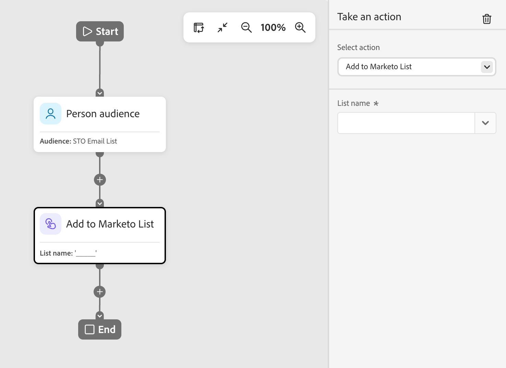
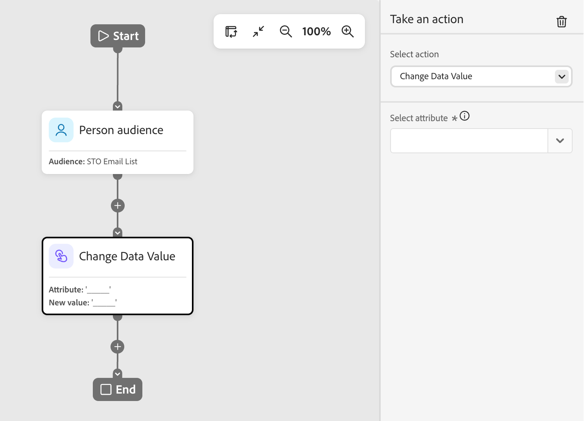
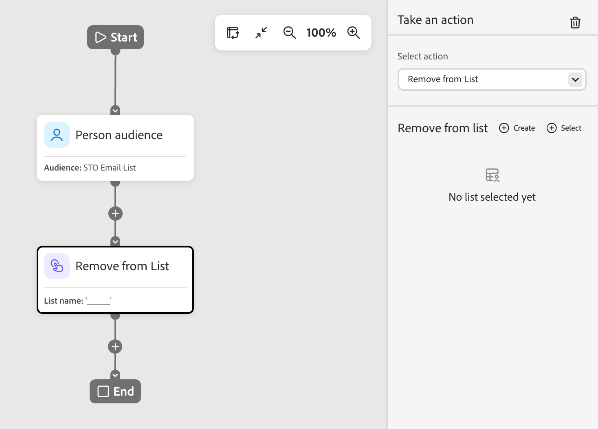
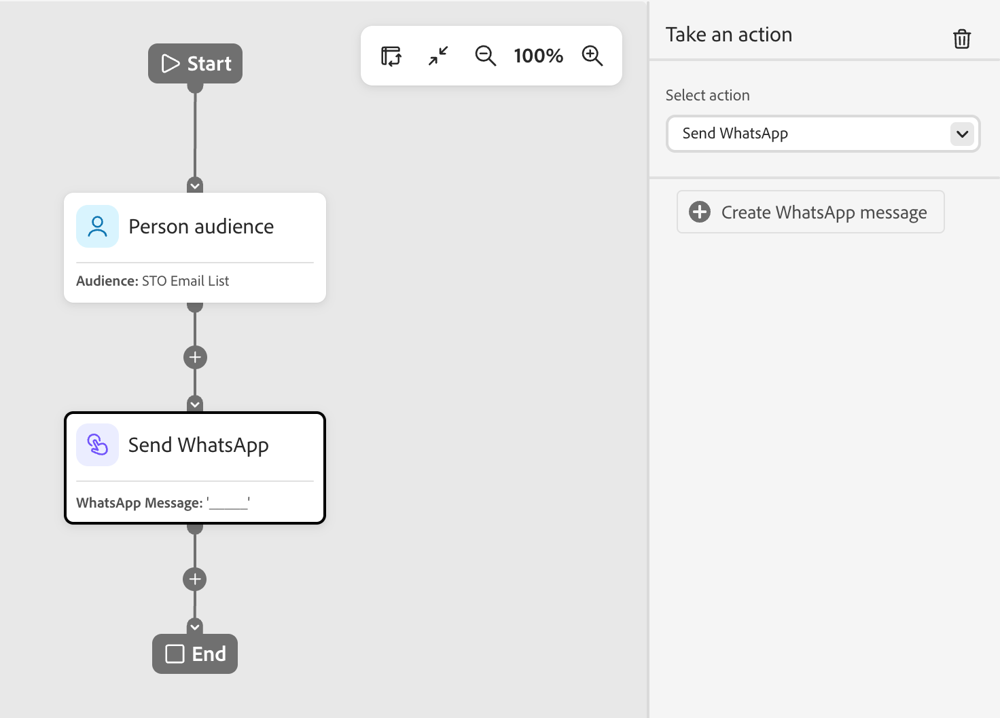

# Nœud Prendre une action

Dans un parcours de personne, utilisez une action sur les personnes lorsque vous souhaitez appliquer une modification à toutes les personnes sur le chemin de nœud.

## Actions et contraintes {#actions}

| Action | Contraintes |
| ------ | ----------- |
| **[!UICONTROL Activer vers la destination]** | <li>Sélectionner ou créer une liste statique <li>Si la liste n’a pas de destination activée, activez-la |
| **[!UICONTROL Ajouter une personne au Parcours]** | <li>Sélectionner un parcours planifié ou dynamique <li>Les critères d’audience du parcours cible ne sont pas appliqués |
| **[!UICONTROL Ajouter à la liste]** | <li>Créer une liste statique ou en sélectionner une existante |
| **[!UICONTROL Ajouter à la liste Marketo]** | <li>Sélectionner une liste statique dans Marketo Engage |
| **[!UICONTROL Modifier la valeur des données]** | <li>Sélectionner l’attribut de personne <li>Définir une nouvelle valeur |
| **[!UICONTROL Modifier les données du programme]** | <li>Sélectionner l’attribut de programme <li>Définir une nouvelle valeur |
| **[!UICONTROL Modifier le statut du programme]** | <li>Sélectionner un programme<li>Sélectionner un nouveau statut |
| **[!UICONTROL Supprimer de la liste]** | <li>Sélectionner une liste statique <li>Ignore la personne si elle n’est pas actuellement membre |
| **[!UICONTROL Supprimer de la liste Marketo]** | <li>Sélectionner une liste statique dans Marketo Engage <li>Ignore la personne si elle n’est pas actuellement membre |
| **[!UICONTROL Supprimer une personne du Parcours]** | <li>Sélectionner un parcours dynamique <li>Ignore la personne si elle n’est pas actuellement membre du parcours cible |
| **[!UICONTROL Demander une campagne Marketo]** | <li>Sélectionner une campagne Marketo Engage |
| **[!UICONTROL Envoyer un e-mail]** | <li>Créer, modifier ou utiliser un e-mail personnalisé par l’IA <li>Optimisation de l’heure d’envoi (facultatif) |
| **[!UICONTROL Envoyer WhatsApp]** | <li>Sélectionner un message WhatsApp |

## Ajouter un nœud d’action {#add-an-action-node}

1. Accédez à la zone de travail de parcours.

1. Cliquez sur l’icône plus ( **+** ) d’un chemin d’accès et choisissez **[!UICONTROL Effectuer une action]**.

   {width="200"}

1. Dans les propriétés de nœud sur la droite, sélectionnez une action dans la liste et définissez ses valeurs.

+++Activer vers la destination

Utilisez cette action pour activer des personnes vers des destinations Experience Platform directement à partir de votre parcours. Sélectionnez la destination et saisissez un nom d’audience pour identifier l’audience activée dans la destination.

{width="450"}

+++

+++[!UICONTROL &#x200B; Ajouter une personne au Parcours &#x200B;]

Utilisez cette action pour ajouter des personnes à d&#39;autres parcours planifiés ou en direct. Les personnes ajoutées par le biais de cette action sont immédiatement ajoutées à l’audience du parcours cible. Les critères d’audience du parcours ne sont pas appliqués.

{width="450"}

+++

+++[!UICONTROL Ajouter à la liste]

Utilisez cette action pour ajouter des personnes à une liste statique dans Journey Optimizer B2B Prime.

{width="450"}

Choisissez l’une des options suivantes :

* **[!UICONTROL Créer]** — Créez une ressource de liste statique et ajoutez-y des personnes. La liste est immédiatement disponible pour être utilisée par d’autres ressources dans Journey Optimizer B2B Prime.
* **[!UICONTROL Sélectionner]** — Sélectionne une ressource de liste statique existante à laquelle vous souhaitez ajouter les personnes qui atteignent le nœud.

+++

+++[!UICONTROL Ajouter à la liste Marketo]

Utilisez cette action pour ajouter des personnes à une liste statique dans Marketo Engage.

{width="450"}

+++

+++[!UICONTROL Modifier la valeur des données]

Utilisez cette action pour mettre à jour la valeur d’un attribut sur un enregistrement de personne. Sélectionnez l’attribut et définissez la nouvelle valeur.

>[!TIP]
>
>Pour effacer la valeur d’un attribut, définissez la valeur sur `NULL`.

{width="450"}

+++

+++[!UICONTROL Modifier les données du programme]

Utilisez cette action pour mettre à jour la valeur d’un attribut de programme. Sélectionnez l’attribut de programme et définissez la nouvelle valeur.

{width="450"}

+++

+++[!UICONTROL Modifier le statut du programme]

Utilisez cette action pour modifier le statut d’une personne dans un programme Marketo Engage. Sélectionnez le programme, puis sélectionnez le nouveau statut.

{width="450"}

+++

+++[!UICONTROL Supprimer de la liste]

Utilisez cette action pour supprimer des personnes d’une liste statique dans Journey Optimizer B2B Prime. Si une personne n’est pas actuellement membre de la liste, l’action est ignorée pour cette personne.

{width="450"}

+++

+++[!UICONTROL Supprimer de la liste Marketo]

Utilisez cette action pour supprimer des personnes d’une liste statique dans Marketo Engage. Si une personne n’est pas actuellement membre de la liste, l’action est ignorée pour cette personne.

{width="450"}

+++

+++[!UICONTROL Supprimer une personne du Parcours &#x200B;]

Utilisez cette action pour supprimer des personnes d’autres parcours de personnes actives. La personne est immédiatement retirée du parcours cible et aucune autre action n’est entreprise à son encontre. Si une personne n’est pas actuellement membre du parcours cible, l’action est ignorée pour cette personne.

{width="450"}

+++

+++[!UICONTROL Demander une campagne Marketo]

Utilisez cette action pour ajouter des personnes à une campagne de demande dans une instance Marketo Engage connectée. Sélectionnez la campagne Marketo Engage à demander.

{width="450"}

+++

+++[!UICONTROL Envoyer un e-mail]

Utilisez cette action pour envoyer un e-mail aux personnes inscrites. Les personnes dont le statut est désabonné, placées sur une liste bloquée, dont le statut d’e-mail est suspendu ou dont le marketing est suspendu ignorent cette action.

{width="450"}

Vous pouvez créer un e-mail, modifier un e-mail existant ou utiliser un e-mail personnalisé par l’IA. Pour plus d&#39;informations sur la création et la modification des emails, voir [Canal email](../marketing/email-channel.md).

Vous pouvez utiliser l’[optimisation de l’heure d’envoi](../marketing/email-send-time-optimization.md) pour personnaliser le délai de diffusion des e-mails en prédisant le moment où chaque profil est le plus susceptible d’interagir.

+++

+++[!UICONTROL Envoyer WhatsApp]

Utilisez cette action pour envoyer un message WhatsApp. Vous pouvez créer, personnaliser et prévisualiser des messages WhatsApp dans l&#39;espace de conception visuelle (voir [Création WhatsApp](../content/whatsapp-authoring.md)).

{width="450"}

+++
