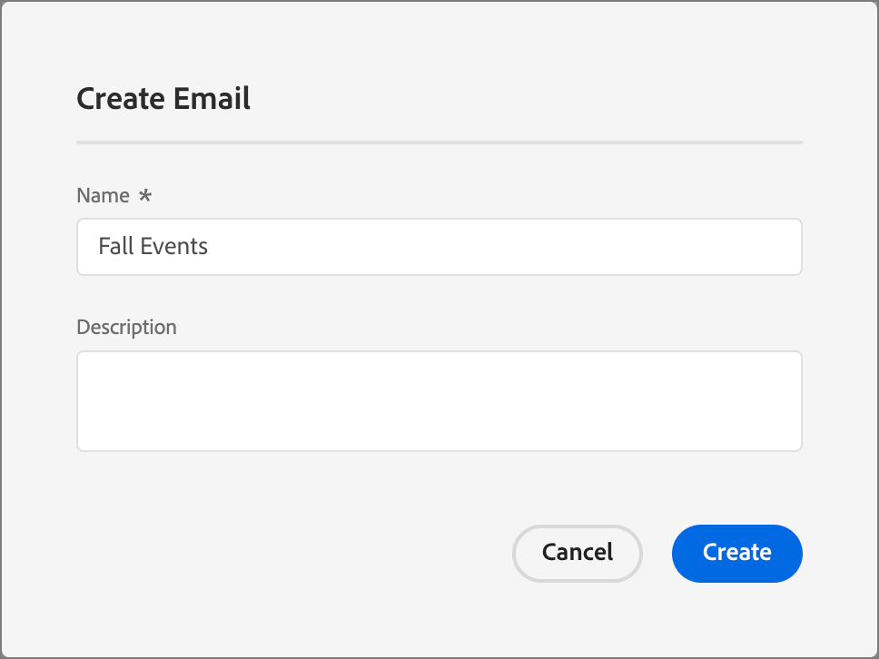

# Ajouter des e-mails aux parcours

[!DNL Adobe Journey Optimizer B2B Prime] offre aux spécialistes du marketing B2B une expérience moderne de création et de diffusion d’e-mails de niveau entreprise.

>[!NOTE]
>
>Si vous envoyez un e-mail pour la première fois, assurez-vous que [délivrabilité des e-mails](../start/email-deliverability.md) et le [canal e-mail](../admin/email-channel-configuration.md) nécessaire sont configurés.

<!-- 
* **Email channel configurations** - Manage the sender identity, reply behavior, marketing vs. transactional message types, and tracking.
* **Email deliverability controls** - Set up your email deliverability channel, including subdomain delegation (Fully Delegated and CNAME methods), DMARC, SPF/DKIM auto-configuration, and shared IP pool support.
* **Send Email action** - From a journey, add a _Send email_ action node, including personalization using profile attributes (Handlebars syntax).
* **Visual drag-and-drop email design tools** -  Design your email content with structures, content components, themes, dark-mode support, and reusable visual fragments.
* **Marketo Design Studio assets** — Choose images and assets from a one-time copy of your Marketo Engage asset library directly inside the email canvas.
* **Reusable templates and fragments** — Save common headers, footers, CTAs, and full email layouts and reuse them across journeys.
* **Role-Based Access Control (RBAC)** — Apply granular permissions for creating, editing, approving, and sending email. 
-->

## Limites actuelles {#limitations}

* **Les profils de test, Simuler du contenu et Envoyer un BAT** ne sont pas disponibles dans cette version. Le rendu Litmus et les rapports de spam basés sur SpamAssassin font partie de la feuille de route GA.
* **La personnalisation au niveau du compte et les données d’objet personnalisé** ne sont pas disponibles dans cette version. Utilisez les attributs de profil.
* **La migration automatisée Velocity-to-Handlebars** des modèles Marketo Engage existants est fournie en disponibilité générale.
* **Les commentaires et la collaboration sur les e-mails** (commentaires intégrés, @mentions, workflow de demande-révision) sont fournis dans une version à venir.
* **Les intégrations d’AEM Assets, des fragments de contenu AEM et d’Adobe Express** figurent sur la feuille de route _Suivi rapide_.

## Principaux concepts {#key-concepts}

Avant de créer des e-mails pour les parcours de personne et de créer du contenu d’e-mail, passez en revue les concepts suivants :

| Concept | En [!DNL Adobe Journey Optimizer B2B Prime] |
| ------- | ---------------------- |
| **_Espace de conception des emails_** | Canevas visuel et outils de conception utilisés pour composer du contenu d’e-mail. Il comprend des composants de disposition à glisser-déposer, des modèles, des fragments, des thèmes et un éditeur de personnalisation. |
| **_Modèle_** | Disposition d’e-mail réutilisable disponible pour la création d’un e-mail. Il peut s’agir d’un modèle type intégré fourni par Adobe ou d’un modèle personnalisé créé par votre équipe. |
| **_Fragment visuel_** | Bloc de contenu réutilisable (par exemple, en-tête, pied de page, CTA, clause de non-responsabilité) pouvant être inséré dans plusieurs e-mails. La mise à jour d’un fragment propage la modification à chaque e-mail qui l’utilise. |
| **_Thème_** | Paramètre prédéfini de style réutilisable (couleurs, typographie, espacement, styles de bouton) appliqué à un e-mail. |
| **_Jeton_** | Une expression Handlebars, par exemple `{{profile.firstName}}`, résolue au moment de l’envoi à l’aide des données de profil de chaque destinataire. |
| **_Action Envoyer un e-mail_** | Nœud d’action de parcours qui utilise une configuration de canal et du contenu d’e-mail pour diffuser un e-mail. |

## Ajout d’un e-mail à partir d’un parcours

Pour envoyer un e-mail à partir d’un parcours, [ajoutez un nœud _Prendre une action_ ](action-nodes.md#add-an-action-node) et configurez-le pour envoyer un e-mail.

1. Dans la zone de travail de parcours, cliquez sur l’icône **+** et sélectionnez **[!UICONTROL Effectuer une action]**.

1. Dans les propriétés de nœud sur la droite, définissez l’action sur **[!UICONTROL Envoyer un e-mail]**.

   {width="500"}

1. Choisissez la source de l’e-mail :

   * **Créer/modifier un e-mail** - Sélectionnez cette option pour définir le contenu de l’e-mail, y compris l’objet, les informations de l’expéditeur et le corps de l’e-mail dans l’espace de conception d’e-mail.

   * **[!UICONTROL Utiliser un e-mail personnalisé par l’IA]** - (_Non disponible pour Beta_) Sélectionnez cette option pour affiner un e-mail généré par l’IA dans l’espace de conception d’e-mail. Ces e-mails sont optimisés de sorte que les clients de boîte de réception assistés par l’IA fondent leurs résumés et leurs réponses dans vos offres et appels à l’action.

1. Cliquez sur **[!UICONTROL Créer un e-mail]**.

1. Dans la boîte de dialogue _[!UICONTROL Créer un e-mail]_, saisissez un **[!UICONTROL Nom]** unique (obligatoire) et un **[!UICONTROL Description]** (facultatif).

   {width="400"}

1. Cliquez sur **[!UICONTROL Créer]**.

Pour l’option [optimisation de l’heure d’envoi](email-send-time-optimization.md), configurez le nœud d’action de parcours après avoir créé l’e-mail.

## Définir les propriétés et les actions de l’e-mail {#define-email-properties}

La page e-mail s’ouvre lorsque vous créez un e-mail pour un nœud _[!UICONTROL Envoyer un e-mail]_. Vous pouvez également accéder à cette page après la création de l’e-mail en cliquant sur **[!UICONTROL Modifier l’e-mail]** dans les propriétés de nœud sur la droite.

1. (Facultatif) Dans l’onglet **[!UICONTROL Propriétés]**, saisissez les informations descriptives que vous souhaitez capturer pour l’e-mail.

1. Sélectionnez l’onglet **[!UICONTROL Actions]** et renseignez les paramètres fonctionnels de l’e-mail :

   * **[!UICONTROL E-mail]** - Sélectionnez ou créez une **[!UICONTROL configuration du canal e-mail]** à utiliser.

     Il s’agit de l’ensemble réutilisable de paramètres de diffusion par e-mail qui définit l’identité de l’expéditeur, l’adresse de réponse, le sous-domaine, le groupe d’adresses IP, le type d’e-mail (marketing ou transactionnel) et le suivi. Cliquez sur l’icône _Affichage_ pour passer en revue les paramètres de la configuration sélectionnée.

     Les administrateurs créent des configurations dans [configuration du canal e-mail](../admin/email-channel-configuration.md).

   * **[!UICONTROL Règles métier]** - (Facultatif) Appliquez des règles de limitation à votre action e-mail en sélectionnant un ensemble de règles.

   * **[!UICONTROL Suivi des actions]** - Cochez les cases correspondant aux actions que vous souhaitez suivre pour l’e-mail.

   {width="600" zoomable="yes"}

1. Cliquez sur **[!UICONTROL Modifier le contenu]** ou sélectionnez l’onglet **[!UICONTROL Contenu]**.

1. Saisissez le texte **[!UICONTROL Objet]** que vous souhaitez afficher dans le champ Objet de l’e-mail.

   Cliquez sur l’icône _Personnaliser_ (  ) pour utiliser un jeton de personnalisation dans le champ.

1. (Facultatif) Cochez la case **[!UICONTROL Optimiser la taille d’HTML]** pour réduire la taille de votre HTML de messagerie pendant le processus de publication.

   Cela permet d’éviter l’extraction d’e-mails dans les clients tels que Gmail, qui tronque les messages de plus de 100 Ko. Pour plus d’informations, voir [_Optimiser la taille de l’e-mail HTML_](#optimize-html-size).

1. Cliquez sur **[!UICONTROL Modifier le corps de l’e-mail]** pour accéder aux outils de conception visuelle et commencer [à créer votre contenu](../content/email-authoring.md).

   Vous pouvez également cliquer sur **[!UICONTROL Éditeur de code]** pour coder votre propre contenu dans HTML brut. Si vous disposez déjà d’HTML à réutiliser pour votre conception d’e-mail, vous pouvez le copier et le coller dans l’éditeur.

### Vérifier les alertes {#alerts}

[!DNL Adobe Journey Optimizer B2B Prime] fait apparaître les problèmes dans le coin supérieur droit de la page de l’e-mail. Résolvez toutes les erreurs avant d’activer le parcours. Les avertissements ne sont que des recommandations.

**Erreurs** (empêcher l’activation du parcours) :

* Le nom de l’expéditeur est vide
* Objet manquant
* Le contenu de l’e-mail est vide

**Avertissements** (recommandations) :

* Le lien d’exclusion n’est pas présent dans le corps de l’e-mail.
* La version texte d’HTML est vide.
* Liens vides détectés
* E-mail dépasse 100 000

## Optimiser la taille de l’e-mail HTML {#optimize-html-size}

>[!CONTEXTUALHELP]
>id="ajo-b2b-prime_email_minification"
>title="Réduction de la taille d’HTML"
>abstract="Activez cette option pour compresser votre HTML d’e-mail lors de la publication en supprimant les espaces blancs, les mises en retrait et les commentaires non indispensables. Cela permet d’éviter l’extraction d’e-mails dans les clients tels que Gmail, qui tronque les messages de plus de 100 Ko."

[!DNL Journey Optimizer B2B Prime] vous permet de compresser votre version d’HTML par e-mail pendant le processus de publication en supprimant les espaces inutiles, la mise en retrait et les commentaires non indispensables. Conserver une petite taille pour HTML vous permet d’effectuer les opérations suivantes :

* Évitez de **couper les e-mails** — certains clients comme Gmail tronquent les messages de plus de 100 Ko, empêchant les destinataires de voir le contenu complet.
* Améliorer le **temps de chargement des emails** dans la boîte de réception du destinataire.
* Améliorez la **délivrabilité** et réduisez l’utilisation de la bande passante.

Cette optimisation n’est pas appliquée automatiquement. Vous devez l’activer dans l’onglet _[!UICONTROL Contenu]_.

<!--  -->

>[!IMPORTANT]
>
> La réduction de la taille d’HTML n’est appliquée qu’au moment de la publication.

L’optimisation est sûre pour le client de messagerie :

* Il conserve les commentaires conditionnels MSO/Outlook.
* Il ne modifie pas le contenu, les images ou les vidéos.

>[!NOTE]
>
>La réduction de la taille de l’e-mail dépend de la structure HTML d’origine de votre e-mail. Si le contenu est déjà compact ou si la payload de l’e-mail est très volumineuse, la réduction peut être minimale et il se peut que l’écrêtage ne soit pas complètement empêché dans tous les cas.

<!-- 
Proof and simulate workflows are not available in this release. See [Current limitations](#limitations).

### Test HTML size optimization {#optimize-html-proof}

If you have enabled the [HTML size optimization](#optimize-html-size) option, you can evaluate its impact before publishing when sending proofs. Follow the following steps.

1. In the email design space, click the _Issues_ icon on the top right. If the rendered email size exceeds 100 KB, a message is displayed to warn you that this may cause truncation in some email clients.

1. Click **[!UICONTROL Simulate content]**.

1. To test the optimized version, click the **[!UICONTROL Send proof]** button and select the **[!UICONTROL Optimize HTML size]** option. This will send a proof with the reduced HTML size to your test recipients.

    >[!NOTE]
    >
    >This setting is independent from the email editor — the proof reflects what you select in the proof, regardless of whether the option is enabled or disabled in the email itself.

1. Select the test recipients and click **[!UICONTROL Send proof]**.

1. Back in the **[!UICONTROL Simulate]** screen, click the **[!UICONTROL View Proof]** button.

1. Click the _Information_ icon next to the status of the proof.

   The optimization details are displayed in a pop-up window, including the original HTML size, the optimized HTML size, and the size reduction percentage.
    
    Use this information to validate the optimized output and confirm the email stays within the recommended 100 KB threshold before publishing.

-->
