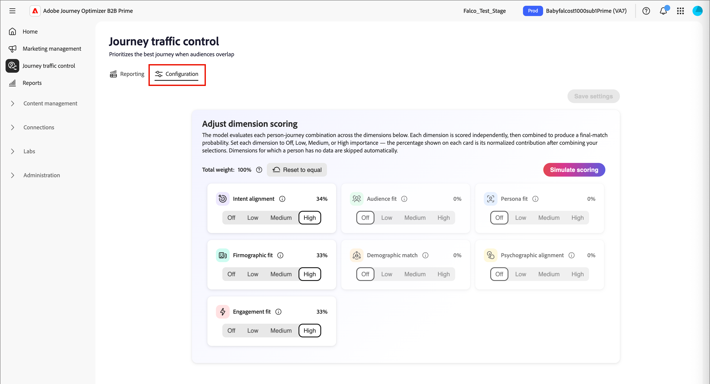

# contrôle de la circulation des parcours

Le contrôle du trafic de parcours (JTC) donne la priorité au meilleur parcours pour une personne lorsque les audiences se chevauchent. Lorsqu’une personne se qualifie pour plusieurs parcours compatibles avec JTC, un modèle d’IA les évalue par rapport à chaque candidat et les ajoute au parcours le mieux adapté, en les tenant à l’écart des autres.

>[!NOTE]
>
>Le contrôle du trafic parcours fonctionne de la même manière pour [!DNL Journey Optimizer B2B Ultimate] et [!DNL Journey Optimizer B2B Prime]. La fonctionnalité et la logique sont identiques ; il n’existe que des différences mineures d’interface utilisateur entre les niveaux. Les informations de cette page reflètent l’expérience [!DNL Journey Optimizer B2B Prime].

Une fois que la personne a terminé le parcours, elle est réévaluée pour les parcours restants pour lesquels elle reste qualifiée. JTC les ajoute ensuite au parcours le mieux adapté suivant, etc. Cela empêche qu’une même personne ne soit affectée simultanément à plusieurs parcours qui se chevauchent et garantit que chaque contact reçoit d’abord l’expérience la plus pertinente.

>[!NOTE]
>
>Actuellement, une personne ne peut être placée que dans un seul parcours sélectionné par JTC à la fois. Une option de configuration administrateur permettant à une personne d’être inscrite simultanément dans plusieurs parcours est prévue pour une version ultérieure.

## Dimensions de notation {#scoring-dimensions}

Le modèle évalue chaque combinaison de parcours de personne sur sept dimensions de notation. Chaque dimension est notée indépendamment, puis combinée, en fonction des poids que vous configurez, afin de produire une probabilité de correspondance finale pour cette personne et ce parcours. Le parcours présentant la correspondance la plus forte est sélectionné.

| Dimension | Ce qu’il évalue |
|---|---|
| Alignement de l’intention | Signaux d’intention comportementaux : recherches de mots-clés, visites de pages de produits, téléchargements de contenu, ouvertures d’e-mails/clics publicitaires et activité de page de tarification. |
| Adaptation de l’audience | La mesure dans laquelle la personne correspond à l’[audience cible](./person-audience-node.md) du parcours. |
| Adaptation du personnage | Alignement entre le rôle/[persona](../audiences/personas.md) de la personne et le parcours. |
| Ajustement micrographique | Attributs au niveau de l’entreprise (par exemple, secteur, taille et chiffre d’affaires). |
| Correspondance démographique | Attributs démographiques au niveau de la personne. |
| Alignement psychographique | Alignement basé sur les attitudes/préférences. |
| Adaptation de l’engagement | Récence et profondeur de l’engagement ](../audiences/engagement-scores.md) de la personne.[ |

Les dimensions pour lesquelles une personne ne dispose d’aucune donnée sont automatiquement ignorées, de sorte que la notation n’est jamais pénalisée en cas d’attributs manquants.

>[!IMPORTANT]
>
>JTC doit être activé pour au moins deux parcours afin de pouvoir effectuer toute action significative. L&#39;activer sur un parcours unique est inefficace, car il n&#39;y a pas de parcours concurrent à arbitrer. Ce n’est que lorsque plusieurs parcours sont activés pour JTC que le modèle commence à résoudre les conflits.

## Conditions préalables {#prerequisites}

Avant que le contrôle du trafic du parcours ne produise des résultats, tenez compte des points suivants :

* **La création de rapports nécessite un parcours publié et compatible JTC.** L’onglet _[!UICONTROL Rapports]_ n’affiche aucune donnée tant qu’au moins un parcours n’a pas été publié avec le contrôle de trafic de parcours activé.
* **La simulation nécessite au moins un parcours publié dans l’instance.** La simulation évalue les [profils](../audiences/people-lists.md) qui se trouvent déjà dans des parcours en direct. Il faut donc au moins un parcours publié dans l’instance à partir duquel dessiner des profils. La simulation elle-même ne nécessite pas l’activation de JTC (voir [_Simuler la notation_](#simulate-scoring)).

## Commencer {#get-started}

Sélectionnez **[!UICONTROL Contrôle du trafic Parcours]** dans le volet de navigation de gauche. La page affichée comporte deux onglets :

* **[!UICONTROL Création de rapports]** — Affichez les résultats des exécutions de contrôle du trafic (renseignés uniquement après que JTC a été exécuté sur des parcours en direct).
* **[!UICONTROL Configuration]** — Ajustez les dimensions de notation, simulez des résultats et choisissez les parcours qui participent.

>[!IMPORTANT]
>
>Pour un nouveau client qui n’a jamais utilisé le contrôle de trafic de parcours, l’onglet _[!UICONTROL Reporting]_ est vide. La création de rapports ne reflète que les parcours pour lesquels le contrôle du trafic a été appliqué et exécuté. Démarrez à partir de l’onglet _[!UICONTROL Configuration]_.

## Onglet Configuration {#configuration-tab}

L’onglet _[!UICONTROL Configuration]_ comporte deux sections : **[!UICONTROL Ajuster le score de la dimension]** et **[!UICONTROL Sélectionner les parcours]**.

### Ajuster le score des dimensions {#adjust-dimension-scoring}

C’est dans cette section que vous définissez dans quelle mesure chacune des sept dimensions contribue au score du match final. Chaque dimension peut être définie sur une importance **[!UICONTROL Désactivé]**, **[!UICONTROL Faible]**, **[!UICONTROL Medium]** ou **[!UICONTROL Élevée]**. Le pourcentage indiqué sur chaque carte est la contribution normalisée de cette dimension après avoir combiné toutes vos sélections - les sept poids totalisent toujours 100%. L’augmentation d’une dimension normalise automatiquement les autres afin que le total reste à 100 %.

Cliquez sur **[!UICONTROL Réinitialiser sur égal à]** pour rétablir toutes les dimensions à une pondération égale.

{width="800" zoomable="yes"}

### Simuler la notation {#simulate-scoring}

Avant de valider le poids en production, vous pouvez simuler le comportement du contrôle du trafic avec ces modifications. La simulation ne nécessite pas l’activation du contrôle du trafic parcours. Il évalue les profils qui se trouvent déjà dans vos parcours actifs et leur applique la logique de contrôle du trafic, afin que vous puissiez juger si les résultats semblent appropriés pour les poids que vous avez choisis.

1. Choisissez le nombre de profils à simuler.

1. Cliquez sur **[!UICONTROL Simuler la notation]**.

L’en-tête des résultats résume l’exécution :

* **Profils évalués** — le nombre de profils notés et le nombre de parcours.
* **Nombre moyen de conflits/profil** — Nombre moyen de parcours concurrents par profil.
* **Score moyen de correspondance** — degré de confiance moyen des parcours sélectionnés.

{width="700" zoomable="yes"}

Sous le résumé, chaque profil évalué apparaît sous la forme d’une carte indiquant le parcours sélectionné, la justification principale, les signaux d’intention et le score de correspondance. Sélectionnez un profil pour ouvrir une vue détaillée avec :

* **Score de correspondance** — La correspondance globale, avec une répartition par dimension avec code de couleur.
* **Décision** — parcours pour lesquels cette personne était admissible, laquelle a été choisie et pourquoi.
* **Scores Dimension par poids** — Les scores par dimension qui ont motivé la décision, extensibles pour afficher les signaux sous-jacents.

{width="450" zoomable="yes"}

Lorsque vous êtes satisfait(e) du résultat, vous pouvez :

* Ajustez les poids des dimensions et cliquez sur **[!UICONTROL Exécuter à nouveau]** pour relancer la simulation.

* Cliquez sur **[!UICONTROL Appliquer à la production]** pour valider les poids.

  Les nouvelles décisions de contrôle du trafic utilisent immédiatement les nouveaux paramètres ; les décisions antérieures ne sont pas affectées. Les poids que vous avez testés apparaissent dans l’onglet principal _[!UICONTROL Configuration]_ et sont utilisés pour toute évaluation du contrôle de trafic parcours dans votre environnement en ligne.

Vous pouvez également quitter la page sans appliquer les poids.

<!--

This section does not appear in the staging environment

### Select journeys {#select-journeys}

The _[!UICONTROL Select journeys]_ section is where you choose which journeys participate in traffic control.

>[!IMPORTANT]
>
>Only draft journeys are available for selection. Traffic control cannot be enabled for a journey that is already live. When JTC is enabled for a journey and then that journey is published, it cannot be disabled.

-->

## Activer le contrôle du trafic pour parcours {#enable-traffic-control-journey}

Lorsque le contrôle du trafic de parcours est activé et est publié pour plusieurs parcours :

* Toute personne éligible à un ou plusieurs de ces parcours est évaluée en fonction de son profil et des métadonnées du parcours.
* Si une personne se qualifie pour plusieurs parcours compatibles JTC à la fois (par exemple, cinq), le modèle détermine quel est le meilleur parcours à ce moment et l’inscrit dans ce seul parcours. Ils sont tenus à l&#39;écart des autres.
* La personne passe par ce parcours jusqu&#39;à ce qu&#39;il soit terminé.
* Une fois l’opération terminée, ils sont réévalués par rapport aux parcours restants pour lesquels ils sont toujours qualifiés et ajoutés au meilleur résultat suivant, puis répétés jusqu’à ce qu’il ne reste plus aucun parcours qualifié.

### Activer JTC pour un brouillon de parcours {#enable-traffic-control-draft-journey}

Le contrôle du trafic de parcours peut être activé directement sur un parcours individuel lorsqu’il a le statut _Brouillon_. <!-- This is the same setting surfaced from the admin/configuration flow — enabling it in either place keeps the two in sync. -->

1. Dans le volet de navigation de gauche, développez **[!UICONTROL Gestion marketing]**.

1. À droite dans la liste de ressources **[!UICONTROL Marketing]**, sélectionnez **[!UICONTROL parcours de personne]**.

1. Cliquez sur le nom du brouillon de parcours de personne pour l’ouvrir.

1. Cliquez sur **[!UICONTROL ... Plus]** en haut à droite et choisissez **[!UICONTROL paramètres de contrôle du trafic Parcours]**.

   {width="700" zoomable="yes"}

1. Dans la boîte de dialogue, activez l’option **[!UICONTROL Activer le contrôle du trafic de parcours]**.

   La boîte de dialogue des paramètres explique le comportement : lorsqu’elle est activée, le parcours devient candidat et il évalue et recommande le parcours le plus adapté pour une personne éligible à plusieurs parcours actifs.

   {width="380"}

1. Cliquez sur **[!UICONTROL Enregistrer]**

>[!IMPORTANT]
>
>Le bouton (bascule) peut être modifié à tout moment tant que le parcours conserve le statut _Brouillon_. <!-- If it was already enabled from the admin section (or previously enabled by someone else), the toggle appears on. --> Une fois que vous avez publié le parcours avec JTC activé, le contrôle du trafic évalue l’entrée dans ce parcours et vous ne pouvez plus désactiver le paramètre.

### Optimiser la description du parcours {#optimize-journey-description}

L’agent de contrôle du trafic peut utiliser efficacement les métadonnées d’un parcours (les nœuds du parcours, le nom de l’audience et des signaux structurels similaires) pour éclairer sa décision. Cependant, il bénéficie grandement d’une description riche et descriptive du parcours qui énonce clairement l’objectif et les buts du parcours.

Une description claire donne au modèle le contexte dont il a besoin pour prendre une décision plus éclairée quant à la place d’une personne dans ce parcours par rapport à une personne concurrente. C’est ce qui importe le plus lorsqu’un parcours est très simple. Par exemple, un parcours avec peu de nœuds offre un contexte limité. Une description claire de son objectif et de son audience cible aide donc le modèle à choisir correctement.

>[!TIP]
>
>Traitez la description du parcours comme une entrée du modèle de prise de décision, et pas seulement comme une documentation interne. Décrivez l’objectif du parcours (ce qu’il tente d’accomplir), ses objectifs et l’audience à laquelle il est destiné. Plus la description est explicite, plus le contrôle du trafic est précis et plus il peut être utilisé comme arbitre lorsqu’une personne est admissible pour plusieurs parcours qui se chevauchent, en particulier pour les parcours légers avec peu de nœuds.

## Onglet Rapports {#reporting-tab}

Une fois que le contrôle du trafic est activé pour plusieurs parcours avec des exécutions terminées, l’onglet _[!UICONTROL Reporting]_ affiche les résultats. Il existe deux vues : **[!UICONTROL Par exécution]** et **[!UICONTROL Par parcours]**.

### Par exécution {#by-run}

La vue _[!UICONTROL Par exécution]_ répertorie chaque exécution de contrôle du trafic. Pour chaque exécution, vous pouvez afficher l’heure, le déclencheur (planifié ou manuel), les parcours actifs évalués, les personnes évaluées, les décisions de contrôle du trafic, le temps de traitement et le statut. Sélectionnez une exécution pour ouvrir un panneau de détails contenant ces mesures clés pour l’exécution, ainsi que la liste des parcours évalués lors de cette exécution.

{width="700" zoomable="yes"}

### Par parcours {#by-journey}

Utilisez la vue _Par parcours_ pour examiner la manière dont le contrôle du trafic a affecté un parcours donné. Le tableau indique, par parcours, le nombre de personnes évaluées, inscrites à ce parcours, déplacées vers d’autres parcours et déjà actives.

{width="700" zoomable="yes"}

<!--
Selecting a journey opens a detail panel:

* **Summary** — Total people evaluated, broken down into _Enrolled in this journey_, _Moved to other journeys_, and _Already active_.
* **Competing journeys** — Every journey that had people competing with this one, and how many were enrolled in each.
* **People evaluated** — The individual people, each with an outcome (_Enrolled_, _Moved_, or _Already active_), competing journeys, and match score.

>[!TIP]
>
>The sum of enrolled people across all competing journeys always equals the _Moved to other journeys_ count in the summary. _Already active_ means the person was already in the journey when the evaluation occurred.

Selecting an individual person shows the same detail view as in simulation: the match score, the decision (competing journeys and which journey was selected and why), and the full dimension breakdown behind the selection.
-->
