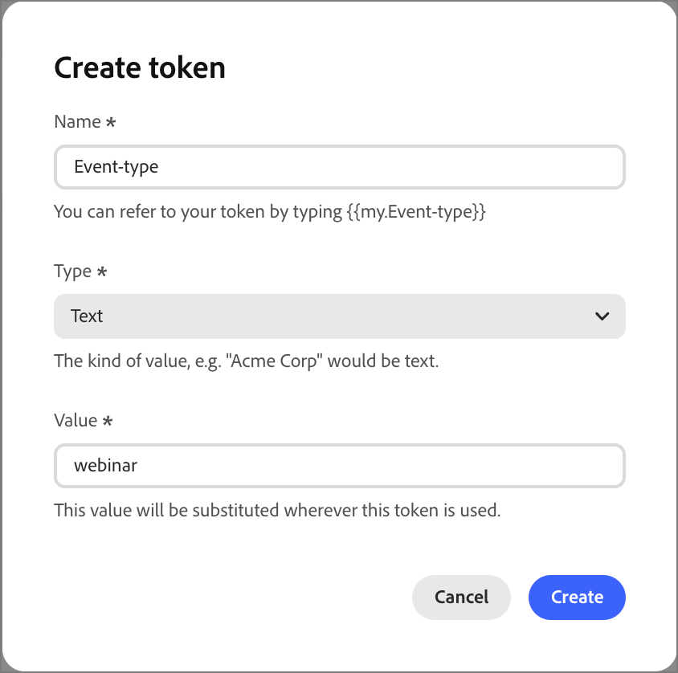

# Jetons personnalisés pour la personnalisation

La personnalisation du contenu utilise des jetons comme espaces réservés ou variables qui sont renseignés lorsque l’artefact de contenu est généré. Des jetons de personnalisation standard sont disponibles pour les e-mails, les pages de destination, les fragments et les modèles. Vous pouvez également définir un ensemble de jetons personnalisés avec des valeurs spécifiques au programme ou au dossier. Cet ensemble de jetons personnalisés est appelé _Mes jetons_ et l’un de ces jetons personnalisés est destiné à la personnalisation.

Lorsque vous ajoutez un jeton personnalisé à un e-mail, il s’affiche sous la forme `{{my.TokenName}}`. Par exemple, vous pouvez avoir créé des jetons `{{my.EventDate}}` ou `{{my.WebinarSpeaker}}` pour gérer le contenu des e-mails liés aux webinaires à venir.

Outre les jetons _Mes jetons_, qui sont spécifiques au programme ou au dossier, vous pouvez utiliser l’un des jetons standard (intégrés) pour la personnalisation.

## Jetons d’accès

1. Dans le volet de navigation de gauche, développez **[!UICONTROL Gestion marketing]**.

1. À droite dans la liste de ressources **[!UICONTROL Marketing]**, sélectionnez **[!UICONTROL Programmes]**.

1. Dans l’arborescence, sélectionnez le programme ou le dossier pour ouvrir les détails dans l’espace de travail central.

1. Cliquez sur l’onglet **[!UICONTROL Jetons]**.

   {width="800" zoomable="yes"}

   L’onglet affiche tous les jetons personnalisés définis dans le dossier ou le programme, ainsi que ceux définis pour les dossiers ou programmes parents.

### Types de jetons {#my-tokens}

Les _Mes jetons_ sont des variables personnalisées que vous créez ou modifiez pour un programme ou un dossier. Ce jeu de jetons personnalisé prend en charge les types de jetons suivants :

| Type de jeton | Description |
| ---------- | ----------- |
| Texte | Ce type contient une chaîne de texte standard. La taille maximale des jetons de texte est de 524 288 caractères (UTF-8), soit 2 Mo. |
| Date | Ce type contient une valeur de date. La date s’affiche sous la forme mois-jour-année (par exemple, 09-23-2026). |
| Date et heure | Ce type contient une valeur de date et d’heure. |
| Nombre | Ce type contient une valeur entière standard. |
| E-mail | Ce type contient une adresse e-mail valide. |
| Score | Utilisez ce jeton pour une modification du score d’un nœud d’action de parcours. |
| Booléen | Ce type contient une valeur booléenne standard, true ou false. |
| Texte complet | Ce type contient du texte formaté. |

### Imbrication de jetons

Lorsque vous créez un jeton dans un programme ou un dossier, il est disponible pour référence par d’autres objets enfants.

* Jeton local : le jeton est défini dans le même programme ou dossier.
* Jeton hérité - Le jeton est défini dans un programme ou dossier parent, un ou plusieurs niveaux au-dessus du programme ou dossier actuel.
* Jeton remplacé - Le jeton est défini dans un programme ou dossier parent, mais une valeur différente est définie dans le programme ou dossier actuel. Le statut du jeton passe à _Remplacé_ et tous les dossiers enfants, programmes et artefacts marketing héritent de la nouvelle valeur.

{width="600" zoomable="yes"}

### Créer un jeton

1. Dans l’onglet _[!UICONTROL Jetons]_, cliquez sur **[!UICONTROL Créer]**.

1. Dans la boîte de dialogue, saisissez le **[!UICONTROL Nom]** du jeton.

   {width="400"}

   Vous ne pouvez pas utiliser d’espaces ni de caractères spéciaux dans le nom du jeton. Vous pouvez utiliser _casse mixte_ comme `EventType`, pour utiliser un nom composé de plusieurs mots faciles à identifier.

1. Sélectionnez le **[!UICONTROL Type]** du jeton.

1. Définissez la **[!UICONTROL Valeur]** du jeton.

1. Cliquez sur **[!UICONTROL Créer]**.

### Modification d’un jeton

Vous pouvez modifier la valeur de l’un des jetons My Tokens définis. Procédez de la sorte pour remplacer la valeur d’un jeton hérité.

<!-- (How does this affect live person journeys? ) -->

1. Sur le _[!UICONTROL Jetons]_ , cliquez sur l’icône _Modifier_ en regard du nom du jeton.

1. Dans le champ , modifiez la valeur selon vos besoins.

   {width="400"}

1. Cliquez sur l’icône _Enregistrer_.

### Supprimer un jeton

Vous pouvez supprimer un jeton personnalisé de la liste s’il n’est pas actuellement utilisé dans le contenu d’e-mail en parcours.

1. Sur le _[!UICONTROL Jetons]_ , cliquez sur l’icône _Supprimer_ en regard du nom du jeton.

1. Dans la boîte de dialogue de confirmation, cliquez sur **[!UICONTROL Supprimer]**.

<!--

## Use custom tokens in your content

When you are authoring email content for your programs, you can use any of the tokens from the _My Tokens_ list when you use the personalization tools in the visual design space.

1. Select the text component and click the _Add personalization_ (  ) icon in the toolbar.

   {width="600"}

   This action opens the _Edit Personalization_ dialog. The dialog includes a _[!UICONTROL My tokens]_ folder in the _[!UICONTROL Personalization Tokens]_ library if there are custom tokens defined for the account journey.

1. To add one of your custom tokens to the blank space, expand the **[!UICONTROL My tokens]** folder, then click **+** or **...**.

   You can add any additional static text as needed.

   {width="700" zoomable="yes"}

1. Click **[!UICONTROL Save]**.

-->
