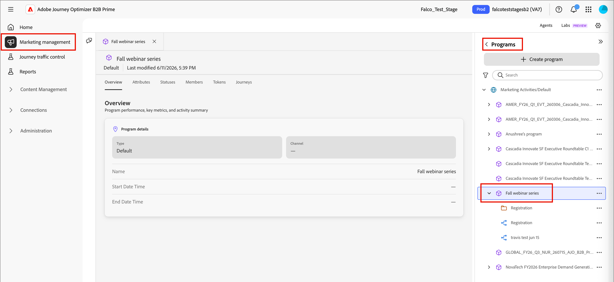

# Programmes

Les programmes sont conçus pour donner un contexte partagé à vos dérivés et parcours marketing, afin que vous puissiez gérer tous les aspects d’un effort marketing à partir d’un seul emplacement. Utilisez les attributs de programme pour décrire votre programme et utilisez le filtre _Membre du programme_ pour segmenter les audiences en fonction de l’appartenance au programme, du statut du membre et de la réussite. Dans l’onglet Jetons , vous pouvez gérer les jetons locaux _Mes jetons_ et les jetons hérités dans votre structure de dossiers.

## Accéder aux programmes {#access-programs}

Chaque programme réside dans la structure de dossiers _[!UICONTROL Marketing]_ et peut contenir des parcours, des listes et d’autres ressources pour organiser vos efforts marketing.

1. Dans le volet de navigation de gauche, développez **[!UICONTROL Gestion marketing]**.

1. À droite dans la liste de ressources **[!UICONTROL Marketing]**, sélectionnez **[!UICONTROL Programmes]**.

1. Utilisez les outils _Rechercher_ et _Filtrer_ pour rechercher des éléments dans la structure.

1. Sélectionnez un programme ou un dossier dans la structure pour ouvrir ses détails dans l’espace de travail central.

   {width="800" zoomable="yes"}

   Sélectionnez l’un des onglets pour accéder aux détails ou au contenu du programme ou du dossier.

## Création d’un programme {#create-program}

>[!IMPORTANT]
>
>Chaque programme est basé sur un [type de programme](../admin/program-types.md), qui définit les aspects importants du programme et de ses membres. Assurez-vous de disposer d’un type de programme défini pour prendre en charge votre programme avant de le créer.

1. Cliquez sur **[!UICONTROL Créer un programme]** dans la partie supérieure de l’arborescence du programme.

1. Dans la boîte de dialogue, sélectionnez l’emplacement **[!UICONTROL Parent]** dans la structure Programmes .

   Il peut s’agir de la racine, d’un dossier ou d’un programme existant.

1. Saisissez un **[!UICONTROL Nom]** unique (obligatoire).

   {width="400"}

1. Choisissez **[!UICONTROL Type de programme]**, qui détermine les attributs du programme et les statuts des membres.

1. (Facultatif) Saisissez une **[!UICONTROL Description]** pour le programme.

   >[!TIP]
   >
   >L’ajout d’une description est une bonne pratique qui rend vos programmes plus accessibles et détectables.

1. Cliquez sur **[!UICONTROL Créer]**.

## Attributs {#attributes}

Chaque programme hérite d’un ensemble d’attributs de son [type de programme](../admin/program-types.md). Utilisez des attributs pour décrire les aspects importants de vos programmes marketing, tels que les dates d’événement et les attributs d’emplacement.

>[!NOTE]
>
>Après Beta : attributs de programme en tant que jetons et en tant que membre de contraintes de programme

## Statuts {#statuses}

Chaque programme hérite d&#39;un ensemble de statuts de membre à partir de son type de programme. Ces statuts peuvent être attribués aux membres du programme pour une utilisation dans la segmentation de l’audience avec le filtre Membre du programme .

Chaque statut est affecté à une étape du type de programme, comme 1, 2 ou 3. Les membres d’un programme peuvent uniquement passer d’un statut avec le même numéro d’étape (par exemple, de _Non affiché_ à _Terminé_), ou à un statut avec un numéro d’étape plus élevé (par exemple, de _Invité_ à _Enregistré_).

Dans le type de programme, les statuts sélectionnés _[!UICONTROL Marquer comme réussi]_ sont considérés comme réussis.

### Modifier le statut du programme {#change-program-status}

Pour ajouter une personne à un programme ou modifier son statut, elle doit passer par une **_[!UICONTROL Modifier le statut du programme]_** [action dans un parcours ](./action-nodes.md). Cela en fait un membre du programme et lui attribue un statut dans ce programme.

### Corriger le statut d’un programme {#correct-program-status}

Si des personnes ont été affectées par erreur à un statut et ne peuvent pas être déplacées vers l’avant ou latéralement vers le statut correct, vous pouvez corriger ce problème en définissant d’abord la personne sur _Pas dans le programme_, puis en lui affectant le statut correct.

## Membres {#members}

L’onglet **Membres** affiche un inventaire des personnes qui sont membres du programme.

<!-- How do they get there? I don't see this populated for any of the programs that I have reviewd -->

## Jetons {#tokens}

Utilisez _Mes jetons_ pour gérer facilement les détails du programme qui apparaissent à de nombreux endroits, tels que les dates et les emplacements des événements, les pieds de page des e-mails, les exercices et trimestres, etc. Ces jetons spécifiques au programme sont des chaînes spéciales conçues pour être réutilisées sur plusieurs parcours ou ressources marketing afin de remplacer une valeur prédéterminée. Par exemple :

_Vous êtes invité à participer à notre exposition le `{{my.Event Date}}`._

Si vous envoyez cet e-mail par l’intermédiaire d’un parcours sous un programme avec un _Date de l’événement_ Mon jeton défini sur `2026-01-01`, le destinataire voit :

_Vous êtes invité à participer à notre exposition le 2026-01-01._

Mes jetons peuvent également être affectés au niveau du dossier. Les dossiers et les programmes héritent tous deux de tous mes jetons définis pour un parent dans l’arborescence. Un jeton hérité peut être remplacé si une autre valeur est pour le même jeton est définie à un niveau inférieur. Par exemple, vous pouvez définir un pied de page d’e-mail en haut de votre structure de dossiers, mais modifier la langue de copyright d’un événement de co-marketing avec un partenaire ou modifier l’URL d’une bannière promotionnelle pour un programme spécifique à un produit.

Pour plus d’informations sur la définition et l’utilisation de mes jetons, voir [ Jetons personnalisés pour la personnalisation ](./personalization-my-tokens.md).

## Filtre Membre du programme {#member-of-program}

_Membre du programme_ est un filtre qui vous permet de segmenter vos listes dynamiques en fonction de l’appartenance ou non d’une personne à un programme, de son statut et de sa réussite ou non dans ce programme. Faites attention lorsque vous utilisez les contraintes **_Programme_** et **_Statut_** ensemble — utilisez des types de correspondance avec les programmes que vous utilisez pour les filtres, sinon cela pourrait créer par inadvertance une audience qui ne peut pas avoir de membres.
