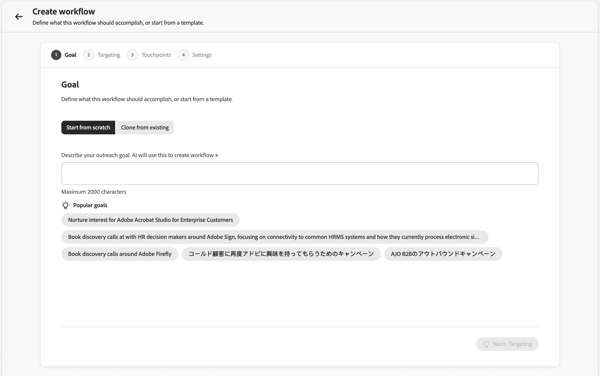

# Qualificateur de vente

Sales Qualifier est une application pilotée par l’IA que vous pouvez utiliser avec [!DNL Adobe Journey Optimizer B2B Prime]. Il met en œuvre Account Qualification Agent et est conçu pour rationaliser les workflows pour les représentants du développement commercial (BDR). Le qualificateur de vente automatise les workflows de qualification des prospects, de sensibilisation et d’engagement des acheteurs sur l’ensemble des canaux. Il réduit la charge manuelle de BDR et accélère la vitesse du pipeline pour les entreprises B2B.

Les BDR peuvent utiliser les plug-ins de navigateur et d’e-mail pour accéder à la Business Intelligence directement dans les CRM ou Outlook. La vidéo suivante présente brièvement le qualificateur de vente et le Account Qualification Agent.

>[!VIDEO](https://video.tv.adobe.com/v/3476550)

## Page de départ Application {#application-home}

Le qualificateur de vente est inclus dans [!DNL Journey Optimizer B2B Prime], mais il s’agit d’une application distincte dans Adobe Experience Platform.

{width="800" zoomable="yes"}

### Agent Account Qualification {#account-qualification-agent}

Le Account Qualification Agent (AQA) est au cœur du qualificateur de vente. L’AQA utilise l’IA pour lire vos comptes et déterminer lesquels sont prêts pour l’étape suivante. Il facilite la recherche, la rédaction d’e-mails et le contexte orienté CRM lorsque votre organisation a connecté le CRM (lecture seule).

<!--
## Edit the left navigation bar

At the bottom left of the application, click the _Edit_ (  ) icon to control which elements are visible in the left navigation. You can also drag and drop them to reorder as you want.
-->

### Utilisation de base de l’agent {#basic-agent-usage}

Les agents Adobe AI utilisent _requêtes en langage naturel_, ce qui signifie qu’ils utilisent la même langue dans l’invite de texte que vous lorsque vous parlez à une personne. Plus vous êtes détaillé, meilleurs sont les résultats.

En utilisant le langage naturel, vous pouvez demander à l’agent de :

* `Tell me the latest financial results of Bodea`
* `Tell me more about hiring at TechNova`
* `Tell me about the new AI features in Bodea LumaSecure4`

Itérez vos workflows sortants en affinant vos invites pour obtenir les résultats dont vous avez besoin. Par exemple :

* _Rédiger un e-mail de relance à partir du contexte, comme des appels de rémunération ou des rapports._ Jusqu’à 120 mots. Objet : Captivant, intégrant un thème clé. Introduction : crochet avec citation directe de sources de contexte. Corps : permet de se connecter aux points faibles et aux propositions de valeur. CTA : proposez un bref appel pour en savoir plus._

* _L’objectif de cet e-mail est de commencer une conversation et de créer de la crédibilité._ Rédigez un e-mail de 120 mots, au ton consultatif et empathique. Évitez d&#39;adopter une approche trop familière ou commerciale et n&#39;utilisez pas les expressions « j&#39;espère que vous allez bien », « je vous demande simplement de vous enregistrer » ou « s&#39;il vous plaît ».

### Accès aux produits et groupes d’utilisateurs {#product-access-and-user-groups}

L’accès aux fonctionnalités du qualificateur de vente est géré via des groupes d’utilisateurs dans Adobe Admin Console. Les administrateurs de produit doivent configurer les groupes d’utilisateurs appropriés avant que les utilisateurs puissent accéder à l’application.

#### Administrateurs de produit

Les administrateurs de produit qui doivent accéder à la fonctionnalité [Intégrations](#integrations) doivent être membres du groupe d’utilisateurs `Sales Qualifier Admins`.

1. Dans Adobe Admin Console, créez un groupe d’utilisateurs nommé `Sales Qualifier Admins`.
1. Ajoutez les utilisateurs qui doivent configurer des connexions CRM et les paramètres de la base de connaissances.

#### Utilisateurs BDR standard

Les utilisateurs standard de BDR doivent être membres du groupe d&#39;utilisateurs `Sales Qualifier users` pour accéder au qualificateur de vente.

1. Dans Adobe Admin Console, créez un groupe d’utilisateurs nommé `Sales Qualifier users`.
1. Attribuez le profil AEP **Tous les accès de production par défaut** au groupe .
1. Ajoutez des utilisateurs au groupe .

>[!NOTE]
>
>Les noms des groupes d’utilisateurs doivent correspondre exactement comme indiqué dans les étapes précédentes.

## Prospects {#prospects}

Sélectionnez **[!UICONTROL Prospects]** dans le volet de navigation de gauche pour afficher une liste de tous les prospects auxquels vous pouvez accéder. Il fournit un aperçu rapide des informations, telles que le statut du prospect et la dernière activité.

{width="800" zoomable="yes"}

Cliquez sur l’icône _Filtrer_  pour filtrer la liste affichée par statut de prospect.

## Workflows sortants {#outbound-workflows}

>[!NOTE]
>
>Les workflows sortants créés par les administrateurs de produit sont partagés avec tous les utilisateurs de votre organisation.

Un _workflow sortant_ est la structure utilisée par le qualificateur de vente pour exécuter une séquence d’e-mails pilotée par les objectifs. Vous définissez un objectif de sensibilisation et des critères de ciblage, et l’IA propose une cadence multi-touch et écrit du contenu d’e-mail personnalisé pour chaque prospect. Vous passez en revue et approuvez chaque e-mail avant que l’inscription n’active la séquence afin que les messages soient envoyés uniquement pendant la fenêtre configurée.

Un workflow sortant connecte quatre éléments :

* **Objectif** - Résultat que vous souhaitez obtenir de la sensibilisation (par exemple, la réservation d’un appel de découverte ou l’enregistrement d’un événement de conduite).
* **Filtres de ciblage** - Conditions qui déterminent les prospects éligibles.
* **Cadence des points de contact** - Séquence ordonnée d’étapes, chacune à un jour planifié. Les points de contact peuvent être **e-mails**, **appels téléphoniques** ou **LinkedInMails**.
* **Contenu d’e-mail personnalisé** - Pour chaque point de contact d’e-mail, l’IA rédige le contenu en utilisant le profil du prospect, le contexte du compte, l’historique d’engagement et les actualités récentes.

L’objectif mène tout en aval : l’IA l’utilise pour suggérer des filtres de ciblage, concevoir la cadence, les invites de point de contact de brouillon et personnaliser la forme de chaque e-mail généré.

{width="800" zoomable="yes"}

### Principaux concepts {#key-concepts}

| Concept | Description |
| --- | --- |
| **Workflow** | Activité sortante réutilisable définie par un objectif, des filtres de ciblage, une cadence et des paramètres. |
| **Objectif** | Ce que la sensibilisation devrait accomplir. |
| **Point de contact** | Une étape de la séquence (e-mail, appel téléphonique ou LinkedInMail), planifiée par rapport à l’inscription. |
| **invite de point de contact** | Instructions que l’IA suit lors de la génération du corps et de l’objet de l’e-mail pour un prospect (ton, longueur, focus et call to action). |
| **Cadence** | La séquence complète des points de contact : combien, dans quel ordre et à quels jours. |
| **Filtre de ciblage** | Une condition qui limite le workflow à un sous-ensemble de prospects. |
| **Brouillon** | Un e-mail généré qui est prêt pour la révision mais pas encore approuvé. |
| **Raisonnement** | L’explication de l’IA sur la manière dont elle a écrit un e-mail donné (quels signaux et sources de données elle a utilisés). |
| **Inscription** | La validation des brouillons d’un prospect, qui active le rythme et met en file d’attente les e-mails à envoyer pendant la fenêtre d’envoi du workflow. |

Les sections suivantes décrivent l’ensemble du cycle de vie : création d’un workflow dans l’assistant, révision des e-mails générés, approbation des prospects et gestion des workflows au fil du temps.

### Création d’un workflow sortant {#outbound-workflow}

La création de workflow est un assistant en cinq étapes : **Objectif**, **Ciblage**, **Générer des points de contact**, **Paramètres** et **Ajouter des prospects**. Chaque étape s’appuie sur la dernière ; votre objectif initial façonne chaque décision ultérieure.

1. Dans le volet de navigation de gauche, sélectionnez **[!UICONTROL Workflow sortant]**.

1. Dans l’onglet **[!UICONTROL Parcourir]**, cliquez sur **[!UICONTROL + Créer un workflow]** dans le coin supérieur droit.

#### Étape 1 : définir votre objectif

L’objectif est l’entrée la plus importante : elle indique à l’IA à quoi ressemble la réussite et ancre le ciblage, la cadence et la génération d’e-mails.

1. Choisissez **[!UICONTROL Démarrer à partir de zéro]** pour écrire votre propre objectif, ou **[!UICONTROL Démarrer à partir d’un modèle]** pour utiliser un modèle enregistré.

   {width="700" zoomable="yes"}

1. Sélectionnez l’un des **[!UICONTROL Objectifs recommandés]** comme point de départ ou saisissez votre propre objectif.

1. Cliquez sur **[!UICONTROL Suivant : Ciblage]**.

Les objectifs fonctionnent mieux lorsqu’ils énoncent un **résultat concret**, et pas seulement un sujet. Par exemple, `Book a 15-minute discovery call with marketing leaders evaluating campaign automation` donne à l’IA plus de possibilités de travail que de `Promote campaign automation`.

#### Étape 2 : Configuration des filtres de ciblage

Les filtres de ciblage définissent les prospects éligibles. Lorsque vous ajoutez des prospects ultérieurement, seuls ceux qui correspondent à ces filtres apparaissent dans la liste de sélection.

1. Cliquez sur la flèche vers le bas pour afficher la liste **[!UICONTROL Ajouter un filtre]** et sélectionnez un filtre à appliquer.

   {width="700" zoomable="yes"}

1. Définissez des valeurs pour le filtre.

1. Ajoutez d’autres filtres si vous devez limiter l’audience.

   {width="600" zoomable="yes"}

1. Cliquez sur **[!UICONTROL Suivant : générer des points de contact]**.

#### Étape 3 : génération et révision des points de contact

Une fois le ciblage défini, l’IA crée la **_cadence_** : elle analyse votre objectif et votre ciblage, définit la séquence de points de contact et écrit une **_invite de point de contact_** pour chaque étape. Une cadence à plusieurs étapes s’affiche avec chaque point de contact un jour spécifique. Le rythme peut combiner des étapes d’e-mail, d’appel téléphonique et d’InMail LinkedIn.

{width="700" zoomable="yes"}

Développez un point de contact d’e-mail pour lire son invite. Ces instructions guident l’IA lors de l’écriture de l’e-mail de chaque prospect, y compris le ton, la longueur, le focus et __.

**Régénérer le rythme**

Si la cadence ne vous convient pas, cliquez sur **[!UICONTROL Régénérer]** et saisissez une instruction d’affinement. Par exemple :

* `Make it 3 touchpoints across 2 weeks`
* `Lead with an executive briefing offer in the first email`
* `Add a nurture touch focused on a relevant case study`

L’IA réécrit la cadence complète en fonction de vos instructions.

Pour ajuster un seul point de contact d’e-mail sans régénérer l’ensemble de la cadence, modifiez le texte de l’invite directement dans sa zone de texte.

Lorsque le rythme et les invites sont corrects, cliquez sur **[!UICONTROL Suivant : Paramètres]**.

Raffiner les invites de point de contact avant que la génération par prospect ne soit importante : ces invites sont les instructions principales que l&#39;IA utilise pour chaque prospect ultérieurement. Le temps passé ici est mis à l’échelle sur tous les e-mails générés.

#### Étape 4 : configurer les paramètres de workflow

L’étape **Paramètres** contrôle le fonctionnement du workflow.

{width="700" zoomable="yes"}

1. Vérifiez le **[!UICONTROL nom du workflow]** et modifiez-le si vous souhaitez un libellé plus clair.
1. Dans **[!UICONTROL Nombre maximal de prospects par workflow]**, confirmez la limite supérieure du nombre de prospects que le workflow peut gérer à la fois.
1. Définissez la **[!UICONTROL fenêtre d’envoi]** pour les heures pendant lesquelles les e-mails sortants sont autorisés à être envoyés.
1. Confirmez **[!UICONTROL Inclure le lien d’exclusion]** afin que chaque e-mail puisse inclure un lien d’exclusion.
1. Vérifiez que le **[!UICONTROL fuseau horaire]** correspond à votre audience.
1. Cliquez sur **[!UICONTROL Enregistrer et ajouter des prospects]**.

#### Étape 5 : ajouter des prospects et commencer la génération d’e-mails

L’enregistrement ouvre la vue de sélection des prospects, déjà filtrée par votre ciblage de l’étape 2.

{width="700" zoomable="yes"}

1. Passez en revue la liste.

   Les lignes comprennent généralement le nom, le compte, l’adresse e-mail, la fonction, le statut d’engagement et le statut du prospect.

1. Ajustez les filtres ici si vous devez développer ou réduire la liste.
1. Sélectionnez des prospects à l’aide des cases à cocher.
1. Cliquez sur **[!UICONTROL Suivant : consulter les points de contact]** pour commencer la génération d’e-mails **par prospect**.

L’IA génère des e-mails personnalisés pour chaque prospect sélectionné **chaque point de contact d’e-mail** à la cadence. Les points de contact Phone et LinkedInMail restent dans la séquence comme prévu. La génération peut s’exécuter en arrière-plan. Utilisez **[!UICONTROL Notifier lorsque vous êtes prêt]** si vous souhaitez continuer une autre tâche pendant qu’elle se termine.

Pour chaque prospect, l’IA combine chaque invite de point de contact avec des données spécifiques au prospect (personne, compte, historique d’engagement, actualités récentes) afin de produire l’objet et le corps.

### Consulter et affiner les e-mails générés {#review-refine-emails}

Une fois la génération terminée, la vue détaillée du workflow affiche une bannière pour réviser les brouillons. Une révision est requise et rien n’est envoyé tant que vous n’avez pas approuvé.

{width="700" zoomable="yes"}

1. Dans la vue détaillée du workflow, cliquez sur **[!UICONTROL Vérifier les brouillons]** dans la bannière.
1. L’étape **[!UICONTROL Vérifier les points de contact]** comporte deux onglets :
   * **[!UICONTROL Prêt pour la révision]** - E-mails dont la génération est terminée.
   * **[!UICONTROL Génération en cours]** - Les e-mails sont toujours en cours d’écriture.
1. Dans la liste des prospects de gauche, cliquez sur un nom pour charger les points de contact de ce prospect à droite.
1. Utilisez le chevron (**>**) sur un point de contact pour développer et lire l’objet et le corps complets.

#### Lire le raisonnement de l’IA

Pour chaque e-mail généré, la section **[!UICONTROL REASONING]** explique comment l’IA a conçu ce message, y compris les signaux, les attributs et les sources qui ont façonné le contenu et le call to action. Passez en revue ces informations et validez la personnalisation avant d’approuver.

{width="600" zoomable="yes"}

#### Modifier directement les e-mails

Pour les petites modifications (libellé, ton, une seule phrase) :

1. Sur le point de contact développé, cliquez sur l’icône _Modifier_ pour ouvrir l’éditeur.
1. Modifiez l’objet ou le corps.
1. Cliquez sur **[!UICONTROL Enregistrer]**

#### Affiner les e-mails avec l’IA

Pour des modifications plus importantes (restructuration, changement de focus ou recadrage du message), utilisez **[!UICONTROL Générer avec l’IA]**. L’agent AI réécrit l’e-mail tout en conservant le contexte de personnalisation.

1. Dans l’éditeur d’e-mail, cliquez sur **[!UICONTROL Générer avec IA]**.

   {width="600" zoomable="yes"}

1. Saisissez une instruction claire, par exemple :
   * `Make it shorter and more direct. Keep it under 100 words.`
   * `Focus more on the prospect's role and how the solution helps them specifically.`
   * `Change the call-to-action to suggest a 15-minute introductory call instead.`
1. Passez en revue la révision et apportez les modifications manuellement, si nécessaire.
1. Cliquez sur **[!UICONTROL Enregistrer]**

>[!TIP]
>
>Les modifications directes suivent le libellé et le ton. _[!UICONTROL Générer avec l’IA]_ est préférable si vous ne réécrivez pas l’e-mail à partir de zéro.

### Approuver et inscrire des prospects {#approve-enroll-prospects}

La validation active le rythme d’un prospect. Tant qu’un prospect n’est pas approuvé et inscrit, le système ne lui envoie pas d’e-mails.

1. Dans la liste de gauche des prospects, sélectionnez les prospects dont vous avez vérifié les e-mails et qui sont prêts à envoyer.
1. Cliquez sur **[!UICONTROL Approuver et inscrire les prospects]** (en bas à droite).

{width="700" zoomable="yes"}

Les e-mails approuvés sont envoyés pendant le workflow **fenêtre d’envoi** dans le **fuseau horaire** configuré, le jour prévu de chaque point de contact par rapport à l’inscription. Les prospects que vous n’approuvez pas restent dans l’état **[!UICONTROL Prêt pour la révision]** jusqu’à ce que vous agissiez. Après approbation, le workflow s’exécute selon la cadence que vous avez définie.

### Gestion des workflows existants {#manage-existing-workflows}

Sur la page _[!UICONTROL Workflow sortant]_, l’onglet **[!UICONTROL Parcourir]** répertorie chaque workflow. Chaque carte affiche l’objectif, les points de contact configurés et les mesures de performances. Utilisez cette vue pour surveiller les workflows actifs, revenir aux brouillons qui doivent encore être examinés ou ouvrir un workflow pour ajouter d’autres prospects.

### Bonnes pratiques relatives au workflow sortant {#outbound-workflow-best-practices}

* **Investissez dans l’objectif.** Le ciblage en aval, la cadence et les e-mails remontent tous jusqu’à l’objectif. Les objectifs spécifiques axés sur les résultats surpassent les objectifs vagues.
* **Finalisez les invites de point de contact avant la génération par prospect.** Après la génération en bloc, les modifications sont généralement apportées un prospect à la fois.
* **Utiliser le raisonnement comme contrôle de qualité.** Si le mauvais signal est souligné (ou si un signal évident est manquant), modifiez l’e-mail ou revenez à l’invite du point de contact et régénérez la cadence.
* **Faire correspondre l’outil d’édition à la modification.** Modifications directes du libellé et du ton ; **[!UICONTROL Générer avec l’IA]** pour restructurer ou recadrer.
* **Approuver uniquement ce que vous avez révisé.** Développez les points de contact, lisez le contenu et affinez-les si nécessaire avant l’inscription.

## Boîte d’envoi d’e-mail {#email-outbox}

La boîte d’envoi d’e-mail vous permet de consulter les e-mails sortants envoyés/générés, d’ouvrir un aperçu et d’examiner les réponses, le cas échéant.

<!--
## Meeting bookings

This panel displays all meetings set up through automation.

## Chat inbox

This panel displays all your chat threads.


You can interact with clients, and see summaries for the contact and the thread so that you can quickly know where you are in the thread.

-->

## Tâches {#tasks}

La zone _Tâches_ dans le qualificateur de vente offre aux représentants du développement commercial (BDR) un espace dédié pour gérer et traiter leurs actions de workflow sortant. Le moteur de workflow sortant génère automatiquement des tâches qui représentent les actions spécifiques qu’un BDR doit effectuer avec chaque prospect (appels téléphoniques, LinkedInMails et révisions des e-mails).

L’expérience de gestion des tâches est conçue comme une **file d’attente de traitement**, pas seulement une liste de tâches. Vous pouvez ouvrir une tâche, effectuer une action, la marquer comme terminée et passer à la suivante, le tout sans quitter la page.

Sélectionnez **[!UICONTROL Tâches]** dans la barre de navigation de gauche pour ouvrir la page complète des tâches. Cette page est l’espace de travail principal pour le traitement des tâches une par une.

{width="800" zoomable="yes"}

<!--
**Homepage feed** - The homepage displays a running feed of your most urgent tasks, with overdue items at the top followed by today's tasks. Each item in the feed has an "Open" button that takes you directly to that task in the Tasks page with the detail panel already loaded.
-->

### Types de tâches {#task-types}

Toutes les tâches sont liées aux étapes de workflow sortant. Il en existe trois types :

**Appel téléphonique** — Créé lorsqu’une séquence de workflow atteint une étape d’appel téléphonique. Le panneau des tâches affiche des points de présentation générés par l’agent et un champ de notes intégrées pour capturer les notes d’appel.

**LinkedInMail** — Créé lorsqu’une séquence atteint une étape LinkedInMail. Le panneau des tâches affiche le contenu InMail suggéré que vous pouvez copier et envoyer en dehors du produit.

**Révision d&#39;email** — Créé une fois que le système a fini de générer des emails personnalisés pour un prospect inscrit dans un workflow. Vous examinez et approuvez les e-mails avant le début de l’envoi pour ce prospect. Chaque prospect reçoit une tâche de révision d’e-mail distincte. Si vous inscrivez 10 prospects à un workflow, vous voyez jusqu’à 10 tâches de révision d’e-mail à mesure que la génération est terminée.

### Gestion des tâches {#task-management}

La page Tâches est divisée en deux panneaux :

* **Gauche — Liste des tâches :** votre file d’attente de tâches, classées et filtrées en fonction de l’affichage et des paramètres de tri sélectionnés.
* **À droite — Panneau de travail de la tâche :** détails de la tâche sélectionnée, y compris les informations sur le prospect, le contexte du workflow, le contenu spécifique à la tâche (points de présentation, copie suggérée, brouillons d’e-mail) et les commandes d’action.

La sélection d’une tâche dans le panneau de gauche charge ses détails dans le panneau de droite sans quitter la page.

#### Contrôles de file d&#39;attente

Le panneau de travail comprend des commandes **Suivant** et **Précédent** pour vous déplacer dans la file d’attente des tâches dans l’ordre. La file d’attente respecte les paramètres de tri et de filtrage que vous appliquez à la liste. Ainsi, si vous travaillez sur des tâches d’appel téléphonique en retard triées par date d’échéance, _Suivant_ et _Précédent_ passez exactement par cet ensemble.

Lorsque vous marquez une tâche comme terminée, le panneau passe automatiquement à la tâche suivante dans la file d’attente.

#### Notes

Pour les tâches Appel téléphonique et LinkedInMail , un champ de notes intégrées est disponible dans le panneau de travail. Les notes sont enregistrées automatiquement lorsque vous cliquez ailleurs afin de ne pas les perdre lorsque vous accédez à une autre tâche avant de marquer la tâche en cours comme terminée.

#### Actions liées à la tâche

Utilisez les actions suivantes pour gérer vos tâches :

* **[!UICONTROL Marquer comme terminé]** - Action principale. Utilisez cette action une fois la tâche exécutée : avez passé l’appel, envoyé l’InMail ou révisé et approuvé les e-mails. Une fois la tâche terminée, elle est enregistrée comme **Terminée** et la file d’attente avance automatiquement.

* **[!UICONTROL Ignorer le point de contact]** - Disponible dans le menu de débordement du panneau de travail. Utilisez cette option lorsque vous ne pouvez pas terminer cette étape, mais que le prospect reste une cible valide dans le workflow.
   * Le prospect passe à l’étape suivante de la séquence. Les futures tâches sont toujours générées dans les délais.
   * Sélectionnez une raison : *Informations de contact incorrectes*, *Mauvais timing*, *Contenu non pertinent* ou *Autre* (avec un champ de texte libre).
   * Le statut de la tâche est défini sur **Ignorée** et consignée avec la raison et l’horodatage.
   * S’il s’agissait de la dernière étape du workflow, l’exécution du workflow du prospect se termine. La tâche est toujours consignée comme Ignorée (non supprimée).

* **[!UICONTROL Supprimer du workflow]** - Disponible à partir du menu de débordement dans le panneau de travail. Utilisez cette option lorsque le prospect n’appartient plus à ce workflow.

  Lorsque vous supprimez un prospect d&#39;un workflow :
   * Toutes les tâches en attente et futures pour ce prospect dans ce workflow sont annulées.
   * Le statut d&#39;inscription du prospect passe à **Supprimé par BDR**.
   * Sélectionnez un motif : *Société de gauche*, *Dupliquer*, *Mauvaise coupe*, *Déjà converti* ou *Autre* (avec un champ de texte).
   * Une boîte de dialogue de confirmation s’affiche : *« Cette action annule tous les points de contact restants pour [Prospect] dans [Nom du workflow]. Continuer ?«*
   * Le statut de la tâche est défini sur **Supprimé**. Toutes les tâches frères annulées sont également marquées **Supprimées**.

>[!NOTE]
>
>Les données de motif Ignorer et Supprimer informent les analyses, y compris le taux d’omission par canal, le taux de suppression par workflow et les principales raisons. Cela permet d’améliorer la qualité des workflows et d’éclairer l’analyse des performances au fil du temps.

### Statut de la tâche {#task-status}

Chaque tâche passe par les états suivants :

| Statut | Description |
|---|---|
| **En attente** | Créée mais l’étape de workflow précédente n’est pas encore terminée. Non visible dans votre liste de tâches. |
| **À venir** | L’étape précédente est terminée, mais la date d’échéance se situe dans le futur. Visible et exploitable : vous pouvez le terminer plus tôt si le moment est venu. |
| **Ouvrir** | Échéance aujourd&#39;hui. Visible et exploitable. |
| **En retard** | Date d&#39;échéance passée, pas encore terminée. Visible, exploitable et marqué visuellement. |
| **Terminé** | Vous avez exécuté et marqué la tâche comme terminée. |
| **Ignoré** | Vous avez ignoré ce point de contact. Le prospect progresse dans le workflow. |
| **Supprimé** | Vous avez supprimé le prospect du workflow. Toutes les tâches frères sont annulées. |
| **Annulé** | Annulation du système en raison d&#39;une modification du workflow ou de la suppression d&#39;un prospect. |

### Vues Liste {#list-views}

Utilisez les onglets situés en haut de la liste des tâches pour basculer entre les vues :

* **Aujourd&#39;hui** *(par défaut)* — Tâches dues aujourd&#39;hui qui ne sont pas terminées.

* **En retard** — Tâches dont l&#39;échéance est dépassée et qui sont toujours en cours. Commencez par vous occuper de ces tâches.

* **À venir** — Tâches à échéance future où l&#39;étape précédente du workflow est déjà terminée. Ces tâches sont visibles de manière anticipée, ce qui vous permet de planifier ou d&#39;agir plus tôt si le moment est propice (par exemple, si vous êtes déjà contacté par un prospect). La date d’échéance prévue s’affiche afin que vous connaissiez la planification.

* **Terminé** — Enregistrement des tâches que vous avez terminées, ignorées ou supprimées. Utile à des fins de révision et d’audit.

### Filtrage et recherche {#filtering-and-search}

Il existe plusieurs façons de filtrer la liste des tâches :

* Filtrez par type de tâche à l’aide d’une liste à sélection multiple. La sélection de plusieurs types affiche les tâches correspondant *à l’un* types sélectionnés (Appel téléphonique **ou Révision** e-mail, par exemple).

* Filtrez par statut de tâche. La sélection de plusieurs statuts affiche les tâches correspondant à l’un des statuts sélectionnés.

* Filtrez les groupes à l’aide de la logique **AND**. Par exemple, `Type = Phone Call and Status = Overdue` affiche uniquement les tâches d’appel en retard.

Utilisez la barre de recherche pour rechercher des tâches par nom de prospect, nom de société ou nom d’engagement. La recherche s’applique à tous les filtres actifs. Correspondance de texte uniquement : correspondances partielles exactes, pas de recherche floue.

### Tri {#sorting}

Utilisez le contrôle **Trier par** pour choisir le classement de la liste des tâches. Le tri détermine également l’ordre dans lequel Suivant et Précédent traversent la file d’attente.

| Option de tri | Comportement |
|---|---|
| **Date d’échéance (croissant)** *(par défaut)* | Date d&#39;échéance la plus ancienne en premier. Les tâches échues apparaissent avant les tâches d&#39;aujourd&#39;hui. |
| **Échéance (Descendante)** | Dernière date d&#39;échéance en premier. |
| **Date de création (la plus récente)** | Tâches créées en premier. |
| **Date De Création (La Plus Ancienne)** | Tâches créées les plus anciennes en premier. |
| **Type de tâche** | Regroupés par type dans l&#39;ordre : Appel téléphonique → LinkedInMail → Email Review. Dans chaque groupe, trié par date d’échéance en ordre croissant. |

### Tâches en retard {#overdue-tasks}

Une tâche devient en retard le jour suivant sa date d&#39;échéance si elle n&#39;est pas terminée. Tâches en retard :

* S’affichent dans la vue **En retard** et en haut du flux de la page d’accueil.
* Sont marqués visuellement avec un badge « En retard » dans la liste des tâches.
* Restez entièrement exploitable : vous pouvez les terminer, les ignorer ou les supprimer.

### Tâches à venir {#upcoming-tasks}

Les tâches à venir sont créées au moment où un prospect termine une étape de workflow, même si la date d’échéance de l’étape suivante se situe toujours dans le futur. Cette visibilité vous permet d’intégrer rapidement insight à votre pipeline afin de planifier ou d’agir rapidement lorsque l’opportunité se présente.

Les tâches à venir affichent leur date d&#39;échéance prévue, de sorte que vous sachiez toujours quand elles sont censées être traitées. Le moteur de workflow enregistre la date d&#39;achèvement effective et avance normalement le prospect afin de permettre l&#39;exécution anticipée d&#39;une tâche à venir.

### Achèvement de tâche {#task-completion}

L’achèvement d’une tâche ne se limite pas à la page Tâches .

**Affichage du prospect engagé :** les aperçus de point de contact sur la page d’un prospect engagé incluent une action _Marquer comme terminé_ ainsi qu’un aperçu du contenu et un champ de notes facultatives. Lorsque vous terminez une tâche, son statut est immédiatement mis à jour dans la page Tâches. Cette vue ne déclenche pas de comportement d’avance automatique ; il s’agit d’une surface d’affichage et d’action, et non d’une surface de traitement de file d’attente.

**Salesforce (module externe CRM) :** le module externe Qualificateur de vente de Salesforce affiche le statut de la tâche (à venir, en attente, terminée, en retard, ignorée) dans la carte de workflow sortant. Dans la version actuelle, la carte CRM est **en lecture seule** — vous pouvez voir le statut des tâches, mais vous devez effectuer les tâches à partir du qualificateur de vente.

### États vides {#empty-states}

* **Aujourd’hui sans tâche :** un message _Vous êtes tous pris pour aujourd’hui_ s’affiche. Si des tâches à venir existent, une invite s’affiche comme _Vous avez [N] tâches à venir — Afficher les tâches à venir_.
* **Présence de tâches en retard :** une invite vous incite à traiter d’abord les tâches en retard.

## Intégrations {#integrations}

Grâce aux intégrations, le qualificateur de vente peut utiliser votre CRM afin que les workflows Account Qualification Agent (AQA) et sortants partagent une vue cohérente des prospects, comptes, contacts, activités et propriétaires dans Salesforce ou Microsoft Dynamics 365. Les intégrations CRM se connectent à un accès en **lecture seule** de sorte qu’AQA puisse récupérer les données et activités de vente CRM (par exemple, e-mails, appels, tâches et rendez-vous) pour enrichir les informations. Les données CRM sont utilisées pour obtenir des informations et optimiser l’efficacité opérationnelle dans l’application. Il n’est pas utilisé pour modifier vos enregistrements CRM via cette connexion.

>[!IMPORTANT]
>
>L’accès aux intégrations dans le qualificateur de vente nécessite l’appartenance à un groupe d’utilisateurs `Sales Qualifier Admins`.

### Étendue de l’accès CRM {#crm-access-scope}

La connexion CRM est **_en lecture seule_**. Les entités généralement utilisées comprennent les utilisateurs, les contacts, les mappages des propriétaires, les prospects, les comptes, les opportunités et les activités. Votre administrateur CRM prépare l’accès à l’API dans Salesforce ou Dynamics. Vous connectez ensuite le qualificateur de vente et mappez les champs entrants dans l’application.

### Préparation des informations d’identification dans votre CRM {#prepare-credentials-in-your-crm}

Contactez votre administrateur CRM avant de connecter le qualificateur de vente. Vous trouverez ci-dessous un résumé des éléments généralement créés dans chaque système.

#### Microsoft Dynamics 365 (Dataverse/Power Platform)

1. Dans Azure Active Directory, enregistrez une application (**[!UICONTROL Enregistrements des applications]**).

   Notez les **ID client** et **ID client**, puis créez un **Secret client**.

1. Dans le **[!UICONTROL Centre d’administration Power Platform]**, ouvrez votre environnement et accédez à **[!UICONTROL Paramètres]** > **[!UICONTROL Utilisateurs + autorisations]** > **[!UICONTROL Utilisateurs de l’application]**.

1. Créez un utilisateur de l’application lié à cette application Azure AD.

1. Attribuez un rôle de sécurité qui accorde un accès **lecture** aux entités dont le qualificateur des ventes a besoin (par exemple, prospects, contacts, comptes, opportunités et activités).

   L’application nécessite un rôle de sécurité avec un accès en lecture aux données de lecture.

**Informations à fournir lors de la connexion de Dynamics :**

* Identifiant client
* Secret client
* Identifiant du tenant
* URL de l&#39;instance Dynamics (URL de l&#39;organisation)

#### Salesforce

Dans Salesforce, [créez une application client externe](https://help.salesforce.com/s/articleView?id=xcloud.create_a_local_external_client_app.htm&type=5) (ou une _application connectée_) avec OAuth activé et des portées qui permettent à l’API d’accéder à l’identité et aux données, en respectant les normes de sécurité de votre organisation. L’utilisateur à l’origine de l’intégration (par exemple, lors de l’utilisation d’une configuration de style d’informations d’identification client) doit disposer d’un accès en lecture aux objets tels que les prospects, les comptes, les contacts, les tâches, les événements, les opportunités et les objets d’opportunité associés. Les tâches administratives nécessitent souvent qu’un utilisateur disposant de l’autorisation **[!UICONTROL Gérer les applications connectées]** (entre autres autorisations) affiche une clé de client et un secret après sa création.

>[!PREREQUISITES]
>
>Pour créer une application client externe, un administrateur de produit doit vérifier que les éléments suivants sont activés (à partir du profil ou du jeu d’autorisations) :
>
>* Personnaliser l’application
>* Afficher l’installation et la configuration
>* Modifier toutes les données
>* Gérer les applications connectées (important)
>
>   Si l’option _Gérer les applications connectées_ n’est pas activée, vous ne pourrez peut-être pas afficher l’identifiant client et le secret client après avoir créé l’application client externe.

Lorsque vous créez l’application cliente externe, activez OAuth et accordez des autorisations. Activez également les informations d’identification client suivantes :

* Accéder au service d’URL d’identité (identifiant, profil, e-mail, adresse, téléphone)
* Gestion des données utilisateur via des API (api)
* Accéder aux identifiants d’utilisateur uniques (openid)

Après avoir créé l’application, activez à nouveau le flux d’informations d’identification du client et utilisez l’adresse électronique du contact comme nom d’utilisateur.  Lorsque les informations d’identification du client sont activées, configurez un utilisateur sur _Exécuter en tant que_.

Assurez-vous que l’utilisateur configuré dispose d’un accès en lecture aux objets suivants :

* Prospects
* Comptes
* Contacts
* Tâches
* Événements
* Opportunité
* OpportunityContactRoles
* OpportunityLineItems

**Informations à fournir lors de la connexion de Salesforce dans le qualificateur de vente :**

* Identifiant client (clé du client)
* Secret client (Consumer Secret)
* URL de rappel (telle que configurée sur l’application connectée)
* URL de l’instance Salesforce

>[!IMPORTANT]
>
>N’envoyez pas de secrets clients par e-mail. Utilisez le canal sécurisé approuvé de votre organisation pour partager les informations d’identification avec la personne qui les saisit dans le qualificateur de vente.

### Connexion à votre CRM {#connect-to-your-crm}

1. Connectez-vous au qualificateur de vente et vérifiez que le sandbox ou l’environnement approprié est sélectionné.

1. Dans le volet de navigation de gauche, développez **[!UICONTROL Administration]** et sélectionnez **[!UICONTROL Intégrations]**.

   La page affiche des cartes pour Salesforce et Microsoft Dynamics.

   {width="800" zoomable="yes"}

1. Cliquez sur **[!UICONTROL Connexion]** pour le CRM que vous utilisez.

1. Saisissez l’ID client, les secrets, les valeurs de client ou de rappel et l’**URL de l’instance** à partir de votre administrateur CRM.

1. Une fois la connexion établie, la carte affiche **[!UICONTROL Connecté]**.

### Instructions relatives aux URL d’instance {#instance-url-guidelines}

L’**URL de l’instance** doit être l’URL de base de l’environnement utilisée par votre CRM pour la configuration de l’API et de l’intégration, et non un nom d’hôte réservé à l’interface utilisateur.

**Salesforce**

1. Connectez-vous et notez votre organisation _Mon domaine_ sous-domaine dans la barre d’adresse du navigateur (valeur `{{mydomain}}`).

1. Pour le qualificateur de vente, utilisez le formulaire canonique : `https://{{mydomain}}.my.salesforce.com` .

   N’utilisez **&#x200B;**&#x200B;une URL `lightning.force.com` comme URL d’instance.

**Microsoft Dynamics 365**

1. Ouvrez votre CRM dans le navigateur et copiez l’URL de base depuis la barre d’adresse.

   Il se présente généralement sous la forme `https://{{org}}.crm.dynamics.com`.

### Mappage des champs CRM (mapping entrant) {#map-crm-fields-inbound-mapping}

Une fois le CRM connecté, ouvrez **[!UICONTROL Gérer]** sur l’intégration pour travailler avec **[!UICONTROL Mapping entrant CRM]**.

1. Cliquez sur **[!UICONTROL Ajouter une section]** et saisissez un nom, une description facultative et un type d’entité (prospect, par exemple).

1. Sélectionnez les champs du CRM à importer, prévisualisez le mapping et enregistrez.

   La section s’affiche sous l’onglet Mappage entrant .

1. Les champs de prospect mappés s’affichent dans l’onglet **[!UICONTROL Personne]** pour les prospects :
   * Champs de compte dans la vue de compte.
   * Champs liés aux opportunités dans les zones d’opportunité de l’expérience de compte.

### Référence : exemples de paramètres d’API {#reference-sample-api-parameters}

Votre équipe CRM peut utiliser ces exemples pour confirmer que l’accès en lecture renvoie les champs de prospect attendus.

**Dynamics (extrait de style OData)**

```text
$select=fullname,_ownerid_value,leadid,emailaddress1,jobtitle,statuscode,createdon,modifiedon,statecode
$filter=_ownerid_value eq '<crmUserId>' [AND additional filters]
$expand=Lead_ActivityPointers(...),parentaccountid(...)
$orderby=modifiedon desc
```

**Salesforce (extrait SOQL)**

```sql
SELECT Id, Salutation, FirstName, LastName, Name, Title, Company, Email,
  LeadSource, Status, OwnerId, LastModifiedDate, LastActivityDate, CreatedDate,
  (SELECT Id, Subject, ActivityDate, Status FROM Tasks ORDER BY ActivityDate DESC LIMIT 1),
  (SELECT Id, Subject, ActivityDateTime FROM Events ORDER BY ActivityDateTime DESC LIMIT 1)
FROM Lead
WHERE OwnerId = '<crmUserId>' AND IsDeleted = false
ORDER BY LastModifiedDate DESC
```

### Centre de connaissances {#knowledge-center}

Le _[!UICONTROL Centre de connaissances]_ donne à AQA accès aux documents clients et aux connaissances connexes afin que Sales Qualifier puisse générer de meilleures informations en matière de recherche et de qualification à l’aide de vos propres documents. Chargez le contenu et les ressources d’information que vous souhaitez utiliser pour générer des e-mails.

{width="700" zoomable="yes"}

## Paramètres de profil {#profile-settings}

Les paramètres de profil spécifient des informations sur vous-même, notamment des détails personnels, les paramètres d’e-mail et de calendrier, ainsi que la disponibilité du chat.

### Paramètres d’e-mail {#email-settings}

Dans l’onglet **[!UICONTROL Paramètres de messagerie]**, configurez vos connexions par e-mail.


* **[!UICONTROL Connexions e-mail]** - Cliquez sur **[!UICONTROL Connexion]** et suivez la procédure de connexion Microsoft.

* **[!UICONTROL Signature d’e-mail]** - Configurez la signature d’e-mail utilisée dans les e-mails générés automatiquement.

### Configuration du calendrier {#calendar-configuration}

Définissez votre fuseau horaire et votre disponibilité dans l’onglet **[!UICONTROL Configuration du calendrier]**.

<!-- 

-->

* **[!UICONTROL Connexion au calendrier]** - Cliquez sur **[!UICONTROL Connexion]** et suivez la procédure de connexion Microsoft pour intégrer votre calendrier.

* **[!UICONTROL E-mail de confirmation de réunion]** - Lorsqu’un client confirme une réunion avec vous, il reçoit l’e-mail de confirmation en tant que réponse. Utilisez ces paramètres pour définir l’objet et le corps de l’e-mail.

* **[!UICONTROL Préférences]** - Définissez la durée par défaut de votre réunion et la durée entre deux réunions consécutives.

Si vous déconnectez votre calendrier :

* Les liens de réservation actifs sont désactivés.
* La page de réservation affiche un état convivial, temporairement indisponible.
* La reconnexion conserve les paramètres.

### Disponibilité du calendrier {#calendar-availability}

La disponibilité du calendrier dans le qualificateur de vente repose sur deux entrées :

* Votre calendrier professionnel connecté (Outlook ou Gmail)
* Votre disponibilité configurée + règles d’intervalle dans _Paramètres du calendrier_.

Le qualificateur de vente lit le statut de disponibilité à partir du calendrier connecté, et non le contenu complet de l&#39;événement, et l&#39;utilise avec les règles configurées pour décider quels emplacements de réservation un prospect peut voir.

Vous pouvez configurer les éléments suivants :

* Heures de travail par jour de la semaine
* Plusieurs blocs par jour (exemple : 9:00-12:00 et 1:00-5:00)
* Votre fuseau horaire
* Durée de la réunion
* Tampon avant/après les réunions
* Avis minimal
* Fenêtre de réservation

<!-- 
### Chat settings

In the **[!UICONTROL Chat settings]** tab, set your Timezone Live chat availability.


## Representative management

The _[!UICONTROL Representative management]_ panel displays the defined representatives and their calendar status.

## Meeting performance

This panel presents analytics around your completed meetings.
-->

<!--
 SHPHR-24341 remove section
## Set up the Chrome plugin

The AI Assistant Chrome plugin is available on the [Google Store](https://chromewebstore.google.com/detail/ai-assistant/hancbabllcmckehonngbdkhilocpdfji?authuser=0&hl=en).

When the plugin is installed in Chrome, the Adobe logo appears on the middle right when you are on an integrated site:

* Adobe web applications
* Salesforce
* Outlook
* Microsoft Dynamics and web applications
* Google applications 
-->

