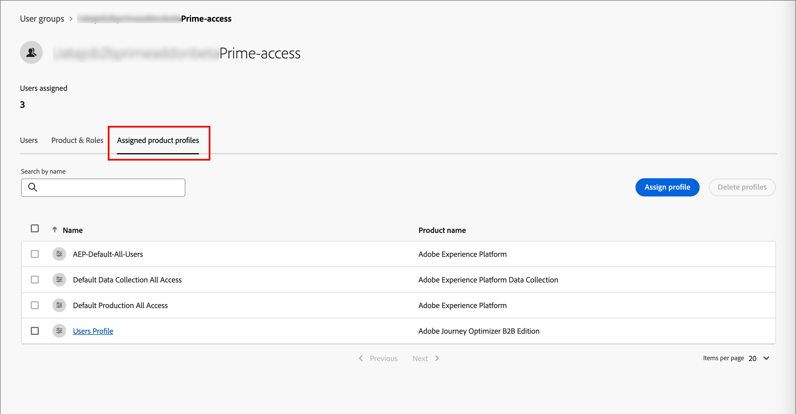
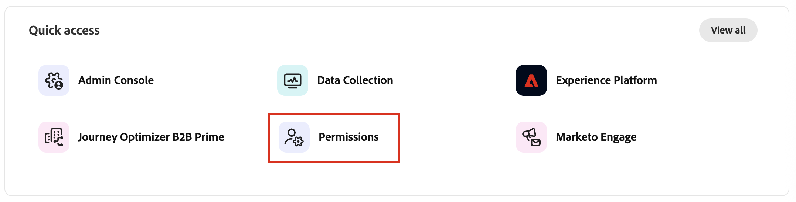
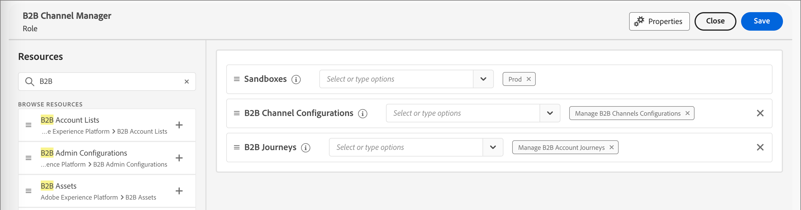
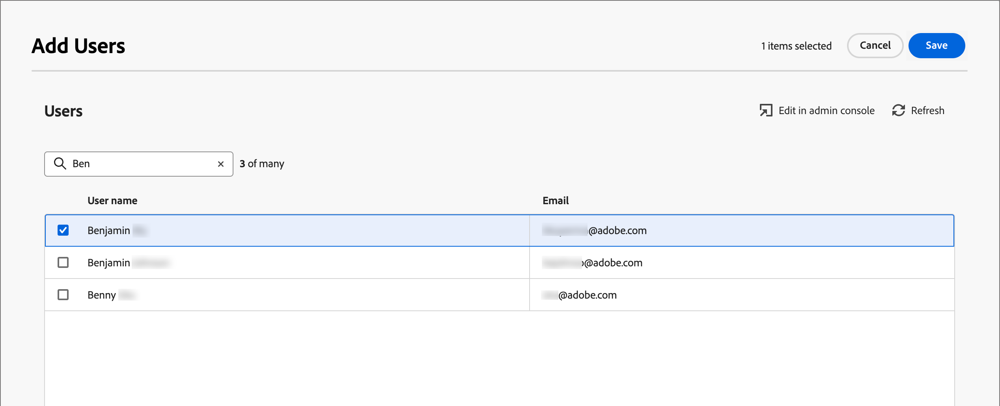

# Accès utilisateur et autorisations

Une fois la mise en service terminée et les sandbox liés, procédez comme suit pour fournir un accès [!DNL Journey Optimizer B2B Prime] à votre équipe et aux utilisateurs.

1. [Créer un [!DNL Journey Optimizer B2B Edition] profil de produit](#create-profile) dans Admin Console (configuration unique/initiale uniquement).
1. [Ajoutez un groupe d’utilisateurs](#add-user-group) dans Admin Console.
1. [Attribuez le profil de produit](#assign-profile) au groupe d’utilisateurs dans Admin Console.
1. [Ajoutez des utilisateurs au nouveau groupe](#add-users) dans Admin Console.
1. [Modifiez les rôles intégrés](#edit-role-permissions) ou [créez un rôle personnalisé](#create-a-custom-role) avec des autorisations [!DNL Journey Optimizer B2B Edition] dans Adobe Experience Platform.
1. [Ajouter des utilisateurs](#add-users-to-a-role) des utilisatrices ou des [groupes](#add-user-groups-to-a-role) à des rôles dans Adobe Experience Platform.

## Configuration du profil de produit {#config-profile}

En tant qu’administrateur, vous pouvez effectuer ces tâches dans le Adobe Admin Console, qui constitue un emplacement central pour administrer et gérer vos licences de produit et utilisateurs Adobe. Dans Admin Console, vous pouvez créer et gérer des utilisateurs à un seul emplacement plutôt qu’au sein de vos différentes solutions individuelles. Pour en savoir plus sur ses fonctions et ses fonctionnalités, consultez la page de présentation d’Admin Console [&#128279;](https://helpx.adobe.com/fr/enterprise/using/admin-console.html).

### Accès à Admin Console {#admin-console}

Avant de pouvoir utiliser Admin Console pour administrer les utilisateurs au sein de votre équipe, vous devez vous assurer que vous pouvez accéder à Admin Console et que vous disposez des autorisations appropriées.

1. En tant qu’administrateur système, vous devriez recevoir plusieurs e-mails d’Adobe dans le cadre du processus d’intégration.

   Recherchez l’e-mail de bienvenue qui fournit les informations sur le nom de l’organisation auquel vous avez accès.

1. Cliquez sur le lien **[!UICONTROL Commencer]** dans l’e-mail de bienvenue pour accéder à Admin Console.

   Si vous ne retrouvez pas l’e-mail en question, ouvrez un navigateur directement sur Admin Console à l’adresse [https://adminconsole.adobe.com](https://adminconsole.adobe.com).

1. Connectez-vous à l’aide de votre Adobe ID.

   Une fois la connexion établie, la page _Aperçu_ du Adobe Admin Console s’affiche.

1. Si vous avez accès à plusieurs organisations, vérifiez que vous vous êtes connecté à la bonne organisation.

   Pour modifier votre organisation, cliquez sur le nom de l’organisation dans le coin supérieur droit et sélectionnez l’organisation à laquelle vous avez besoin d’accéder.

1. Sélectionnez **[!UICONTROL Administrateurs]** dans la vignette _[!UICONTROL Utilisateurs]_ pour vérifier que vous êtes bien administrateur système.

   {width="800" zoomable="yes"}

1. Recherchez en saisissant votre adresse e-mail, votre nom d’utilisateur, votre prénom ou votre nom Adobe ID.

   * Si votre accès est correctement configuré, la recherche renvoie votre enregistrement.

   * Si la valeur de la colonne **[!UICONTROL RÔLE D’ADMINISTRATEUR]** s’affiche `System`, vous savez que vous (ou l’utilisateur affiché) êtes un administrateur ou une administratrice système.

### Créer le profil de produit [!DNL Journey Optimizer B2B Edition] {#create-profile}

Lorsque vous accordez aux utilisateurs l’accès à une solution Adobe, vous ne souhaitez pas nécessairement leur accorder un accès complet. Les profils de produit permettent à chaque solution d’avoir son propre jeu d’autorisations utilisateur. Utilisez Admin Console pour attribuer des profils de produit.

Pour plus d’informations sur l’utilisation des profils de produit pour les droits des utilisateurs, voir [_Gérer les profils de produit pour les utilisateurs d’entreprise_](https://helpx.adobe.com/fr/enterprise/using/manage-product-profiles.html){target="_blank"} dans la documentation d’Admin Console.

{width="30"} Un administrateur système ou [!DNL Experience Platform] administrateur de produit peut effectuer les étapes suivantes à partir de [https://adminconsole.adobe.com](https://adminconsole.adobe.com).

1. Sélectionnez l’onglet **[!UICONTROL Produits]**.

1. Ouvrez l’instance de [!DNL Journey Optimizer B2B Edition] où vous souhaitez ajouter le profil et cliquez sur **[!UICONTROL Nouveau profil]**.

   {width="600" zoomable="yes"}

1. Saisissez un nom de profil de produit, tel que _Utilisateurs B2B_.

1. Cliquez sur **[!UICONTROL Suivant]** puis sur **[!UICONTROL Enregistrer]**.

### Ajouter un groupe d’utilisateurs {#add-user-group}

Un groupe d’utilisateurs est un ensemble d’utilisateurs auxquels est accordé un ensemble partagé d’autorisations. Vous pouvez ajouter ou supprimer des utilisateurs dans votre groupe d’utilisateurs. Les autorisations de groupe restent les mêmes tandis que les utilisateurs du groupe changent.

Pour plus d’informations sur l’utilisation des groupes d’utilisateurs pour gérer les autorisations, voir [Gérer les groupes d’utilisateurs](https://helpx.adobe.com/fr/enterprise/using/user-groups.html){target="_blank"} dans la documentation d’Admin Console.

{width="30"} Un administrateur système peut effectuer les étapes suivantes à partir de [https://adminconsole.adobe.com](https://adminconsole.adobe.com).

1. Sélectionnez l’onglet **[!UICONTROL Utilisateurs]**.

1. Sélectionnez **[!UICONTROL Groupes d’utilisateurs]** dans le volet de navigation de gauche.

1. Cliquez sur **[!UICONTROL Nouveau groupe d’utilisateurs]** en haut à droite.

1. Saisissez le nom du groupe d’utilisateurs, par exemple _Utilisateurs B2B_ et cliquez sur **[!UICONTROL Enregistrer]**.

   {width="600" zoomable="yes"}

### Attribuer le profil de produit {#assign-profile}

{width="30"} Un administrateur de produit peut effectuer les étapes suivantes à partir de [https://adminconsole.adobe.com](https://adminconsole.adobe.com).

1. Cliquez sur le groupe d’utilisateurs que vous avez créé.

1. Sélectionnez l’onglet **[!UICONTROL Profils de produit attribués]** et cliquez sur **[!UICONTROL Attribuer un profil]**.

1. Cliquez sur **+** et ajoutez chaque instance des produits suivants :

   * [!UICONTROL Adobe Journey Optimizer B2B edition - Profil des utilisateurs]
   * [!UICONTROL Adobe Experience Platform - AEP-Default-All-Users]
   * [!UICONTROL Collecte De Données Adobe Experience Platform - Collecte De Données Par Défaut Tous Les Accès]
   * [!UICONTROL Adobe Experience Platform - Accès Tous À La Production Par Défaut]

   {width="600" zoomable="yes"}

1. Cliquez sur **[!UICONTROL Enregistrer]**

### Ajouter des utilisateurs au nouveau groupe {#add-users}

Pour plus d’informations sur la gestion des utilisateurs, voir [_Utilisateurs de_](https://helpx.adobe.com/fr/enterprise/using/users.html){target="_blank"} dans la documentation d’Admin Console.

{width="30"} Un administrateur système ou un administrateur de produit peut effectuer les étapes suivantes à partir de [https://adminconsole.adobe.com](https://adminconsole.adobe.com). Un administrateur ou une administratrice de produit ne peut ajouter que des utilisateurs et utilisatrices qui existent déjà dans son organisation.

1. Si les utilisateurs ne sont pas déjà membres de votre organisation, ajoutez chaque utilisateur :

   * Sous _[!UICONTROL Liens rapides]_, cliquez sur **[!UICONTROL Ajouter des utilisateurs]**.

   * Saisissez l’adresse électronique de l’utilisateur et cliquez sur **[!UICONTROL Ajouter en tant que nouvel utilisateur]**.

     {width="600" zoomable="yes"}

   * Saisissez le prénom et le nom, puis cliquez sur **[!UICONTROL Enregistrer]**.

1. Ajoutez chaque utilisateur au groupe :

   * Cliquez sur le nom d’utilisateur.

   * Dans la page des détails de l’utilisateur, faites défiler l’écran jusqu’à **[!UICONTROL Groupes d’utilisateurs]**.

   * Cliquez sur l’icône _Plus_ ( **...** ) à gauche et choisissez **[!UICONTROL Modifier les groupes d’utilisateurs]**.

   * Cliquez sur l’icône _Ajouter_ ( **+** ) sous **[!UICONTROL Groupes d’utilisateurs]**.

     {width="600" zoomable="yes"}

   * Sélectionnez le groupe d’utilisateurs que vous avez créé précédemment et cliquez sur **[!UICONTROL Appliquer]**.

   * Cliquez sur **[!UICONTROL Enregistrer]** pour les modifications de l’utilisateur.

## Attribuer des autorisations de produit {#assign-product-permissions}

Les autorisations sont des droits unitaires qui vous permettent de définir les autorisations attribuées à un profil de produit. Chaque autorisation est regroupée sous une fonctionnalité, telle que parcours ou groupes d’achats, représentant les fonctionnalités de [!DNL Journey Optimizer B2B Prime].

La zone _Autorisations_ de Adobe Experience Platform permet aux administrateurs de définir des rôles d’utilisateur et des politiques d’accès afin de gérer les autorisations d’accès aux fonctionnalités et objets d’une application de produit. Dans cette application, vous pouvez créer et gérer des rôles, ainsi qu’attribuer les autorisations de ressources souhaitées pour ces rôles. Les autorisations vous permettent également de gérer les sandbox et les utilisateurs associés à un rôle spécifique.

Pour plus d’informations sur les autorisations des rôles dans Experience Platform, voir [Gérer les autorisations pour un rôle](https://experienceleague.adobe.com/fr/docs/experience-platform/access-control/abac/permissions-ui/permissions){target="_blank"} dans la documentation d’Experience Platform.

1. Accédez à [experience.adobe.com](https://experience.adobe.com/).

1. Dans le panneau _[!UICONTROL Accès rapide]_, sélectionnez **[!UICONTROL Autorisations]**.

   >[!NOTE]
   >
   >Si vous ne voyez pas _[!UICONTROL Autorisations]_, vous devrez peut-être cliquer sur **[!UICONTROL Afficher tout]** et le sélectionner dans les applications disponibles.

   {width="700" zoomable="yes"}

<!--

### B2B product permissions {#b2b-product-permissions}

The following permissions govern access to [!DNL Journey Optimizer B2B Edition] capabilities:

| Category | Description | Permissions |
| -------- | ----------- | ---------- |
| B2B Account Lists | Configure, manage, view, and publish permissions for B2B account lists. These permissions include actions such as add, remove, import, and delete accounts from account lists. | <li>Manage B2B Account Lists |
| B2B Admin Configurations | Configure, manage, and view permissions for B2B administrative configurations. These permissions include digital asset management connections, asset repositories, and events. | <li>Manage B2B Admin Configurations |
| B2B Assets | Configure, manage, and view permissions for B2B assets. These permissions include emails, SMS, landing pages, fragments, templates, and images. | <li>Manage B2B Assets <li>Manage B2B Templates <li>Manage B2B Fragments <li>Manage B2B Emails |
| B2B Buying Groups | Configure, manage, and view permissions for B2B buying groups. These permissions include solution interests, roles templates, and buying group status. | <li>Manage B2B Buying Groups <li>Manage B2B Solution Interests <li>Manage B2B Role Templates <li>Manage B2B Stages <li>View B2B Buying Groups |
| B2B Channel Configurations | Configure, manage, and view permissions for B2B channel configurations. These permissions include settings for communication limits, API credentials, and security settings. | <li>Manage B2B Channels Configurations |
| B2B Dashboards | Configure and view permissions for B2B dashboards. These permissions include account engagement, buying group stages, surging accounts, and contact coverage. | <li>View B2B Engagement Dashboard |
| B2B Journeys | Configure, manage, view, and publish permissions for B2B journeys. These permissions include account and person actions, event listeners, and split paths. | <li>Manage B2B Account Journeys |
| Journey Optimizer Rules | Access and configure frequency rules (communication limits). These permissions should be limited to product administrators. | <li>View Frequency Rules <li>Manage Frequency Rules |

### B2B built-in roles {#b2b-built-in-roles}

When your organization has [!DNL Journey Optimizer B2B Edition] provisioned, Experience Platform includes a set of built-in (default) roles that you can use to manage access to the product capabilities:

| Role | Permissions |
| ---- | ----------- |
| B2B Journey Manager | <li>Manage B2B Journeys <li>Manage B2B Buying Groups <li>Manage B2B Account Lists <li>View B2B Engagement Dashboard <li>View B2B Insights Dashboard |
| B2B Channel Manager | <li>Manage B2B Assets <li>Manage B2B Templates <li>Manage B2B Fragments |
| B2B System Administrator | <li>Manage B2B Channels Configurations <li>Manage B2B Admin Configurations |
| B2B Sales User | <li>View B2B Engagement Dashboard <li>View B2B Buying Groups <li>Access In-CRM Insights |

-->

### Modifier les autorisations de rôle {#edit-role-permissions}

Pour les rôles intégrés ou personnalisés, vous pouvez décider à tout moment d’ajouter ou de supprimer des autorisations. Si vous modifiez un rôle par défaut ou personnalisé, cela a un impact sur chaque utilisateur affecté au rôle.

>[!IMPORTANT]
>
>[!DNL Journey Optimizer B2B Prime] accès nécessite l’activation d’un sandbox spécifique configuré selon la convention de nommage suivante : préfixe d’abonnement Marketo Engage + Prime. Par exemple, si le préfixe de votre abonnement Marketo Engage lié est _AcmeAssoc_, le sandbox requis pour [!DNL Journey Optimizer B2B Prime] accès est _AcmeAssocPrime_.

>[!NOTE]
>
>Un administrateur système Admin Console peut effectuer les étapes suivantes.

_Pour modifier les autorisations d&#39;un rôle :_

1. Sélectionnez **[!UICONTROL Rôles]** dans le volet de navigation de gauche.

1. Cliquez sur le nom du rôle **_Gestionnaire de canaux B2B_**.

1. Dans la page de détails, cliquez sur **[!UICONTROL Modifier]** en haut à droite.

   {width="800" zoomable="yes"}

   Dans l’éditeur de rôles, le menu _[!UICONTROL Ressources]_ affiche la liste des ressources qui s’appliquent aux applications Experience Cloud optimisées par Platform.

1. Sélectionnez le sandbox configuré pour l’accès [!DNL Journey Optimizer B2B Prime] (`<Marketo subscription prefix>Prime`).

   {width="800" zoomable="yes"}

1. Cliquez sur l’icône _Ajouter_ (**+**) pour chacune des ressources B2B.

   {width="700" zoomable="yes"}

1. Ajoutez les autorisations spécifiques à chacune des ressources ou sélectionnez **[!UICONTROL Tout ajouter]**.

1. Cliquez sur **[!UICONTROL Enregistrer]**

   <!-- {width="700" zoomable="yes"} -->

1. Cliquez sur **[!UICONTROL Fermer]** pour revenir à la page de détails.

### Ajouter des utilisateurs à un rôle {#add-users-to-a-role}

{width="30"} Un administrateur système ou un administrateur Experience Platform peut effectuer les étapes suivantes.

1. Ouvrez les détails du rôle et sélectionnez l’onglet **[!UICONTROL Utilisateurs]**.

   Cet onglet affiche une liste de tous les utilisateurs affectés au rôle.

1. Cliquez sur **[!UICONTROL Ajouter des utilisateurs]**.

   {width="800" zoomable="yes"}

1. Dans la boîte de dialogue _[!UICONTROL Ajouter des utilisateurs]_, recherchez et sélectionnez les utilisateurs que vous souhaitez ajouter au rôle.

   * Vous pouvez utiliser l’outil Rechercher pour filtrer la liste des utilisateurs.

   * Cochez la case de chaque utilisateur ou utilisatrice.

   {width="600" zoomable="yes"}

1. Cliquez sur **[!UICONTROL Enregistrer]** lorsque vous avez sélectionné tous les utilisateurs à ajouter.

### Ajouter des groupes d’utilisateurs à un rôle {#add-user-groups-to-a-role}

Pour plus d’informations sur la gestion des utilisateurs, voir [_Utilisateurs de_](https://helpx.adobe.com/fr/enterprise/using/users.html){target="_blank"} dans la documentation d’Admin Console.

{width="30"} Un administrateur système ou un administrateur Experience Platform peut effectuer les étapes suivantes.

1. Ouvrez les détails du rôle et sélectionnez l’onglet **[!UICONTROL Groupes d’utilisateurs]**.

   Cet onglet affiche la liste de tous les groupes d’utilisateurs affectés au rôle.

1. Cliquez sur **[!UICONTROL Ajouter des groupes]**.

   {width="800" zoomable="yes"}

1. Dans la boîte de dialogue _[!UICONTROL Ajouter des groupes]_, recherchez et sélectionnez les groupes à ajouter au rôle.

   * Vous pouvez utiliser l’outil Rechercher pour filtrer la liste des groupes d’utilisateurs.

   * Cochez la case de chaque groupe d’utilisateurs.

   {width="600" zoomable="yes"}

1. Cliquez sur **[!UICONTROL Enregistrer]** lorsque vous avez sélectionné tous les groupes à ajouter.

### Créer un rôle personnalisé {#create-a-custom-role}

{width="30"} Un administrateur système ou un administrateur Experience Platform peut effectuer les étapes suivantes.

1. Sélectionnez **[!UICONTROL Rôles]** dans le volet de navigation de gauche, puis sélectionnez **[!UICONTROL Créer un rôle]**.

1. Dans la boîte de dialogue _[!UICONTROL Créer un nouveau rôle]_, saisissez un nom pour le rôle, tel que _Spécialistes du marketing B2B_, ainsi qu’une description (facultatif).

1. Cliquez sur **[!UICONTROL Confirmer]**.

1. Sélectionnez le sandbox configuré pour l’accès [!DNL Journey Optimizer B2B Prime] (`<Marketo subscription prefix>Prime`).

   {width="800" zoomable="yes"}

1. Ajoutez les autorisations de produit B2B :

   <!-- To determine which product capabilities that you want for the role, refer to the list of [B2B product permissions](#b2b-product-permissions). -->

   Dans la liste _[!UICONTROL Ressources]_ sur la gauche, localisez les éléments B2B et cliquez sur l’icône _Ajouter_ (**+**) pour ajouter chaque attribut que vous souhaitez activer pour le rôle.

   Vous pouvez saisir _B2B_ dans l’outil de recherche pour filtrer la liste des autorisations de produit B2B.

   {width="700" zoomable="yes"}

1. Cliquez sur **[!UICONTROL Enregistrer]** en haut à droite.

1. Accédez aux détails du rôle et sélectionnez l’onglet **[!UICONTROL Groupes d’utilisateurs]**.

1. Cliquez sur **[!UICONTROL Ajouter des groupes]**.

1. Cochez la case en regard du groupe d’utilisateurs que vous avez créé précédemment dans Admin Console.

1. Cliquez sur **[!UICONTROL Enregistrer]**

Votre rôle personnalisé est configuré et les utilisateurs du groupe affecté peuvent désormais accéder aux fonctionnalités [!DNL Journey Optimizer B2B Prime] que vous avez sélectionnées.
