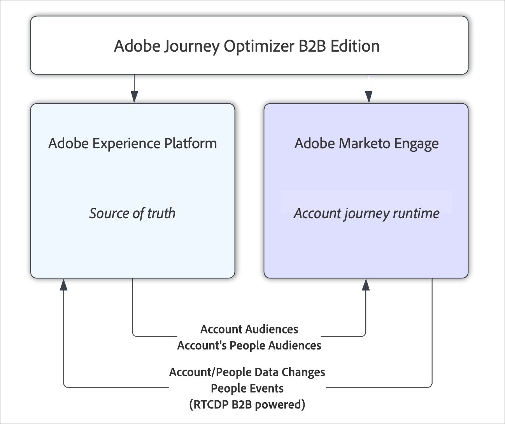

# Vue d’ensemble d’Adobe Journey Optimizer B2B Edition

Avec Adobe Journey Optimizer B2B Edition, vous pouvez orchestrer des parcours de compte et de groupe d’achat à l’aide d’une IA générative intégrée et d’une automatisation de pointe afin d’optimiser la demande pour des offres spécifiques à l’aide de groupes d’achats qualifiés pour le marketing.

## Parcours de compte avec groupes d’achat

Si l’on compare Adobe Journey Optimizer B2B Edition à Marketo Engage et à Adobe Journey Optimizer Standard, la principale différence est que les parcours de compte déplacent les comptes dans le parcours, et non les personnes. Une personne associée à un compte a généralement une progression non linéaire qui repose sur la progression du compte dans le parcours, et non sur ses actions individuelles. Par exemple, lorsqu’un compte se trouve dans une phase initiale du parcours d’achat, les informations envoyées peuvent concerner les fonctionnalités générales de la solution. Plus loin dans le processus d’achat, le contenu peut cibler davantage des offres particulières ou d’autres éléments visant à conclure une vente. Une fois la solution achetée, les informations peuvent être modifiées à nouveau afin de fournir des guides pratiques, des bonnes pratiques ou des informations sur les événements à venir, ou encore du contenu sur d’autres montées en gamme. Même si une personne n’a pas interagi avec le contenu de la phase initiale, il est toujours nécessaire de la faire progresser vers la phase actuelle en fonction non pas de ses propres actions, mais des actions des autres personnes au sein de son compte ou de son groupe d’achat.

## Architecture détaillée

Adobe Journey Optimizer B2B Edition utilise les _Audiences de compte_ et les _Audiences de personnes_ d’Adobe Experience Platform pour alimenter un parcours de compte qui s’exécute dans Marketo Engage. Experience Platform est toujours la source de vérité pour ces données, mais l’exécution et le traitement du parcours de compte se font au sein de l’infrastructure marketing de Marketo Engage B2B. L’orchestration renvoie les données à Experience Platform en temps quasi réel grâce au connecteur source Marketo Engage - Adobe Real-Time CDP B2B Edition, qui diffuse les modifications de données de Marketo Engage vers Experience Platform.

{width="500" zoomable="yes"}

>[!NOTE]
>
>Vérifiez vos droits de licence et la [description du produit](https://helpx.adobe.com/fr/legal/product-descriptions/adobe-journey-optimizer-b2b.html){target="_blank"} correspondante à propos des mécanismes de sécurisation des performances et des limitations statiques.

### Modèle d’abonnement

Un abonnement Journey Optimizer B2B Edition est défini par une association de sandbox Experience Platform (AEP) à un abonnement Marketo Engage _Munchkin_. Un abonnement Marketo Engage unique ne peut pas être associé à plusieurs sandbox AEP. Si vous ne choisissez pas d’associer un abonnement Marketo Engage existant à Journey Optimizer B2B Edition, vous recevez un nouvel abonnement Marketo Engage vide à utiliser avec Journey Optimizer B2B Edition.

L’objectif d’Experience Platform dans cette configuration est de fournir une vue unifiée des données issues des instances Marketo Engage (et des systèmes CRM associés), puis de pouvoir agir sur les données unifiées à l’aide d’un parcours de compte.

### Opérations de parcours de compte

Les parcours de compte sont créés dans Journey Optimizer B2B Edition et stockés dans l’instance Marketo Engage associée à l’abonnement. Bien qu’ils soient stockés dans le magasin de données Marketo Engage, ils ne sont pas visibles depuis l’interface d’utilisation de Marketo Engage et ne peuvent être utilisés que depuis Journey Optimizer B2B Edition.

Un parcours de compte commence toujours par la sélection d’un segment de compte à utiliser comme audience de compte pour le parcours. La sélection de l’audience utilise le composant standard de sélecteur d’audience Experience Platform. Les spécialistes marketing peuvent ensuite implémenter le parcours de compte en divisant les chemins du parcours en fonction de leurs propres critères, qui peuvent inclure des critères de compte, de personne ou de groupe d’achat. Sur chaque branche, des actions peuvent être entreprises pour implémenter le parcours, telles que l’envoi d’un e-mail ou l’attente d’un événement.

Une fois le parcours de compte créé, il doit être publié. Lors de la publication, le parcours de compte est validé et converti en une série de campagnes Marketo Engage qui implémentent l’expérience du parcours. Les services d’intégration de données sont contactés pour démarrer le flux de données qui, à son tour, lance les opérations de parcours de compte. La première étape consiste à créer les segments pour les personnes du compte.

### Flux de données

Journey Optimizer B2B Edition utilise la segmentation de compte Real-Time CDP pour définir et exécuter les segments de compte et les segments de personne de compte associés requis par parcours. Lors de l’exécution d’un parcours publié, les données sur les personnes et les comptes peuvent changer et les données sont collectées sur les personnes qui interagissent avec le parcours. Journey Optimizer B2B Edition s’appuie sur le connecteur source Marketo Engage pour Real-Time CDP B2B Edition afin de transmettre les modifications de données au sandbox Experience Platform, qui est la source de vérité.  Ces données sont transmises à AEP en temps quasi réel.

Seuls les types de données existants pris en charge par le connecteur source Marketo Engage (comptes, personnes et opportunités) sont renvoyés dans Real-Time CDP. Cela signifie que les données du groupe d’achat ne sont pas transmises à AEP et résident plutôt dans l’instance Marketo Engage utilisée par l’abonnement Journey Optimizer B2B Edition.
