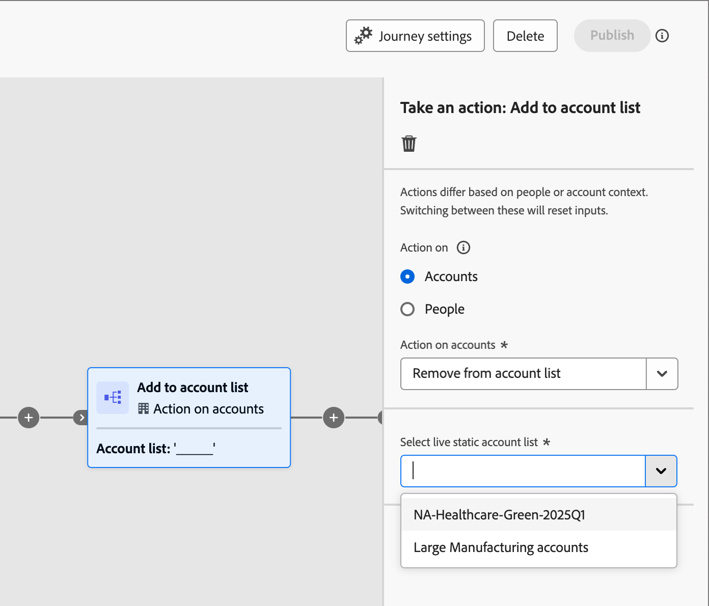

# Utilisation des listes de comptes dans parcours

Vous pouvez incorporer des listes de comptes dynamiques (publiés) de différentes manières dans les parcours de votre compte.

## Nœud d’audience de compte

Tous les parcours de compte commencent par un nœud [_Audience du compte_](../journeys/account-audience-nodes.md). Lorsque vous définissez ce nœud pour utiliser une liste de comptes, les comptes de membres se déplacent dans le parcours lors de sa mise en ligne (publication).

1. Sélectionnez l’option **[!UICONTROL Liste des comptes]** pour le nœud _Audience du compte_ de départ.

   {width="500"}

1. Cliquez sur **[!UICONTROL Liste Ajouter des comptes]**.

1. Cochez la case de la liste des comptes et cliquez sur **[!UICONTROL Enregistrer]**.

   {width="600" zoomable="yes"}

## Nœud Prendre une action - Ajouter à la liste

**_Listes de comptes statiques uniquement_**

Dans un parcours de compte, ajoutez des comptes à une liste de comptes statique à l’aide d’[un nœud _Prendre une action_](../journeys/action-nodes.md).

Par exemple, vous disposez d’un chemin de parcours où vous envoyez un e-mail et certains comptes prennent différentes actions en réponse. Vous considérez cette activité comme un point de qualification dans le parcours. Avec la qualification, vous souhaitez les ajouter à une liste de comptes utilisée comme audience pour un autre parcours avec un flux différent pour les comptes qualifiés.

>[!NOTE]
>
>Si un compte figure déjà dans la liste lors de l’exécution du nœud, l’action est ignorée.

1. Sélectionnez l’option _[!UICONTROL Action sur]_ **[!UICONTROL Comptes]**.

1. Pour _[!UICONTROL Action sur les comptes]_, choisissez **[!UICONTROL Ajouter à la liste des comptes]**.

   {width="500"}

1. Pour **[!UICONTROL Sélectionner la liste des comptes statiques actifs]**, choisissez la liste des comptes dans laquelle vous souhaitez ajouter des comptes.

   {width="500"}

## Nœud Prendre une action - Supprimer du compte

**_Listes de comptes statiques uniquement_**

Dans un parcours de compte, supprimez des comptes d’une liste de comptes statique à l’aide d’[un nœud _Prendre une action_](../journeys/action-nodes.md).

Par exemple, vous disposez d’un chemin de parcours où vous envoyez un e-mail et certains comptes prennent différentes actions en réponse. Vous considérez cette activité comme un point de qualification dans le parcours. Avec cette qualification, vous souhaitez les supprimer d’une liste de comptes. Cette liste est utilisée comme audience pour un autre parcours qui envoie des e-mails supplémentaires afin que vous ne dupliquiez pas vos communications de qualification.

>[!NOTE]
>
>Si un compte ne figure pas dans la liste où sa suppression est planifiée, l’action est ignorée.

1. Sélectionnez l’option _[!UICONTROL Action sur]_ **[!UICONTROL Comptes]**.

1. Pour _[!UICONTROL Action sur les comptes]_, choisissez **[!UICONTROL Supprimer de la liste des comptes]**.

   {width="500"}

1. Pour **[!UICONTROL Sélectionner la liste des comptes statiques actifs]**, choisissez la liste des comptes dans laquelle vous souhaitez supprimer des comptes.

   {width="500"}
