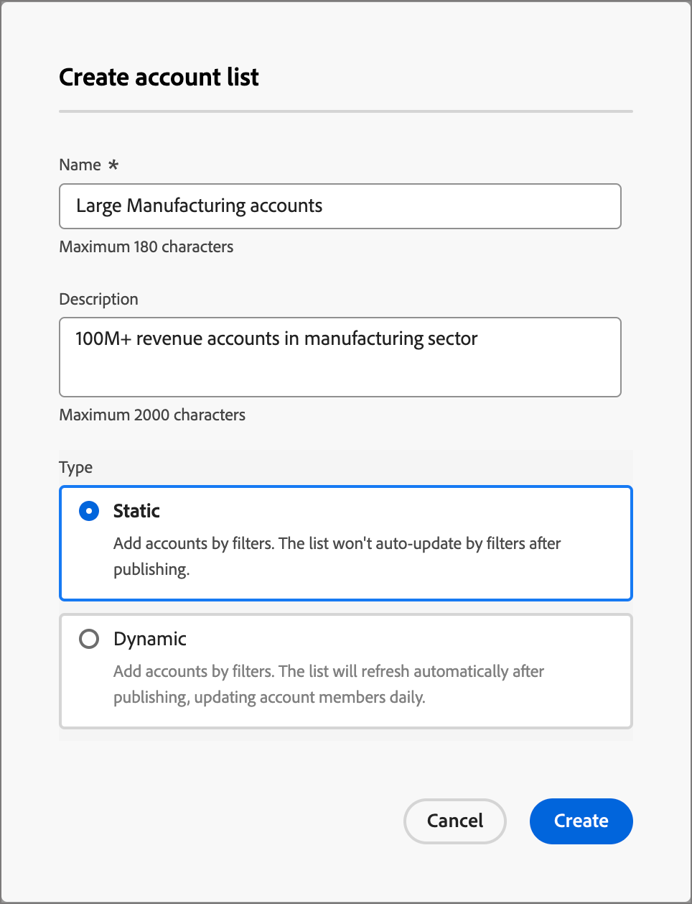
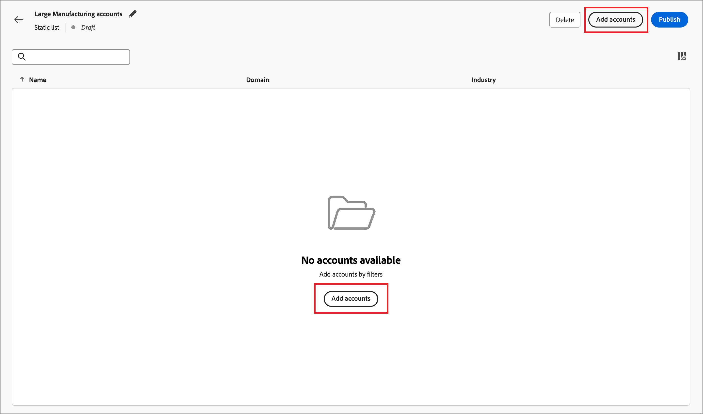

# Listes de comptes

Dans Journey Optimizer B2B edition, une liste de comptes est un ensemble de comptes nommés que les spécialistes du marketing peuvent utiliser pour l’orchestration des parcours ciblés. Une liste de comptes peut cibler des comptes nommés selon vos critères définis, tels que le secteur d’activité, l’emplacement ou la taille de l’entreprise. Il existe deux types de listes de comptes :

* **Statique** - Avec une liste de comptes statique, la liste ne change que lorsque vous ajoutez les comptes. Vous pouvez ajouter manuellement des comptes en appliquant un jeu de filtres pour renseigner la liste en fonction des données du compte actuel, ou ajouter et supprimer des comptes par le biais d’un parcours de compte.
* **Dynamique** - Avec une liste de comptes dynamique, vous définissez un jeu de filtres pour traiter automatiquement la liste. Le système utilise ce jeu de filtres pour ajouter et supprimer des comptes en fonction des modifications apportées aux informations du compte. Cette gestion de liste est similaire à la [segmentation d’audience dans Real-time Customer Data Platform](https://experienceleague.adobe.com/fr/docs/experience-platform/rtcdp/segmentation/b2b).

Lorsqu’une liste de comptes est à l’état _En ligne_ (publiée), elle peut être [utilisée dans les parcours de compte et les programmes Marketo Engage](./account-lists-journeys.md).

>[!NOTE]
>
>Les listes de comptes exploitent les données du compte Marketo Engage pour créer des segments et des listes de comptes. Cela signifie que si un segment de compte Adobe Experience Platform n’est pas synchronisé activement avec Marketo Engage, les comptes de ce segment Experience Platform peuvent ne pas être disponibles dans les listes de comptes Journey Optimizer B2B edition. Par la suite, les personnes issues de comptes dans les segments Experience Platform qui ne sont pas synchronisés avec Marketo Engage peuvent ne pas être incluses dans le nombre d’adhésions aux personnes ou comptabilisées dans les événements de déclenchement.

## Accès et navigation dans les listes de comptes

Dans le volet de navigation de gauche, développez **[!UICONTROL Comptes]** et cliquez sur **[!UICONTROL Listes de comptes]**.

{width="800" zoomable="yes"}

La page _[!UICONTROL Listes des comptes]_ qui s’affiche comprend les colonnes suivantes :

* [!UICONTROL Nom] (cliquez sur le nom de la liste des comptes pour afficher les détails)
* [!UICONTROL Statut]
* [!UICONTROL Type]
* [!UICONTROL Dernière mise à jour le]
* [!UICONTROL Dernière mise à jour par]
* [!UICONTROL Date de création]
* [!UICONTROL Créé par]

Ce tableau permet d’effectuer une recherche par nom. La fonction de tri est actuellement indisponible.

Vous pouvez personnaliser le tableau affiché en cliquant sur l’icône _Paramètres de colonne_ (  ) dans le coin supérieur droit, puis en cochant ou décochant les cases.

{width="300"}

Pour afficher la description d’une liste de comptes, cliquez sur l’icône _Informations_ (  ) en regard du nom.

## Création d’une liste de comptes

Lorsque vous créez une liste de comptes, vous définissez un ensemble de filtres pour générer la liste. Vous pouvez, par exemple, l’utiliser pour générer une liste de comptes dont le secteur est Healthcare et les recettes dépassent 100 millions de dollars.

1. Sur la page _[!UICONTROL Listes des comptes]_, cliquez sur la liste **[!UICONTROL Créer un compte]** en haut à droite de la page.

   {width="700" zoomable="yes"}

1. Dans la boîte de dialogue _[!UICONTROL Créer une liste de comptes]_, saisissez un **[!UICONTROL Nom]** unique (obligatoire) et un **[!UICONTROL Description]** (facultatif).

1. Choisissez le _[!UICONTROL Type]_ pour la liste des comptes, **[!UICONTROL Statique]** ou **[!UICONTROL Dynamique]**.

   {width="380"}

1. Cliquez sur **[!UICONTROL Créer]**.

   Une nouvelle liste de comptes statique s’ouvre avec une liste vide de comptes. Une nouvelle liste de comptes dynamiques s’ouvre avec le panneau _[!UICONTROL Ajouter des comptes par filtre]_ dans la page.

## Ajouter des comptes à la liste des comptes

Pour une liste statique, vous pouvez procéder à la publication de la liste de comptes vide et ajouter des comptes par le biais d’un parcours de compte. Vous pouvez également ajouter manuellement des comptes en appliquant un jeu de filtres avant de le publier.

Pour une liste de comptes dynamique, vous devez ajouter le jeu de filtres que vous souhaitez utiliser pour gérer automatiquement la liste avant de la publier.

>[!BEGINTABS]

>[!TAB Liste des comptes statiques]

Après avoir créé la liste des comptes statiques, vous pouvez la remplir en appliquant un jeu de filtres. Vous pouvez également appliquer un jeu de filtres pour ajouter des comptes à une liste de comptes statique une fois qu’elle a été publiée (_en direct_).

>[!NOTE]
>
>Si vous souhaitez que la liste des comptes commence vide, ne sélectionnez aucun filtre et publiez simplement la liste des comptes. Il est utile de commencer avec une liste vide lorsque vous prévoyez d’ajouter des membres par le biais d’une action de parcours de compte (voir [Nœud Prendre une action - Ajouter au compte](#take-an-action-node---add-to-account)).

1. Cliquez sur **[!UICONTROL Ajouter des comptes]**.

   {width="700" zoomable="yes"} de liste

   Vous pouvez accéder à cette fonction dans la page de liste vide ou en haut à droite.

1. Dans la boîte de dialogue _[!UICONTROL Ajouter des comptes par filtre]_, utilisez le menu **[!UICONTROL Filtres de compte]** pour ajouter les attributs et les activités à utiliser pour créer le jeu de filtres :

   Les filtres sont imbriqués dans des dossiers de catégories. Vous pouvez développer chaque dossier et faire défiler les listes de filtres disponibles. Vous pouvez également utiliser l’outil _Recherche_ dans la partie supérieure pour localiser le filtre dont vous avez besoin.

   * Faites glisser le filtre du menu de gauche vers l’espace de définition du filtre.
   * Complétez la définition de l’évaluation de correspondance.
   * Répétez ces actions pour chaque filtre que vous souhaitez inclure.

     {width="700" zoomable="yes"}

   * Vous pouvez affiner vos conditions en appliquant la logique **[!UICONTROL Filtre]** en haut. Vous pouvez choisir de correspondre à toutes les conditions d’attribut ou à n’importe quelle condition.

     {width="450"}

1. Une fois le jeu de filtres et la logique terminés, cliquez sur **[!UICONTROL Renseigner les comptes]**.

   Le processus de population peut prendre un certain temps, selon le nombre de comptes à évaluer et à remplir (la taille de votre base de données et les critères de filtre que vous avez sélectionnés). Le remplissage des comptes dans votre liste peut prendre jusqu’à deux heures.

Vous pouvez procéder à la publication de la liste afin de la rendre disponible pour les actions d’ajout et de suppression dans un parcours de compte.

>[!TAB Liste dynamique des comptes]

Après avoir créé une liste de comptes dynamique, vous définissez le jeu de filtres utilisé pour gérer la liste (ajouter/supprimer des comptes) lorsqu’elle est _en ligne_ (publiée). Vous ne pouvez pas ajouter/supprimer de comptes par le biais des parcours de compte, mais une liste de comptes dynamiques publiée est disponible pour le nœud d’audience du compte de départ.

1. Cliquez sur **[!UICONTROL Sélectionner des filtres]**.

   {width="700" zoomable="yes"}

1. Dans la boîte de dialogue _[!UICONTROL Ajouter des comptes par filtre]_, utilisez le menu **[!UICONTROL Filtres de compte]** pour ajouter les attributs et les filtres spéciaux que vous souhaitez utiliser pour créer le jeu de filtres :

   Les filtres sont imbriqués dans des dossiers de catégories. Vous pouvez développer chaque dossier et faire défiler les listes de filtres disponibles. Vous pouvez également utiliser l’outil _Recherche_ dans la partie supérieure pour localiser le filtre dont vous avez besoin.

   * Faites glisser le filtre du menu de gauche vers l’espace de définition du filtre.
   * Complétez la définition de l’évaluation de correspondance.
   * Répétez ces actions pour chaque filtre que vous souhaitez inclure.

     {width="700" zoomable="yes"}

   * Vous pouvez affiner vos conditions en appliquant la logique **[!UICONTROL Filtre]** en haut. Vous pouvez choisir de correspondre à toutes les conditions d’attribut ou à n’importe quelle condition.

     {width="450"}

1. Une fois le jeu de filtres et la logique terminés, cliquez sur **[!UICONTROL Terminé]**.

   Si le jeu de filtres vous convient, vous pouvez procéder à la [publication de la liste](#publish-an-account-list) afin de la rendre disponible pour le nœud de départ [audience du compte](#account-audience-node) dans un parcours de compte.

   >[!NOTE]
   >
   >Vous ne pouvez pas mettre à jour les filtres d’une liste de comptes dynamiques une fois la liste publiée.

   Le processus de population peut prendre un certain temps, selon le nombre de comptes à évaluer et à remplir (la taille de votre base de données et les critères de filtre que vous avez sélectionnés). Le remplissage des comptes dans votre liste peut prendre jusqu’à deux heures.

>[!ENDTABS]

## Publication d’une liste de comptes

Vous pouvez procéder à la publication d’une liste de comptes dès que le jeu de filtres est terminé.

>[!BEGINTABS]

>[!TAB Liste des comptes statiques]

1. Cliquez sur **[!UICONTROL Publier]** en haut à droite.

   {width="700" zoomable="yes"}

1. Dans la boîte de dialogue _[!UICONTROL Publier la liste de comptes statiques]_, cliquez sur **[!UICONTROL Publier]** pour confirmer.

   {width="400"}

Le statut de la liste de comptes statique passe à _[!UICONTROL Actif]_ et peut être [ utilisé dans un parcours de compte](#account-list-usage-in-account-journeys).

>[!TAB Liste dynamique des comptes]

Vous pouvez procéder à la publication d’une liste de comptes dynamique dès que le jeu de filtres est terminé. Une fois que la liste des comptes a le statut Actif , elle peut être sélectionnée dans un nœud de parcours d’audience de compte .

1. Cliquez sur **[!UICONTROL Publier]** en haut à droite.

   {width="700" zoomable="yes"}

1. Dans la boîte de dialogue _[!UICONTROL Publier la liste de comptes dynamiques]_, cliquez sur **[!UICONTROL Publier]** pour confirmer.

   {width="400"}

Le statut de la liste de comptes dynamique passe à _[!UICONTROL Actif]_ et peut être [ utilisé dans un parcours de compte](#account-list-usage-in-account-journeys).

>[!ENDTABS]
