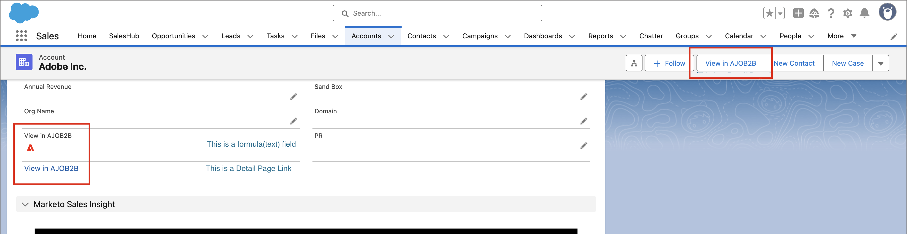

# Accéder aux pages de détails dans CRM

Adobe Journey Optimizer B2B edition permet aux membres de l’équipe des ventes et de l’équipe des comptes d’accéder à des pages détaillées pour les informations sur le compte et le groupe d’achats directement à partir de leur outil de gestion de la relation client (CRM), tel que Salesforce ou Microsoft Dynamics. Grâce à cette intégration, les commerciaux peuvent rapidement accéder aux informations en temps réel sur le compte et le groupe d’achats, telles que l’historique de l’engagement, les signaux d’intention et les recommandations générées par l’IA. Cette fonctionnalité permet à l’équipe commerciale d’atteindre plus rapidement les clients, de hiérarchiser plus intelligemment les priorités et de mieux s’aligner sur le marketing.

Pour permettre aux membres de l’équipe des ventes et du compte d’afficher les pages [détails du compte](account-details.md) et [détails de la personne](person-details.md) dans Journey Optimizer B2B edition à partir du CRM, l’administrateur Salesforce ou Dynamics peut ajouter un lien à partir de la vue du compte, du contact ou du prospect.

Lorsqu’un membre de l’équipe commerciale utilise le lien de l’instance CRM, le sandbox doit être _Prod_ et l’organisation IMS est déterminée selon la logique ordonnée suivante :

1. Organisation la plus récente à laquelle l’utilisateur a accédé
1. Le premier de la liste avec un tri alphabétique
1. Organisation sélectionnée dans ses préférences

## Liens Salesforce

Un administrateur Salesforce disposant de l’autorisation _Personnaliser l’application_ peut configurer le lien dans la disposition Compte, Contact ou Prospect. Les liens configurés permettent aux utilisateurs du service commercial d’accéder aux détails du compte ou de la personne correspondants dans Adobe Journey Optimizer B2B edition.

Dans Salesforce, ajoutez le lien personnalisé sous la forme d’un bouton, d’un lien hypertexte ou d’une icône liée et personnalisez-le en fonction des préférences de votre équipe.

{width="800" zoomable="yes"}

Pour plus d’informations sur l’ajout d’un lien personnalisé dans Salesforce, reportez-vous à la section [Définir des boutons et des liens personnalisés](https://help.salesforce.com/s/articleView?id=platform.defining_custom_links.htm&type=5) dans la documentation de Salesforce.

Lorsque vous définissez l’URL cible du lien, vous pouvez utiliser la mise en page du compte, du contact ou du prospect et la lier à la page de détails correspondante dans Journey Optimizer B2B edition :

* **Compte** - `https://experience.adobe.com/#/journey-optimizer-b2b/accounts/crm/account/[18-character ID of account]`

* **Contact** - `https://experience.adobe.com/#/journey-optimizer-b2b/accounts/crm/contact/[18-character ID of contact]`

* **Lead** - `https://experience.adobe.com/#/journey-optimizer-b2b/accounts/crm/lead/[18-character ID of lead]`

Utilisez l’objet `Account` pour récupérer l’ID de 18 caractères du compte, tel que `CASESAFEID(Account.Id)` ou `CASESAFEID(Id)`.

**_Examples:_**

+++Lien du champ

1. Dans Salesforce, accédez à **[!UICONTROL Configuration]** > **[!UICONTROL Gestionnaire d’objets]** > **[!UICONTROL Compte]**/**[!UICONTROL Contact]**/**[!UICONTROL Lead]** > **[!UICONTROL Fields &amp; Relationships]**.
1. Cliquez sur **[!UICONTROL Nouveau]** pour créer un champ de formule (texte) et l’ajouter à une disposition _Compte_, _Contact_ ou _Lead_.

   Pour la formule, utilisez les exemples suivants comme guide.

   **_Lien hypertexte du texte:_**

   * Compte - `HYPERLINK("https://experience.adobe.com/#/journey-optimizer-b2b/accounts/crm/account/" & CASESAFEID(Id), "View in AJO B2B")`
   * Contact - `HYPERLINK("https://experience.adobe.com/#/journey-optimizer-b2b/accounts/crm/contact/" & CASESAFEID(Id), "View in AJO B2B")`
   * Lead - `HYPERLINK("https://experience.adobe.com/#/journey-optimizer-b2b/accounts/crm/lead/" & CASESAFEID(Id), "View in AJO B2B")`

   **_Icône hyperlien:_**

   * Compte - `HYPERLINK("https://experience.adobe.com/#/journey-optimizer-b2b/accounts/crm/account/" & CASESAFEID(Id), IMAGE("https://cdn.experience.adobe.net/assets/HeroIcons.6620f5dc.svg#AdobeExperienceSubCloud", "View in AJO B2B", 24, 24))`
   * Contact - `HYPERLINK("https://experience.adobe.com/#/journey-optimizer-b2b/accounts/crm/contact/" & CASESAFEID(Id), IMAGE("https://cdn.experience.adobe.net/assets/HeroIcons.6620f5dc.svg#AdobeExperienceSubCloud", "View in AJO B2B", 24, 24))`
   * Contact - `HYPERLINK("https://experience.adobe.com/#/journey-optimizer-b2b/accounts/crm/lead/" & CASESAFEID(Id), IMAGE("https://cdn.experience.adobe.net/assets/HeroIcons.6620f5dc.svg#AdobeExperienceSubCloud", "View in AJO B2B", 24, 24))`

   {width="800" zoomable="yes"}

1. Actualisez la page pour que les modifications de disposition s’affichent. Accédez à **[!UICONTROL Profil]**, puis sélectionnez une autre option sous **[!UICONTROL DENSITÉ D’AFFICHAGE]**.

   {width="450" zoomable="yes"}

+++

+++Lien vers la page de détails

1. Dans Salesforce, accédez à **[!UICONTROL Configuration]** > **[!UICONTROL Gestionnaire d’objets]** > **[!UICONTROL Compte]**/**[!UICONTROL Contact]**/**[!UICONTROL Lead]** > **[!UICONTROL Buttons, Links et Actions]**.
1. Cliquez sur **[!UICONTROL Nouveau bouton ou lien]** dans le coin supérieur droit et créez le lien de la page de détails.

   Pour la formule, utilisez les exemples suivants comme guide.

   * Compte - `{!URLFOR("https://experience.adobe.com/#/journey-optimizer-b2b/accounts/crm/account/" & CASESAFEID(Account.Id), null)}`
   * Contact - `{!URLFOR("https://experience.adobe.com/#/journey-optimizer-b2b/accounts/crm/contact/" & CASESAFEID(Contact.Id), null)}`
   * Lead - `{!URLFOR("https://experience.adobe.com/#/journey-optimizer-b2b/accounts/crm/lead/" & CASESAFEID(Lead.Id), null)}`

   {width="800" zoomable="yes"}

1. Accédez à **[!UICONTROL Mises en page]** dans le volet de navigation de gauche.

1. Faites glisser le lien à partir de **[!UICONTROL Liens personnalisés]** et déposez-le dans la section _Liens personnalisés_ de la disposition.

+++

+++Bouton Page de détails

1. Dans Salesforce, accédez à **[!UICONTROL Configuration]** > **[!UICONTROL Gestionnaire d’objets]** > **[!UICONTROL Compte]**/**[!UICONTROL Contact]**/**[!UICONTROL Lead]** > **[!UICONTROL Buttons, Links et Actions]**.
1. Cliquez sur **[!UICONTROL Nouveau bouton ou lien]** dans le coin supérieur droit et créez le bouton de la page de détails.

   Pour le **[!UICONTROL Type d’affichage]**, choisissez **[!UICONTROL Lien de page de détail]**.

   Pour la formule, utilisez les exemples suivants comme guide.

   * Compte - `{!URLFOR("https://experience.adobe.com/#/journey-optimizer-b2b/accounts/crm/account/" & CASESAFEID(Account.Id), null)}`
   * Contact - `{!URLFOR("https://experience.adobe.com/#/journey-optimizer-b2b/accounts/crm/contact/" & CASESAFEID(Contact.Id), null)}`
   * Lead - `{!URLFOR("https://experience.adobe.com/#/journey-optimizer-b2b/accounts/crm/lead/" & CASESAFEID(Lead.Id), null)}`

   {width="800" zoomable="yes"}

1. Accédez à **[!UICONTROL Mises en page]** dans le volet de navigation de gauche.

1. Faites glisser le bouton de **[!UICONTROL Mobile &amp; Lightning Actions]** et déposez-le dans la section **[!UICONTROL Salesforce Mobile et Lightning Experience Actions]** dans la mise en page.

   {width="800" zoomable="yes"}

+++

## Liens Microsoft Dynamics

Un développeur ou une développeuse Dynamics peut étendre l’entité Compte, Contact ou Lead pour ajouter un champ de lien. Les liens configurés permettent aux utilisateurs du service commercial d’accéder aux détails du compte ou de la personne correspondants dans Adobe Journey Optimizer B2B edition.

Ajoutez le lien personnalisé sous la forme d’un bouton, d’un lien hypertexte ou d’un lien d’icône lié et personnalisez-le en fonction des préférences de votre équipe.

{width="800" zoomable="yes"}

Utilisez les applications Power pour personnaliser les applications Microsoft pilotées par des modèles, telles que les composants Dynamics. Pour plus d’informations sur l’utilisation de Power Apps pour ajouter un lien personnalisé dans Dynamics, consultez la [documentation de PowerApps](https://learn.microsoft.com/en-us/power-apps/maker/model-driven-apps/create-edit-web-resources).

Lorsque vous définissez l’URL cible du lien, vous pouvez utiliser la vue Compte, Contact ou Prospect et la lier à la page de détails correspondante dans Journey Optimizer B2B edition :

* **Compte** - `https://experience.adobe.com/#/journey-optimizer-b2b/accounts/crm/account/[Account ID]`

* **Contact** - `https://experience.adobe.com/#/journey-optimizer-b2b/accounts/crm/contact/[Contact ID]`

* **Lead** - `https://experience.adobe.com/#/journey-optimizer-b2b/accounts/crm/lead/[Lead ID]`

**_Examples:_**

+++Champ URL

Suivez cette séquence de tâches pour ajouter le lien personnalisé sous la forme d’un champ URL :

**1 - Configuration du champ de solution**

1. Accédez à **[!UICONTROL Paramètres avancés]** > **[!UICONTROL Personnaliser le système]** et sélectionnez l’onglet **[!UICONTROL Solution]**.
1. Sélectionnez **[!UICONTROL Entités]** > **[!UICONTROL Compte]**/**[!UICONTROL Contact]**/**[!UICONTROL Lead]** > **[!UICONTROL Champs]**.
1. Cliquez sur **[!UICONTROL Nouveau]** et configurez le nouveau champ.

   {width="800" zoomable="yes"}

1. Enregistrez la configuration du champ.
1. Dans l’onglet _[!UICONTROL Solution]_, sélectionnez **[!UICONTROL Ressources web]**.
1. Cliquez sur **[!UICONTROL Nouveau]** et configurez la ressource web Script (JScript) suivante :

   ```js
   function setViewInAjoB2b(executionContext) {
    var url = "https://experience.adobe.com/#/journey-optimizer-b2b/accounts/crm";
   
    var formContext = executionContext.getFormContext();
   
    // Get the entity ID (GUID)
    var id = formContext.data.entity.getId();
   
    // Get the entity type (account, lead, contact)
    var type = formContext.data.entity.getEntityName().toLowerCase();
   
    if (id && type) {
        // Remove curly braces
        id = id.replace(/[{}]/g, "").toLowerCase();
   
        // Set the value in the custom field (Ensure this field exists on the form)
        formContext.getAttribute("new_viewinajob2b").setValue(url + "/" + type + "/" + id);
       }
   }
   ```

   {width="800" zoomable="yes"}

1. En haut de la page, cliquez sur **[!UICONTROL ENREGISTRER]** puis **[!UICONTROL PUBLIER]**.

**2 - Configuration du formulaire**

1. Dans l’onglet _Solution_, sélectionnez **[!UICONTROL Entités]** > **[!UICONTROL Compte]**/**[!UICONTROL Contact]**/**[!UICONTROL Lead]** > **[!UICONTROL Forms]** > **[!UICONTROL Account]**/**[!UICONTROL Contact]**/**[!UICONTROL Lead]**.
1. Faites glisser le nouveau champ que vous avez créé lors de la première tâche depuis **[!UICONTROL Explorateur de champs]** vers la section **[!UICONTROL Résumé]**.

   {width="800" zoomable="yes"}

1. Double-cliquez sur le champ dans la section _Résumé_ et configurez ses propriétés.

   {width="800" zoomable="yes"}

   Une fois la configuration de la propriété terminée, cliquez sur **[!UICONTROL OK]**.

1. Dans le ruban en haut de la page, cliquez sur **[!UICONTROL Enregistrer]** puis **[!UICONTROL Publier]**.

**3 - Ajoutez la ressource web JS aux bibliothèques de formulaires**

1. Dans l’onglet _[!UICONTROL Accueil]_ en haut, cliquez sur **[!UICONTROL Propriétés du formulaire]**.
1. Cliquez sur **[!UICONTROL Ajouter]**.

   {width="500" zoomable="yes"}

1. Recherchez la ressource, sélectionnez-la, puis cliquez sur **[!UICONTROL Ajouter]**.

   {width="500" zoomable="yes"}

1. Lorsque la ressource ajoutée est sélectionnée, cliquez sur **[!UICONTROL Ajouter]** sous _[!UICONTROL Gestionnaires d’événements]_.
1. Ajoutez la fonction `setViewInAjoB2b` dans **[!UICONTROL Gestionnaires d&#39;événements]**.
1. Avec la fonction sélectionnée dans la liste _[!UICONTROL Gestionnaires d&#39;événements]_, définissez **[!UICONTROL Control]** sur `Form` et **[!UICONTROL Event]** sur `OnLoad`.

   {width="500" zoomable="yes"}

1. Cliquez sur **[!UICONTROL OK]**.

1. Dans l’onglet _[!UICONTROL Accueil]_ en haut, cliquez sur **[!UICONTROL Enregistrer]** puis **[!UICONTROL Publier]**.

**4 - Vérifier le lien**

Pour vérifier le lien, vérifiez la vue Compte, Contact ou Lead dans Dynamics.

{width="500" zoomable="yes"}

Si le lien ne s&#39;affiche pas, essayez d&#39;accéder à Comptes, contacts ou leads sous **[!UICONTROL Clients]** sur la page d&#39;accueil Dynamics. Revenez ensuite à l’affichage spécifique du compte, du contact ou du prospect. Vous pouvez également essayer de vous déconnecter et de vous reconnecter.

+++

+++ressource web HTML

Suivez cette séquence de tâches pour ajouter le lien personnalisé en tant que ressource web HTML :

>[!NOTE]
>
>Cet exemple dépend de la manière dont Dynamics utilise les ressources web de la page web.

**1 - Configuration des ressources web de la solution**

1. Accédez à **[!UICONTROL Paramètres avancés]** > **[!UICONTROL Personnaliser le système]** et sélectionnez l’onglet **[!UICONTROL Solution]**.

1. Dans l’onglet _[!UICONTROL Solution]_, sélectionnez **[!UICONTROL Ressources web]**.

1. Cliquez sur **[!UICONTROL Nouveau]** et configurez la ressource web Script (JScript) suivante à l’aide de la fonction suivante :

   ```js
   function getFormContext(executionContext) {
       window.top["formContext"] = executionContext.getFormContext();
   }
   ```

   {width="800" zoomable="yes"}

1. Cliquez sur **[!UICONTROL Nouveau]** pour créer une autre ressource web et configurer une ressource web de page web (HTML) à l’aide de l’HTML suivante :

   ```html
   <html>
   <head>
       <script>
       function onLoad(){
           // Adobe URL
           var url = "https://experience.adobe.com/#/journey-optimizer-b2b/accounts/crm";
   
           // Get the entity ID (GUID)
           var id = window.top.formContext.data.entity.getId();
   
           // Get the entity type (account, lead, contact)
           var type = window.top.formContext.data.entity.getEntityName().toLowerCase();
   
           if (id && type) {
               // Remove curly braces
               id = id.replace(/[{}]/g, "").toLowerCase();
               var url = url + "/" + type + "/" + id;
   
               // Find the hyperlink and set the href value
               var link = document.getElementById("link");
               link.href = url;
           }
       }
       </script>
   </head>
   <body onload="onLoad()" style="margin-left: 0;">
       <a id="link" style="text-decoration: none; font-family: sans-serif; font-size: 13px;" target="_blank">
           
           <span style="vertical-align: middle;">View in AJOB2B</span>
       </a>
   </body>
   </html>
   ```

1. En haut de la page, cliquez sur **[!UICONTROL ENREGISTRER]** puis **[!UICONTROL PUBLIER]**.

**2 - Ajoutez les ressources web JS aux bibliothèques de formulaires**

1. Dans l’onglet _Solution_, sélectionnez **[!UICONTROL Entités]** > **[!UICONTROL Compte]**/**[!UICONTROL Contact]**/**[!UICONTROL Lead]** > **[!UICONTROL Forms]** > **[!UICONTROL Account]**/**[!UICONTROL Contact]**/**[!UICONTROL Lead]**.

1. Dans l’onglet _Accueil_ en haut, cliquez sur **[!UICONTROL Propriétés du formulaire]**.

1. Cliquez sur **[!UICONTROL Ajouter]**.

1. Recherchez la ressource web JScript (`new_getFormContext`) que vous avez créée, sélectionnez-la, puis cliquez sur **[!UICONTROL Ajouter]**.

   {width="500" zoomable="yes"}

1. Lorsque la ressource ajoutée est sélectionnée, cliquez sur **[!UICONTROL Ajouter]** sous _[!UICONTROL Gestionnaires d’événements]_.
1. Ajoutez la fonction `getFormContext` dans **[!UICONTROL Gestionnaires d&#39;événements]**.
1. Avec la fonction sélectionnée dans la liste _[!UICONTROL Gestionnaires d&#39;événements]_, définissez **[!UICONTROL Control]** sur `Form` et **[!UICONTROL Event]** sur `OnLoad`.

   {width="500" zoomable="yes"}

1. Cliquez sur **[!UICONTROL OK]**.

1. Dans l’onglet _[!UICONTROL Accueil]_ en haut, cliquez sur **[!UICONTROL Enregistrer]** puis **[!UICONTROL Publier]**.

**3 - Configuration du formulaire**

1. Dans l&#39;onglet **[!UICONTROL ACCUEIL]** du formulaire Compte, Contact ou Lead, sélectionnez **[!UICONTROL Corps]** (pour créer la ressource liée dans la section _Résumé_) ou **[!UICONTROL En-tête]** (pour la créer dans le menu d&#39;en-tête).

   {width="500" zoomable="yes"}

1. Sélectionnez l&#39;onglet **[!UICONTROL INSERT]** en haut et cliquez sur **[!UICONTROL Ressource Web]**.

1. Insérez la ressource web que vous avez créée et configurez les propriétés.

   {width="500" zoomable="yes"}

   Pour plus d’informations sur les propriétés et le formatage des ressources web, consultez la [documentation de Power Apps](https://learn.microsoft.com/en-us/power-apps/maker/model-driven-apps/web-resource-properties-legacy).

1. Cliquez sur **[!UICONTROL OK]**.

   Si vous choisissez un emplacement Corps/Résumé pour la ressource web, il s’affiche dans la disposition du formulaire.

   {width="800" zoomable="yes"}

1. Dans l’onglet _[!UICONTROL Accueil]_ en haut, cliquez sur **[!UICONTROL Enregistrer]** puis **[!UICONTROL Publier]**.

**4 - Vérifier le lien**

Pour vérifier le lien, vérifiez la vue Compte, Contact ou Lead dans Dynamics.

{width="500" zoomable="yes"}

Si le lien ne s&#39;affiche pas, essayez d&#39;accéder à Comptes, contacts ou leads sous **[!UICONTROL Clients]** sur la page d&#39;accueil Dynamics. Revenez ensuite à l’affichage spécifique du compte, du contact ou du prospect. Vous pouvez également essayer de vous déconnecter et de vous reconnecter.

+++
