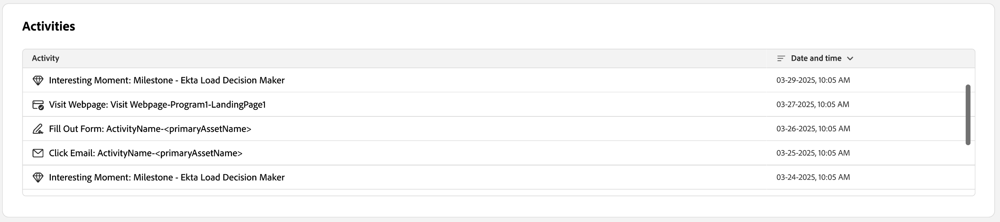

# Détails de la personne

Lorsque vous cliquez sur le nom d’une personne depuis n’importe quel emplacement de Journey Optimizer B2B edition, la page de détails de la personne s’affiche. Cette page contient des informations utiles sur la personne associée à un compte ou à un groupe d’achat, y compris un résumé IA génératif des données de mise en évidence et d’intention (si elles sont configurées). <!-- There are also [actions](#person-actions) that you can execute for the person. -->

{width="800" zoomable="yes"}

Pour accéder à cette page, cliquez sur un nom affiché dans la page [Tableau de bord intelligent](../dashboards/intelligent-dashboard.md), [Informations sur le groupe d’achats](../buying-groups/buying-group-details.md) ou [Informations sur le compte](./account-details.md).

La page des détails de la personne se compose des quatre sections suivantes :

## Présentation des personnes

{zoomable="yes"}

La section d’aperçu de la personne en haut de la page comprend les informations suivantes :

* Nom
* Titre
* E-mail
* Numéro de téléphone
* Score d’engagement
* Résumé

## Activités

Cette section fournit une liste des e-mails, sites web, formulaires à remplir et moments intéressants les plus récents associés à la personne (jusqu’à 20). Les éléments sont des listes en tant que type d’activité avec la date et l’heure.

{width="700" zoomable="yes"}

## Achat de groupes en fonction du score d’engagement

Cette section inclut les groupes d’achats dont la personne est membre, et est triée en fonction du score d’engagement. Chaque carte comprend les informations suivantes sur le groupe d&#39;achats :

* Nom - Cliquez sur le nom pour ouvrir les [détails du groupe d’achat](../buying-groups/buying-group-details.md).
* Score d’engagement
* Score d’exhaustivité
* Étape
* Membres

{width="700" zoomable="yes"}

## Données d’intention

Dans Journey Optimizer B2B edition, le modèle de détection des intentions prédit une solution/un produit ciblé avec un degré de confiance suffisant en fonction de l’activité d’une personne. Il tire également parti des activités des autres membres du compte, ainsi que du contenu balisé. L’intention d’une personne peut être interprétée comme la probabilité d’avoir un intérêt dans un produit.

{{intent-data-note}}

{width="700" zoomable="yes"}

* Niveaux d’intention
* Types de signal d’intention : mots-clés, produit et solution

<!-- ## Person actions -->
