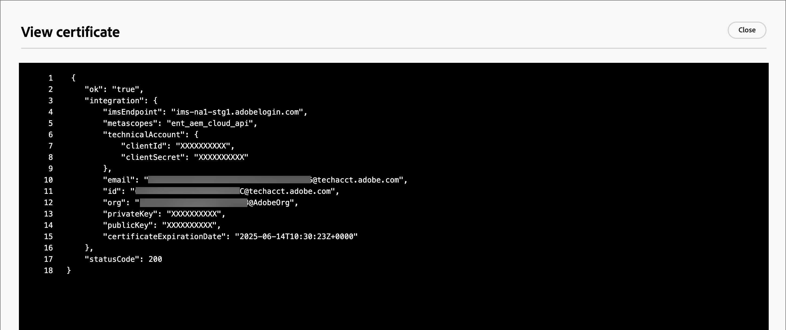

# Configuration des référentiels de ressources Experience Manager

Adobe Journey Optimizer version B2B s’intègre à Adobe Experience Manager Assets as a Cloud Service, ce qui permet d’utiliser des ressources telles que des courriers électroniques dans un parcours de compte. Elle garantit la transparence en échangeant des informations avec Experience Manager Assets. Configurez la connexion à Adobe Experience Assets pour activer cette fonctionnalité.

Adobe Experience Manager Cloud Manager est organisé en programmes, et chaque programme comporte plusieurs environnements et référentiels ([En savoir plus](https://experienceleague.adobe.com/en/docs/experience-manager-cloud-service/content/implementing/using-cloud-manager/programs/program-types)). Lorsque vous configurez Adobe Experience Manager Assets dans Adobe Journey Optimizer Édition B2B, vous configurez des connexions à chaque référentiel que vous souhaitez utiliser pour accéder aux ressources numériques.

## Conditions préalables

* Générez les informations d’identification du service pour l’environnement souhaité sur AEM Developer Console sans affichage ([En savoir plus](https://experienceleague.adobe.com/en/docs/experience-manager-learn/getting-started-with-aem-headless/authentication/service-credentials#generate-service-credentials)).
* Traitez les certificats nécessaires pour la connexion. La bonne pratique consiste à s’assurer qu’il reste au moins six mois avant l’expiration des certificats. Les certificats expirent tous les 365 jours.
* L’édition B2B de Adobe Journey Optimizer prend en charge l’accès à une source de gestion des actifs numériques à la fois. Assurez-vous que les ressources requises sont disponibles dans Adobe Experience Manager avant de basculer.

>[!IMPORTANT]
>
>Les informations d’identification du service sont de bonne foi et contiennent une clé privée. Ces informations d’identification doivent être stockées, gérées et accessibles en fonction de la stratégie informatique et de sécurité de votre entreprise.

## Ajout d’une connexion au référentiel

1. Dans le volet de navigation de gauche, sélectionnez **[!UICONTROL Administration]** > **[!UICONTROL Configuration]**.

1. Cliquez sur **[!UICONTROL Assets]** dans le panneau intermédiaire.

   {width="700" zoomable="yes"}

<!--   The default digital asset management option is configured as `Adobe Marketo Engage`.
-->
À partir de là, vous pouvez configurer les connexions unitairement à chaque référentiel d’environnement AEM.

1. Dans la zone _[!UICONTROL Adobe Experience Manager Assets]_, cliquez sur la flèche en regard de **[!UICONTROL Configurer un référentiel]** et sélectionnez le référentiel.

   {width="500"}

1. Cliquez sur **[!UICONTROL Ajouter un certificat]** et utilisez les outils de la boîte de dialogue pour télécharger le fichier.

   Vous pouvez charger un fichier .json en le faisant glisser sur la boîte de dialogue ou en cliquant sur le lien pour localiser et sélectionner un fichier sur votre système (assurez-vous que le fichier est un type JSON valide).

   {width="500"}

   Une fois le téléchargement effectué, le certificat s’affiche en bas de la page.

   >[!NOTE]
   >
   >Si un fichier non valide est utilisé, la boîte de dialogue affiche une erreur en bas.

   Cliquez sur **[!UICONTROL Ajouter]** pour terminer le certificat.

1. Cliquez sur la flèche Précédent (←) pour revenir à la page de configuration principale.

   Le référentiel configuré s’affiche dans le tableau sous le panneau de sélection. Vous pouvez ajouter un autre référentiel en répétant les étapes 3 à 4.

   {width="600" zoomable="yes"}

Une fois la configuration des référentiels terminée, les membres de l’équipe peuvent sélectionner Adobe Experience Manager Assets lors de la création de contenu.

>[!NOTE]
>
>L’édition B2B de Adobe Journey Optimizer prend en charge l’accès à une source de gestion des ressources numériques à la fois lors de la création de contenu. 

## Remplacement d’un certificat

Les certificats expirent tous les 365 jours à compter de la date de création. Remplacez-le avant son expiration pour vous assurer que votre équipe peut continuer à accéder aux ressources.

>[!NOTE]
>
>Adobe Journey Optimizer Édition B2B communique avec les ressources Experience Manager pour obtenir des informations d’utilisation. La connexion doit rester active pour une synchronisation des données d’utilisation fiable et pour éviter les incohérences de données. Les utilisateurs administrateurs sont informés de l’expiration des certificats par le biais des notifications in-app. Ils peuvent également noter les dates d’expiration de la sous-section Assets - Gestion des actifs numériques dans la zone d’administration.

1. Dans la page de gestion des ressources numériques, recherchez la liste des référentiels configurés.

1. Cliquez sur le référentiel de votre choix pour remplacer le certificat.

1. Cliquez sur l’icône représentant des points de suspension (**...**) pour que le fichier de certificat affiche les options d’actions qu’il contient.

   {width="600" zoomable="yes"}

1. Sélectionnez **[!UICONTROL Remplacer]** pour ouvrir la boîte de dialogue de téléchargement de fichier.

1. Chargez un fichier en le faisant glisser sur la boîte de dialogue ou à l’aide du lien. Assurez-vous que le fichier est de type json.

   {width="500"}

1. Cliquez sur **[!UICONTROL Remplacer]** pour confirmer le téléchargement.

## Affichage d’un certificat

Vous pouvez afficher le fichier de certificat JSON associé à la connexion au référentiel.

1. Dans la page de gestion des ressources numériques, recherchez la liste des référentiels configurés.

1. Cliquez sur le référentiel connecté.

1. Cliquez sur l’icône représentant des points de suspension (**...**) pour que le fichier de certificat affiche les options d’actions qu’il contient.

1. Sélectionnez **[!UICONTROL Affichage]**.

   {width="600"}

1. Cliquez sur **[!UICONTROL Fermer]** pour revenir à la page Configurer le référentiel .

## Suppression d’une connexion de référentiel

La suppression d’un référentiel supprime l’accès utilisateur à l’environnement Experience Manager Assets dans Journey Optimizer B2B Edition.

1. Recherchez la liste des référentiels de ressources configurés sur la page _[!UICONTROL Gestion des actifs numériques]_.

1. Cliquez sur le nom du référentiel souhaité pour modifier la connexion.

1. Cliquez sur l’icône représentant des points de suspension (**...**) pour que le fichier de certificat affiche les options d’actions qu’il contient.

1. Sélectionnez **[!UICONTROL Supprimer]**.

1. Dans la boîte de dialogue de confirmation, cliquez sur **[!UICONTROL Supprimer]**.
<!--

## Switch back to Adobe Marketo Engage Assets

Select Adobe Marketo Engage digital asset management in the Assets section.

After the confirmation, the Adobe Marketo Engage assets library is available for users.
-->
