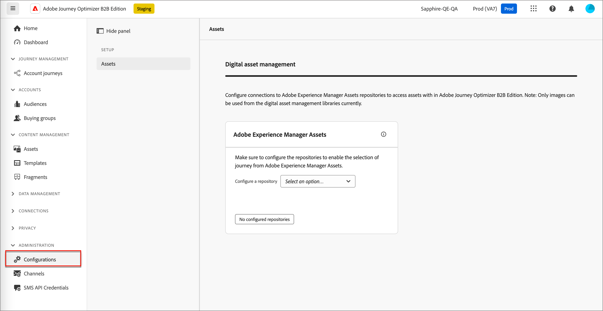

# Configuration des référentiels de ressources Experience Manager

[!DNL Adobe Journey Optimizer B2B Edition] s’intègre à [!DNL Adobe Experience Manager Assets as a Cloud Service], ce qui permet d’utiliser des ressources dans le contenu de votre e-mail. Elle assure la transparence en échangeant des informations avec les [!DNL Experience Manager Assets]. Configurez la connexion à [!DNL Adobe Experience Assets] pour activer cette fonctionnalité.

Adobe Experience Manager Cloud Manager est organisé en programmes, et chaque programme comporte plusieurs environnements et référentiels ([ En savoir plus](https://experienceleague.adobe.com/en/docs/experience-manager-cloud-service/content/implementing/using-cloud-manager/programs/program-types){target="_blank"}). Lorsque vous configurez Adobe Experience Manager Assets dans Adobe Journey Optimizer B2B edition, vous configurez des connexions à chaque référentiel que vous souhaitez utiliser pour accéder aux ressources numériques.

{{aem-assets-licensing-note}}

## Conditions préalables

* Générez les informations d’identification de service pour l’environnement souhaité sur le Developer Console découplé AEM ([En savoir plus](https://experienceleague.adobe.com/en/docs/experience-manager-learn/getting-started-with-aem-headless/authentication/service-credentials#generate-service-credentials){target="_blank"}).
* Procurez-vous les certificats nécessaires à la connexion. Il est recommandé de s’assurer que les certificats ont au moins six mois restants avant leur expiration. Les certificats expirent tous les 365 jours.
* Adobe Journey Optimizer B2B edition prend en charge l’accès à une source de gestion des ressources numériques à la fois. Assurez-vous que les ressources requises sont disponibles dans Adobe Experience Manager avant de basculer.

>[!IMPORTANT]
>
>Les informations d’identification de service sont authentiques et contiennent une clé privée. Ces informations d’identification doivent être stockées, gérées et accessibles conformément à la politique de sécurité et informatique de votre entreprise.

## Ajouter une connexion au référentiel

1. Dans le volet de navigation de gauche, choisissez **[!UICONTROL Administration]** > **[!UICONTROL Configuration]**.

1. Cliquez sur **[!UICONTROL Assets]** dans le panneau intermédiaire.

   {width="700" zoomable="yes"}

<!--   The default digital asset management option is configured as `Adobe Marketo Engage`.
-->
À partir de là, vous pouvez configurer une par une les connexions à chaque référentiel d’environnement AEM.

1. Dans la zone _[!UICONTROL Adobe Experience Manager Assets]_, cliquez sur la flèche en regard de **[!UICONTROL Configurer un référentiel]** et sélectionnez le référentiel.

   {width="500"}

1. Cliquez sur **[!UICONTROL Ajouter un certificat]** et utilisez les outils de boîte de dialogue pour télécharger le fichier.

   Vous pouvez charger un fichier .json en le faisant glisser dans la boîte de dialogue. Vous pouvez également cliquer sur le lien pour localiser et sélectionner un fichier sur votre système.

   {width="500"}

   Après le chargement, le certificat s’affiche en bas.

   >[!NOTE]
   >
   >Si un fichier non valide est utilisé, la boîte de dialogue affiche une erreur en bas.

   Cliquez sur **[!UICONTROL Ajouter]** pour terminer le certificat.

1. Cliquez sur la flèche Précédent (←) pour revenir à la page de configuration principale.

   Le référentiel configuré s’affiche dans le tableau sous le panneau de sélection. Vous pouvez ajouter un autre référentiel en répétant les étapes 3 et 4.

   {width="600" zoomable="yes"}

Une fois la configuration des référentiels terminée, les membres de l’équipe peuvent sélectionner le [!DNL Adobe Experience Manager Assets] lors de la création de contenu.

>[!NOTE]
>
>Adobe Journey Optimizer B2B edition prend en charge l’accès à une source de gestion des ressources numériques à la fois lors de la création de contenu. 

## Remplacer un certificat

Les certificats expirent tous les 365 jours à compter de la date de création. Pour que votre équipe puisse continuer à accéder aux ressources , remplacez le certificat avant son expiration.

>[!NOTE]
>
>[!DNL Adobe Journey Optimizer B2B Edition] communique avec [!DNL Experience Manager Assets] pour obtenir des informations d’utilisation. La connexion doit rester active pour une synchronisation fiable des données d’utilisation et pour éviter les incohérences de données. Les administrateurs reçoivent des notifications sur l’expiration des certificats via les notifications in-app. Les dates d’expiration sont également affichées dans la sous-section _Assets_ de la zone _[!UICONTROL Administration]_.

1. Sur la page de gestion des ressources numériques, recherchez la liste des référentiels configurés.

1. Cliquez sur le référentiel de votre choix pour remplacer le certificat.

1. Cliquez sur l’icône représentant des points de suspension (**...**) du fichier de certificat pour afficher les options d’actions correspondantes.

   {width="600" zoomable="yes"}

1. Choisissez **[!UICONTROL Remplacer]** pour ouvrir la boîte de dialogue de téléchargement du fichier.

1. Chargez un fichier en le faisant glisser dans la boîte de dialogue ou à l’aide du lien. Assurez-vous que le fichier est de type JSON.

   {width="500"}

1. Cliquez sur **[!UICONTROL Remplacer]** pour confirmer le chargement.

## Afficher un certificat

Vous pouvez afficher le fichier JSON de certificat associé à la connexion au référentiel.

1. Sur la page de gestion des ressources numériques, recherchez la liste des référentiels configurés.

1. Cliquez sur le référentiel connecté.

1. Cliquez sur l’icône représentant des points de suspension (**...**) du fichier de certificat pour afficher les options d’actions correspondantes.

1. Choisissez **[!UICONTROL Affichage]**.

   {width="600"}

1. Cliquez sur **[!UICONTROL Fermer]** pour revenir à la page Configurer le référentiel.

## Supprimer une connexion au référentiel

La suppression d’un référentiel supprime l’accès des utilisateurs et utilisatrices à l’environnement Experience Manager Assets dans Journey Optimizer B2B edition.

1. Sur la page _[!UICONTROL Gestion des ressources numériques]_, recherchez la liste des référentiels de ressources configurés.

1. Cliquez sur le nom du référentiel souhaité pour modifier la connexion.

1. Cliquez sur l’icône représentant des points de suspension (**...**) du fichier de certificat pour afficher les options d’actions correspondantes.

1. Choisissez **[!UICONTROL Supprimer]**.

1. Dans la boîte de dialogue de confirmation, cliquez sur **[!UICONTROL Supprimer]**.
<!--

## Switch back to Adobe Marketo Engage Assets

Select Adobe Marketo Engage digital asset management in the Assets section.

After the confirmation, the Adobe Marketo Engage assets library is available for users.
-->
