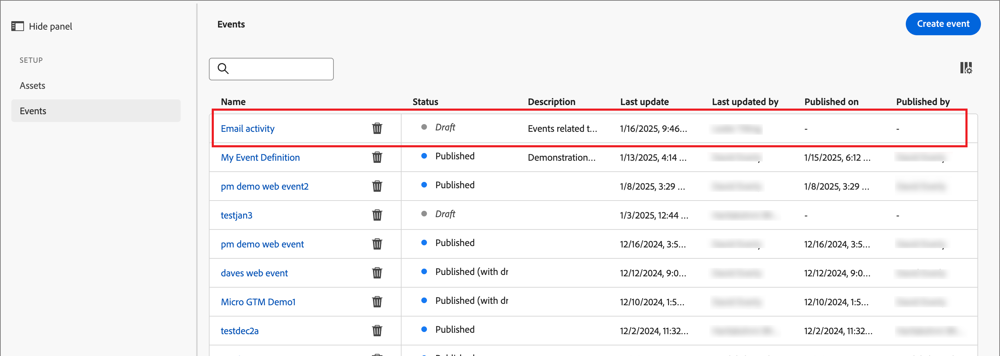
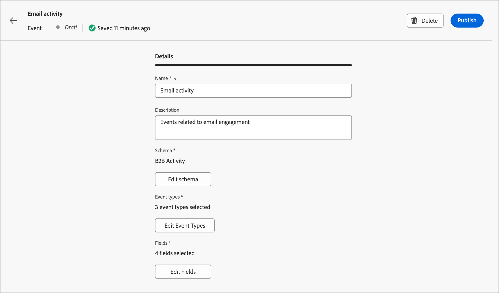
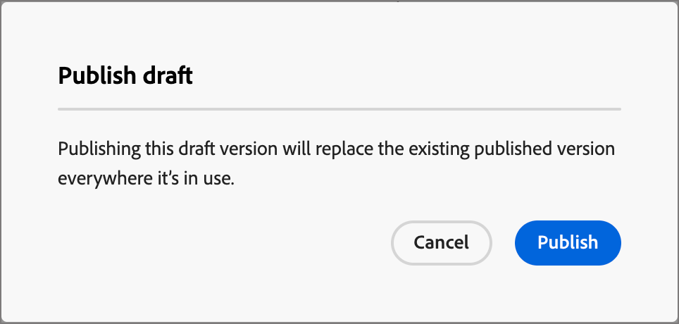

# Configuration des définitions d’événement Experience Platform

Les administrateurs peuvent configurer des définitions d’événement basées sur Adobe Experience Platform (AEP), ce qui permet aux spécialistes marketing de créer des parcours de compte qui réagissent aux [Événements d’expérience AEP](https://experienceleague.adobe.com/fr/docs/experience-platform/xdm/classes/experienceevent){target="_blank"}.

{width="30"} [Regarder la vidéo de présentation](#overview-video)

L’utilisation des événements d’expérience AEP dans les parcours de compte est un processus en deux étapes :

1. Créez et publiez une définition d’événement AEP.

2. Dans un parcours de compte, ajoutez un nœud _Écouter un événement_ et [sélectionnez une définition d’événement AEP en tant qu’événement de personne](../journeys/listen-for-event-nodes.md#listen-for-an-experience-event).

Chaque définition d’événement nécessite les entrées Experience Platform suivantes :

* **_Schéma_** - Schéma XDM qui définit la structure des données d’événement d’expérience. Il doit être basé sur un événement d’expérience et doit être activé pour le profil.

  >[!NOTE]
  >
  >Pour vous assurer que les schémas nécessaires sont définis, contactez votre équipe d’ingénieurs . La [création de schémas XDM](https://experienceleague.adobe.com/fr/docs/experience-platform/xdm/schema/composition){target="_blank"} est un processus complexe réalisé par des ingénieurs de données en fonction des exigences de cas d’utilisation de l’ensemble de votre entreprise.

* **_Types d’événement_** - Type d’événement XDM ExperienceEvent (20 maximum par définition d’événement).

* **_Champs_** - Champs XDM présents dans le schéma (maximum de 20 par définition d’événement)

* **_Name_** - Nom unique pour la définition d’événement.

* **_Description_** - Description de la définition d’événement.

## Limites et mécanismes de sécurisation

Lorsque vous créez et gérez des définitions d’événement pour atteindre les objectifs de votre organisation, tenez compte des points suivants :

* Journey Optimizer B2B edition prend en charge un maximum de 50 définitions d’événement.

* Les parcours de compte peuvent écouter les événements d’expérience AEP ingérés à l’aide des fonctionnalités de diffusion en continu d’AEP, telles que l’API Web SDK ou HTTP.

* Une seule définition d’événement AEP peut utiliser à la fois un schéma et un ensemble de types d’événements. Lorsque vous créez une définition d’événement à l’aide d’un schéma (par exemple, `My Schema`) et d’un type d’événement (par exemple, `Web Webpagedetails Page Views`), aucune autre définition d’événement ne peut utiliser la combinaison de `My Schema` et `Web Webpagedetails Page Views`.

* Une définition d’événement peut être utilisée dans plusieurs parcours de compte.

* Les événements d’expérience AEP peuvent être utilisés à des fins de prise de décision dans un parcours de compte, mais ne sont pas conservés. Par conséquent, aucun enregistrement historique d’événements d’expérience AEP ne peut être utilisé dans Journey Optimizer B2B edition.

* Les contraintes de _date d&#39;activité_ et _nombre minimum de fois_ ne sont pas prises en charge.

* Une fois la définition d’événement publiée, le schéma et le nom ne peuvent pas être modifiés. Cependant, vous pouvez ajouter des types d’événements et des champs en créant un brouillon, puis en le republiant.

* Les définitions d’événement utilisées dans les parcours publiés ne peuvent pas être supprimées.

## Accéder aux définitions d’événement et les gérer

1. Dans le volet de navigation de gauche, choisissez **[!UICONTROL Administration]** > **[!UICONTROL Configurations]**.

1. Cliquez sur **[!UICONTROL Événements]** dans le panneau intermédiaire pour afficher la liste des définitions d’événement.

   À partir de cette page, vous pouvez [créer](#create-an-event-definition), [publier](#publish-an-event-defintion), [modifier](#edit-an-event-definition) et [supprimer](#delete-an-event-definition) des définitions d’événement.

   {width="800" zoomable="yes"}

   Le tableau est trié selon la colonne _[!UICONTROL Modifié]_, les définitions les plus récemment mises à jour étant celles en haut par défaut.<!-- Click the column title to change between ascending and descending.-->

1. Pour accéder aux détails d’une définition d’événement, cliquez sur son nom.

### Statut et cycle de vie de la définition d&#39;événement

Dans la liste _[!UICONTROL Définitions des événements]_, la colonne **[!UICONTROL Statut]** indique le statut actuel de chaque définition. Le statut détermine sa disponibilité pour une utilisation dans les parcours de compte et les modifications que vous pouvez y apporter.

| Statut | Description |
| -------------------- | ----------- |
| Brouillon | Lorsque vous créez une définition d’événement, elle a le statut brouillon. Il reste dans ce statut jusqu’à ce que vous le publiiez pour l’utiliser dans les parcours de compte. Actions disponibles :  <li>Modifier tous les détails<li>Publier<li>Supprimer |
| Publié | Lorsque vous publiez une définition d’événement, elle peut être utilisée dans les parcours de compte. Les détails ne peuvent pas être modifiés. Actions disponibles :  <li>Disponible pour le nœud de parcours _Écouter un événement_<li>Créer une version brouillon<li>Supprimer (si non utilisé) |
| Publié (avec le brouillon) | Lorsque vous créez un brouillon à partir d’une définition d’événement publiée, la version publiée reste disponible pour être utilisée dans les parcours de compte et le brouillon peut être modifié. Si vous publiez le brouillon, il remplace la version publiée actuelle et la définition de l’événement est mise à jour pour les parcours de compte où il n’est pas encore exécuté. Actions disponibles :  <li>Modifier tous les détails<li>Publier le brouillon<li>Abandonner la version brouillon<li>Supprimer (si non utilisé) |

{zoomable="yes"}

### Filtrer la liste des définitions d’événement

Pour rechercher une définition d’événement par nom, saisissez une chaîne de texte dans la barre de recherche pour rechercher une correspondance.

{width="700" zoomable="yes"}

## Création d’une définition d’événement

1. Dans le volet de navigation de gauche, choisissez **[!UICONTROL Administration]** > **[!UICONTROL Configuration]**.

1. Cliquez sur **[!UICONTROL Événements]** dans le panneau intermédiaire pour afficher la liste des définitions d’événement.

1. Cliquez sur **[!UICONTROL Créer un événement]** en haut à droite.

1. Saisissez le **[!UICONTROL Nom]** (obligatoire) et le **[!UICONTROL Description]** (facultatif).

   {width="600" zoomable="yes"}

1. Définissez le **[!UICONTROL Schéma]** à utiliser pour la définition de l’événement.

   Le schéma que vous sélectionnez détermine les champs disponibles à ajouter à la définition. Les champs que vous ajoutez sont ensuite disponibles en tant que contraintes pour un nœud _Écouter un événement_ dans un parcours de compte.

   * Cliquez sur **[!UICONTROL Sélectionner le schéma]**.
   * Dans la boîte de dialogue, sélectionnez un schéma dans la liste des schémas basés sur un événement d’expérience.
   * Cliquez sur **[!UICONTROL Sélectionner]**.

   {width="600" zoomable="yes"}

1. Sélectionnez les **[!UICONTROL types d’événement]** à utiliser pour la définition de l’événement.

   Les [types d’événement](https://experienceleague.adobe.com/fr/docs/experience-platform/xdm/classes/experienceevent#eventType){target="_blank"} que vous sélectionnez déterminent les événements disponibles en tant que contraintes pour un nœud _Écouter un événement_ dans un parcours de compte.

   * Cliquez sur **[!UICONTROL Sélectionner les types d’événements]**.
   * Dans la boîte de dialogue, sélectionnez un ou plusieurs types d’événements dans la liste (20 au maximum).
   * Cliquez sur **[!UICONTROL Sélectionner]**.

   {width="600" zoomable="yes"}

1. Sélectionnez les **[!UICONTROL Champs]** à utiliser pour la définition de l’événement.

   Les champs que vous sélectionnez déterminent les contraintes disponibles lorsque l’événement est utilisé pour un nœud _Écouter un événement_ dans un parcours de compte.

   >[!NOTE]
   >
   >Le champ `eventType` est obligatoire et automatiquement sélectionné.

   * Cliquez sur **[!UICONTROL Sélectionner les champs]**.
   * Dans la boîte de dialogue, sélectionnez un ou plusieurs champs dans la liste (20 au maximum).
   * Cliquez sur **[!UICONTROL Sélectionner]**.

   {width="600" zoomable="yes"}

1. Une fois le schéma, les types d’événements et les champs terminés, cliquez sur **[!UICONTROL Créer]**.

   Lors de la création, la page de liste s’affiche et le nouvel événement apparaît en haut de la liste avec le statut _Brouillon_.

   {width="700" zoomable="yes"}

## Publication d’une définition d’événement

Lorsque vous êtes convaincu que le brouillon de définition d’événement est complet et adapté à vos besoins, vous pouvez le publier. La définition d’événement publiée est alors disponible pour être utilisée dans les parcours de compte. Une fois la définition d’événement publiée, vous pouvez créer un brouillon si vous devez y apporter des modifications. Cependant, vous ne pouvez pas modifier le schéma, et vous pouvez uniquement ajouter des types d’événements et des champs (vous ne pouvez pas les supprimer).

1. Dans le volet de navigation de gauche, choisissez **[!UICONTROL Administration]** > **[!UICONTROL Configuration]**.

1. Cliquez sur **[!UICONTROL Événements]** dans le panneau intermédiaire pour afficher la liste des définitions d’événement.

1. Dans la liste _[!UICONTROL Définitions d’événement]_, cliquez sur le nom du brouillon de définition d’événement pour ouvrir la page de détails.

   {width="600" zoomable="yes"}

   Si nécessaire, passez en revue les paramètres avant de publier. Vous pouvez [modifier le brouillon](#edit-an-event-definition) s’il ne répond pas à vos besoins.

1. Cliquez sur **[!UICONTROL Publier]** en haut à droite.

1. Dans la boîte de dialogue de confirmation, cliquez sur **[!UICONTROL Publier]**.

   {width="300"}

   Le statut de la définition d’événement passe à _Publiée_ et elle est désormais [disponible dans les parcours de compte](../journeys/listen-for-event-nodes.md#listen-for-an-experience-event).

   {width="700" zoomable="yes"}

## Modification d’une définition d’événement

1. Dans le volet de navigation de gauche, choisissez **[!UICONTROL Administration]** > **[!UICONTROL Configuration]**.

1. Cliquez sur **[!UICONTROL Événements]** dans le panneau intermédiaire pour afficher la liste des définitions d’événement.

   Les modifications apportées à une définition d’événement dépendent de son statut actuel :

   * Lorsqu’une définition d’événement a le statut _Brouillon_, vous pouvez modifier n’importe lequel de ses détails.
   * Lorsqu’une définition d’événement a le statut _Publié_, vous ne pouvez pas la modifier. Vous pouvez créer un brouillon modifiable, puis remplacer la version publiée.
   * Lorsqu’une définition d’événement a le statut _Publié (avec brouillon)_ vous pouvez modifier la version brouillon (modifier la description et ajouter des types d’événement et des champs).

   {width="700" zoomable="yes"}

1. Dans la page de liste _[!UICONTROL Définitions d’événement]_, cliquez sur le nom de la définition d’événement pour l’ouvrir.

Suivez les étapes en fonction du statut :

>[!BEGINTABS]

>[!TAB Brouillon]

1. Modifiez les détails de la définition d’événement selon les besoins.

   {width="600" zoomable="yes"}

   Suivez les mêmes instructions que celles utilisées pour [création d’une définition d’événement](#create-an-event-definition).

   Les modifications sont automatiquement enregistrées dans le brouillon.

1. Lorsque la définition d’événement répond à vos critères et que vous souhaitez la rendre disponible pour les parcours de compte d’utilisation, cliquez sur **[!UICONTROL Publier]**.

1. Dans la boîte de dialogue de confirmation, cliquez sur **[!UICONTROL Publier]**.

   Le statut de la définition d’événement passe à _Publié_ et peut désormais être utilisé dans les parcours de compte.

>[!TAB Publié]

1. Pour mettre à jour la définition de l’événement, cliquez sur **[!UICONTROL Créer un brouillon]** en haut à droite.

   {width="600" zoomable="yes"}

1. Dans la boîte de dialogue de confirmation, cliquez sur **[!UICONTROL Créer un brouillon]** pour ouvrir le brouillon.

   {width="300"}

   Cette action crée le brouillon et revient à la page de liste, où la définition de l’événement est désormais à l’état _Publié (avec le brouillon)_.

1. Cliquez sur le nom de la définition d’événement pour l’ouvrir.

   Pour une définition d’événement _Publié (avec brouillon)_ l’onglet de version _[!UICONTROL Publié]_ est sélectionné par défaut.

1. Sélectionnez l’onglet Version **[!UICONTROL brouillon]** .

   {width="600" zoomable="yes"}

1. Modifiez l’un des détails modifiables (**[!UICONTROL Description]**, **[!UICONTROL Types d’événement]** et **[!UICONTROL Champs]**) si nécessaire.

   Suivez les mêmes instructions que celles utilisées pour [création d’une définition d’événement](#create-an-event-definition).

   Les modifications sont automatiquement enregistrées dans le brouillon.

1. Lorsque la définition d’événement de brouillon répond à vos critères et que vous souhaitez remplacer la version publiée actuelle pour l’utiliser dans les parcours de compte, cliquez sur **[!UICONTROL Publier le brouillon]**.

1. Dans la boîte de dialogue de confirmation, cliquez sur **[!UICONTROL Publier]**.

   {width="300"}

   Lorsque vous publiez le brouillon, il remplace la version publiée actuelle et la définition de l’événement est mise à jour pour les parcours de compte où il est déjà utilisé, mais pas encore exécuté.

>[!TAB Publié (avec brouillon)]

Lorsque vous ouvrez une définition d’événement _Publié (avec brouillon)_, l’onglet de version _[!UICONTROL Publié]_ est sélectionné par défaut.

1. Sélectionnez l’onglet Version **[!UICONTROL brouillon]** .

   {width="600" zoomable="yes"}

1. Modifiez l’un des détails modifiables (**[!UICONTROL Description]**, **[!UICONTROL Types d’événement]** et **[!UICONTROL Champs]**) si nécessaire.

   Suivez les mêmes instructions que celles utilisées pour [créer une définition d’événement](#create-an-event-definition).

   Les modifications sont automatiquement enregistrées dans le brouillon.

1. Lorsque la définition d’événement de brouillon répond à vos critères et que vous souhaitez remplacer la version publiée actuelle pour l’utiliser dans les parcours de compte, cliquez sur **[!UICONTROL Publier le brouillon]**.

1. Dans la boîte de dialogue de confirmation, cliquez sur **[!UICONTROL Publier]**.

   {width="300"}

   Lorsque vous publiez le brouillon, il remplace la version publiée actuelle et la définition de l’événement est mise à jour pour les parcours de compte où il est déjà utilisé, mais pas encore exécuté.

>[!ENDTABS]

## Suppression d’une définition d’événement

Vous pouvez supprimer une définition d’événement si elle n’est pas utilisée par un parcours de compte publié.

>[!CAUTION]
>
>Utilisez cette action avec précaution. La suppression d’une définition d’événement ne peut pas être annulée.

1. Dans le volet de navigation de gauche, choisissez **[!UICONTROL Administration]** > **[!UICONTROL Configuration]**.

1. Cliquez sur **[!UICONTROL Événements]** dans le panneau intermédiaire pour afficher la liste des définitions d’événement.

1. Recherchez la définition de l’événement dans la liste, puis cliquez sur l’icône _Supprimer_ (  ) à droite du nom.

1. Dans la boîte de dialogue de confirmation, cliquez sur **[!UICONTROL Supprimer]**.

   {width="300"}

## Vidéo de vue d’ensemble

>[!VIDEO](https://video.tv.adobe.com/v/3448685/?learn=on&captions=fre_fr)