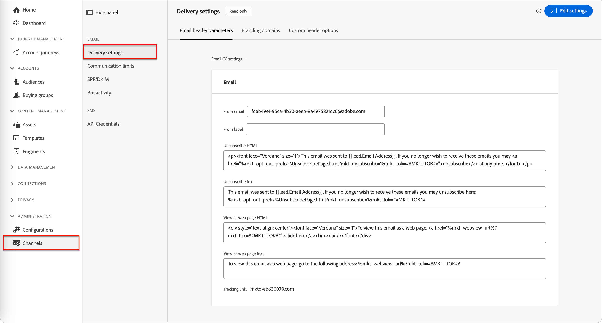
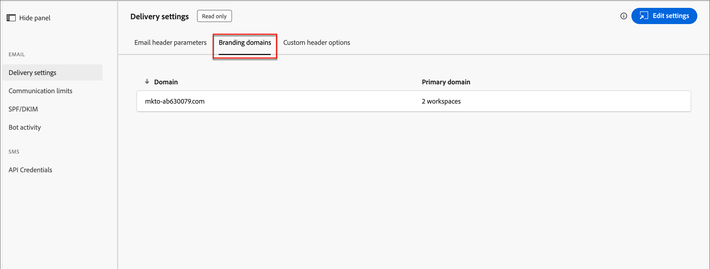

# Configurations du canal e-mail

Adobe Journey Optimizer B2B edition exploite les fonctions de canal et le suivi des événements dans Marketo Engage. Les administrateurs doivent s’assurer que les configurations de diffusion et de suivi sont en place pour activer la diffusion de canal pour les marketeurs. Pour plus d’informations sur les protocoles nécessaires à la diffusion et au suivi des e-mails via Marketo Engage, voir [Protocoles de suivi et de diffusion des e-mails](../start/email-protocols.md).

## Paramètres de diffusion

Les paramètres d’e-mail par défaut sont utilisés lorsque les marketeurs créent un e-mail dans un parcours de compte. Pour consulter les paramètres de diffusion des e-mails, accédez à **[!UICONTROL Administration]** > **[!UICONTROL Canaux]**. Sous _[!UICONTROL E-mail]_ dans le panneau de navigation, sélectionnez **[!UICONTROL Paramètres de diffusion]**.

{width="800" zoomable="yes"}

Les paramètres sont en lecture seule dans Journey Optimizer B2B edition. Cliquez sur **[!UICONTROL Modifier les paramètres]** en haut à droite pour accéder aux options de configuration de l’instance Marketo Engage connectée.

>[!NOTE]
>
>Pour accéder à ces paramètres et les modifier dans Adobe Marketo Engage, vous devez disposer des autorisations d’administrateur de produit.

Sélectionnez chacun des onglets suivants pour passer en revue les paramètres actuels.

### [!UICONTROL Paramètres d&#39;en-tête des emails] {#email-header}

Les paramètres d&#39;en-tête des emails définissent les valeurs par défaut des éléments suivants :

* **[!UICONTROL E-mail de l’expéditeur]** - Adresse e-mail répertoriée dans le champ _De_ de l’en-tête de l’e-mail.

* **[!UICONTROL Libellé de l’expéditeur]** - Nom affiché de l’adresse e-mail expéditeur.

* **[!UICONTROL Désabonnement d’HTML]** - HTML (pour les clients de messagerie pris en charge) qui s’affiche dans les e-mails non opérationnels pour expliquer les actions de désabonnement au destinataire. Ce texte et ces liens sont ajoutés en bas.

* **[!UICONTROL Texte de désabonnement]** - Texte brut affiché dans les e-mails non opérationnels pour expliquer les actions de désabonnement au destinataire. Ce texte et ces liens sont ajoutés en bas.

* **[!UICONTROL Afficher en tant que page web HTML]** - HTML (pour les clients de messagerie pris en charge) utilisé pour _Afficher en tant que page web_, qui fournit un lien pour afficher un e-mail dans un navigateur.

* **[!UICONTROL Afficher en tant que texte de page web]** - Texte brut utilisé pour _Afficher en tant que page web_, qui fournit un lien pour afficher un e-mail dans un navigateur.

### [!UICONTROL Domaines de branding] {#branding-domains}

Pour passer en revue les domaines de branding, cliquez sur l’onglet **[!UICONTROL Domaines de branding]**.

{width="700" zoomable="yes"}

Ce paramètre définit votre domaine principal pour un ou plusieurs espaces de travail Marketo Engage. Les nouveaux e-mails utilisent ce domaine par défaut, mais les spécialistes du marketing peuvent le remplacer par e-mail. Pour plus d&#39;informations, consultez la documentation de [Marketo Engage](https://experienceleague.adobe.com/en/docs/marketo/using/product-docs/administration/email-setup/add-multiple-branding-domains/edit-your-default-branding-domain){target="_blank"}.

>[!NOTE]
>
>Si vous commercialisez plusieurs marques en dehors de Journey Optimizer B2B edition et de l’instance Marketo Engage connectée et que vous souhaitez que chacune d’elles ait ses propres liens de tracking de marque, vous pouvez ajouter un domaine de marque supplémentaire. Pour plus d&#39;informations, consultez la documentation de [Marketo Engage](https://experienceleague.adobe.com/en/docs/marketo/using/product-docs/administration/email-setup/add-multiple-branding-domains/add-an-additional-branding-domain){target="_blank"}.

### [!UICONTROL Options d’en-tête personnalisé] {#custom-header-options}

Pour passer en revue les options d’en-tête personnalisé, cliquez sur l’onglet **[!UICONTROL Options d’en-tête personnalisé]**.

{width="700" zoomable="yes"}

Lorsque l’option _[!UICONTROL Strict Transport Security]_ est activée, elle garantit que les liens de suivi sont diffusés via HTTPS (uniquement pour les abonnements dont les liens de suivi sont sécurisés par SSL).

## Limites de communication

Les limites de communication contrôlent la quantité d’e-mails envoyés par votre organisation. Il est recommandé de définir des limites afin de ne pas submerger les destinataires avec trop d’e-mails provenant de votre organisation.

Pour consulter les paramètres actuels, accédez à **[!UICONTROL Administration]** > **[!UICONTROL Canaux]**. Sous _[!UICONTROL E-mail]_ dans le panneau de navigation, sélectionnez **[!UICONTROL Limites de communication]**.

{width="700" zoomable="yes"}

Les paramètres sont en lecture seule dans Journey Optimizer B2B edition. Cliquez sur **[!UICONTROL Modifier les paramètres]** en haut à droite pour accéder aux options de configuration de l’instance Marketo Engage connectée.

>[!NOTE]
>
>Pour accéder à ces paramètres et les modifier dans Adobe Marketo Engage, vous devez disposer des autorisations d’administrateur de produit.

Pour plus d&#39;informations sur la configuration des limites de communication, consultez la documentation de [Marketo Engage](https://experienceleague.adobe.com/en/docs/marketo/using/product-docs/administration/email-setup/enable-communication-limits){target="_blank"}.

## SPF/DKIM

Améliorez vos taux de diffusion d’e-mails en incorporant SPF (Sender Policy Framework) et DKIM (Domain Keys Identified Mail) dans vos paramètres DNS. Ces technologies garantissent à vos destinataires que vos e-mails ne sont pas du spam. Pour empêcher les filtres de spam des destinataires de rejeter des e-mails, assurez-vous que les paramètres SPF et DKIM sont configurés pour vos domaines.

Pour consulter les paramètres actuels, accédez à **[!UICONTROL Administration]** > **[!UICONTROL Canaux]**. Sous _[!UICONTROL E-mail]_ dans le panneau de navigation, sélectionnez **[!UICONTROL SPF/DKIM]**.

{width="700" zoomable="yes"}

Les paramètres sont en lecture seule dans Journey Optimizer B2B edition. Cliquez sur **[!UICONTROL Modifier les paramètres]** en haut à droite pour accéder aux options de configuration de l’instance Marketo Engage connectée.

>[!NOTE]
>
>Pour accéder à ces paramètres et les modifier dans Adobe Marketo Engage, vous devez disposer des autorisations d’administrateur de produit.

### Configuration SPF

L’administrateur réseau doit ajouter la ligne suivante à vos entrées DNS :

`[domain] IN TXT v=spf1 mx ip4:[corpIP] include:mktomail.com ~all`

Dans cette entrée, remplacez `[domain]` par le domaine principal de votre site web (tel que `company.com`) et `[corpIP]` par l’adresse IP du serveur de messagerie de votre entreprise (tel que `255.255.255.255`). Si vous envoyez des e-mails provenant de plusieurs domaines via Marketo Engage, ajoutez cette entrée pour chaque domaine sur une seule ligne.

Si votre entrée DNS contient déjà un enregistrement SPF, ajoutez-y les éléments suivants :

`include:mktomail.com`

### Configuration de DKIM

DKIM est un protocole d’authentification utilisé par les destinataires d’e-mails pour valider l’expéditeur de l’e-mail. Elle améliore souvent la délivrabilité des e-mails vers la boîte de réception, car le destinataire peut être certain que le message n’est pas un faux.

Avec la clé publique dans votre enregistrement DNS et le domaine d’envoi activé dans l’instance Marketo Engage connectée, la signature DKIM personnalisée est utilisée pour vos messages sortants. La signature DKIM personnalisée comprend une signature numérique chiffrée avec chaque e-mail envoyé. Les récepteurs peuvent ensuite déchiffrer la signature numérique en recherchant la _clé publique_ dans le DNS de votre domaine d’envoi. Si la clé dans l’e-mail correspond à la clé dans l’enregistrement DNS, le serveur de messagerie de réception est plus susceptible d’accepter l’e-mail envoyé via Marketo Engage.

Pour plus d&#39;informations sur la configuration d&#39;une signature DKIM personnalisée pour la diffusion d&#39;e-mails, consultez la documentation de [Marketo Engage](https://experienceleague.adobe.com/fr/docs/marketo/using/product-docs/email-marketing/deliverability/set-up-a-custom-dkim-signature){target="_blank"}.

## Activité de robot

L’activité de robots d’e-mail peut gonfler par erreur les données d’ouverture et de clic de votre e-mail.

Marketo Engage utilise deux méthodes pour confirmer l’activité des robots :

* **Correspondance avec la liste Interactive Advertising Bureau (IAB)** - Les activités qui correspondent à tout ce qui figure sur la liste IAB UA/IP (Agent utilisateur/adresse IP) sont marquées comme des robots.

* **Correspondance avec le modèle de proximité** - Lorsque plusieurs activités se produisent en même temps (dans la seconde), elles sont identifiées comme des robots. Cette méthode prend en compte les attributs suivants à des fins de comparaison :

   * ID de lead (doit être le même)
   * Ressource e-mail (doit être la même)
   * Clic sur un lien ou ouverture d’un e-mail
   * Décalage horaire (doit être inférieur à une seconde)

Pour les activités de clic sur les liens d’e-mail et d’ouverture d’e-mail, les nouveaux attributs sont renseignés avec les valeurs suivantes :

* Les activités identifiées comme des robots ont _Activité de robot_ comme `True` et _Modèle d’activité de robot_ comme modèle/méthode identifié.
* Les activités identifiées comme n’étant pas des robots ont _Activité de robot_ comme `False` et _Modèle d’activité de robot_ comme `N/A`.
* Les activités qui se produisent avant l’introduction des attributs ont _Activité de robot_ comme vide (nul) et _Modèle d’activité de robot_ comme vide (nul)

Pour consulter les paramètres actuels, accédez à **[!UICONTROL Administration]** > **[!UICONTROL Canaux]**. Sous _[!UICONTROL E-mail]_ dans le panneau de navigation, sélectionnez **[!UICONTROL Activité de robot]**.

{width="700" zoomable="yes"}

Les paramètres sont en lecture seule dans Journey Optimizer B2B edition. Cliquez sur **[!UICONTROL Modifier les paramètres]** en haut à droite pour accéder aux options de configuration de l’instance Marketo Engage connectée.

>[!NOTE]
>
>Pour accéder à ces paramètres et les modifier dans Adobe Marketo Engage, vous devez disposer des autorisations d’administrateur de produit.

Pour plus d&#39;informations sur la configuration des options d&#39;activité des robots, consultez la documentation de Marketo Engage [&#128279;](https://experienceleague.adobe.com/en/docs/marketo/using/product-docs/administration/email-setup/filtering-email-bot-activity#select-filter-type){target="_blank"}.
