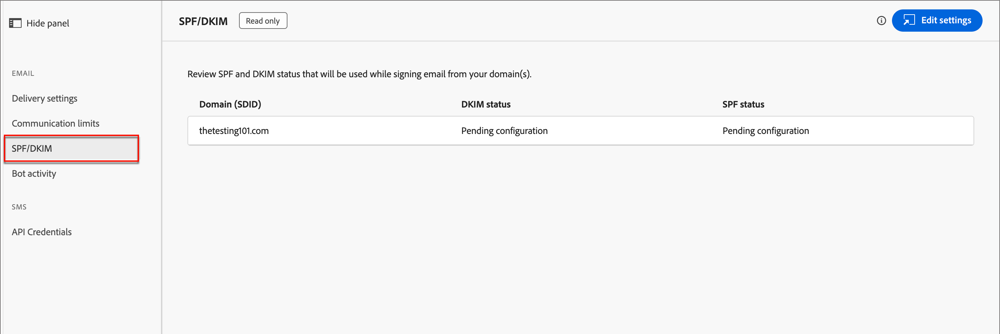

# Paramétrages des emails

Adobe Journey Optimizer B2B edition tire parti des fonctions de canal et du suivi des événements dans Market Engage. Les administrateurs doivent s’assurer que les configurations de diffusion et de suivi sont en place pour activer la diffusion des canaux pour les marketeurs. Pour plus d’informations sur les protocoles nécessaires à la diffusion et au suivi des emails par le biais de Marketo Engage, voir [Protocoles de suivi et de diffusion d’emails](../start/email-protocols.md).

## Paramètres de diffusion

Les paramètres de courrier électronique par défaut sont utilisés lorsque les marketeurs créent un courrier électronique dans un parcours de compte. Pour consulter les paramètres de remise des emails, accédez à **[!UICONTROL Administration]** > **[!UICONTROL Canaux]**. Sous _[!UICONTROL Email]_ dans le panneau de navigation, sélectionnez **[!UICONTROL Paramètres de diffusion]**.

{width="800" zoomable="yes"}

Les paramètres sont en lecture seule dans Journey Optimizer B2B edition. Cliquez sur **[!UICONTROL Modifier les paramètres]** en haut à droite pour accéder aux options de configuration dans l’instance de Marketo Engage connectée.

>[!NOTE]
>
>Pour accéder à ces paramètres et les modifier dans Adobe Marketo Engage, vous devez disposer des autorisations Administrateur de produit.

Sélectionnez chacun des onglets suivants pour consulter les paramètres actuels.

### [!UICONTROL  Paramètres d’en-tête de l’email] {#email-header}

Les paramètres d’en-tête de l’email définissent les valeurs par défaut des éléments suivants :

* **[!UICONTROL De l’email]** - Adresse électronique indiquée dans le champ _De_ de l’en-tête de l’email.

* **[!UICONTROL From Label]** - Nom affiché de l’adresse de l’expéditeur de l’email.

* **[!UICONTROL HTML de désabonnement]** - HTML (pour les clients de messagerie pris en charge) affiché dans les emails non opérationnels pour expliquer au destinataire les actions de désabonnement. Ce texte et ces liens sont ajoutés au bas de la page.

* **[!UICONTROL Texte de désabonnement]** : texte brut affiché dans les emails non opérationnels pour expliquer au destinataire les actions de désabonnement. Ce texte et ces liens sont ajoutés au bas de la page.

* **[!UICONTROL Afficher comme HTML de page web]** - HTML (pour les clients de messagerie pris en charge) utilisé pour _Afficher comme page web_, qui fournit un lien pour afficher un courrier électronique dans un navigateur.

* **[!UICONTROL Afficher en tant que texte de page web]** - Texte brut utilisé pour _Afficher en tant que page web_, qui fournit un lien pour afficher un courrier électronique dans un navigateur.

### [!UICONTROL Domaines de marque] {#branding-domains}

Pour passer en revue les domaines de marque, cliquez sur l’onglet **[!UICONTROL Domaines de marque]** .

{width="700" zoomable="yes"}

Ce paramètre définit votre domaine principal pour un ou plusieurs espaces de travail de Marketo Engage. Les nouveaux emails utilisent ce domaine comme domaine par défaut, mais les marketeurs peuvent le remplacer par email. Pour plus d&#39;informations, consultez la [documentation du Marketo Engage](https://experienceleague.adobe.com/en/docs/marketo/using/product-docs/administration/email-setup/add-multiple-branding-domains/edit-your-default-branding-domain){target="_blank"}.

>[!NOTE]
>
>Si vous marketing plusieurs marques à partir de Journey Optimizer B2B edition et de l’instance de Marketo Engage connectée et que vous souhaitez que chacune dispose de ses propres liens de suivi de marque, vous pouvez ajouter un domaine de branding supplémentaire. Pour plus d&#39;informations, consultez la [documentation du Marketo Engage](https://experienceleague.adobe.com/en/docs/marketo/using/product-docs/administration/email-setup/add-multiple-branding-domains/add-an-additional-branding-domain){target="_blank"}.

### [!UICONTROL Options d’en-tête personnalisées] {#custom-header-options}

Pour passer en revue les options d’en-tête personnalisé, cliquez sur l’onglet **[!UICONTROL Options d’en-tête personnalisé]** .

{width="700" zoomable="yes"}

Lorsque _[!UICONTROL Strict Transport Security]_ est activé, il garantit que les liens de suivi sont diffusés via HTTPS (uniquement pour les abonnements avec des liens de suivi sécurisés par SSL).

## Limites de communication

Les limites de communication contrôlent la quantité de courriers électroniques que votre entreprise envoie. Il est recommandé de définir des limites afin de ne pas submerger les destinataires avec un trop grand nombre d’emails de votre entreprise.

Pour consulter les paramètres actuels, accédez à **[!UICONTROL Administration]** > **[!UICONTROL Canaux]**. Sous _[!UICONTROL Email]_ dans le panneau de navigation, sélectionnez **[!UICONTROL Limites de communication]**.

{width="700" zoomable="yes"}

Les paramètres sont en lecture seule dans Journey Optimizer B2B edition. Cliquez sur **[!UICONTROL Modifier les paramètres]** en haut à droite pour accéder aux options de configuration dans l’instance de Marketo Engage connectée.

>[!NOTE]
>
>Pour accéder à ces paramètres et les modifier dans Adobe Marketo Engage, vous devez disposer des autorisations Administrateur de produit.

Pour plus d&#39;informations sur la configuration des limites de communication, consultez la [documentation du Marketo Engage](https://experienceleague.adobe.com/en/docs/marketo/using/product-docs/administration/email-setup/enable-communication-limits){target="_blank"}.

## SPF/DKIM

Améliorez vos taux de diffusion email en intégrant SPF (Sender Policy Framework) et DKIM (Domain Keys Identified Mail) dans vos paramètres DNS. Ces technologies assurent vos destinataires que vos emails ne sont pas des spams. Pour empêcher les filtres de spam des destinataires de rejeter les emails, assurez-vous que SPF et DKIM sont configurés pour vos domaines.

Pour consulter les paramètres actuels, accédez à **[!UICONTROL Administration]** > **[!UICONTROL Canaux]**. Sous _[!UICONTROL Email]_ dans le panneau de navigation, sélectionnez **[!UICONTROL SPF/DKIM]**.

{width="700" zoomable="yes"}

Les paramètres sont en lecture seule dans Journey Optimizer B2B edition. Cliquez sur **[!UICONTROL Modifier les paramètres]** en haut à droite pour accéder aux options de configuration dans l’instance de Marketo Engage connectée.

>[!NOTE]
>
>Pour accéder à ces paramètres et les modifier dans Adobe Marketo Engage, vous devez disposer des autorisations Administrateur de produit.

### Configuration SPF

L’administrateur réseau doit ajouter la ligne suivante à vos entrées DNS :

`[domain] IN TXT v=spf1 mx ip4:[corpIP] include:mktomail.com ~all`

Dans cette entrée, remplacez `[domain]` par le domaine principal de votre site web (par exemple `company.com`) et `[corpIP]` par l’adresse IP de votre serveur de messagerie d’entreprise (par exemple `255.255.255.255`). Si vous envoyez des emails à partir de plusieurs domaines par le biais de Marketo Engage, ajoutez cette entrée pour chaque domaine sur une seule ligne.

Si votre entrée DNS contient déjà un enregistrement SPF, ajoutez-y le code suivant :

`include:mktomail.com`

### Configuration de DKIM

DKIM est un protocole d’authentification utilisé par les destinataires des emails pour valider l’expéditeur du message. Cela améliore souvent la délivrabilité des emails vers la boîte de réception, car un destinataire peut être certain que le message n’est pas une erreur.

Avec la clé publique de votre enregistrement DNS et le domaine d’envoi activé dans l’instance de Marketo Engage connectée, la signature DKIM personnalisée est utilisée pour vos messages sortants. La signature DKIM personnalisée comprend une signature numérique cryptée avec chaque email envoyé. Les destinataires peuvent alors déchiffrer la signature numérique en recherchant la _clé publique_ dans le DNS de votre domaine d’envoi. Si la clé de l’email correspond à la clé de l’enregistrement DNS, le serveur de messagerie de réception est plus susceptible d’accepter l’email envoyé via Marketo Engage.

Pour plus d’informations sur la configuration d’une signature DKIM personnalisée pour la diffusion des emails, reportez-vous à la [documentation du Marketo Engage](https://experienceleague.adobe.com/en/docs/marketo/using/product-docs/email-marketing/deliverability/set-up-a-custom-dkim-signature){target="_blank"}.

## Activité des robots

L’activité de robot d’email peut gonfler par erreur l’ouverture de votre email et les données de clic.

Marketo Engage utilise deux méthodes pour confirmer l’activité des robots :

* **Correspondance avec la liste Interactive Advertising Bureau (IAB)** - Les activités qui correspondent à n’importe quel élément de la liste IAB UA/IP (User Agent/IP address) sont marquées comme des robots.

* **Correspondance avec le modèle de proximité** - Lorsque plusieurs activités se produisent en même temps (dans l’intervalle d’une seconde), elles sont identifiées comme des robots. Cette méthode prend en compte les attributs suivants pour la comparaison :

   * Identifiant de piste (doit être le même)
   * Ressource de messagerie électronique (doit être identique)
   * Clic sur un lien ou ouverture d’un courrier électronique
   * Différence horaire (doit être inférieure à une seconde)

Pour les activités de clic sur les liens de courrier électronique et d’ouverture de courrier électronique, les nouveaux attributs sont renseignés avec les valeurs suivantes :

* Les activités identifiées comme des robots ont _l’activité de robots_ comme `True` et _le modèle d’activité de robots_ comme modèle/méthode identifié.
* Les activités identifiées comme n’étant pas des robots ont _l’activité des robots_ comme `False` et _le modèle d’activité des robots_ comme `N/A`.
* Les activités qui se produisent avant l’introduction des attributs ont _Activité de robot_ comme vide (nul) et _Modèle d’activité de robot_ comme vide (nul).

Pour consulter les paramètres actuels, accédez à **[!UICONTROL Administration]** > **[!UICONTROL Canaux]**. Sous _[!UICONTROL Email]_ dans le panneau de navigation, sélectionnez **[!UICONTROL Activité de robot]**.

{width="700" zoomable="yes"}

Les paramètres sont en lecture seule dans Journey Optimizer B2B edition. Cliquez sur **[!UICONTROL Modifier les paramètres]** en haut à droite pour accéder aux options de configuration dans l’instance de Marketo Engage connectée.

>[!NOTE]
>
>Pour accéder à ces paramètres et les modifier dans Adobe Marketo Engage, vous devez disposer des autorisations Administrateur de produit.

Pour plus d’informations sur la configuration des options d’activité de robot, consultez la [documentation du Marketo Engage](https://experienceleague.adobe.com/en/docs/marketo/using/product-docs/administration/email-setup/filtering-email-bot-activity#select-filter-type){target="_blank"}.
