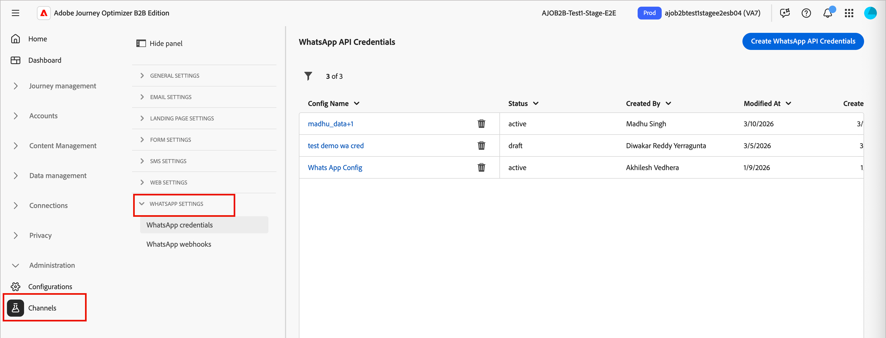
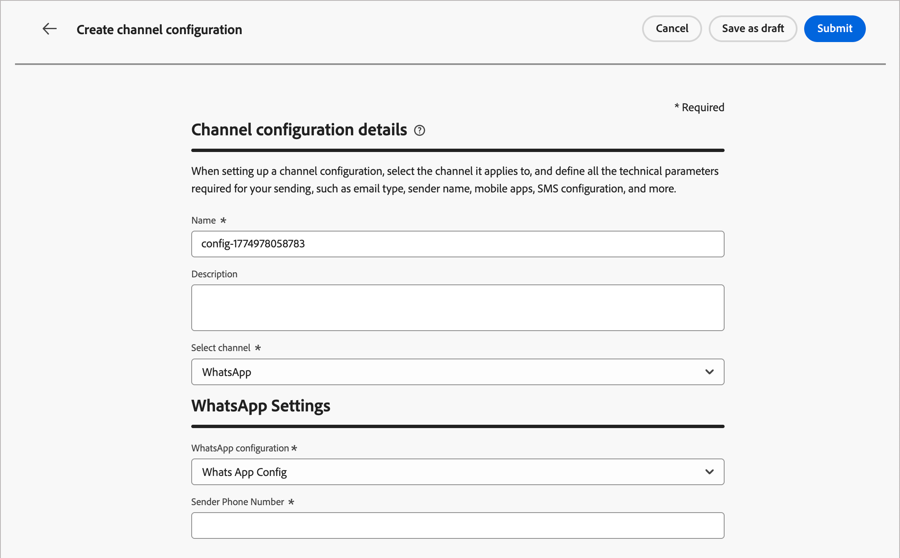

# Configuration du canal WhatsApp

Adobe Journey Optimizer B2B edition envoie des messages WhatsApp par le biais de l’API Meta Cloud. Avant que les professionnels du marketing puissent créer des messages WhatsApp pour les parcours de compte, un administrateur de produit doit configurer un canal WhatsApp.

## Conditions préalables

Avant de configurer le canal WhatsApp, assurez-vous que vous disposez des éléments suivants :

* [Un compte Meta Business Manager](https://business.facebook.com/)
* [Un compte professionnel WhatsApp avec un nom d&#39;expéditeur et un numéro de téléphone vérifiés](https://developers.facebook.com/docs/whatsapp/overview/business-accounts/)
* [Un jeton d’autorisation utilisateur Meta avec les autorisations appropriées](https://developers.facebook.com/blog/post/2022/12/05/auth-tokens/)
* [Modèles de messages approuvés dans votre compte professionnel WhatsApp](https://developers.facebook.com/docs/whatsapp/message-templates/guidelines/)

>[!IMPORTANT]
>
>Votre utilisation des services de messagerie WhatsApp est soumise aux conditions générales de Meta. En accédant aux messages WhatsApp via Journey Optimizer B2B edition, vous reconnaissez avoir vérifié et accepter de vous conformer aux [politiques commerciales de Meta WhatsApp](https://www.whatsapp.com/legal/business-policy/).

## Limites {#limitations}

Les limites suivantes s’appliquent au canal WhatsApp :

* Adobe Journey Optimizer B2B edition n’est **pas conforme à la loi HIPAA et non conforme à la loi HIPAA**. En outre, les fournisseurs tiers ne sont pas couverts par la loi Adobe BAA. Les clientes et les clients sont responsables de leur propre conformité et de la validation de leurs fournisseurs.

* Les messages de réponse automatisés ou prédéfinis ne sont pas encore pris en charge.

* À compter d’avril 2025, Meta a temporairement suspendu la diffusion de tous les modèles de messages marketing aux utilisateurs de WhatsApp qui disposent d’un numéro de téléphone aux États-Unis (un numéro composé d’un indicatif +1 et d’un indicatif régional des États-Unis). [En savoir plus dans la documentation de Meta](https://developers.facebook.com/documentation/business-messaging/whatsapp/templates/marketing-templates/per-user-limits/)

* La fonctionnalité d’intégration native ne permet pas l’intégration de prestataires de services professionnels (BSP) tiers.

## Terminer la configuration du canal

Avant d&#39;envoyer votre message WhatsApp, vous devez configurer votre environnement Journey Optimizer B2B edition et le connecter à votre compte WhatsApp.

Effectuez les tâches suivantes :

1. [Créer les identifiants de l&#39;API WhatsApp](#create-whatsapp-api-credentials)
1. [Ajouter les Webhooks WhatsApp](#configure-webhooks)
1. [Créer la configuration du canal WhatsApp](#create-channel-configuration)

### Créer des informations d’identification d’API WhatsApp

>[!NOTE]
>
>Les paramètres décrits ne sont accessibles que par les utilisateurs et utilisatrices disposant de droits d’administrateur.

1. Dans le volet de navigation de gauche, développez la section **[!UICONTROL Administration]** et cliquez sur **[!UICONTROL Canaux]**.

1. Dans le panneau, développez **[!UICONTROL Paramètres WhatsApp]** et sélectionnez **[!UICONTROL Informations d’identification de l’API]**.

   {width="800" zoomable="yes"}

1. Cliquez sur **[!UICONTROL Créer des informations d’identification d’API]** en haut à droite.

1. Configurez vos informations d’identification dʼAPI comme indiqué ci-dessous :

   * **[!UICONTROL Nom]** - Saisissez un nom unique pour les informations d’identification
   * **[!UICONTROL Jeton API]** - Saisissez votre jeton API. Pour plus d&#39;informations, consultez la documentation de Meta .
   * **[!UICONTROL Identifiant de compte professionnel]** - Saisissez le numéro unique associé à votre portefeuille professionnel. Pour plus d&#39;informations, consultez la documentation de Meta .

   {width="500" zoomable="yes"}

1. Cliquez sur **[!UICONTROL Continuer]**.

1. Choisissez le **[!UICONTROL compte professionnel WhatsApp]** que vous souhaitez connecter à vos identifiants d&#39;API WhatsApp.

   {width="500" zoomable="yes"}

1. Sélectionnez le **[!UICONTROL Nom de l’expéditeur]** à utiliser pour envoyer des messages WhatsApp.

   Les paramètres des numéros de téléphone sont automatiquement renseignés :

   * **Évaluation de la qualité** : reflète les commentaires des clients concernant les messages envoyés au cours des dernières 24 heures.
      * Vert : haute qualité
      * Jaune : qualité moyenne
      * Rouge : faible qualité

     Pour plus d’informations, voir [_Évaluation de la qualité_](https://www.facebook.com/business/help/766346674749731#) dans la documentation de Meta.

   * **Débit** - Indique le taux auquel votre numéro de téléphone peut envoyer des messages.

1. Cliquez sur **[!UICONTROL Envoyer]** lorsque vous avez terminé la configuration de vos informations d’identification d’API.

Lorsque vous cliquez sur _[!UICONTROL Envoyer]_, les informations d’identification sont immédiatement validées et enregistrées, vous redirigeant vers la page de liste _[!UICONTROL Informations d’identification de l’API]_.

Si les informations d’identification envoyées ne sont pas valides, le système affiche un message d’erreur HTTP 500. Dans ce cas, vous pouvez choisir d’annuler la configuration ou de la mettre à jour et de l’envoyer à nouveau.

+++Dépannage des erreurs HTTP 500

Si vous rencontrez une erreur HTTP 500 lors de la configuration des informations d’identification de l’API WhatsApp, suivez ces étapes de dépannage :

1. Vérification des droits Adobe - Vérifiez que le droit _cjm_ whatsapp_ est configuré pour votre organisation. Sans ce droit, le canal WhatsApp ne peut pas être configuré.

1. Validez les champs du compte professionnel - Vérifiez que tous les champs obligatoires sont corrects :

   * Jeton API : doit être un jeton d’accès [Meta valide avec les autorisations appropriées](https://developers.facebook.com/blog/post/2022/12/05/auth-tokens/).
   * Identifiant du compte professionnel - Doit correspondre exactement à votre [identifiant du compte professionnel ](https://www.facebook.com/business/help/1181250022022158?id=180505742745347).

1. Tester les informations d’identification en externe - Vérifiez vos informations d’identification directement avec l’API Meta pour confirmer que le problème concerne bien les informations d’identification ou la gestion des informations d’identification Journey Optimizer B2B edition.

<!-- 1. Enable advanced logging - To identify internal server or authentication misconfigurations, enable advanced logs in your Journey Optimizer B2B Edition environment to provide detailed information about the API call failures. 
do we have advanced logs? How are they enabled?-->

1. Contactez Adobe - Si la validité de l’environnement et des droits est confirmée, mais que l’erreur HTTP 500 persiste, contactez votre représentant Adobe.

+++

### Ajouter les Webhooks WhatsApp {#configure-webhooks}

>[!CONTEXTUALHELP]
>id="ajo_b2b_admin-whatsapp-webhook-inbound-keyword-category"
>title="Catégorie de mots-clés entrants"
>abstract="<b>Opt-in</b> : envoie votre réponse automatique définie lorsqu’un utilisateur ou une utilisatrice s’abonne.  <b>Opt-out</b> : envoie votre réponse automatique définie lorsqu’un utilisateur ou une utilisatrice se désabonne.  <b>Aide</b> : envoie votre réponse automatique définie lorsqu’un utilisateur ou une utilisatrice demande de l’aide ou de l’assistance.  <b>Par défaut</b> : envoie votre réponse automatique de secours lorsqu’aucun mot-clé ne correspond."

>[!CONTEXTUALHELP]
>id="ajo_b2b_admin_whatsapp-webhook-inbound-keyword"
>title="Saisir vos mots-clés"
>abstract="Vous pouvez définir des mots-clés pour déclencher des réponses automatiques spécifiques en fonction du texte des utilisateurs et utilisatrices. Les mots-clés ne sont pas sensibles à la casse (les arrêts et les arrêts sont traités de la même manière)."

>[!CONTEXTUALHELP]
>id="ajo_b2b_admin-whatsapp-webhook-webhook-url"
>title="URL de rappel"
>abstract="La demande de validation et les notifications webhook pour cet objet sont envoyées à l’URL spécifiée."

>[!CONTEXTUALHELP]
>id="ajo_b2b_admin-whatsapp-webhook-verify-token"
>title="Jeton de vérification"
>abstract="Jeton renvoyé par Meta pour confirmer et vérifier l’URL de rappel pendant le processus de vérification."

Les Webhooks permettent à Journey Optimizer B2B edition de recevoir des messages entrants, des réponses de consentement et des notifications de diffusion de votre compte professionnel WhatsApp. Configurez les webhooks pour assurer une gestion adéquate du consentement et du suivi des messages.

>[!NOTE]
>
>Sans des mots-clés d’opt-in ou d’opt-out spécifiés, les messages de consentement standard ne sont pas activés.

Une fois les informations d’identification de l’API WhatsApp créées, vous pouvez configurer les Webhooks.

1. Dans le panneau de navigation, sélectionnez **[!UICONTROL WhatsApp Webhooks]**.

1. Cliquez sur **[!UICONTROL Créer un Webhook]**.

1. Saisissez un **[!UICONTROL Nom]** pour la configuration webhook.

1. Pour **[!UICONTROL Configuration]**, sélectionnez les informations d’identification d’API (créées lors de la tâche précédente) à associer au webhook.

1. Pour la **[!UICONTROL catégorie de mots-clés entrants]**, choisissez une catégorie pour définir les mots-clés et le message de réponse :

   * **[!UICONTROL Opt-in]** - Les utilisateurs doivent activement accepter de recevoir des messages WhatsApp, souvent gérés par le biais de formulaires sur votre site Web ou application.
   * **[!UICONTROL Opt-out]** - Configurez votre webhook pour écouter des expressions telles que `Stop` ou `No Message` afin de marquer automatiquement les utilisateurs comme exclus.
   * **[!UICONTROL Aide]** - Autorisez les systèmes automatisés à détecter lorsqu’un utilisateur envoie des `HELP` (ou des mots-clés similaires tels que `Unknown`) et à répondre automatiquement avec des informations spécifiques, telles que des instructions de service.
   * **[!UICONTROL Par défaut]** - Gérer les messages entrants qui ne correspondent pas à des mots-clés définis spécifiquement. Il sert de catégorie de secours pour activer le suivi des événements (tels que les rapports d’ouverture et de diffusion) dans les jeux de données Adobe Experience Platform.

   Lorsque vous sélectionnez la catégorie de mots-clés, les mots-clés par défaut sont renseignés.

1. Pour **[!UICONTROL Saisir un mot-clé]**, vous pouvez saisir un mot-clé personnalisé et cliquer sur _Ajouter_ ( **+** ).

   Vous pouvez ajouter plusieurs mots-clés par catégorie.

   >[!NOTE]
   >
   >Les mots-clés ne sont pas sensibles à la casse (`stop` et `STOP` sont traités de la même manière).

1. Saisissez le **[!UICONTROL Message de réponse]** à envoyer automatiquement lorsqu&#39;un message reçu correspond à un mot-clé de cette catégorie.

   {width="500" zoomable="yes"}

1. Pour chaque catégorie de mots-clés supplémentaire que vous souhaitez configurer, cliquez sur _Ajouter_ (**+**) dans le coin supérieur droit et répétez les étapes 5 à 7.

1. Cliquez sur **[!UICONTROL Envoyer]** pour enregistrer la configuration du webhook.

### Copiez le jeton et l’URL

Une fois le webhook envoyé, vous pouvez récupérer les valeurs du jeton et de l’URL, puis l’enregistrer dans Meta.

1. Dans la liste **[!UICONTROL WhatsApp Webhooks]**, cliquez sur l’icône d’édition (  ) correspondant au webhook que vous avez créé.

1. Copiez les valeurs **[!UICONTROL Jeton de vérification]** et **[!UICONTROL URL Webhook]**.

   {width="500" zoomable="yes"}

1. Dans le portail [Meta pour les développeurs](https://developers.facebook.com/), accédez aux paramètres de votre application WhatsApp et configurez le webhook à l’aide des valeurs que vous avez copiées.

### Créer une configuration de canal {#create-channel-configuration}

Une configuration de canal définit les paramètres de diffusion utilisés lors de l’envoi de messages WhatsApp à partir d’un nœud d’action de parcours.

1. Dans le panneau de navigation, sous _[!UICONTROL Paramètres généraux]_, sélectionnez **[!UICONTROL Configurations de canal]**.

   {width="600" zoomable="yes"}

1. Cliquez sur **[!UICONTROL Créer une configuration de canal]** en haut à droite.

1. Saisissez un **[!UICONTROL Nom]** et un **[!UICONTROL Description]** (facultatif) pour la configuration.

   >[!NOTE]
   >
   >Le nom doit commencer par une lettre (A-Z) et ne peut contenir que des caractères alphanumériques, des traits de soulignement (`_`), des points (`.`) et des tirets (`-`).

1. Pour **[!UICONTROL Sélectionner le canal]**, choisissez `WhatsApp`.

   <!-- 1. For **[!UICONTROL Marketing action]**, select one or more marketing actions to associate consent policies with this configuration. -->

   <!-- Make sure to include all applicable marketing actions to ensure compliance with customer preferences. -->

   <!-- All consent policies associated with a selected marketing action are automatically leveraged in order to respect the preferences of your customers. For example, any WhatsApp message using that configuration in a journey is only sent to the profiles who have consented to receive WhatsApp messages from you. Profiles who have not consented to receive these communications are excluded. -->

1. Sous _[!UICONTROL Paramètres WhatsApp]_, sélectionnez la **[!UICONTROL Configuration WhatsApp]** (informations d’identification de l’API) que vous avez créée lors de la tâche précédente.

1. Saisissez le **[!UICONTROL numéro de téléphone de l’expéditeur]** à utiliser pour la diffusion du message.

   {width="500" zoomable="yes"}

1. (Ne s’applique actuellement pas à Journey Optimizer B2B edition) Pour le **[!UICONTROL champ d’exécution WhatsApp]**, sélectionnez l’attribut de profil à utiliser comme numéro de téléphone prioritaire lorsque plusieurs numéros de téléphone sont disponibles pour un destinataire.

1. Cliquez sur **[!UICONTROL Envoyer]** pour enregistrer, ou **[!UICONTROL Enregistrer en tant que brouillon]** pour terminer et envoyer la configuration ultérieurement.

La configuration s’affiche initialement avec un statut _Traitement_ pendant l’exécution des contrôles de validation. Lorsque toutes les vérifications réussissent, le statut passe à **_Actif_** et la configuration est prête à être sélectionnée lorsque les spécialistes marketing créent des messages WhatsApp dans des actions de parcours.
