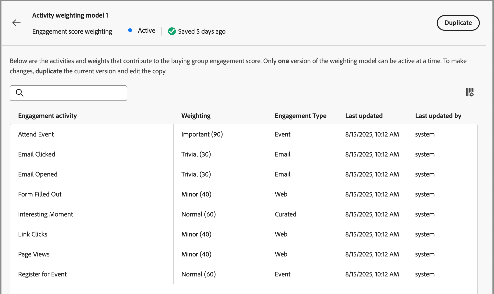

# Configurer la pondération du score d’engagement personnalisé

Un [score d&#39;engagement du groupe d&#39;achat](../buying-groups/engagement-scores.md) reflète le niveau d&#39;engagement en évaluant diverses activités enregistrées pour les membres du groupe d&#39;achat. Grâce à la pondération de score personnalisée, les équipes opérationnelles marketing ont la possibilité de définir leurs propres modèles de pondération des activités. Un modèle de notation personnalisé donne une image plus précise de votre pipeline en priorisant les comportements qui signalent le plus précisément l’intention d’achat dans votre processus de vente.

En tant qu’administrateur ou administratrice, vous pouvez définir plusieurs modèles de score d’engagement pour votre organisation, mais un seul modèle peut être actif à la fois. Vous définissez un modèle de score en fonction du poids appliqué à chaque activité de score d’engagement.

>[!PREREQUISITES]
>
>Pour définir et activer un modèle de pondération de score d’engagement, vous devez disposer de l’autorisation _[!UICONTROL Gérer les configurations d’administration B2B]_ [produit](./user-management.md#b2b-product-permissions).

## Accéder aux modèles de pondération de score de l’engagement

Ouvrez la liste _[!UICONTROL pondération du score de l’engagement]_ pour afficher les modèles actifs, brouillons et archivés :

1. Dans le volet de navigation de gauche, choisissez **[!UICONTROL Administration]** > **[!UICONTROL Configurations]**.

1. Cliquez sur **[!UICONTROL Pondération de score de l’engagement]** dans le panneau intermédiaire pour afficher la liste des modèles de score.

   À partir de cette page, vous pouvez [créer (dupliquer)](#create-an-engagement-score-model), [activer](#activate-a-score-model) et [modifier](#change-the-engagement-weighting-settings) des modèles de score d’engagement.

   {width="800" zoomable="yes"}

   La liste affiche les modèles les plus récemment mis à jour en haut de l’écran (triés par _[!UICONTROL Dernière mise à jour]_) et permet de rechercher par _[!UICONTROL Nom]_.

   Vous pouvez personnaliser le tableau affiché en cliquant sur l’icône _Paramètres des colonnes_ (  ) dans le coin supérieur droit, puis en cochant ou décochant les cases des colonnes.

   {width="300"}

1. Pour accéder aux détails d’un modèle de score d’engagement, cliquez sur le nom.

### Modèle de score par défaut

Le système crée un modèle de score d’engagement initial nommé _modèle de pondération des activités 1_. Le statut du modèle et les activités d’engagement dépendent de l’architecture des données de votre environnement de [!DNL Journey Optimizer B2B Edition] :

* **Architecture simplifiée** (Beta) - Si votre environnement utilise l’[architecture simplifiée](../simplified-architecture.md), les activités d’engagement sont basées sur des événements Experience Platform standard et personnalisés. Le poids de toutes les activités est de 0 par défaut.

  {width="600" zoomable="yes"}

* **Architecture standard** - Si votre environnement utilise l’architecture standard, l’instance [!DNL Marketo Engage] connectée est la source des données d’activité d’engagement. Le modèle par défaut est actif jusqu’à ce que vous créiez une version personnalisée et l’activiez.

  {width="600" zoomable="yes"}

Lorsque vous activez un modèle personnalisé, le modèle actif passe à un statut _Archivé_. Si vous décidez de revenir au modèle de score d’engagement par défaut, vous pouvez dupliquer le modèle par défaut d’origine, puis l’activer ou l’utiliser comme point de départ pour un autre modèle personnalisé.

### Supprimer un modèle de brouillon

Vous pouvez supprimer un modèle de score d’engagement provisoire si vous décidez de ne plus l’activer par la suite. Cliquez sur l’icône _Plus de menu_ (***...***) en regard du nom du modèle de score du brouillon dans la liste, puis choisissez **[!UICONTROL Supprimer]**.

{width="350"}

Dans la boîte de dialogue de confirmation, cliquez sur **[!UICONTROL Supprimer]**.

## Créer un modèle de notation d’engagement personnalisé

Pour créer un modèle de score d’engagement personnalisé, dupliquez le modèle par défaut ou un autre modèle personnalisé déjà créé. Vous pouvez dupliquer le modèle _actif_ actuel, un modèle _Brouillon_ ou un modèle _archivé_. Modifiez ensuite le modèle en double en fonction de vos besoins.

1. Cliquez sur le nom du modèle pour ouvrir la page des détails du modèle, puis cliquez sur **[!UICONTROL Dupliquer]** en haut à droite.

   {width="600" zoomable="yes"}

   Vous pouvez également cliquer sur l’icône _Plus_ (***...***) en regard du nom du modèle de score dans la liste et choisir **[!UICONTROL Dupliquer]**.

   {width="325"}

1. Dans la boîte de dialogue _Dupliquer_, saisissez un nom unique pour le modèle dupliqué et cliquez sur **[!UICONTROL Dupliquer]**.

   {width="500"}

   Le modèle dupliqué s’affiche dans la liste avec un statut _Brouillon_. Cliquez sur le nom pour ouvrir les détails du modèle de score et apporter vos modifications.

### Modifier les paramètres de pondération de l’engagement

Les paramètres de poids définissent les bandes que vous pouvez affecter à chaque activité du modèle. Vous pouvez modifier les bandes pour refléter les stratégies de votre organisation pour évaluer l’engagement. Par exemple, vous pouvez ajuster la plage de pondération _Normale_ à une valeur de 65 si vous souhaitez attribuer une valeur plus élevée aux activités normales. Vous pouvez également ajouter une bande de pondération conçue pour capturer les activités comprises entre _Normale_ et _Importante_. Dans ce cas, vous pouvez ajouter une bande et l’étiqueter comme _Significatif_ et attribuer une valeur de bande de poids de 75.

1. Dans la page des détails du modèle de score, cliquez sur **[!UICONTROL Paramètres de poids de l’engagement]** dans la partie supérieure.

   {width="600" zoomable="yes"}

1. Pour chaque plage de poids, ajustez le nom ou les valeurs en fonction de vos besoins :

   * Modifiez le nom dans le champ _[!UICONTROL Bande de pondération]_.
   * Saisissez une nouvelle valeur. Vous pouvez également cliquer sur **&plus;** ou **−** pour augmenter ou diminuer la valeur.

   {width="500"}

1. Si nécessaire, ajouter une autre plage de pondération :

   Cliquez sur **[!UICONTROL + Ajouter une bande de pondération]** au bas de la liste. Cette action insère une bande de pondération vide en bas de la liste.

   Saisissez le nom et définissez la valeur de la bande. Veillez à utiliser un nom et une valeur uniques.

1. Pour supprimer une bande de pondération, cliquez sur l’icône _Supprimer_ (  ) pour la ligne de bande de pondération.

1. Une fois vos modifications effectuées, cliquez sur **[!UICONTROL Enregistrer]**.

### Modifier la pondération de l&#39;activité

Chaque modèle de score comprend la liste complète des activités de score d’engagement prises en charge.

+++Activités pour une architecture simplifiée

Le modèle par défaut de l’architecture simplifiée inclut les activités suivies par Experience Platform. Chaque activité a un poids nul (0) (non utilisé) jusqu’à ce que vous lui attribuiez un poids. Toutes les activités ont également une fréquence quotidienne maximale de 20, ce que vous ne pouvez pas modifier.

<table style="table-layout: fixed; width: 100%; border: 0;">
<tbody>
<tr style="border: 0;">
<td>
<ul><li>Clics Advertising </li><li>Advertising Completes </li><li>Conversions Advertising </li><li>Advertising Federated </li><li>Advertising - Premiers Quartiles </li><li>Advertising Impressions </li><li>Midpoints Advertising </li><li>Advertising démarre </li><li>Quartiles tiers d’Advertising </li><li>Durée de lecture Advertising </li><li>Fermeture de l'application </li><li>Lancement de l’application </li><li>Modifier le rythme de la campagne d’engagement </li><li>Avoir Commerce Backoffice émis </li><li>Commerce Backoffice Order Cancelled </li><li>Commerce Backoffice Order Placed </li><li>Commerce Backoffice OrderItems Shipped </li><li>Expédition du back-office Commerce terminée </li><li>Passages en caisse Commerce </li><li>Ajouts dans la liste de produits Commerce (panier) </li><li>Ouverture de la liste de produits Commerce (panier) </li><li>Retraits de la liste de produits Commerce (panier) </li><li>Réouvertures de la liste de produits Commerce (panier) </li><li>Vues de la liste de produits Commerce (panier) </li><li>Consultations de produits Commerce </li><li>Commerce Purchases </li><li>Enregistrement Commerce Pour Plus Tard </li><li>Ignorer la proposition de prise de décision </li><li>Affichage de la proposition de prise de décision </li><li>Interaction de la proposition de prise de décision </li></ul>
</td>
<td>
<ul><li>Envoi de la proposition de prise de décision </li><li>Déclencheur de proposition de prise de décision </li><li>Retour d’informations de diffusion </li><li>E-mail de marketing direct non remis </li><li>E-mail de marketing direct non remis en erreur - Soft </li><li>E-mail de marketing direct sur lequel l’utilisateur a cliqué </li><li>E-Mail De Marketing Direct Diffusé </li><li>E-mail de marketing direct ouvert </li><li>E-mail de marketing direct envoyé </li><li>Désabonnement des e-mails de marketing direct </li><li>Message in-app ignoré </li><li>Le message in-app était affiché </li><li>Le message in-app a fait l’objet d’une interaction </li><li>Ajout D’Opération De Lead À La Campagne </li><li>Webhook D’Appel D’Opération De Lead </li><li>Flux de campagne de modification de l’opération de lead </li><li>Opération de lead Convertir le lead </li><li>Moment intéressant de l’opération de lead </li><li>Opération de lead - Fusionner les leads </li><li>Opération de lead Nouveau lead </li><li>Étape de revenu d’opération de lead modifiée </li><li>Score d’opération de lead modifié </li><li>Statut de l’opération de lead modifié dans la progression de la campagne </li></ul>
</td>
<td>
<ul><li>Ajout De L’Opération De Lead À La Liste </li><li>Opération De Lead Supprimée De La Liste </li><li>Sortie de l’emplacement </li><li>adBreakComplete du média </li><li>Media adBreakStart </li><li>Media adComplete </li><li>Media adSkip </li><li>Media adStart </li><li>Modification du débit multimédia </li><li>Début de la mémoire tampon du média </li><li>Chapitre du média terminé </li><li>Chapitre de média ignoré </li><li>Début du chapitre du média </li><li>Suivi personnalisé des médias </li><li>Contenu multimédia téléchargé </li><li>Erreur de média </li><li>Media pauseStart </li><li>Ping du média </li><li>Media Play (Lecture du fichier multimédia) </li><li>Session multimédia terminée </li><li>Fin de session du média </li><li>Media sessionStart </li><li>Mise à jour des états du média </li><li>Retour d’informations du message </li><li>Données de rendu du message </li><li>Suivi des messages </li><li>Ajout D’Événement D’Opportunité À L’Opportunité </li><li>Opportunité d’événement d’opportunité mise à jour </li><li>Événement d’opportunité supprimé de l’opportunité </li><li>Application de suivi des notifications push ouverte </li><li>Action personnalisée de suivi des notifications push </li><li>Formulaire Web Rempli </li><li>Clics sur les liens d’interaction web </li><li>Pages Web Détaillées Vues</li></ul>
</td>
</tbody>
</table>

+++

+++Activités pour l’architecture standard

Le modèle par défaut de l’architecture standard inclut les activités suivies par [!DNL Marketo Engage] avec un poids par défaut associé. Lorsque vous dupliquez ce modèle, vous pouvez modifier la pondération en fonction de vos besoins. Vous ne pouvez pas modifier la fréquence quotidienne maximale.

{{engagement-activities-me}}

+++

Pour chaque activité de la liste, définissez la valeur à affecter à chaque occurrence de l’activité. Cliquez sur la flèche vers le bas dans le champ **[!UICONTROL Pondération]** et choisissez la bande de pondération telle que définie dans les paramètres de pondération d&#39;engagement.

{width="600" zoomable="yes"}

Si vous ne souhaitez pas que le calcul du score de l&#39;engagement utilise une activité, définissez la pondération sur une valeur nulle (0).

Vos modifications sont enregistrées automatiquement.

## Activer un modèle de score

Lorsque vous activez un modèle de score de brouillon, il remplace le modèle actif. Le modèle actuellement actif est automatiquement archivé.

1. Ouvrez un modèle de score de brouillon pour afficher la page de détails.

1. Cliquez sur **[!UICONTROL Activer]**.

1. Dans la boîte de dialogue de confirmation, cliquez sur **[!UICONTROL Activer]**.

   {width="400"}
