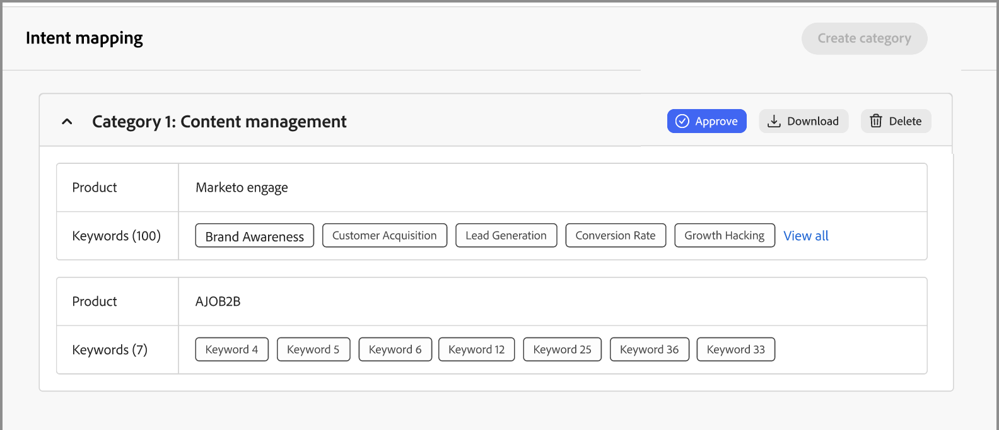

# Données d’intention

Dans Journey Optimizer B2B edition, le modèle de détection des intentions prédit une solution/un produit ciblé avec un degré de confiance suffisamment élevé en fonction de l’activité du prospect. Il tire également parti des activités des autres membres du compte, ainsi que du contenu balisé. L’intention d’une personne peut être interprétée comme la probabilité d’avoir un intérêt dans un produit.

* Niveaux d’intention - Disponibles au niveau du prospect, du compte et du groupe d’achat connus.
* Types de signal d’intention : mots-clés, produit et solution

Les données d’intention sont utilisées dans les [_Tableau de bord intelligent_](../dashboards/intelligent-dashboard.md), [_Détails du compte_ page](../accounts/account-details.md), [_Détails du groupe d’achat_ page](../buying-groups/buying-group-details.md) et [_Détails de la personne_ page](../accounts/person-details.md).

{width="700" zoomable="yes"}

## Préparation des données de mappage d’intention

Pour activer cette fonction, créez une feuille de calcul, telle qu’un fichier Microsoft Excel, à l’aide des onglets pour définir la taxonomie d’intention. La feuille de calcul entière est chargée en tant que catégorie pouvant comporter plusieurs produits, et chaque produit peut avoir plusieurs mots-clés. Utilisez les définitions suivantes pour votre feuille de calcul de mappage d’intention pour chaque catégorie à définir :

* Nom de la feuille de calcul = _Nom de la catégorie_
* Chaque onglet = le nom de votre produit.
* Chaque onglet comprend une colonne = mots-clés de produit (150 maximum).

Vous pouvez télécharger un fichier Excel à utiliser comme modèle pour préparer vos données de mappage. Pour télécharger le modèle :

1. Dans le volet de navigation de gauche, choisissez **[!UICONTROL Administration]** > **[!UICONTROL Configuration]**.

1. Cliquez sur **[!UICONTROL Mappage d’intention]** dans le panneau intermédiaire.

1. Cliquez sur **[!UICONTROL Créer une catégorie]**.

1. Dans la boîte de dialogue, cliquez sur le lien **[!UICONTROL Télécharger le modèle de fichier]**.

   {width="500"}

1. Cliquez sur **[!UICONTROL Annuler]**.

   Vous pouvez revenir pour charger le fichier préparé une fois l’opération terminée.

1. Utilisez le modèle pour définir les données de mappage d’intention :

   * Renommez le fichier pour refléter le nom de votre catégorie, par exemple _Personalization à grande échelle_.
   * Renommez chaque onglet en fonction de vos noms de produit, par exemple _Journey Optimizer B2B_, _Marketo Engage_ et _Experience Manager_.
   * Ajoutez les mots-clés de produit pour chaque onglet, tels que _Marketing B2B_, _Reconnaissance de marque_ et _Engagement du prospect_.

   {width="600" zoomable="yes"}

## Chargement d’un fichier de catégorie

Lorsque votre feuille de calcul est prête, revenez à la page de configuration _[!UICONTROL Mappage d’intention]_ et chargez le fichier.

1. Cliquez sur **[!UICONTROL Créer une catégorie]**.

1. Effectuez un glisser-déposer du fichier dans la boîte de dialogue _[!UICONTROL Télécharger les fichiers]_ ou cliquez sur **[!UICONTROL Sélectionner un fichier]** pour localiser et sélectionner le fichier sur votre système.

1. Cliquez sur **[!UICONTROL Suivant]**.

   Le pré-traitement s’exécute pour regrouper des mots-clés similaires, ce qui améliore la détection d’intention et évite la dilution des mots-clés. Une notification impulsionnelle est affichée dès que ce pré-traitement est terminé (jusqu’à 15 minutes, selon les données).

   {width="500"}

   Le résultat s’affiche sur la page _Mappage d’intention_.

   {width="600" zoomable="yes"}

## Valider ou refuser la catégorie

Vérifiez la liste des catégories et cliquez sur **[!UICONTROL Approuver]** pour activer les mots-clés à utiliser dans le tableau de bord intelligent, les pages Détails du compte, Détails du groupe d’achats et Détails de la personne. Cliquez sur **[!UICONTROL Afficher tout]** pour afficher la liste complète de chaque produit, ou cliquez sur **[!UICONTROL Télécharger]** pour consulter la liste complète sous la forme d’un fichier Excel.

Si la liste ne vous convient pas, vous pouvez cliquer sur **[!UICONTROL Supprimer]** pour supprimer la catégorie. Vous pouvez ensuite apporter des ajustements à votre fichier de feuille de calcul avant de relancer le processus de chargement pour définir cette catégorie.

>[!IMPORTANT]
>
>Vous devez approuver ou rejeter (supprimer) la nouvelle catégorie avant de pouvoir ajouter une autre catégorie ou modifier une catégorie.

Si vous ajoutez une autre catégorie et que sa taxonomie a un impact sur une catégorie existante, un avertissement s’affiche. Tenez compte de cet impact lorsque vous décidez d’approuver ou de rejeter la catégorie. Le mappage produit-mot clé doit être le même pour toutes les catégories si le produit est utilisé dans plusieurs catégories.

{width="600" zoomable="yes"}
