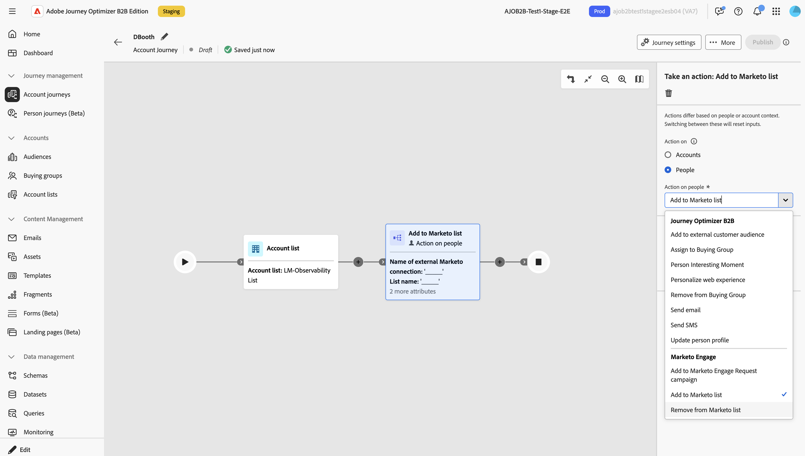

# Activer les connexions Marketo Engage pour prendre en charge les actions

Les actions Marketo Engage sont des actions _basées sur les personnes_ qui vous permettent de coordonner votre orchestration marketing _basée sur les comptes_ entre Journey Optimizer B2B edition et vos efforts marketing _basés sur les prospects_ dans Marketo Engage. Utilisez ces actions pour orchestrer l’appartenance à une liste statique et pour placer des personnes dans des campagnes.

Pour utiliser les actions de parcours Marketo Engage, un administrateur doit d’abord créer un [service personnalisé](https://experienceleague.adobe.com/en/docs/marketo-developer/marketo/rest/custom-services){target="_blank"} dans Marketo Engage, qui fournit les informations d’identification nécessaires à l’authentification. Ensuite, un administrateur de produit pour Journey Optimizer B2B edition utilise les informations d’identification pour créer une connexion à Marketo Engage. Les utilisateurs de Journey Optimizer B2B edition peuvent ensuite référencer la connexion pour configurer les actions Marketo Engage en personne et sur les parcours de compte :

* [!UICONTROL Ajouter à la liste Marketo]
* [!UICONTROL Supprimer de la liste Marketo]
* [!UICONTROL Ajouter à la campagne de requêtes Marketo]

## Configurer une connexion Marketo Engage {#external-marketo-configure}

>[!CONTEXTUALHELP]
>id="ajo-b2b_marketo-configure-connections"
>title="Connexions Marketo Engage externes"
>abstract="Les administrateurs et administratrices de produit peuvent configurer les connexions aux instances Marketo Engage externes, ce qui les rend disponibles pour les actions de parcours."

Pour configurer une instance Marketo Engage externe à utiliser avec des actions de parcours, effectuez les tâches suivantes.

### Création du service personnalisé Marketo Engage

1. Connectez-vous à Marketo Engage en tant qu’administrateur et [créez un service personnalisé](https://experienceleague.adobe.com/en/docs/marketo/using/product-docs/administration/additional-integrations/create-a-custom-service-for-use-with-rest-api){target="_blank"}.
1. Copiez les valeurs suivantes à utiliser pour la connexion Journey Optimizer B2B edition :

   * ID Munchkin
   * Identifiant client
   * Secret client

Les [autorisations de rôle attribuées dans le service personnalisé](https://experienceleague.adobe.com/en/docs/marketo-developer/marketo/rest/custom-services#permission-list){target="_blank"} régissent la visibilité de l’espace de travail Marketo Engage pour les ressources, telles que les listes et les campagnes. Les marketeurs peuvent utiliser la même connexion plusieurs fois au sein d’un parcours et utiliser différentes connexions Marketo Engage dans le même parcours.

### Ajouter l’intégration

{width="800" zoomable="yes"}

1. Dans Journey Optimizer B2B edition, accédez à **[!UICONTROL Administration]** > **[!UICONTROL Configurations]**.
1. Sélectionnez l’onglet **[!UICONTROL Intégrations]**.
1. Cliquez sur **[!UICONTROL Créer une connexion]**.
1. Saisissez un **[!UICONTROL Nom]** (obligatoire) et un **[!UICONTROL Description]** (facultatif).
1. Sélectionnez la politique de mise à jour utilisée pour appliquer une action à un enregistrement de personne correspondant.

   Lorsqu’une action s’exécute pour l’instance Marketo Engage connectée, la _politique de mise à jour_ sélectionnée détermine les enregistrements de personne dans Marketo Engage pour déterminer s’il existe plusieurs identifiants dans le profil de personne unifié.

   * **[!UICONTROL Mettre à jour tous les enregistrements correspondants]**
   * **[!UICONTROL Mettre à jour uniquement le plus ancien enregistrement correspondant]**
   * **[!UICONTROL Mettre à jour uniquement le dernier enregistrement correspondant]**

   >[!NOTE]
   >
   >Une personne/un prospect passe par le parcours quelle que soit la correspondance, sauf en cas d’erreur. Une action de parcours ne crée pas d’enregistrement de nouvelle personne dans Marketo Engage lorsqu’il n’existe pas d’enregistrement correspondant.

1. Saisissez l’ID Munchkin, l’ID client et le secret client pour le service créé dans l’instance Marketo Engage externe.
1. Cliquez sur **[!UICONTROL Connexion à Marketo]**.
1. Cliquez sur **[!UICONTROL Créer]**.

## Utiliser la connexion dans une action de parcours

Lorsqu’un spécialiste marketing utilise une action Marketo Engage dans un parcours, il peut configurer le nœud à l’aide du nom de la connexion.

>[!NOTE]
>
>Les actions Marketo Engage exécutées à partir d’un parcours ne s’appliquent pas aux limites de l’API REST pour l’instance Marketo Engage connectée.

Une fois l’intégration terminée, les actions Marketo Engage sont disponibles à partir de **_Actions sur:_** dans les propriétés de nœud.

{width="800" zoomable="yes"}
