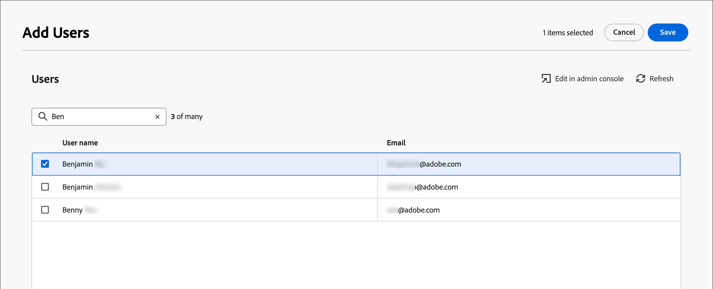

# Gestion des utilisateurs et utilisatrices

Une fois la mise en service terminée et les sandbox liés, procédez comme suit pour fournir un accès Adobe Journey Optimizer B2B edition à votre équipe et aux utilisateurs.

1. [Création d’un profil de produit Marketo Engage](#marketo-engage-profile) dans Admin Console (nouvelle instance Marketo Engage uniquement).
1. [Création d’un groupe d’utilisateurs](#create-user-group) dans Admin Console.
1. [Modifiez les rôles intégrés](#edit-roles) ou [créez un rôle personnalisé](#create-a-custom-role) avec les autorisations Journey Optimizer B2B edition.
1. [Ajoutez des utilisateurs](#add-users) des utilisatrices ou des [groupes](#add-user-groups-to-a-role) aux rôles.

En tant qu’administrateur, vous pouvez effectuer ces tâches dans le Adobe Admin Console, qui constitue un emplacement central pour administrer et gérer vos licences de produit et utilisateurs Adobe. Dans Admin Console, vous pouvez créer et gérer des utilisateurs à un seul emplacement plutôt qu’au sein de vos différentes solutions individuelles. Reportez-vous à la page [Présentation d’Admin Console](https://helpx.adobe.com/fr/enterprise/using/admin-console.html) pour en savoir plus sur ses fonctions et fonctionnalités.

## Accès à Admin Console

Avant de pouvoir utiliser Admin Console pour administrer les utilisateurs au sein de votre équipe, vous devez vous assurer que vous pouvez accéder à Admin Console et que vous disposez des autorisations appropriées.

1. En tant qu’administrateur système, vous devriez recevoir plusieurs e-mails d’Adobe dans le cadre du processus d’intégration.

   Recherchez l’e-mail de bienvenue qui fournit les informations sur le nom de l’organisation auquel vous avez accès.

1. Cliquez sur le lien **[!UICONTROL Commencer]** dans l’e-mail de bienvenue pour accéder à Admin Console.

   Si vous ne retrouvez pas l’e-mail en question, ouvrez un navigateur directement sur Admin Console à l’adresse [https://adminconsole.adobe.com](https://adminconsole.adobe.com).

1. Connectez-vous à l’aide de votre Adobe ID.

   Une fois la connexion établie, la page _Aperçu_ du Adobe Admin Console s’affiche.

1. Si vous avez accès à plusieurs organisations, vérifiez que vous vous êtes connecté à la bonne organisation.

   Pour modifier votre organisation, cliquez sur le nom de l’organisation dans le coin supérieur droit et sélectionnez l’organisation à laquelle vous avez besoin d’accéder.

1. Sélectionnez **[!UICONTROL Administrateurs]** dans la vignette _[!UICONTROL Utilisateurs]_ pour vérifier que vous êtes bien administrateur système.

   {width="700" zoomable="yes"}

1. Recherchez en saisissant votre adresse e-mail, votre nom d’utilisateur, votre prénom ou votre nom Adobe ID.

   * Si votre accès est correctement configuré, la recherche renvoie votre enregistrement.

   * Si la valeur de la colonne **[!UICONTROL RÔLE D’ADMINISTRATEUR]** s’affiche `System`, vous savez que vous (ou l’utilisateur affiché) êtes un administrateur ou une administratrice système.

## Création du profil de produit Marketo Engage {#marketo-engage-profile}

Lorsque vous accordez aux utilisateurs l’accès à une solution Adobe, vous ne souhaitez pas nécessairement leur accorder un accès complet. Les profils de produit permettent à chaque solution d’avoir son propre jeu d’autorisations utilisateur. Utilisez Admin Console pour attribuer des profils de produit.

Pour plus d’informations sur l’utilisation des profils de produit pour les droits des utilisateurs, voir [Gérer les profils de produit pour les utilisateurs d’entreprise](https://helpx.adobe.com/fr/enterprise/using/manage-product-profiles.html){target="_blank"} dans la documentation d’Admin Console.
<!--
>[!BEGINSHADEBOX]

When you add a user to the Marketo Engage product profile, they are subsequently added to the _Standard User_ role within the Default workspace of the Marketo Engage subscription. This role grants them all _Standard User_ permissions for Marketo Engage in that workspace. Currently, all Journey Optimizer B2B Edition users are required to be Marketo Engage users. A Marketo Engage administrator can restrict access by updating the permissions for the _Standard User_ role or by moving the user to a different Marketo Engage user role with more restrictive permissions.

For more information about managing these permissions within Marketo Engage, see [Managing User Roles and Permissions](https://experienceleague.adobe.com/fr/docs/marketo/using/product-docs/administration/users-and-roles/managing-user-roles-and-permissions){target="_blank"} in the Marketo Engage documentation.

>[!ENDSHADEBOX]-->

{width="30"} Un administrateur système ou un administrateur de produit Marketo Engage peut effectuer les étapes suivantes.

1. Connectez-vous à [https://adminconsole.adobe.com](https://adminconsole.adobe.com).

1. Sélectionnez l’onglet **[!UICONTROL Produits]**.

1. Ouvrez l’instance Marketo Engage à laquelle vous souhaitez ajouter le profil et cliquez sur **[!UICONTROL Nouveau profil]**.

   {width="700" zoomable="yes"}

1. Saisissez un nom de profil de produit, tel que _Utilisateur standard_.

1. Cliquez sur **Suivant** puis sur **Enregistrer**.

## Création d’un groupe d’utilisateurs {#create-user-group}

Un groupe d’utilisateurs est un ensemble d’utilisateurs auxquels est accordé un ensemble partagé d’autorisations. Vous pouvez ajouter ou supprimer des utilisateurs dans votre groupe d’utilisateurs. Les autorisations de groupe restent les mêmes tandis que les utilisateurs du groupe changent.

Pour plus d’informations sur l’utilisation des groupes d’utilisateurs pour gérer les autorisations, voir [Gérer les groupes d’utilisateurs](https://helpx.adobe.com/fr/enterprise/using/user-groups.html){target="_blank"} dans la documentation d’Admin Console.

{width="30"} Un administrateur système peut effectuer les étapes suivantes.

1. Connectez-vous à [https://adminconsole.adobe.com](https://adminconsole.adobe.com).

1. Sélectionnez l’onglet **[!UICONTROL Utilisateurs]**.

1. Sélectionnez **[!UICONTROL Groupes d’utilisateurs]** dans le volet de navigation de gauche.

1. Cliquez sur **[!UICONTROL Nouveau groupe d’utilisateurs]** en haut à droite.

1. Saisissez le nom du groupe d’utilisateurs, par exemple _Utilisateurs standard_ et cliquez sur **[!UICONTROL Enregistrer]**.

1. Cliquez sur le groupe d’utilisateurs que vous venez de créer.

1. Sélectionnez l’onglet **[!UICONTROL Profils de produit attribués]** et cliquez sur **[!UICONTROL Attribuer un profil]**.

1. Cliquez sur **+** et ajoutez chaque instance des produits suivants :

   * [!UICONTROL Marketo Engage]
   * [!UICONTROL Adobe Experience Platform - AEP-Default-All-Users]
   * [!UICONTROL Collecte de données dʼAdobe Experience Platform]
   * [!UICONTROL Accès complet à la collecte de données]

   {width="700" zoomable="yes"}

1. Cliquez sur **[!UICONTROL Enregistrer]**.

## Ajout d’utilisateurs à un groupe

Pour plus d’informations sur la gestion des utilisateurs, voir [Utilisateurs Admin Console](https://helpx.adobe.com/fr/enterprise/using/user-groups.html) dans la documentation d’Admin Console.

{width="30"} Un administrateur système ou un administrateur de produit peut effectuer les étapes suivantes. Un administrateur ou une administratrice de produit ne peut ajouter que des utilisateurs et utilisatrices qui existent déjà dans son organisation.

1. Accédez à [https://adminconsole.adobe.com](https://adminconsole.adobe.com).

1. Sous _[!UICONTROL Liens rapides]_, cliquez sur **[!UICONTROL Ajouter des utilisateurs]**.

1. Ajoutez chaque utilisateur :

   * Saisissez l’adresse e-mail, le prénom et le nom de l’utilisateur.

     {width="600" zoomable="yes"}

   * Pour **[!UICONTROL Groupes d’utilisateurs]**, cliquez sur **+**.

   * Sélectionnez le groupe d’utilisateurs que vous avez créé précédemment.

   * Cliquez sur **[!UICONTROL Appliquer]**.

1. Cliquez sur **[!UICONTROL Enregistrer]**.

## Modifier les rôles pour les autorisations de produit {#edit-roles}

Les autorisations sont des droits unitaires qui vous permettent de définir les autorisations attribuées à un profil de produit. Chaque autorisation est regroupée sous une fonctionnalité, telle que parcours ou groupes d’achats, qui représente les différentes fonctionnalités ou objets dans Journey Optimizer B2B edition.

La zone _Autorisations_ de Adobe Experience Platform permet aux administrateurs de définir des rôles d’utilisateur et des politiques d’accès afin de gérer les autorisations d’accès aux fonctionnalités et objets d’une application de produit. Dans cette application, vous pouvez créer et gérer des rôles, ainsi qu’attribuer les autorisations de ressources souhaitées pour ces rôles. Les autorisations vous permettent également de gérer les sandbox et les utilisateurs associés à un rôle spécifique.

Pour plus d’informations sur les autorisations des rôles dans Experience Platform, voir [Gérer les autorisations pour un rôle](https://experienceleague.adobe.com/fr/docs/experience-platform/access-control/abac/permissions-ui/permissions){target="_blank"} dans la documentation d’Experience Platform.

### Autorisations des produits B2B

Les autorisations suivantes régissent l’accès aux fonctionnalités de Journey Optimizer B2B edition :

| Catégorie | Description | Autorisations |
| -------- | ----------- | ---------- |
| Listes de comptes B2B | Configurer, gérer, afficher et publier des autorisations pour les listes de comptes B2B. Ces autorisations incluent des actions telles que l’ajout, la suppression, l’importation et la suppression de comptes des listes de comptes. | <li>Gérer les listes de comptes B2B |
| Configurations de l’administration B2B | Configurez, gérez et affichez les autorisations pour les configurations administratives B2B. Ces autorisations incluent les connexions de gestion des ressources numériques, les référentiels de ressources et les événements. | <li>Gérer les configurations d’administration B2B |
| Assets B2B | Configurez, gérez et affichez les autorisations pour les ressources B2B. Ces autorisations incluent les e-mails, SMS, pages de destination, fragments, modèles et images. | <li>Gestion d’Assets B2B <li>Gestion des modèles B2B <li>Gestion des fragments B2B |
| Groupes d&#39;achats B2B | Configurez, gérez et affichez les autorisations pour les groupes d’achats B2B. Ces autorisations incluent les intérêts de la solution, les modèles de rôles et le statut du groupe d&#39;achat. | <li>Gérer les groupes d&#39;achats B2B |
| Configurations du canal B2B | Configurez, gérez et affichez les autorisations pour les configurations de canal B2B. Ces autorisations incluent des paramètres pour les limites de communication, les informations d’identification d’API et les paramètres de sécurité. | <li>Gérer les configurations des canaux B2B |
| Tableaux de bord B2B | Configurez et affichez les autorisations pour les tableaux de bord B2B. Ces autorisations incluent l’engagement du compte, les étapes du groupe d’achat, les comptes de forte demande et la couverture de contact. | <li>Gérer les tableaux de bord B2B |
| Parcours B2B | Configurez les autorisations de gestion, d’affichage et de publication pour les parcours B2B. Ces autorisations incluent les actions de compte et de personne, les écouteurs d’événement et les chemins de partage | <li>Gestion des Parcours B2B |

### Rôles intégrés B2B

Lorsque le produit Journey Optimizer B2B edition est configuré pour votre organisation, Experience Platform inclut un ensemble de rôles intégrés (par défaut) que vous pouvez utiliser pour gérer l’accès aux fonctionnalités du produit :

| Rôle | Autorisations |
| ---- | ----------- |
| Gestionnaire de Parcours B2B | <li>Gestion des Parcours B2B <li>Gérer les groupes d&#39;achats B2B <li>Gérer les listes de comptes B2B <li>Afficher le tableau de bord B2B intelligent <li>Afficher le tableau de bord des informations B2B |
| Gestionnaire de canaux B2B | <li>Gestion d’Assets B2B <li>Gestion des modèles B2B <li>Gestion des fragments B2B |
| Administrateur système B2B | <li>Gérer les configurations des canaux B2B <li>Gérer les configurations d’administration B2B |
| Utilisateur commercial B2B | <li>Afficher le tableau de bord intelligent |

### Modifier les autorisations de rôle

Pour les rôles intégrés ou personnalisés, vous pouvez décider à tout moment d’ajouter ou de supprimer des autorisations. Si vous modifiez un rôle par défaut ou personnalisé, cela a un impact sur chaque utilisateur affecté au rôle.

Dans l’exemple suivant, vous souhaitez ajouter des autorisations liées à la ressource Parcours B2B pour les utilisateurs affectés au rôle Gestionnaire de canaux B2B. Cette modification permet aux utilisateurs de ce rôle de gérer également les parcours de compte.

>[!NOTE]
>
>Un administrateur système Admin Console peut effectuer les étapes suivantes.

_Pour modifier les autorisations d’un rôle, procédez comme suit_

1. Accédez à [experience.adobe.com](https://experience.adobe.com/).

1. Dans le panneau _[!UICONTROL Accès rapide]_, sélectionnez **[!UICONTROL Autorisations]**.

   >[!NOTE]
   >
   >Si vous ne voyez pas _[!UICONTROL Autorisations]_, vous devrez peut-être cliquer sur **[!UICONTROL Afficher tout]** et le sélectionner dans les applications disponibles.

   {width="700" zoomable="yes"}

1. Sélectionnez **[!UICONTROL Rôles]** dans le volet de navigation de gauche.

1. Cliquez sur le nom du rôle **_Gestionnaire de canaux B2B_**.

1. Dans la page de détails, cliquez sur **[!UICONTROL Modifier]** en haut à droite.

   {width="700" zoomable="yes"}

   Dans l’éditeur de rôles, le menu _[!UICONTROL Ressources]_ affiche la liste des ressources qui s’appliquent aux produits Experience Cloud - Applications optimisées par Platform .

   Vous pouvez saisir _B2B_ dans l’outil de recherche pour filtrer la liste des autorisations de produit B2B.

1. Cliquez sur l’icône _Ajouter_ (**+**) pour la ressource Parcours B2B.

   {width="700" zoomable="yes"}

1. Dans la vignette Autorisations des Parcours _[!UICONTROL B2B]_, sélectionnez **[!UICONTROL Gérer les Parcours de compte B2B]**.

1. Cliquez sur **[!UICONTROL Enregistrer]**.

   {width="700" zoomable="yes"}

1. Cliquez sur **[!UICONTROL Fermer]** pour revenir à la page de détails.

### Ajouter des utilisateurs à un rôle

{width="30"} Un administrateur système ou un administrateur de produit AEP peut effectuer les étapes suivantes.

1. Ouvrez les détails du rôle et sélectionnez l’onglet **[!UICONTROL Utilisateurs]**.

   Cet onglet affiche une liste de tous les utilisateurs affectés au rôle.

1. Cliquez sur **[!UICONTROL Ajouter des utilisateurs]**.

   {width="700" zoomable="yes"}

1. Dans la boîte de dialogue _[!UICONTROL Ajouter des utilisateurs]_, recherchez et sélectionnez les utilisateurs que vous souhaitez ajouter au rôle.

   * Vous pouvez utiliser l’outil Rechercher pour filtrer la liste des utilisateurs.

   * Cochez la case de chaque utilisateur ou utilisatrice.

   {width="600" zoomable="yes"}

1. Cliquez sur **[!UICONTROL Enregistrer]** lorsque vous avez sélectionné tous les utilisateurs à ajouter.

### Ajouter des groupes d’utilisateurs à un rôle

Pour plus d’informations sur la gestion des utilisateurs, voir [Utilisateurs Admin Console](https://helpx.adobe.com/fr/enterprise/using/user-groups.html) dans la documentation d’Admin Console.

{width="30"} Un administrateur système ou un administrateur de produit AEP peut effectuer les étapes suivantes.

1. Ouvrez les détails du rôle et sélectionnez l’onglet **[!UICONTROL Groupes d’utilisateurs]**.

   Cet onglet affiche la liste de tous les groupes d’utilisateurs affectés au rôle.

1. Cliquez sur **[!UICONTROL Ajouter des groupes]**.

   {width="700" zoomable="yes"}

1. Dans la boîte de dialogue _[!UICONTROL Ajouter des groupes]_, recherchez et sélectionnez les groupes à ajouter au rôle.

   * Vous pouvez utiliser l’outil Rechercher pour filtrer la liste des groupes d’utilisateurs.

   * Cochez la case de chaque groupe d’utilisateurs.

   {width="600" zoomable="yes"}

1. Cliquez sur **[!UICONTROL Enregistrer]** lorsque vous avez sélectionné tous les utilisateurs à ajouter.

## Créer un rôle personnalisé

{width="30"} Un administrateur système ou un administrateur de produit AEP peut effectuer les étapes suivantes.

1. Sélectionnez **[!UICONTROL Rôles]** dans le volet de navigation de gauche, puis sélectionnez **[!UICONTROL Créer un rôle]**.

1. Dans la boîte de dialogue _[!UICONTROL Créer un nouveau rôle]_, saisissez un nom pour le rôle, tel que _Spécialistes du marketing B2B_, ainsi qu’une description (facultatif).

1. Cliquez sur **[!UICONTROL Confirmer]**.

1. Sélectionnez vos sandbox.

   {width="700" zoomable="yes"}

1. Ajoutez les autorisations de profil :

   * Dans la liste _[!UICONTROL Ressources]_ sur la gauche, recherchez l’élément **[!UICONTROL Gestion des profils]** et cliquez sur l’icône _Ajouter_ (**+**) pour ajouter l’attribut.

   * Pour l’attribut , ajoutez les autorisations suivantes :
      * [!UICONTROL Affichage des segments]
      * [!UICONTROL Gérer les segments]
      * [!UICONTROL Affichage des profils]
      * [!UICONTROL Gérer les profils]
      * [!UICONTROL Afficher le profil B2B]
      * [!UICONTROL Gérer le profil B2B]

   {width="700" zoomable="yes"}

1. Ajoutez les autorisations de produit B2B :

   Reportez-vous à la liste des autorisations de produit [B2B](#b2b-product-permissions) pour déterminer les fonctionnalités de produit souhaitées pour le rôle.

   Dans la liste _[!UICONTROL Ressources]_ sur la gauche, localisez les éléments **[!UICONTROL B2B]** et cliquez sur l’icône _Ajouter_ (**+**) pour ajouter chaque attribut que vous souhaitez activer pour le rôle.

   Vous pouvez saisir _B2B_ dans l’outil de recherche pour filtrer la liste des autorisations de produit B2B.

1. Cliquez sur **[!UICONTROL Enregistrer]** en haut à droite.

1. Accédez aux détails du rôle et sélectionnez l’onglet **[!UICONTROL Groupes d’utilisateurs]**.

1. Cliquez sur **[!UICONTROL Ajouter des groupes]**.

   {width="700" zoomable="yes"}

1. Cochez la case en regard du groupe d’utilisateurs que vous avez créé précédemment dans Admin Console.

1. Cliquez sur **[!UICONTROL Enregistrer]**.
