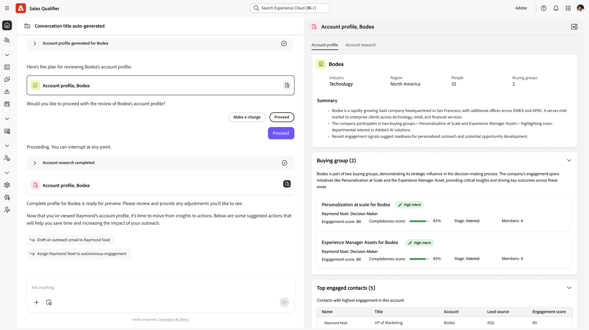

# Account Qualification Agent pour B2B

>[!NOTE]
>Cette fonctionnalité est actuellement en disponibilité limitée et n’est pas disponible pour tous les utilisateurs et utilisatrices.
>

Account Qualification Agent est un assistant optimisé par l’IA conçu pour les représentants de compte. Il rationalise et automatise les principaux workflows de développement des ventes, réduisant considérablement les frais généraux manuels et accélérant la génération de pipelines.

Construite conjointement avec Adobe Journey Optimizer B2B (AJO B2B) et le framework Adobe Agent Orchestrator, cette solution intègre intelligemment les fonctionnalités de données, d’orchestration et d’IA générative pour permettre aux représentants du développement commercial (BDR) d’acquérir les compétences suivantes :

* **Recherche de prospects**

  Effectuez des recherches de prospects en utilisant la récupération et l&#39;affichage automatiques des informations clés sur les prospects (telles que la fonction, les engagements récents, l&#39;appartenance à un groupe d&#39;achat) pour fournir une image complète en quelques secondes.

* **Étude de compte**

  Effectuer des recherches sur les comptes à l&#39;aide de la récupération et de l&#39;affichage automatiques d&#39;informations détaillées sur l&#39;organisation d&#39;un prospectCes informations comprennent les informations vitales de l&#39;entreprise, les nouvelles récentes, les priorités stratégiques et les membres les plus engagés.

* **Brouillons d’e-mails**

  Générez des brouillons d’e-mails en synthétisant les recherches des prospects et des informations de compte afin de produire du contenu d’e-mail unique pertinent et personnalisé en fonction de l’objectif du rapport BDR.

* **E-mails relatifs au plan d’engagement**

  Créez des brouillons d’e-mails de plan d’engagement personnalisés pour chaque étape d’une cadence de sensibilisation définie par BDR, en veillant à ce que la séquence entière soit personnalisée

Ce système d&#39;agents intelligents améliore l&#39;évolutivité, maintient la conscience contextuelle à travers les interactions et s&#39;intègre de manière transparente dans la chaîne d&#39;outils BDR — permettant aux BDR de se concentrer sur des conversations à forte valeur ajoutée plutôt que sur des tâches répétitives.

## Utilisation de base

Les agents de l’IA d’Adobe utilisent _requêtes en langage naturel_, ce qui signifie qu’ils utilisent la même langue dans l’invite de texte que vous le feriez en parlant à une personne. Plus vous êtes détaillé, meilleurs sont les résultats.

En utilisant le langage naturel, vous pouvez demander à l’agent de :

* Afficher mes prospects affectés sans encore engagement
* Me montrer toutes mes pistes qui ne font pas partie d’un engagement autonome
* Donnez-moi un résumé détaillé des `<company>`, y compris leur groupe d&#39;achat, les signaux d&#39;intention récents et nos engagements passés.

Vous pouvez immédiatement comprendre quels comptes et prospects sont les plus actifs et afficher la plus haute intention, de sorte que vous pouvez concentrer votre énergie là où elle a le plus d&#39;impact.

Effectuez une itération sur votre parcours en affinant vos invites pour obtenir les résultats dont vous avez besoin. Par exemple :

* Rédigez un e-mail de relance à partir du contexte, comme des appels de rémunération ou des rapports. Jusqu’à 120 mots. Objet : Captivant, intégrant un thème clé. Introduction : crochet avec citation directe de sources de contexte. Corps : permet de se connecter aux points faibles et aux propositions de valeur. CTA : proposez un bref appel pour en savoir plus.

* L’objectif de cet e-mail est de commencer une conversation et de renforcer votre crédibilité. Rédigez un e-mail de 120 mots, au ton consultatif et empathique. Veillez à éviter une approche trop familière ou commerciale et à ne pas utiliser les expressions « j&#39;espère que vous allez bien », « je vous demande simplement de vous enregistrer » ou « s&#39;il vous plaît ».
