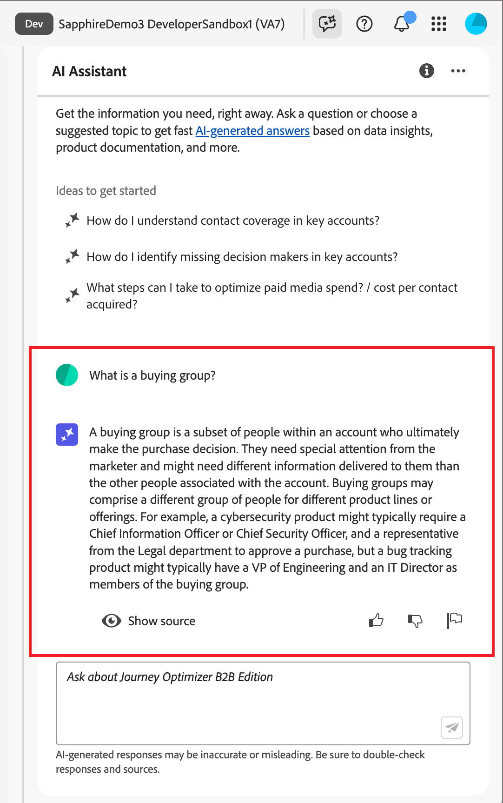

# Utilisation de l’assistant AI dans Journey Optimizer B2B edition

Dans Journey Optimizer B2B edition, l’assistant AI est une fonctionnalité d’interface utilisateur que vous pouvez utiliser pour comprendre les concepts de produit, parcourir rapidement les fonctionnalités de Journey Optimizer B2B edition, en apprendre davantage et obtenir des informations opérationnelles pour votre environnement spécifique. Il est également disponible dans plusieurs produits dans Adobe Experience Cloud.

>[!IMPORTANT]
>
>Un accord concernant les directives d’utilisation de Adobe Experience Cloud Generative AI est requis avant de pouvoir utiliser l’assistant AI. Pour plus d’informations sur ce contrat et les instructions d’utilisation, consultez les [instructions d’utilisation de Adobe Experience Cloud Generative AI](https://www.adobe.com/legal/licenses-terms/adobe-dx-gen-ai-user-guidelines.html).

Pour accéder à l’assistant AI, cliquez sur l’icône dans l’en-tête. L’assistant d’IA s’ouvre dans un panneau à droite.

{width="420" zoomable="yes"}

L’interface de l’assistant d’IA s’affiche et vous fournit immédiatement des informations pour commencer. Vous pouvez utiliser les options fournies sous _Idées pour commencer_ afin de répondre aux questions et aux commandes, telles que :

* Quels parcours de mon compte ont été publiés ?
* Quels intérêts de solution ont été créés ?
* Expliquez-moi les principaux avantages de Journey Optimizer B2B edition.

Dans Adobe Journey Optimizer B2B edition, l’assistant AI prend en charge les cas d’utilisation suivants :

## Connaissances du produit

Les questions sur la connaissance des produits portent sur les concepts de Journey Optimizer B2B edition relatifs à certains aspects de Adobe Journey Optimizer. Voici quelques exemples de questions relatives à la connaissance des produits :

* Comment configurer les comptes des fournisseurs SMS ?
* Comment envoyer un e-mail dans un parcours de compte ?
* Comment personnaliser le contenu de mon e-mail ?

Pour poser une question sur un produit, saisissez-la dans le champ en bas du panneau et appuyez sur Entrée.

{width="420" zoomable="yes"}

Vous pouvez vérifier les réponses renvoyées par l’assistant AI en examinant les citations disponibles avec chaque réponse de la connaissance du produit.

Pour afficher les citations et valider la réponse de l’assistant AI, sélectionnez **[!UICONTROL Afficher les sources]**.

{width="420" zoomable="yes"}

L’assistant AI met à jour l’interface et vous fournit des liens vers la documentation qui corrobore la réponse initiale. En outre, lorsque les citations sont activées, l’assistant AI met à jour la réponse pour inclure des notes de bas de page permettant d’indiquer les parties spécifiques de la réponse qui font référence à la documentation fournie.

Utilisez le pouce vers le haut ou le pouce vers le bas pour évaluer la qualité de la réponse.

## Informations opérationnelles

Les questions relatives aux informations opérationnelles portent sur les objets de parcours du sandbox de votre entreprise. Voici quelques exemples de questions ou d’invites relatives aux informations opérationnelles :

* Combien de parcours en direct ai-je dans Adobe Journey Optimizer B2B edition ?
* Écris-moi une liste de tous les parcours planifiés.
* Combien de parcours ont été créés au cours des 7 derniers jours ?

Vous devez être dans un sandbox actif pour que l’assistant AI puisse fournir une réponse suffisante à une question sur vos informations opérationnelles.

>[!NOTE]
>
>Les seuls objets B2B edition Adobe Journey Optimizer pris en charge par les questions d’informations opérationnelles de l’assistant AI sont répertoriés dans le [tableau du domaine des informations opérationnelles](./ai-assistant-overview.md#operational-insights). Il ne peut accéder aux données que pour le sandbox dans lequel vous vous trouvez actuellement.

<!-- Select to view an example of an operational insights question.

In the following example, AI Assistant receives the following query: _Show me dataflows that were created using the Amazon S3 source._

screen

AI Assistant responds with a table list of your dataflows and their corresponding IDs. Click the _Download_ icon ( Download icon ) to download the table as a CSV file. To view the entire table, click the _Expand_ icon ( Expand icon ).

screen

An expanded view of the table appears, providing you with a more comprehensive list of dataflows based on the parameters of your query.

screen

When prompted with an operational insights question, AI Assistant provides an explanation of how it computed the answer. In the following example, AI Assistant outlines the steps it took in order to identify the dataflows that were created using the Amazon S3 source.

screen

You can also provide filters and modifications to your questions, and you can instruct AI Assistant to render its findings based on the filters that you include. For example, you can ask AI Assistant to show you a trend of the count of segment definitions in the order of their created date, remove segment definitions with zero total profiles, and use month names instead of integers when displaying the data.

### Verify operational insights responses

You can verify each response related to operational insights questions using an SQL query that AI Assistant provides.

Select to view example of verifying operational insights responses

After receiving an answer for an operational insights question, click **[!UICONTROL Show sources]** and then select **[!UICONTROL View source query]**.

screen

When queried with an operational insights question, AI Assistant provides an SQL query that you can use to verify the process that it took to compute its answer. This source query is for verification purposes only and is not supported on Query Service.

screen  

 -->
