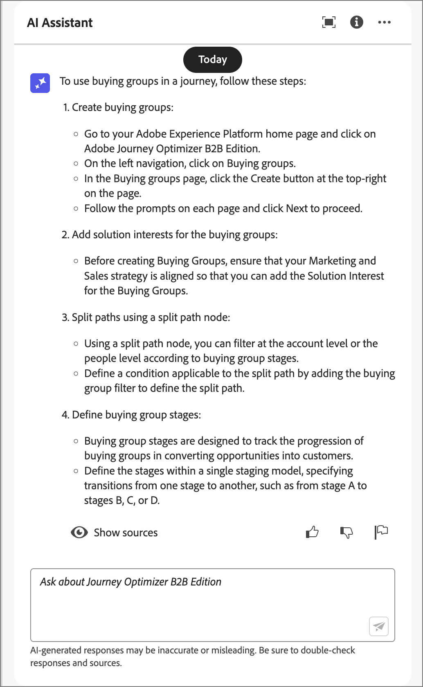
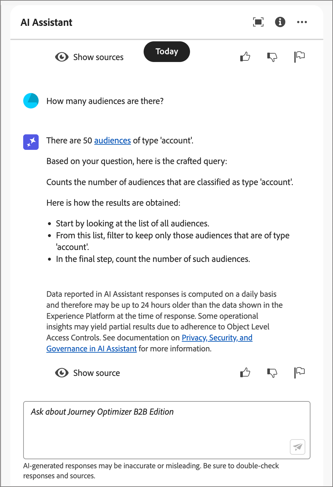

# Utilisation de l’assistant AI dans Journey Optimizer B2B edition

Dans Journey Optimizer B2B edition, l’assistant d’IA est une fonctionnalité d’interface utilisateur que vous pouvez utiliser pour comprendre les concepts de produit, parcourir rapidement les fonctionnalités de produit et en apprendre plus, ainsi qu’obtenir des informations opérationnelles sur votre environnement. Il est également disponible dans plusieurs produits dans Adobe Experience Cloud.

>[!IMPORTANT]
>
>Un accord concernant les directives d’utilisation de Adobe Experience Cloud Generative AI est requis avant de pouvoir utiliser l’assistant AI. Pour plus d’informations sur ce contrat et les instructions d’utilisation, consultez les [instructions d’utilisation de Adobe Experience Cloud Generative AI](https://www.adobe.com/legal/licenses-terms/adobe-dx-gen-ai-user-guidelines.html).

Pour accéder à l’assistant AI, cliquez sur l’icône dans l’en-tête. L’assistant d’IA s’ouvre dans un panneau à droite.

{width="420"}

L’interface de l’assistant d’IA s’affiche et vous fournit immédiatement des informations pour commencer. Vous pouvez utiliser les options fournies sous _Idées pour commencer_ afin de répondre aux questions et aux commandes, telles que :

* Quels parcours ont été publiés ?
* Quels intérêts de solution ont été créés ?
* Expliquez-moi les principaux avantages de Journey Optimizer B2B edition.

Dans Adobe Journey Optimizer B2B edition, l’assistant AI prend en charge les cas d’utilisation suivants :

## Poser des questions sur la connaissance du produit

Les questions relatives à la connaissance des produits portent sur les concepts et les informations pratiques de Journey Optimizer B2B edition. Voici quelques exemples de questions relatives à la connaissance des produits :

* Comment configurer les comptes des fournisseurs SMS ?
* Comment envoyer un email dans un parcours ?
* Comment personnaliser le contenu de mon e-mail ?

Pour poser une question sur un produit, saisissez-la dans le champ en bas du panneau et appuyez sur Entrée. Par exemple, lorsque vous devez apprendre à utiliser un groupe d&#39;achat dans un parcours. Dans ce cas, vous entrez _Comment utiliser un groupe d&#39;achat dans un parcours ?_ Après avoir envoyé la question, l’assistant AI interroge sa base de connaissances et compile une réponse en quelques secondes.

{width="420"}

+++Afficher un exemple de réponse

{width="420"}

+++

## Poser des questions sur les informations opérationnelles

Les questions sur les informations opérationnelles concernent les objets de parcours dans le sandbox de votre entreprise. Vous pouvez poser des questions sur les artefacts opérationnels, tels que l’audience du compte, le parcours du compte, l’intérêt de la solution et le modèle de groupe d’achat. Voici quelques exemples de questions ou d’invites d’informations opérationnelles :

* Combien de parcours en direct ai-je dans Adobe Journey Optimizer B2B edition ?
* Écris-moi une liste de tous les parcours planifiés.
* Combien de parcours ont été créés au cours des 7 derniers jours ?

Vous devez être dans un sandbox actif pour que l’assistant AI puisse fournir une réponse suffisante à une question sur vos informations opérationnelles.

>[!NOTE]
>
>Les seuls objets B2B edition Adobe Journey Optimizer pris en charge par les questions d’informations opérationnelles de l’assistant AI sont répertoriés dans le [tableau du domaine des informations opérationnelles](./ai-assistant-overview.md#operational-insights). Il ne peut accéder aux données que pour le sandbox dans lequel vous vous trouvez actuellement.

Pour poser une question sur les informations opérationnelles, saisissez-la dans le champ au bas du panneau et appuyez sur Entrée. Par exemple, lorsque vous souhaitez en savoir plus sur les audiences de votre sandbox. Dans ce cas, vous saisissez _Combien y a-t-il d’audiences ?_.  L’assistant AI fournit un nombre d’audiences dans votre sandbox et une explication de la manière dont il a calculé la réponse. Dans l’exemple de réponse suivant, l’assistant AI fournit un lien pour accéder aux audiences dans l’interface utilisateur et décrit les étapes effectuées pour identifier le nombre d’audiences.

{width="420"}

Vous pouvez suivre votre recherche initiale en demandant une liste d’artefacts, telle que _Liste des 5 premiers par taille_. L’assistant AI renvoie une table avec les cinq premiers éléments de la requête et leurs identifiants correspondants. Cliquez sur l’icône _Télécharger_ (  ) pour télécharger le tableau au format CSV.

{width="420"}

Pour afficher le tableau entier dans l’assistant AI, cliquez sur l’icône _Maximiser_ (  ). Dans la vue de tableau développée, cliquez sur **[!UICONTROL Télécharger CSV]** pour enregistrer les informations au format CSV.

{width="600" zoomable="yes"}

## Vérifier les réponses

L’assistant AI comprend des outils que vous pouvez utiliser pour vérifier et valider les réponses.

### Sources de connaissance des produits

Après réception d’une réponse à une question sur le produit, sélectionnez **[!UICONTROL Afficher la source]** pour afficher les citations de la source de connaissance du produit utilisées pour générer la réponse de l’assistant d’IA.

L’assistant AI fournit des liens vers la documentation qui corrobore la réponse initiale. Il ajoute également des notes de bas de page à la réponse pour indiquer les parties spécifiques de la réponse qui font référence aux sources de documentation liées.

{width="420"}

### Sources d’informations opérationnelles

Après avoir reçu une réponse à une question sur les informations opérationnelles, cliquez sur **[!UICONTROL Afficher la source]** puis sélectionnez **[!UICONTROL Afficher la requête source]**.

Vous pouvez vérifier chaque réponse liée aux questions d’informations opérationnelles à l’aide d’une requête SQL fournie par l’assistant AI. Lorsqu’il est interrogé avec une question d’informations opérationnelles, l’assistant AI fournit une requête SQL que vous pouvez utiliser pour vérifier le processus nécessaire au calcul de la réponse. Cette requête source est fournie à des fins de vérification uniquement et n’est pas prise en charge sur Query Service.

{width="550" zoomable="yes"}

## Fournir des commentaires

Utilisez les icônes _Pouce vers le haut_ (  ) ou _Pouce vers le bas_ (  ) pour évaluer l’utilité et la qualité de la réponse. Remplissez le court formulaire de sondage en fonction de votre expérience et cliquez sur **[!UICONTROL Soumettre]**. Les informations que vous fournissez sont utilisées pour apporter des améliorations à l’assistant AI.

Si vous remarquez quelque chose de problématique dans la réponse, cliquez sur l’icône _Indicateur_ (  ). Utilisez le formulaire pour décrire le problème et cliquez sur **[!UICONTROL Envoyer]** pour signaler le problème.

{width="420"}

+++Affichage des formulaires

>[!BEGINTABS]

>[!TAB Pouce levé]

{width="600" zoomable="yes"}

>[!TAB Pouce vers le bas]

{width="600" zoomable="yes"}

>[!TAB Indicateur]

{width="600" zoomable="yes"}

>[!ENDTABS]

+++
