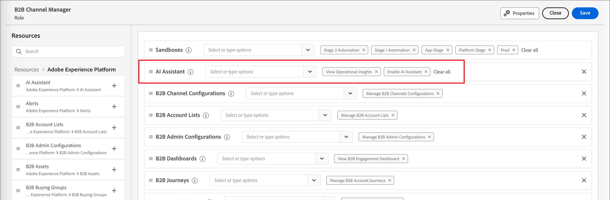
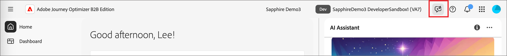

# Activer l’accès à l’assistant IA

>[!IMPORTANT]
>
>Si vous recevez un message dans l’interface utilisateur des autorisations pour vous informer que votre entreprise doit d’abord accepter des termes juridiques supplémentaires pour accéder à l’assistant AI, contactez votre équipe de compte Adobe pour obtenir des conseils.

Les paramètres suivants régissent l’accès à l’assistant AI dans Journey Optimizer B2B Edition :

* **Accéder à l’application :** vous pouvez accéder à l’assistant AI dans Adobe Journey Optimizer B2B Edition.

* **Autorisations :** utilisez l’[interface utilisateur des autorisations](https://experienceleague.adobe.com/en/docs/experience-platform/access-control/abac/permissions-ui/permissions){target="_blank"} pour accorder ou révoquer l’accès à l’assistant AI dans votre entreprise. Pour utiliser l’assistant AI, un utilisateur donné doit appartenir à un rôle configuré avec les autorisations _[!UICONTROL Activer l’assistant AI]_ et _[!UICONTROL Afficher les informations opérationnelles]_.

En tant qu’administrateur, vous pouvez :

* Ajoutez l’autorisation **[!UICONTROL Activer l’assistant IA]** à un rôle donné et ajoutez un utilisateur à ce rôle. Cette autorisation permet aux utilisateurs de votre entreprise d’accéder à l’assistant AI.

* Ajoutez l’autorisation **[!UICONTROL Afficher les informations opérationnelles]** à un rôle donné et ajoutez un utilisateur à ce rôle. Cette autorisation permet à l’utilisateur d’utiliser les fonctionnalités d’informations opérationnelles de l’assistant AI.

{width="800" zoomable="yes"}

Utilisez l’interface utilisateur Autorisations pour accorder des autorisations d’utilisation de l’assistant AI dans Journey Optimizer B2B Edition. Pour plus d’informations sur l’accès à l’assistant AI dans Experience Platform et d’autres applications Experience Cloud, reportez-vous à la documentation de Adobe Experience Platform {target="_blank"}.

Lorsque l’utilisateur dispose des autorisations nécessaires, il peut accéder à l’assistant AI en sélectionnant l’icône _Assistant AI_ dans l’en-tête supérieur de l’application que vous utilisez.

{width="800" zoomable="yes"}

## Vidéo de présentation de l’accès à l’assistant AI

Pour découvrir comment configurer l’accès à l’assistant AI pour votre entreprise et les utilisateurs, regardez la vidéo suivante.

>[!VIDEO](https://video.tv.adobe.com/v/3436470/?learn=on)

## Étapes suivantes

Lorsque les utilisateurs ont accès à l’assistant AI, ils peuvent utiliser la fonctionnalité lors de l’exécution de leurs tâches. Reportez-vous à la documentation suivante :

* [Conseils sur les questions](./question-guidance.md)
* [Utiliser l’assistant IA](./use-ai-assistant.md)
