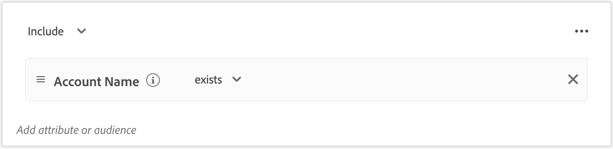

# Audiences de compte

Une audience est un ensemble de personnes qui partagent des comportements et/ou des caractéristiques similaires. Journey Optimizer B2B edition utilise les fonctionnalités de segmentation de compte disponibles dans les éditions B2B et B2P d’Adobe Real-Time Customer Data Platform. Avec la segmentation de compte, les utilisateurs peuvent générer des audiences de compte en exploitant les données de l’une des entités B2B du système. Ces audiences de compte servent d’entrées pour les parcours de compte Journey Optimizer B2B edition, ce qui facilite l’activation et la personnalisation transparentes.

Apprenez-en davantage sur les audiences de compte et comment les définir dans la documentation du service de segmentation de Adobe Experience Platform .

## Workflow d’audience de compte

Vous pouvez considérer Journey Optimizer B2B edition comme une destination Experience Platform (AEP) qui n’apparaît pas dans le catalogue des destinations. Activez les audiences de compte dans Journey Optimizer B2B edition en procédant comme suit :

1. Création de schémas pour vos données dans AEP.
1. Ingérez vos données dans AEP.
1. Créez un segment de compte pour évaluer vos données.
1. Activez vos données évaluées dans Journey Optimizer B2B edition.

Dans Journey Optimizer B2B edition, les audiences de compte sont utilisées comme entrée pour les parcours basés sur compte, ce qui vous permet de cibler les personnes au sein de ces comptes. Par exemple, vous pouvez utiliser les audiences de compte pour récupérer les enregistrements de tous les comptes qui ne disposent pas des informations de contact des personnes nommées Chef de l’exploitation (COO) ou Chef du marketing (CMO).

Journey Optimizer B2B edition vous permet de créer des audiences de compte Adobe Experience Platform (AEP) directement à partir du volet de navigation de gauche et de les incorporer dans les parcours de votre compte.

{width="800" zoomable="yes"}

## Création d’une audience de compte

Définissez l’audience du compte en créant une segmentation de compte. Vous avez la possibilité de créer la segmentation du compte directement dans l’application Journey Optimizer B2B edition ou vous pouvez utiliser l’interface utilisateur du créateur de segments [IU](https://experienceleague.adobe.com/en/docs/experience-platform/segmentation/ui/segment-builder). Vous trouverez ci-dessous la procédure à suivre pour créer une segmentation de compte dans Journey Optimizer B2B edition.

1. Dans le volet de navigation de gauche, choisissez **[!UICONTROL Comptes]** > **[!UICONTROL Audiences]**.

1. Cliquez sur **[!UICONTROL Créer une audience]** en haut à droite.

1. Créez la définition de segment.

   Les attributs de compte et les audiences s’affichent dans la barre de navigation de gauche. Sous l’onglet _[!UICONTROL Attributs]_, vous pouvez ajouter des attributs créés par Platform et des attributs personnalisés. Faites glisser chaque attribut pour créer la logique du segment.

   >[!TIP]
   >
   >Lors de la création d’une audience de compte, gardez à l’esprit que les événements sont répertoriés sous _[!UICONTROL Personnes]_, car ces attributs sont associés aux personnes. 
   >
   >Sous l’onglet _[!UICONTROL Audiences]_, vous pouvez ajouter des audiences basées sur les personnes créées précédemment à partir de lors de la création de votre propre audience de compte.

   L’exemple suivant définit l’audience créée à l’aide de `Country Code`, `Revenue Amount` et `Market segment`. La requête en anglais serait la suivante : « Je veux tous les comptes aux États-Unis qui se trouvent dans le segment financier dont le chiffre d’affaires dépasse 1 million de dollars ».

   {width="700" zoomable="yes"}
    

   >[!IMPORTANT]
   >
   >L’attribut `Account Name` pour les enregistrements de compte doit contenir une valeur à inclure dans les parcours de compte. Si cet attribut est vide (nul), l’enregistrement de compte est exclu. 
   >Pour vous assurer que seuls les comptes dont le nom de compte n’est pas vide sont inclus, ajoutez l’attribut **[!UICONTROL Nom du compte]** et sélectionnez _[!UICONTROL existe]_ comme condition de correspondance. 
   >{width="600"}
   > Si vous utilisez un attribut personnalisé pour le nom du compte, utilisez votre nom d’attribut personnalisé au lieu de _[!UICONTROL Nom du compte]_.

1. Cliquez sur **[!UICONTROL Enregistrer et fermer]** en haut à droite.

Pour activer l’audience de votre compte pour Journey Optimizer B2B edition, vous devez [l’ajouter à un parcours de compte](../journeys/journey-overview.md#add-the-account-audience-for-your-journey) et [publier le parcours ](../journeys/journey-overview.md).
