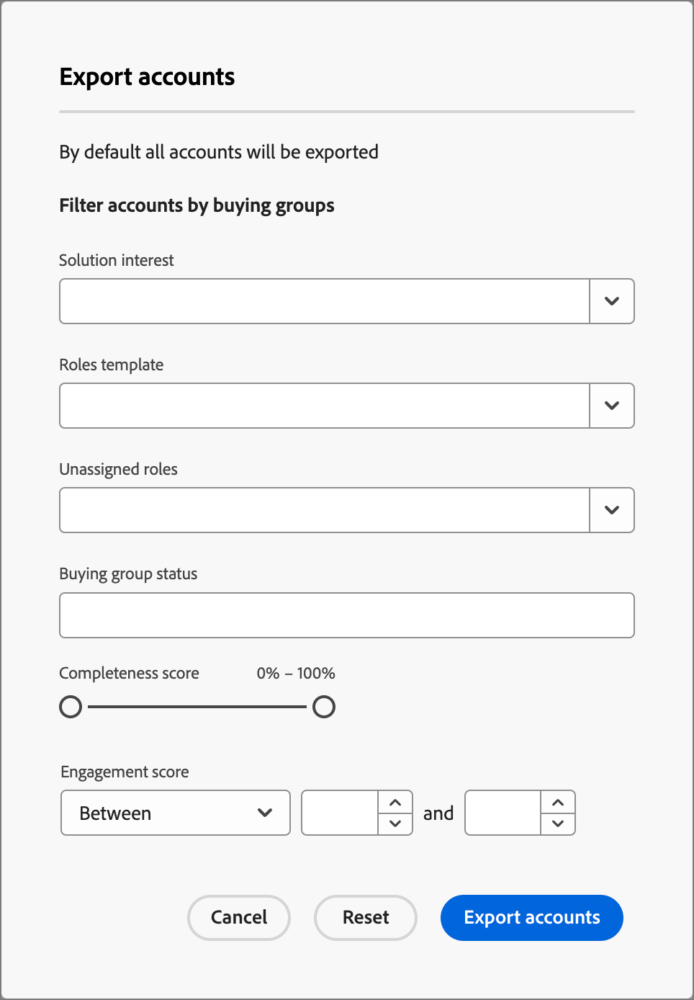
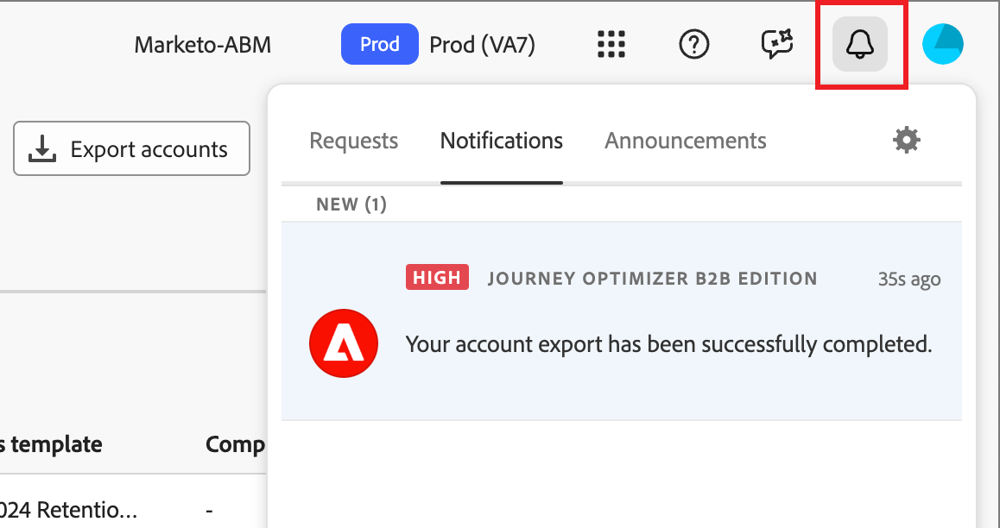

# Exporter des comptes

Utilisez la fonctionnalité _Exporter des comptes_ pour exporter tous les comptes ou un ensemble de comptes en fonction du filtrage que vous définissez. Le processus d’export génère un fichier CSV et envoie l’URL du fichier stocké dans une notification push. Vous pouvez utiliser cette fonctionnalité pour déplacer des comptes vers des plateformes tierces, si nécessaire.

1. Dans Journey Optimizer B2B Edition, accédez à **[!UICONTROL Comptes]** > **[!UICONTROL Groupes d’achat]** dans le volet de navigation de gauche.

1. Sélectionnez l’onglet **[!UICONTROL Parcourir]**.

1. Cliquez sur **[!UICONTROL Exporter des comptes]** en haut à droite.

   {width="800" zoomable="yes"}

1. Dans la boîte de dialogue, définissez les paramètres des audiences de comptes à exporter.

   {width="400"}

   Pour le **[!UICONTROL score d’engagement]**, l’opérateur `Between` est inclusif, tout comme les plages de pourcentage. Par exemple, les paragraphes 5.1 et 5 sont tous deux compris _entre_ 5 et 6.

   Les paramètres de filtrage vides sont traités comme `Is Any`.

1. Cliquez sur **[!UICONTROL Exporter des comptes]** pour générer le fichier CSV à l’aide des filtres spécifiés.

1. Lorsque vous recevez la notification indiquant que l’export est terminé, cliquez sur le lien de notification pour accéder au fichier CSV.

   {width="425"}

   >[!NOTE]
   >
   >Si vous avez configuré un abonnement aux notifications par e-mail dans les préférences de votre compte d’utilisateur ou d’utilisatrice Adobe, il peut s’agir d’une notification par e-mail.

   La page de l’application redirige vers l’onglet de navigation _Groupe d’achat_ et la boîte de dialogue d’enregistrement du fichier sur le système vous invite à enregistrer le fichier sur votre système. Si vous devez partager les données, vous pouvez utiliser le système de partage de fichiers de votre équipe.
