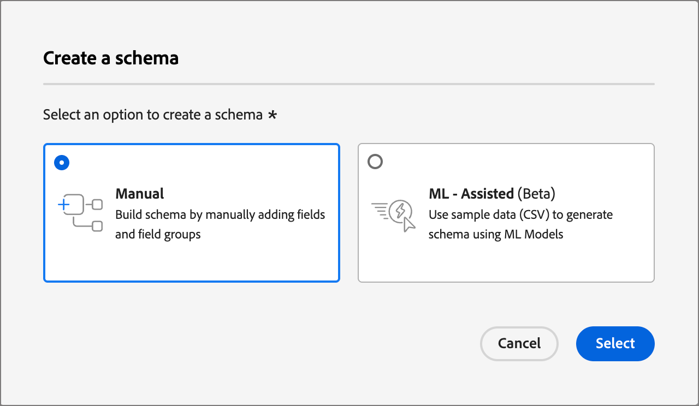
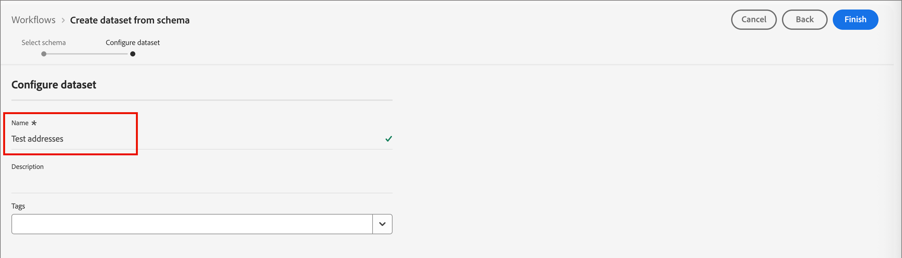
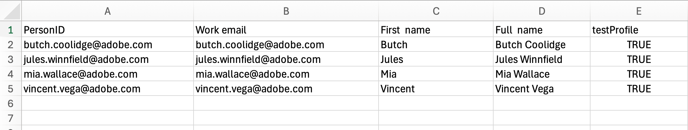
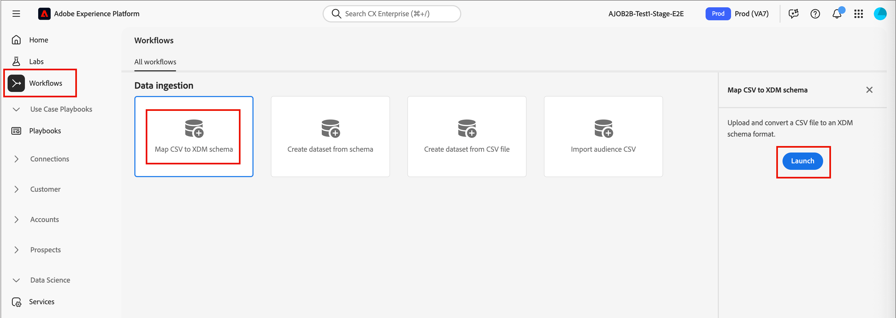
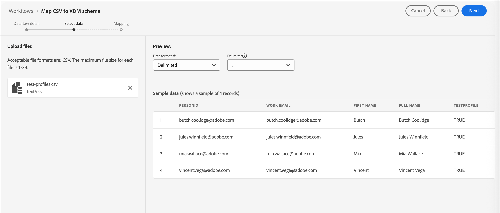

# Profils de test {#test-profiles}

Les profils de test sont requis pour [prévisualiser et tester le contenu de la page de destination](../content/landing-pages-create-publish.md#test-landing-page) dans Journey Optimizer B2B edition. Vous pouvez définir un ensemble de profils de test en créant un schéma, en créant le jeu de données et en chargeant un fichier CSV.

<!--
>[!NOTE]
>
>[!DNL Journey Optimizer B2B Edition] allows testing different variants of your content by previewing it and sending proofs using sample input data uploaded from a CSV or JSON file, or added manually. 
-->

La création d&#39;un profil de test est similaire à la création de profils classiques dans [!DNL Adobe Experience Platform]. Pour plus d&#39;informations, consultez la [documentation du profil client en temps réel](https://experienceleague.adobe.com/docs/experience-platform/profile/home.html?lang=fr){target="_blank"}.


## Créer un schéma {#create-schema}

Pour créer des profils, vous devez d’abord créer un schéma dans [!DNL Journey Optimizer B2B Edition].

1. Développez **[!UICONTROL Gestion des données]** dans le volet de navigation de gauche, sélectionnez **[!UICONTROL Schémas]**, puis cliquez sur **[!UICONTROL Créer un schéma]** en haut à droite.

   {width="800" zoomable="yes"}

1. Sélectionnez **[!UICONTROL Standard]** comme option de création de schémas.

1. Sélectionnez un type de schéma, par exemple **[!UICONTROL Manuel]**, puis cliquez sur **[!UICONTROL Sélectionner]**.

   {width="500"}

1. Sélectionnez un type de schéma, par exemple **[!UICONTROL Profil individuel]**, puis cliquez sur **[!UICONTROL Suivant]**.

   {width="700" zoomable="yes"}

1. Saisissez un nom (obligatoire) et une description (facultatif) pour le schéma, puis cliquez sur **[!UICONTROL Terminer]**.

   {width="700" zoomable="yes"}

   La structure du schéma s’affiche, avec le panneau _[!UICONTROL Composition]_ à gauche.

1. Dans la section **[!UICONTROL Groupes de champs]**, cliquez sur **[!UICONTROL Ajouter]** et sélectionnez les groupes de champs appropriés.

   Utilisez l’outil de recherche pour localiser et sélectionner le groupe de champs **[!UICONTROL Détails du test de profil]**.

   {width="700" zoomable="yes"}

   Une fois l’opération terminée, cliquez sur **[!UICONTROL Ajouter des groupes de champs]**. La liste des groupes de champs s’affiche alors dans l’écran aperçu du schéma.

   Répétez cette étape pour ajouter d’autres groupes de champs que vous souhaitez utiliser pour les profils de test, tels que **[!UICONTROL Coordonnées de la personne]** et **[!UICONTROL Coordonnées de travail]**.

1. Dans la liste des champs, cliquez sur le champ que vous souhaitez définir comme identité principale.

1. Dans le volet de droite _[!UICONTROL Propriétés du champ]_, vérifiez les options **[!UICONTROL Identité]** et **[!UICONTROL Identité principale]**, puis sélectionnez un espace de noms.

   Si vous souhaitez que l&#39;identité principale soit une adresse e-mail, choisissez l&#39;espace de noms **[!UICONTROL E-mail]**.

   {width="700" zoomable="yes"}

   Cliquez sur **[!UICONTROL Appliquer]**.

1. Sélectionnez le schéma et activez l&#39;option **[!UICONTROL Profil]** dans le volet **[!UICONTROL Propriétés du schéma]**.

   {width="700" zoomable="yes"}

1. Cliquez sur **[!UICONTROL Enregistrer]**.

Pour plus d’informations sur la création de schémas, consultez la [documentation XDM](https://experienceleague.adobe.com/docs/experience-platform/xdm/ui/resources/schemas.html?lang=fr#prerequisites){target="_blank"}.

>[!IMPORTANT]
>
>Lors de la création ou du remplacement d’un jeu de données pour l’ingestion de profil de test, assurez-vous que le descripteur d’identité correct appliqué au schéma est celui qui est appliqué au champ d’identité principale (`/personID`) de l’espace de noms prévu. Si le descripteur d’identité est manquant ou mal configuré, les profils ingérés dans ce jeu de données peuvent ne pas être marqués comme profils de test (`testProfile = true`), même si le processus d’ingestion s’est terminé avec succès.
>
>Si vos profils de test ne sont pas correctement marqués après ingestion :
>
>1. Vérifiez le schéma associé à votre jeu de données.
>1. Vérifiez que le champ Identité principale comporte le descripteur d’identité correct pour votre espace de noms.
>1. Si le descripteur est manquant, mettez à jour le schéma pour ajouter le descripteur d’identité et ingérer à nouveau vos données.

## Créer un jeu de données {#create-dataset}

Après avoir créé le schéma, créez le jeu de données utilisé pour importer les profils. Pour plus d’informations sur la création de jeux de données, consultez la [documentation du service de catalogue](https://experienceleague.adobe.com/docs/experience-platform/catalog/datasets/user-guide.html?lang=fr#getting-started){target="_blank"}.

1. Sous _[!UICONTROL Gestion des données]_ dans le volet de navigation de gauche, sélectionnez **[!UICONTROL Jeux de données]**.

1. En haut à droite, cliquez sur **[!UICONTROL Créer un jeu de données]**.

   {width="800" zoomable="yes"}

1. Choisissez **[!UICONTROL Créer un jeu de données à partir d’un schéma]**.

   {width="500"}

1. Sélectionnez le schéma créé précédemment et cliquez sur **[!UICONTROL Suivant]**.

1. Choisissez un nom et cliquez sur **[!UICONTROL Terminer]**.

   {width="700" zoomable="yes"}

1. Dans le panneau de droite, activez l’option **[!UICONTROL Profil]**.

## Créer des profils de test à l’aide d’un fichier CSV {#create-test-profiles-csv}

Dans [!DNL Adobe Experience Platform], vous pouvez créer des profils en chargeant un fichier CSV contenant les différents champs de profil dans votre jeu de données. Cette méthode est la plus simple.

1. Créez un fichier CSV simple à l’aide d’un tableur.

1. Ajoutez une colonne pour chaque champ obligatoire.

   Veillez à ajouter le champ Identité principale (`personID`, par exemple) et le champ `testProfile` défini sur `true`.

1. Ajoutez une ligne par profil et les valeurs de chaque champ.

   {width="600" zoomable="yes"}

1. Enregistrez la feuille de calcul au format CSV en veillant à utiliser des virgules comme séparateurs.

1. Dans [!DNL Adobe Experience Platform], accédez à **[!UICONTROL Workflows]**.

1. Choisissez **[!UICONTROL Mapper CSV à un schéma XDM]** et cliquez sur **[!UICONTROL Lancer]**.

   {width="800" zoomable="yes"}

1. Sélectionnez le jeu de données à utiliser pour l’importation, puis cliquez sur **[!UICONTROL Suivant]**.

   {width="700" zoomable="yes"}

1. Cliquez sur **[!UICONTROL Choisir les fichiers]** et sélectionnez le fichier CSV, ou glissez-déposez le fichier depuis votre système.

   Une fois le téléchargement du fichier terminé, cliquez sur **[!UICONTROL Suivant]**.

   {width="700" zoomable="yes"}

1. Mappez les champs CSV source aux champs du schéma, puis cliquez sur **[!UICONTROL Terminer]**.

   {width="700" zoomable="yes"}

   L&#39;import de données démarre. Le statut passe de _Traitement_ à _Succès_.

1. En haut à droite, cliquez sur **[!UICONTROL Prévisualiser le jeu de données]** et vérifiez que les profils de test ajoutés au jeu de données sont corrects.

   {width="700" zoomable="yes"}

   Les profils de test peuvent ensuite être utilisés pour [tester le contenu de la page de destination](../content/landing-pages-create-publish.md#test-landing-page).

>[!NOTE]
>
>Pour plus d’informations sur l’importation de données CSV, consultez la [documentation sur l’ingestion de données](https://experienceleague.adobe.com/docs/experience-platform/ingestion/tutorials/map-a-csv-file.html?lang=fr#tutorials){target="_blank"}.

<!--
## Create test profiles using API calls {#create-test-profiles-api}

You can also create test profiles via API calls. Learn more in [[!DNL Adobe Experience Platform] documentation](https://experienceleague.adobe.com/docs/experience-platform/profile/home.html){target="_blank"}.

You must use a Profile schema that contains the **[!UICONTROL Profile test details]** field group. The `testProfile` flag is part of this field group.
When creating a profile, make sure you pass the value: `testProfile = true`.

You can also update an existing profile to change its `testProfile` flag to `true`.

Here is an example of an API call to create a test profile:

```bash
curl -X POST \
'https://dcs.adobedc.net/collection/xxxxxxxxxxxxxx' \
-H 'Cache-Control: no-cache' \
-H 'Content-Type: application/json' \
-H 'Postman-Token: xxxxx' \
-H 'cache-control: no-cache' \
-H 'x-api-key: xxxxx' \
-H 'x-gw-ims-org-id: xxxxx' \
-d '{
"header": {
"msgType": "xdmEntityCreate",
"msgId": "xxxxx",
"msgVersion": "xxxxx",
"xactionid":"xxxxx",
"datasetId": "xxxxx",
"imsOrgId": "xxxxx",
"source": {
"name": "Postman"
},
"schemaRef": {
"id": "https://example.adobe.com/mobile/schemas/xxxxx",
"contentType": "application/vnd.adobe.xed-full+json;version=1"
}
},
"body": {
"xdmMeta": {
"schemaRef": {
"contentType": "application/vnd.adobe.xed-full+json;version=1"
}
},
"xdmEntity": {
"_id": "xxxxx",
"_mobile":{
"ECID": "xxxxx"
},
"testProfile":true
}
}
}'
```
-->
