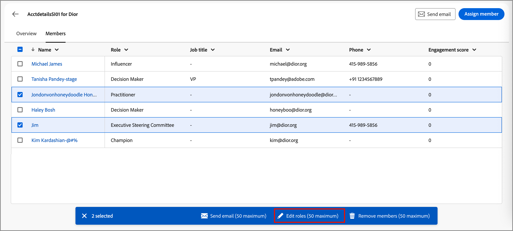

# Détails du groupe d’achat

Lorsque vous cliquez sur le nom d&#39;un groupe d&#39;achats à partir de n&#39;importe quel emplacement de Journey Optimizer B2B edition, les détails de ce groupe s&#39;affichent. Cet aperçu fournit des informations utiles sur le groupe d’achats, y compris des résumés IA génératifs. Vous pouvez également exécuter des [actions](#buying-group-actions) pour les contacts associés au compte.

{width="800" zoomable="yes"}

Utilisez l&#39;onglet **[!UICONTROL Aperçu]** pour consulter les informations sur le compte, et l&#39;onglet **[!UICONTROL Membres]** pour accéder à une liste des membres du groupe d&#39;achat.

## Onglet Aperçu

L’onglet Aperçu se compose de trois sections principales :

### Résumé du groupe d&#39;achat

{zoomable="yes"}

La section de synthèse des groupes d&#39;achats comprend les informations suivantes sur les groupes d&#39;achats :

* Nom du groupe d’achat
* Nom du compte (cliquez sur le nom pour ouvrir le [détails du compte](../accounts/account-details.md))
* Nombre de membres du groupe d&#39;achat
* Score d’engagement
* Score d’exhaustivité
* Étape du groupe d&#39;achat actuel
* Modèle de rôle (cliquez sur le nom pour ouvrir le [modèle de rôle](buying-groups-role-templates.md#access-and-browse-role-templates))
* Date de la dernière modification/mise à jour
* Résumé IA générative du groupe d’achat

### Présentation du compte

{zoomable="yes"}

La section de présentation du compte comprend les informations de compte suivantes :

* Nom du compte (cliquez sur le nom pour ouvrir les détails du compte)
* Nombre de personnes dans le compte
* Secteur industriel
* Opportunités ouvertes
* Les trois derniers parcours de compte pour lesquels le compte est actuellement utilisé (cliquez sur le nom pour afficher les détails du parcours)
* Résumé IA générative du compte

### Données d’intention

Dans Journey Optimizer B2B edition, le modèle de détection des intentions prédit une solution/un produit ciblé avec un degré de confiance suffisant en fonction de l’activité des membres du groupe d’achat. L&#39;intention des membres du groupe d&#39;achat peut être interprétée comme la probabilité d&#39;avoir un intérêt dans un produit.

{{intent-data-note}}

{width="700" zoomable="yes"}

* Niveaux d’intention
* Types de signal d’intention : mots-clés, produit et solution

### Membres du groupe d’achat

{width="800" zoomable="yes"}

La section _[!UICONTROL Membres du groupe d&#39;achat]_ affiche deux lignes mettant en surbrillance les membres du groupe d&#39;achat :

* **[!UICONTROL Décideur]** - Les trois meilleurs décideurs en fonction du score d’engagement de la personne
* **[!UICONTROL Membres les plus engagés]** - Autres membres les plus engagés en fonction du score d’engagement de la personne

Chaque carte de membre contient les informations suivantes :

* Nom
* Titre
* Rôle
* Score de l’engagement du lead

Cliquez sur **[!UICONTROL Afficher les détails]** pour accéder aux informations sur les membres suivantes :

* Résumé IA générative
* Dernier moment significatif
* Activités les plus récentes (deux)
* Autres groupes d&#39;achat dont le prospect est membre (limité à trois groupes d&#39;achat en fonction du dernier groupe ajouté).
* Adresse e-mail
* Numéro de téléphone

{width="600" zoomable="yes"}

## Onglet Membres

Sélectionnez l&#39;onglet **[!UICONTROL Membres]** pour afficher la liste de tous les membres du groupe d&#39;achat. Chaque liste de membres inclut le nom, le rôle, l’intitulé de la fonction, l’adresse e-mail, le numéro de téléphone et la source.

{width="700" zoomable="yes"}

Vous pouvez exécuter plusieurs actions à partir de l’onglet _Membres_ :

### Affecter un nouveau membre

Un compte peut être associé à un ou plusieurs groupes d&#39;achats, et les membres d&#39;un groupe d&#39;achats sont généralement un sous-ensemble de contacts du compte. Vous pouvez ajouter manuellement n&#39;importe quel contact du compte associé au groupe d&#39;achats.

1. Cliquez sur **[!UICONTROL Attribuer un nouveau membre]** en haut à droite.

1. Dans la boîte de dialogue _[!UICONTROL Affecter un membre]_, sélectionnez les prospects de compte à ajouter au groupe d’achats et cliquez sur **[!UICONTROL Suivant]**.

   {width="700" zoomable="yes"}

1. Dans la boîte de dialogue _[!UICONTROL Modifier le nouveau rôle de membre]_, sélectionnez le rôle à affecter à chacun des nouveaux membres.

   {width="700" zoomable="yes"}

1. Cliquez sur **[!UICONTROL Enregistrer]**

### Supprimer un membre

Vous pouvez supprimer un ou plusieurs membres sélectionnés (jusqu&#39;à 50 à la fois) du groupe d&#39;achat.

1. Cochez les cases correspondant aux membres à supprimer.

1. Dans la barre de sélection inférieure, cliquez sur **[!UICONTROL Supprimer des membres]**.

   {width="700" zoomable="yes"}

1. Dans la boîte de dialogue de confirmation, cliquez sur **[!UICONTROL Supprimer]**.

### Modifier le rôle

Vous pouvez modifier le rôle d&#39;un ou de plusieurs membres sélectionnés (jusqu&#39;à 50 à la fois) du groupe d&#39;achat.

1. Cochez les cases correspondant aux membres dont vous souhaitez modifier les rôles.

1. Dans la barre de sélection inférieure, cliquez sur **[!UICONTROL Modifier les rôles]**.

   {width="700" zoomable="yes"}

1. Dans la boîte de dialogue _[!UICONTROL Modifier le rôle de membre]_, sélectionnez le rôle à affecter à chacun des membres.

   {width="700" zoomable="yes"}

1. Cliquez sur **[!UICONTROL Enregistrer]**

### Envoyer un e-mail

Vous pouvez envoyer un e-mail approuvé par le spécialiste marketing à un ou plusieurs membres sélectionnés (jusqu’à 50 à la fois) d’un groupe d’achats. La liste des e-mails disponibles se limite aux e-mails approuvés provenant de l’instance Marketo Engage connectée.

1. Cochez les cases correspondant aux membres qui doivent recevoir l’e-mail.

1. En haut à droite ou dans la barre de sélection en bas, cliquez sur **[!UICONTROL Envoyer un e-mail]**.

   {width="700" zoomable="yes"}

1. Dans la boîte de dialogue _[!UICONTROL Envoyer un e-mail]_, sélectionnez l’espace de travail Marketo Engage, puis cochez la case de l’e-mail à envoyer.

   {width="700" zoomable="yes"}

1. Cliquez sur **[!UICONTROL Envoyer]**.
