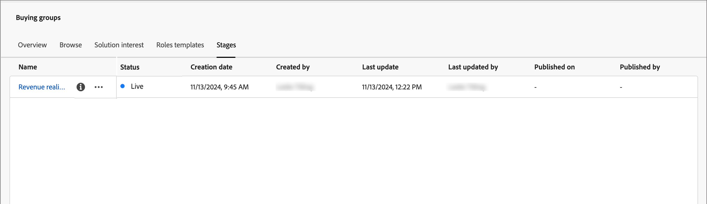
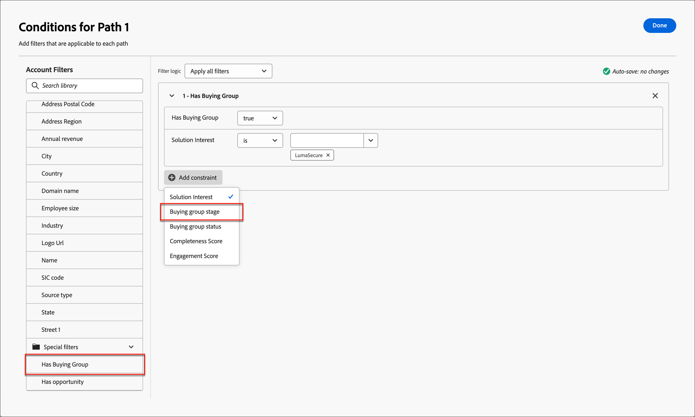

# Étapes du groupe d’achat

Les étapes des groupes d’achat sont conçues pour suivre la progression des groupes d’achat lors de la conversion des opportunités en clients. Utilisez cette fonction pour effectuer le suivi de la progression du groupe d’achats et identifier les meilleures actions à entreprendre pour les membres du groupe.

Définissez les étapes dans un modèle d’évaluation unique, en définissant plusieurs étapes et le flux de transition entre elles. Une ou plusieurs étapes sont désignées pour être entrées dans le cycle de vie. Le modèle permet également une progression non linéaire, où vous pouvez spécifier des transitions d’une étape à l’autre, telles que de l’étape A aux étapes B, C ou D. Il est nécessaire qu’une étape soit désignée comme étape de succès, par exemple un achat ou un contrat signé. Il est facultatif qu’une autre étape soit désignée comme une étape d’échec, par exemple un contrat rejeté ou l’achat d’une solution concurrente auprès d’un autre fournisseur.<!-- This is achieved through intelligent dashboards that show how buying groups are progressing in terms of completing a sale opportunity or converting an opportunity into a customer. -->

{width="800" zoomable="yes"}

## Définition du modèle d’étapes du groupe d’achat

Vous créez et configurez un modèle de phases de groupe d’achat en procédant comme suit :

* Ajout des étapes du cycle de vie
* Définir les flux de transition
* Désignation des étapes d’entrée et de destination

Un seul modèle est pris en charge. Il est donc important de travailler avec vos équipes marketing et commerciales pour planifier le modèle optimal pour votre organisation avant de le créer et de le publier dans Journey Optimizer B2B edition.<!-- Initially, only one stage model can be created, but future releases will support multiple stage models, allowing users to select which model to use in a journey. -->

Lorsque vous créez le modèle d’évaluation de groupe d’achats, il est automatiquement à l’état _Brouillon_ et ne peut pas être supprimé ou renommé. Il reste dans cet état lorsque vous définissez les étapes et configurez le flux de transition entre les étapes. Lorsque le modèle se trouve dans un état publié (_Live_), il ne peut pas être modifié.

### Création du modèle

1. Dans le volet de navigation de gauche, accédez à **[!UICONTROL Comptes]** > **[!UICONTROL Groupes d’achat]**.

1. Sur la page Groupes d’achats, sélectionnez l’onglet **[!UICONTROL Étapes]** .

   {width="800" zoomable="yes"}

   Cet onglet _[!UICONTROL Étapes]_ est à l’état _vide_ jusqu’à ce que vous créiez le modèle.

1. Cliquez sur **[!UICONTROL Créer un modèle]** au centre de la page.

1. Dans la boîte de dialogue, saisissez les valeurs **[!UICONTROL Name]** (obligatoire) et **[!UICONTROL Description]** (facultatif) pour le modèle.

   {width="700" zoomable="yes"}

   Si vous cliquez sur _[!UICONTROL Annuler]_ dans cette boîte de dialogue, vous revenez à l’onglet _[!UICONTROL Étapes]_ dans un état _vide_.

1. Cliquez sur **[!UICONTROL Créer]**.

### Définition des étapes

Une fois le modèle créé, il s’ouvre dans l’espace de travail et vous êtes invité à créer les étapes du modèle.

1. Cliquez sur **[!UICONTROL Modifier les étapes]**.

   {width="700" zoomable="yes"}

1. Définissez la première étape en saisissant le **[!UICONTROL nom]** (obligatoire) et la **[!UICONTROL description]** (facultatif).

   {width="700" zoomable="yes"}

   Il n’est pas nécessaire d’ajouter les scènes dans un ordre spécifique, mais cela détermine la manière dont elles sont répertoriées dans la page des détails du modèle. Vous pouvez désigner l&#39;étape d&#39;entrée et le flux entre les étapes lorsque vous définissez les règles de transition.

1. Cliquez sur **[!UICONTROL Ajouter une étape]** et répétez l’étape 2 pour définir une autre étape.

   Répétez cette étape jusqu’à ce que vous disposiez des étapes nécessaires au modèle.

   {width="700" zoomable="yes"}

1. Lorsque vous êtes satisfait des scènes que vous avez définies, cliquez sur **[!UICONTROL Enregistrer]**.

   >[!IMPORTANT]
   >
   >**Une fois les étapes du groupe d’achat enregistrées, elles ne peuvent pas être supprimées.** Cependant, vous pouvez modifier le nom et la description de n’importe quelle étape tant que le modèle reste dans l’état _Brouillon_ .

### Configuration des règles de workflow et de transition

Une fois les scènes enregistrées, l’espace de travail du modèle s’affiche à nouveau. La colonne _[!UICONTROL Passage en transit autorisé vers]_ est vide, ce qui indique que les règles de transition pour les étapes du modèle ne sont pas encore définies.

{width="700" zoomable="yes"}

Les règles de transition déterminent comment un groupe d’achats peut passer d’une étape à une autre. Par exemple, il peut passer d’une étape d’entrée à une étape intermédiaire, et d’une étape intermédiaire à d’autres étapes. Une étape d’entrée est une étape initiale qu’un groupe d’achat peut entrer à partir d’un état vide, et les étapes de destination sont classées comme étapes de succès ou d’échec.

1. Cliquez sur **[!UICONTROL Modifier les règles de transition]** en haut à droite.

   Cette action ouvre la boîte de dialogue _[!UICONTROL Modifier les règles intermédiaires]_, dans laquelle vous définissez la logique du flux.

   Lorsque vous définissez les options, il existe des barrières de sécurité et des messages intégrés pour vous aider à éviter de créer des erreurs logiques dans le flux. Vous pouvez cliquer sur _[!UICONTROL Annuler]_ pour fermer la boîte de dialogue et revenir à la page de l’onglet _[!UICONTROL Étapes]_ sans modification.

1. Dans la section _[!UICONTROL Sélectionner l’étape]_ , définissez les étapes de début et de fin du flux :

   * **[!UICONTROL Étape du point d’entrée]** (obligatoire) - Désignez une ou plusieurs étapes d’entrée pour l’opportunité du groupe d’achats.

   * **[!UICONTROL Étape de succès]** (obligatoire) - Désignez l’étape qui indique que l’opportunité du groupe d’achats a réussi (destination).

   * **[!UICONTROL Étape d’échec]** (facultatif) : désignez une ou plusieurs étapes qui indiquent que l’opportunité du groupe d’achat a atteint un point d’échec (destination).

   {width="700" zoomable="yes"}

1. Pour chaque étape hors destination, définissez une ou plusieurs étapes suivantes dans le flux (transition).

   Toutes les étapes hors destination doivent avoir au moins une étape **[!UICONTROL transit autorisé vers]** sélectionnée. Dans le cas contraire, la logique du modèle n’est pas valide et les comptes peuvent être _bloqués_ à ce stade sans aucun moyen de progresser vers la réussite ou l’échec.

   {width="700" zoomable="yes"}

   Vous pouvez éventuellement spécifier une transition à partir d’une étape d’échec. Par exemple, vous pouvez désigner une étape nommée _Aucune réponse_ comme étape d’échec. Mais vous pouvez également désigner une étape appelée _Résurgence_ comme transition possible pour identifier les cas où un compte inactif est réactivé.

1. Cliquez sur **[!UICONTROL Enregistrer]**.

   Avec le retour à la page des détails du modèle, les étapes sont répertoriées dans un tableau avec les transitions autorisées, ainsi que les propriétés de destination et d’entrée.

| Colonne | Description |
| ------ | ---------- |
| **[!UICONTROL Nom de l’état]** | Nom de la scène. Cliquez sur l’icône d’information pour afficher la description de la scène. |
| **[!UICONTROL Transféré autorisé vers]** | Répertorie les scènes valides pour une action _move to_ dans le modèle. |
| **[!UICONTROL Étape du point d’entrée]** | Indique si l’étape est valide en tant qu’étape de point d’entrée ([!UICONTROL Oui] ou [!UICONTROL Non]). |
| **[!UICONTROL Destination]** | Indique si l’étape est désignée comme étape de destination ([!UICONTROL Succès] ou [!UICONTROL Échec]). |

{width="700" zoomable="yes"}

## Modification d’un modèle de brouillon

Tant que le modèle des phases de groupe d’achat reste dans un état _Draft_, vous pouvez modifier les étapes et les règles de transition.

Pour afficher le modèle de brouillon :

1. Dans le volet de navigation de gauche, accédez à **[!UICONTROL Comptes]** > **[!UICONTROL Groupes d’achat]**.

1. Sur la page _Groupes d&#39;achats_, sélectionnez l&#39;onglet **[!UICONTROL Étapes]** .

1. Cliquez sur le nom du modèle pour ouvrir les détails du modèle.

### Modification des étapes dans le modèle

1. Cliquez sur **[!UICONTROL Modifier les étapes]**.

   Dans la boîte de dialogue _[!UICONTROL Modifier les étapes]_, vous pouvez ajouter de nouvelles étapes ou modifier le nom et la description des étapes existantes.

   * Modifiez le **[!UICONTROL nom]** ou **[!UICONTROL description]** de n’importe quelle étape selon les besoins.

   * Faites défiler l’écran jusqu’en bas et cliquez sur **[!UICONTROL Ajouter une étape]** pour définir une nouvelle étape pour le modèle, si nécessaire.

1. Lorsque vous êtes satisfait des scènes que vous avez définies, cliquez sur **[!UICONTROL Enregistrer]**.

   Vous pouvez également cliquer sur _[!UICONTROL Annuler]_ pour fermer la boîte de dialogue et revenir à la page des détails du modèle sans aucune modification.

### Modifier les règles de transition du modèle

1. Cliquez sur **[!UICONTROL Modifier les règles de transition]**.

1. Dans la boîte de dialogue _Modifier les règles de l’étape_, modifiez les options de flux selon les besoins.

   Pour plus d’informations sur ces options et leur impact sur le flux de modèle, voir [Configuration des règles de workflow et de transition](#configure-the-workflow-and-transition-rules) .

1. Lorsque vous êtes satisfait des règles de transition définies, cliquez sur **[!UICONTROL Enregistrer]**.

   Vous pouvez également cliquer sur _[!UICONTROL Annuler]_ pour fermer la boîte de dialogue et revenir à la page des détails du modèle sans aucune modification.

## Publish du modèle des étapes du groupe d’achat

En l’absence d’erreur de validation, le modèle peut être publié. Lorsqu’il est publié, il passe à l’état _Live_ et peut être utilisé pour faire progresser les étapes du groupe d’achat dans les parcours de compte.

>[!IMPORTANT]
>
>**Une fois le modèle publié, il ne peut pas être mis à jour ni supprimé.** Assurez-vous que ce que vous avez est correct avant de publier le modèle.

1. Examinez attentivement les étapes et les transitions définies.

   Si des révisions sont nécessaires, modifiez les étapes du modèle.

1. Cliquez sur **[!UICONTROL Publier]**.

1. Dans la boîte de dialogue de confirmation, cliquez sur **[!UICONTROL Publish]**.

   Avec le retour à la page des détails du modèle, le modèle est désigné comme _[!UICONTROL Live]_. Cliquez sur la flèche _Précédent_ en haut à gauche pour revenir à la page de l’onglet _[!UICONTROL Étapes]_ .

{width="700" zoomable="yes"}
<!-- list these later when the Published columns are working correctly

Columns - Name, Status, Created by, Created date, Last updated by, Last update, Published by, Published on.
Name - Name of the stage model, hyperlinked. Clicking on it will navigate to the stage inventory page. 
Info icon beside the name - display the description on click.
Status - Live, Draft. If a draft stage model is Published, then its status is updated to Live. -->

## Utilisation du modèle dans les parcours de compte

Lorsque le modèle d’étapes d’achat est à l’état _Live_ (publié), ajoutez le modèle aux centres d’intérêt de la solution où vous souhaitez l’utiliser pour suivre la progression du groupe d’achats. Dans les parcours de votre compte, vous pouvez inclure des actions pour transférer des comptes à une étape spécifique et ajouter des transitions intermédiaires en tant qu’événements qui déterminent le cheminement des comptes dans le parcours.

### Association d’intérêt de solution

Pour chaque intérêt de solution existant auquel vous souhaitez associer le modèle d’étapes du groupe d’achat, ouvrez les détails de l’intérêt de la solution et ajoutez le modèle. Vous pouvez également ajouter le modèle aux propriétés lorsque vous [créez un intérêt pour une solution](./solution-interests.md#create-a-solution-interest).

1. Sélectionnez l’onglet _[!UICONTROL Centre d’intérêt de la solution]_ .

1. Ouvrez l’intérêt de la solution à l’aide de l’une des méthodes suivantes pour ouvrir les propriétés de l’intérêt de la solution que vous souhaitez modifier :

   * Cliquez sur le nom des centres d’intérêt de la solution.
   * Cliquez sur les points de suspension (**...**) en regard et sélectionnez **[!UICONTROL Modifier]**.

   {width="500" zoomable="no"}

1. Sélectionnez le **[!UICONTROL modèle d’étape Groupe d’achat]** pour utiliser la progression d’étape de groupe d’achat (facultatif).

   {width="700" zoomable="yes"}

1. Si nécessaire, modifiez le paramètre **[!UICONTROL Mettre à jour les groupes d’achat existants]** .

   Lorsque cette option est activée, tous les groupes d’achat existants associés aux centres d’intérêt de la solution sont mis à jour tout au long du cycle de synchronisation 24 heures.

1. Cliquez sur **[!UICONTROL Enregistrer]**.

### Fractionner les chemins

À l’aide d’un [noeud de chemin d’accès partagé](../journeys/journey-nodes.md#split-paths), vous pouvez filtrer au niveau du compte ou des personnes en fonction des étapes du groupe d’achat. Par exemple, ajoutez une étape d’achat de groupe comme condition de chemin lors de la division des chemins en achetant un membre du groupe.

>[!BEGINTABS]

>[!TAB Niveau de compte]

1. Ouvrez le parcours de compte dans l’éditeur.

1. Cliquez sur l’icône plus ( **+** ) sur un chemin et sélectionnez **[!UICONTROL Fractionner les chemins]**.

   {width="300"}

1. Dans les propriétés du noeud à droite, sélectionnez **[!UICONTROL Comptes]** pour le partage.

1. Pour définir une condition applicable à _[!UICONTROL Path 1]_, cliquez sur **[!UICONTROL Apply condition]**.

   {width="500"}

1. Dans l&#39;éditeur de conditions, ajoutez le filtre de groupe d&#39;achats pour définir le chemin de partage.

   * Sur la gauche, développez l’attribut **[!UICONTROL Filtres spéciaux]** en bas et faites glisser l’attribut **[!UICONTROL Avec groupe d’achats]** sur l’espace de travail du filtre.

   * Définissez le **[!UICONTROL Centre d&#39;intérêt de la solution]** sur un centre associé au modèle des étapes du groupe d&#39;achat.

   * Cliquez sur **[!UICONTROL Ajouter une contrainte]** et sélectionnez **[!UICONTROL Etape de groupe d&#39;achat]**.

     {width="700" zoomable="yes"}

   * Cliquez sur **[!UICONTROL Terminé]**.

   Le chemin de division est défini dans les propriétés du noeud à droite.

   {width="600" zoomable="yes"}

1. Continuez à définir d’autres chemins d’accès pour le noeud partagé et enregistrez le parcours.

>[!TAB Niveau de personnes]

1. Ouvrez le parcours de compte dans l’éditeur.

1. Cliquez sur l’icône plus ( **+** ) sur un chemin et sélectionnez **[!UICONTROL Fractionner les chemins]**.

   {width="300"}

1. Dans les propriétés du noeud à droite, sélectionnez **[!UICONTROL Personnes]** pour la division.

   Laissez la valeur par défaut _[!UICONTROL Attribut utilisé pour les conditions]_ comme **[!UICONTROL Attributs du peuple uniquement]**.

1. Pour définir une condition applicable à _[!UICONTROL Path 1]_, cliquez sur **[!UICONTROL Apply condition]**.

   {width="500"}

1. Dans l&#39;éditeur de conditions, ajoutez le filtre de groupe d&#39;achats pour définir le chemin de partage.

   * Sur la gauche, développez l’attribut **[!UICONTROL Filtres spéciaux]** en bas et faites glisser l’attribut **[!UICONTROL Membre du groupe d’achats]** sur l’espace de travail du filtre.

   * Définissez le **[!UICONTROL Centre d&#39;intérêt de la solution]** sur un centre associé au modèle des étapes du groupe d&#39;achat.

   * Cliquez sur **[!UICONTROL Ajouter une contrainte]** et sélectionnez **[!UICONTROL Etape de groupe d&#39;achat]**.

     {width="700" zoomable="yes"}

   * Cliquez sur **[!UICONTROL Terminé]**.

   Le chemin de division est défini dans les propriétés du noeud à droite.

   {width="600" zoomable="yes"}

1. Continuez à définir d’autres chemins d’accès pour le noeud partagé et enregistrez le parcours.

>[!ENDTABS]

### Mise à jour de l’action du compte d’étape de groupe d’achat

À l’aide d’un [noeud d’action de compte](../journeys/journey-nodes.md#add-an-account-action), vous pouvez mettre à jour l’étape du groupe d’achat. La définition de ce noeud implique de sélectionner l’intérêt de la solution et de définir la nouvelle étape du groupe d’achats.

>[!NOTE]
>
>Si la nouvelle étape n’est pas une transition valide (définie dans le modèle), l’action n’est pas appliquée au compte.

1. Ouvrez le parcours de compte dans l’éditeur.

1. Cliquez sur l’icône plus ( **+** ) sur un chemin et sélectionnez **[!UICONTROL Agir sur une action]**.

   {width="400"}

1. Dans les propriétés du noeud à droite, sélectionnez **[!UICONTROL Comptes]** pour l’action.

1. Définissez l’action permettant de mettre à jour l’étape du groupe d’achats.

   * Pour **[!UICONTROL Action sur les comptes]**, sélectionnez **[!UICONTROL Mettre à jour l’étape du groupe d’achat]**.

   * Pour **[!UICONTROL Sélectionner l’intérêt de la solution]**, sélectionnez un qui est associé au modèle d’étapes du groupe d’achat.

   * Pour **[!UICONTROL Nouvelle étape]**, sélectionnez l’étape de transition du compte.

   L’action est définie dans les propriétés du noeud à droite.

   {width="600" zoomable="yes"}

1. Continuez à apporter d’autres modifications et enregistrez le parcours.

### Événement de compte

Utilisez l’occurrence d’un changement d’étape de groupe d’achat pour avancer le compte vers l’étape suivante du parcours. La définition de ce noeud implique de sélectionner l’intérêt de la solution et des contraintes supplémentaires pour satisfaire au déclencheur d’événement.

1. Ouvrez le parcours de compte dans l’éditeur.

1. Cliquez sur l’icône plus ( **+** ) sur un chemin d’accès et sélectionnez **[!UICONTROL Listen for an event]**.

   {width="400"}

1. Dans les propriétés du noeud à droite, sélectionnez **[!UICONTROL Comptes]** pour le type d’événement.

1. Pour **[!UICONTROL Sélectionner un événement de compte]**, choisissez **[!UICONTROL Changement dans l’étape d’achat du groupe]**.

1. Cliquez sur **[!UICONTROL Modifier l’événement]** et définissez les détails de l’événement.

   * Pour **[!UICONTROL Centre d’intérêt pour les solutions]**, faites correspondre la condition d’intérêt pour les solutions associée au modèle des étapes du groupe d’achat.

   * Cliquez sur **[!UICONTROL Ajouter une contrainte]** et sélectionnez la modification de l’étape du groupe d’achat que vous souhaitez utiliser pour déclencher l’événement.

     {width="700" zoomable="yes"}

   * Cliquez sur **[!UICONTROL Terminé]**.

   L’événement est défini dans les propriétés du noeud à droite.

   {width="700" zoomable="yes"}

1. Continuez à apporter d’autres modifications et enregistrez le parcours.
