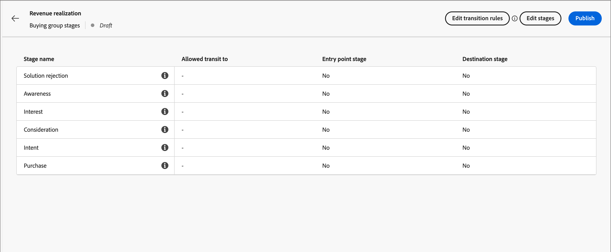

# Étapes du groupe d’achat

Les étapes de groupes d&#39;achat sont conçues pour suivre l&#39;évolution des groupes d&#39;achat dans la conversion des opportunités en clients. Utilisez cette fonctionnalité pour suivre la progression du groupe d&#39;achat et identifier les meilleures actions suivantes pour les membres du groupe d&#39;achat.

Définissez les étapes dans un modèle d’évaluation unique, en définissant plusieurs étapes et le flux de transition entre elles. Une ou plusieurs étapes sont désignées pour l&#39;entrée dans le cycle de vie. Le modèle permet également une progression non linéaire, où vous pouvez spécifier des transitions d&#39;une étape à une autre, par exemple de l&#39;étape A vers les étapes B, C ou D. Il est nécessaire qu’une étape soit désignée comme étape de succès, par exemple un achat ou un contrat signé. Il est facultatif qu’une autre étape soit désignée comme une étape d’échec, par exemple un contrat rejeté ou l’achat d’une solution concurrente auprès d’un autre fournisseur. Pour ce faire, des [tableaux de bord intelligents](../dashboards/intelligent-dashboard.md) montrent la progression des groupes d&#39;achats en termes de réalisation d&#39;une opportunité de vente ou de conversion d&#39;une opportunité en client.

{width="800" zoomable="yes"}

{width="30"} [Regardez la présentation vidéo](#overview-video)

## Définir le modèle des étapes du groupe d&#39;achats

Vous créez et configurez un modèle d&#39;étapes de groupe d&#39;achats en :

* Ajouter les étapes du cycle de vie
* Définir les flux de transition
* Désigner les étapes d&#39;entrée et de destination

Un seul modèle est pris en charge. Il est donc important de travailler avec vos équipes marketing et vente pour planifier le modèle optimal pour votre organisation avant de le créer et de le publier dans Journey Optimizer B2B edition.<!-- Initially, only one stage model can be created, but future releases will support multiple stage models, allowing users to select which model to use in a journey. -->

Lorsque vous créez le modèle d&#39;étape de groupe d&#39;achats, il est automatiquement à l&#39;état _Brouillon_ et ne peut pas être supprimé ou renommé. Il reste dans ce statut lorsque vous définissez les étapes et configurez le flux de transition entre les étapes. Lorsque le modèle a le statut Publié (_Actif_), il ne peut pas être modifié.

### Création du modèle

1. Dans le volet de navigation de gauche, accédez à **[!UICONTROL Comptes]** > **[!UICONTROL Groupes d’achat]**.

1. Sur la page Groupes d&#39;achat, sélectionnez l&#39;onglet **[!UICONTROL Étapes]**.

   {width="800" zoomable="yes"}

   Cet onglet _[!UICONTROL Étapes]_ est à l’état _vide_ jusqu’à ce que vous créiez le modèle.

1. Cliquez sur **[!UICONTROL Créer un modèle]** au centre de la page.

1. Dans la boîte de dialogue, saisissez le **[!UICONTROL Nom]** (obligatoire) et le **[!UICONTROL Description]** (facultatif) pour le modèle.

   {width="700" zoomable="yes"}

   Si vous cliquez sur _[!UICONTROL Annuler]_ dans cette boîte de dialogue, vous revenez à l’onglet _[!UICONTROL Étapes]_ à l’état _vide_.

1. Cliquez sur **[!UICONTROL Créer]**.

### Définition des étapes

Une fois le modèle créé, il s’ouvre dans l’espace de travail et vous êtes invité à créer les étapes du modèle.

1. Cliquez sur **[!UICONTROL Modifier les étapes]**.

   {width="700" zoomable="yes"}

1. Définissez la première étape en saisissant le **[!UICONTROL Nom]** (obligatoire) et le **[!UICONTROL Description]** (facultatif).

   {width="700" zoomable="yes"}

   Il n’est pas nécessaire d’ajouter les étapes dans un ordre spécifique, mais cela détermine la manière dont les étapes sont répertoriées dans la page des détails du modèle. Vous désignez l&#39;étape d&#39;entrée et le flux entre les étapes lorsque vous définissez les règles de transition.

1. Cliquez sur **[!UICONTROL Ajouter une étape]** et répétez l’étape 2 pour définir une autre étape.

   Répétez cette étape jusqu’à ce que vous disposiez des étapes nécessaires pour le modèle.

   {width="700" zoomable="yes"}

1. Lorsque les étapes que vous avez définies vous conviennent, cliquez sur **[!UICONTROL Enregistrer]**.

   >[!IMPORTANT]
   >
   >**Une fois les étapes du groupe d&#39;achats enregistrées, elles ne peuvent pas être supprimées.** Cependant, vous pouvez modifier le nom et la description de n’importe quelle étape tant que le modèle conserve l’état _Brouillon_.

### Configurer le workflow et les règles de transition

Une fois les étapes enregistrées, vous revenez à l’espace de travail de modèle. La colonne _[!UICONTROL Transit autorisé vers]_ est vide, ce qui indique que les règles de transition pour les étapes de modèle ne sont pas encore définies.

{width="700" zoomable="yes"}

Les règles de transition déterminent comment un groupe d&#39;achat peut passer d&#39;une étape à une autre. Par exemple, il peut passer d&#39;une étape d&#39;entrée à une étape intermédiaire, et d&#39;une étape intermédiaire à diverses autres étapes. Une étape d&#39;entrée est une étape initiale qu&#39;un groupe d&#39;achats peut entrer à partir d&#39;un état vide, et les étapes de destination sont classées comme étapes de succès ou d&#39;échec.

1. Cliquez sur **[!UICONTROL Modifier les règles de transition]** en haut à droite.

   Cette action ouvre la boîte de dialogue _[!UICONTROL Modifier les règles de l’étape]_, dans laquelle vous définissez la logique du flux.

   Lorsque vous définissez les options, il existe des mécanismes de sécurisation et des messages intégrés pour vous aider à éviter de faire des erreurs de logique dans le flux. Vous pouvez cliquer sur _[!UICONTROL Annuler]_ pour fermer la boîte de dialogue et revenir à la page de l’onglet _[!UICONTROL Étapes]_ sans modification.

1. Dans la section _[!UICONTROL Sélectionner une étape]_, indiquez les étapes de début et de fin du flux :

   * **[!UICONTROL Étape du point d&#39;entrée]** (obligatoire) - Désignez une ou plusieurs étapes d&#39;entrée pour l&#39;opportunité du groupe d&#39;achat.

   * **[!UICONTROL Étape de succès]** (obligatoire) - Désignez l’étape qui indique que l’opportunité du groupe d’achats a réussi (destination).

   * **[!UICONTROL Étape d&#39;échec]** (facultatif) - Désignez une ou plusieurs étapes indiquant que l&#39;opportunité du groupe d&#39;achat a atteint un point d&#39;échec (destination).

   {width="700" zoomable="yes"}

1. Pour chaque étape hors destination, définissez une ou plusieurs étapes qui viennent ensuite dans le flux (transition).

   Toutes les étapes hors destination doivent avoir au moins une étape **[!UICONTROL transit autorisé vers]** sélectionnée. Dans le cas contraire, la logique du modèle n’est pas valide et les comptes peuvent être _bloqués_ à ce stade, sans possibilité de réussite ou d’échec.

   {width="700" zoomable="yes"}

   Vous pouvez éventuellement définir une transition à partir d’une étape d’échec. Par exemple, vous pouvez désigner une étape nommée _Aucune réponse_ comme étape d’échec. Mais aussi désigner une étape appelée _Résurgence_ comme transition possible pour identifier les cas où un compte inactif est réactivé.

1. Cliquez sur **[!UICONTROL Enregistrer]**.

   Avec le retour à la page des détails du modèle, les étapes sont répertoriées dans un tableau avec les transitions autorisées, ainsi que les propriétés de destination et d’entrée.

| Colonne | Description |
| ------ | ---------- |
| **[!UICONTROL Nom de l’étape]** | Nom de l’étape. Cliquez sur l’icône d’informations pour afficher la description de l’étape. |
| **[!UICONTROL Transit autorisé vers]** | Répertorie les étapes valides pour une action _déplacer vers_ dans le modèle. |
| **[!UICONTROL Étape du point d’entrée]** | Indique si l’étape est valide comme étape de point d’entrée ([!UICONTROL Oui] ou [!UICONTROL Non]). |
| **[!UICONTROL Destination]** | Indique si l’étape est désignée comme étape de destination ([!UICONTROL  Succès ] ou [!UICONTROL  Échec ]). |

{width="700" zoomable="yes"}

## Modification d’un modèle de brouillon

Tant que le modèle des étapes du groupe d&#39;achat reste à l&#39;état _Brouillon_, vous pouvez modifier les étapes et les règles de transition.

Pour afficher le modèle de brouillon :

1. Dans le volet de navigation de gauche, accédez à **[!UICONTROL Comptes]** > **[!UICONTROL Groupes d’achat]**.

1. Sur la page _Groupes d&#39;achat_, sélectionnez l&#39;onglet **[!UICONTROL Étapes]**.

1. Cliquez sur le nom du modèle pour ouvrir les détails du modèle.

### Modification des étapes du modèle

1. Cliquez sur **[!UICONTROL Modifier les étapes]**.

   Dans la boîte de dialogue _[!UICONTROL Modifier les étapes]_, vous pouvez ajouter de nouvelles étapes ou modifier le nom et la description des étapes existantes.

   * Modifiez le **[!UICONTROL Nom]** ou **[!UICONTROL Description]** de n’importe quelle étape selon les besoins.

   * Faites défiler l’écran vers le bas et cliquez sur **[!UICONTROL Ajouter une étape]** pour définir une nouvelle étape pour le modèle, si nécessaire.

1. Lorsque les étapes que vous avez définies vous conviennent, cliquez sur **[!UICONTROL Enregistrer]**.

   Vous pouvez également cliquer sur _[!UICONTROL Annuler]_ pour fermer la boîte de dialogue et revenir à la page des détails du modèle sans modification.

### Modifier les règles de transition du modèle

1. Cliquez sur **[!UICONTROL Modifier les règles de transition]**.

1. Dans la boîte de dialogue _Modifier les règles de l’étape_, modifiez les options de flux selon vos besoins.

   Voir [Configurer le workflow et les règles de transition](#configure-the-workflow-and-transition-rules) pour plus d’informations sur ces options et sur la manière dont elles affectent le flux du modèle.

1. Lorsque les règles de transition définies vous conviennent, cliquez sur **[!UICONTROL Enregistrer]**.

   Vous pouvez également cliquer sur _[!UICONTROL Annuler]_ pour fermer la boîte de dialogue et revenir à la page des détails du modèle sans modification.

## Publier le modèle des étapes du groupe d&#39;achat

En l’absence d’erreur de validation, le modèle peut être publié. Lorsqu’il est publié, il passe à l’état _Actif_ et peut être utilisé pour faire progresser les étapes du groupe d’achats dans les parcours de compte.

>[!IMPORTANT]
>
>**Une fois le modèle publié, il ne peut pas être mis à jour ni supprimé.** Assurez-vous que ce que vous avez est correct avant de publier le modèle.

1. Examinez attentivement les étapes et transitions définies.

   Si des révisions sont nécessaires, modifiez les étapes de modèle.

1. Cliquez sur **[!UICONTROL Publier]**.

1. Dans la boîte de dialogue de confirmation, cliquez sur **[!UICONTROL Publier]**.

   Lorsque la page des détails du modèle est de nouveau affichée, le modèle est désigné comme _[!UICONTROL En ligne]_. Cliquez sur la flèche _Précédent_ en haut à gauche pour revenir à la page de l’onglet _[!UICONTROL Étapes]_.

{width="700" zoomable="yes"}
<!-- list these later when the Published columns are working correctly

Columns - Name, Status, Created by, Created date, Last updated by, Last update, Published by, Published on.
Name - Name of the stage model, hyperlinked. Clicking on it will navigate to the stage inventory page. 
Info icon beside the name - display the description on click.
Status - Live, Draft. If a draft stage model is Published, then its status is updated to Live. -->

## Utiliser le modèle dans les parcours de compte

Lorsque le modèle d&#39;étapes d&#39;achat est à l&#39;état _En ligne_ (publié), ajoutez le modèle aux centres d&#39;intérêt de la solution où vous souhaitez l&#39;utiliser pour suivre la progression du groupe d&#39;achats. Dans vos parcours de compte, vous pouvez inclure des actions pour faire passer les comptes à une étape spécifiée et ajouter des transitions d’étape en tant qu’événements qui déterminent la façon dont les comptes se déplacent dans le parcours.

### Association d’intérêt de solution

Pour chaque intérêt de solution existant auquel vous souhaitez associer le modèle étapes de groupe d&#39;achat, ouvrez les détails de l&#39;intérêt de solution et ajoutez le modèle. Vous pouvez également ajouter le modèle aux propriétés lorsque vous [créez un intérêt de solution](./solution-interests.md#create-a-solution-interest).

1. Sélectionnez l’onglet _[!UICONTROL Intérêt de la solution]_.

1. Ouvrez l’intérêt de la solution à l’aide de l’une des méthodes suivantes pour ouvrir les propriétés de l’intérêt de la solution que vous souhaitez modifier :

   * Cliquez sur le nom de la solution qui vous intéresse.
   * Cliquez sur les points de suspension (**...**) en regard et choisissez **[!UICONTROL Modifier]**.

   {width="500" zoomable="no"}

1. Sélectionnez le modèle **[!UICONTROL Étape du groupe d&#39;achat]** pour utiliser la progression de l&#39;étape du groupe d&#39;achat (facultatif).

   {width="700" zoomable="yes"}

1. Si nécessaire, modifiez le paramètre **[!UICONTROL Mettre à jour les groupes d&#39;achats existants]**.

   Lorsque cette option est activée, tous les groupes d&#39;achats existants associés à la solution recherchée sont mis à jour tout au long du cycle de synchronisation de 24 heures.

1. Cliquez sur **[!UICONTROL Enregistrer]**.

### Partage de chemins

À l’aide d’un [nœud de chemin de partage](../journeys/journey-nodes.md#split-paths), vous pouvez filtrer au niveau du compte ou au niveau des personnes en fonction des étapes du groupe d’achat. Par exemple, ajoutez une étape de groupe d’achats comme condition de chemin lors du fractionnement de chemins par membre de groupe d’achats.

>[!BEGINTABS]

>[!TAB Niveau du compte]

1. Ouvrez le parcours de compte dans l’éditeur.

1. Cliquez sur l’icône plus ( **+** ) d’un chemin d’accès et choisissez **[!UICONTROL Fractionner les chemins]**.

   {width="300"}

1. Dans les propriétés de nœud sur la droite, choisissez **[!UICONTROL Comptes]** pour la division.

1. Pour définir une condition applicable à _[!UICONTROL Chemin 1]_, cliquez sur **[!UICONTROL Appliquer la condition]**.

   {width="500"}

1. Dans l’éditeur de conditions, ajoutez le filtre Groupe d’achats pour définir le chemin de partage.

   * Sur la gauche, développez l’attribut **[!UICONTROL Filtres spéciaux]** en bas et faites glisser l’attribut **[!UICONTROL A un groupe d’achat]** sur l’espace de travail des filtres.

   * Définissez le **[!UICONTROL Intérêt de la solution]** sur celui associé au modèle étapes du groupe d&#39;achat.

   * Cliquez sur **[!UICONTROL Ajouter une contrainte]** et choisissez **[!UICONTROL Étape du groupe d&#39;achat]**.

     {width="700" zoomable="yes"}

   * Cliquez sur **[!UICONTROL Terminé]**.

   Le chemin de division est défini dans les propriétés de nœud sur la droite.

   {width="600" zoomable="yes"}

1. Continuez à définir d’autres chemins d’accès pour le nœud partagé et enregistrez le parcours.

>[!TAB Niveau des personnes]

1. Ouvrez le parcours de compte dans l’éditeur.

1. Cliquez sur l’icône plus ( **+** ) d’un chemin d’accès et choisissez **[!UICONTROL Fractionner les chemins]**.

   {width="300"}

1. Dans les propriétés de nœud sur la droite, choisissez **[!UICONTROL Personnes]** pour la division.

   Laissez la valeur par défaut pour _[!UICONTROL Attribut utilisé pour les conditions]_ en tant qu’**[!UICONTROL Attributs de personnes uniquement]**.

1. Pour définir une condition applicable à _[!UICONTROL Chemin 1]_, cliquez sur **[!UICONTROL Appliquer la condition]**.

   {width="500"}

1. Dans l’éditeur de conditions, ajoutez le filtre Groupe d’achats pour définir le chemin de partage.

   * Sur la gauche, développez l’attribut **[!UICONTROL Filtres spéciaux]** en bas et faites glisser l’attribut **[!UICONTROL Membre du groupe d’achat]** sur l’espace de travail des filtres.

   * Définissez le **[!UICONTROL Intérêt de la solution]** sur celui associé au modèle étapes du groupe d&#39;achat.

   * Cliquez sur **[!UICONTROL Ajouter une contrainte]** et choisissez **[!UICONTROL Étape du groupe d&#39;achat]**.

     {width="700" zoomable="yes"}

   * Cliquez sur **[!UICONTROL Terminé]**.

   Le chemin de division est défini dans les propriétés de nœud sur la droite.

   {width="600" zoomable="yes"}

1. Continuez à définir d’autres chemins d’accès pour le nœud partagé et enregistrez le parcours.

>[!ENDTABS]

### Mettre à jour l&#39;action du compte d&#39;étape du groupe d&#39;achats

À l’aide d’un [nœud d’action de compte](../journeys/journey-nodes.md#add-an-account-action), vous pouvez mettre à jour l’étape du groupe d’achats. La définition de ce nœud implique la sélection de la solution qui vous intéresse et la définition de la nouvelle étape pour le groupe d&#39;achat.

>[!NOTE]
>
>Si la nouvelle étape n’est pas une transition valide (comme définie dans le modèle), l’action n’est pas appliquée au compte.

1. Ouvrez le parcours de compte dans l’éditeur.

1. Cliquez sur l’icône plus ( **+** ) d’un chemin d’accès et choisissez **[!UICONTROL Effectuer une action]**.

   {width="400"}

1. Dans les propriétés de nœud sur la droite, choisissez **[!UICONTROL Comptes]** pour l’action.

1. Définissez l&#39;action de mise à jour de l&#39;étape du groupe d&#39;achats.

   * Pour **[!UICONTROL Action sur les comptes]**, sélectionnez **[!UICONTROL Mettre à jour l&#39;étape du groupe d&#39;achats]**.

   * Pour **[!UICONTROL Sélectionner la solution qui vous intéresse]**, sélectionnez-en une qui est associée au modèle des étapes du groupe d&#39;achat.

   * Pour **[!UICONTROL Nouvelle étape]**, sélectionnez l’étape pour effectuer la transition du compte.

   L’action est définie dans les propriétés de nœud sur la droite.

   {width="600" zoomable="yes"}

1. Continuez pour apporter d’autres modifications et enregistrez le parcours.

### Événement de compte

Utilisez l&#39;occurrence d&#39;un changement d&#39;étape de groupe d&#39;achat pour faire passer le compte à l&#39;étape suivante du parcours. La définition de ce nœud implique la sélection de l&#39;intérêt de la solution et des contraintes supplémentaires pour satisfaire le déclencheur d&#39;événement.

1. Ouvrez le parcours de compte dans l’éditeur.

1. Cliquez sur l’icône plus ( **+** ) d’un chemin et choisissez **[!UICONTROL Écouter un événement]**.

   {width="400"}

1. Dans les propriétés de nœud sur la droite, choisissez **[!UICONTROL Comptes]** pour le type d’événement.

1. Pour **[!UICONTROL Sélectionner un événement de compte]**, choisissez **[!UICONTROL Modifier l&#39;étape du groupe d&#39;achats]**.

1. Cliquez sur **[!UICONTROL Modifier l’événement]** et définissez les détails de l’événement.

   * Pour **[!UICONTROL Intérêt de la solution]**, faites correspondre la condition pour un intérêt de la solution associé au modèle d&#39;étapes du groupe d&#39;achat.

   * Cliquez sur **[!UICONTROL Ajouter une contrainte]** et sélectionnez la modification de l&#39;étape du groupe d&#39;achats que vous souhaitez utiliser pour déclencher l&#39;événement.

     {width="700" zoomable="yes"}

   * Cliquez sur **[!UICONTROL Terminé]**.

   L’événement est défini dans les propriétés de nœud sur la droite.

   {width="700" zoomable="yes"}

1. Continuez pour apporter d’autres modifications et enregistrez le parcours.

## Vidéo de présentation

>[!VIDEO](https://video.tv.adobe.com/v/3448634/?learn=on)
