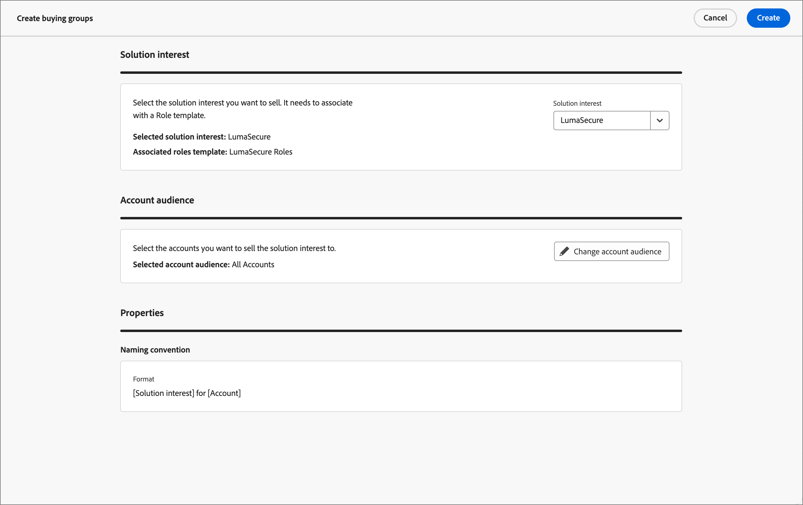

# Créer des groupes d’achat

Une fois le groupe d’achat créé, il peut être utilisé dans un parcours de compte par le biais de l’ [intérêt de la solution](./solution-interests.md).

1. Sur la page d’accueil de Adobe Experience Platform, cliquez sur Adobe Journey Optimizer B2B Edition.

1. Dans le volet de navigation de gauche, cliquez sur **[!UICONTROL Groupes d’achats]**.

1. Sur la page _[!UICONTROL Groupes d’achats]_, cliquez sur l’icône **[!UICONTROL Créer des groupes d’achats]** en haut à droite de la page.

   {width="700" zoomable="yes"}

1. Suivez les invites sur chaque page et cliquez sur **[!UICONTROL Suivant]** pour continuer.

{width="30"} [Regardez la vidéo pratique](#how-to-video)

## Page d’orientation

La première page fournit des conseils sur les conditions préalables/composants nécessaires à la création de groupes d’achats. Si vous savez que vous disposez des composants nécessaires, cliquez sur **[!UICONTROL Suivant]**.

## Composants

1. Sélectionnez chaque composant à utiliser :

   * **[!UICONTROL Centre d’intérêt de la solution]** - Sélectionnez l’intérêt de la solution dans la liste.

   * **[!UICONTROL Audience du compte]** - Cliquez sur # et sélectionnez une audience de compte dans la liste.

   Sous _[!UICONTROL Propriétés]_, le nom des groupes d’achats est généré automatiquement (lecture seule) en tant que &lt; Nom d’intérêt de la solution > pour &lt; nom du compte >.

   {width="700" zoomable="yes"}

1. Après avoir sélectionné l’intérêt de la solution et l’audience du compte, cliquez sur **[!UICONTROL Créer]**.

## Confirmation

La boîte de dialogue de confirmation fournit un résumé du processus de groupes d’achat et une estimation du temps d’achèvement. Pour confirmer et lancer le processus, cliquez sur **[!UICONTROL Créer]**.

{width="400" zoomable="yes"}

Vous pouvez accéder à l’onglet Intérêt de la solution et afficher le nombre de tâches créées pour l’intérêt de la solution.

{width="700" zoomable="yes"}

<!-- Other buying group activities:

Member of buying group.
Assign a member of the buying group.
Remove a member of the buying group. -->

## Vidéo pratique

>[!VIDEO](https://video.tv.adobe.com/v/3433081/?learn=on)
