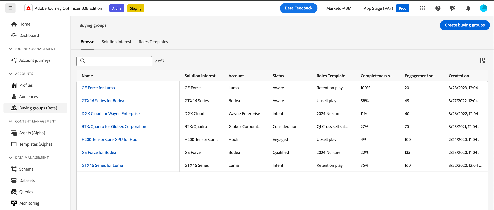

# Groupes d’achat

Pour les activités de vente et de marketing B2B, les comptes sont la clé de toute stratégie. Chaque compte est associé à un groupe de personnes, qui peuvent être des employés du compte ou des sous-traitants qui travaillent avec le compte. Les comptes sont hiérarchisés et différents produits peuvent être vendus à différents niveaux de la hiérarchie. Par exemple, Adobe Experience Platform peut être vendu au niveau de l’entreprise à un compte de niveau supérieur. Quant à Adobe Photoshop, il peut être vendu à un compte qui représente une division ou un service au sein d’une organisation, par exemple un service de conception au sein d’une grande entreprise.

{width="800"}

Dans le compte, il peut y avoir un sous-ensemble de personnes qui composent le _groupe d’achat_. Ce sont ces personnes qui prennent la décision d’achat. Elles ont donc besoin d’une attention particulière de la part des spécialistes du marketing et peuvent avoir besoin d’informations différentes de celles fournies aux autres personnes associées au compte. Les groupes d’achat peuvent comprendre un groupe différent de personnes pour différentes gammes de produits ou offres. Par exemple, un produit de cybersécurité peut généralement nécessiter l’approbation d’un achat par un directeur des systèmes d’information ou un directeur de la sécurité, ainsi que par un représentant du service juridique. Un produit de suivi des bogues peut généralement avoir un vice-président de l’ingénierie et un directeur informatique comme membres du groupe d’achat.

{width="30"} [Regarder la vidéo de présentation](#overview-video)

## Composants clés

Vous pouvez accroître l&#39;efficacité du marketing en établissant des groupes d&#39;achat dans Journey Optimizer B2B edition qui identifient les membres de vos listes de comptes cibles en fonction des solutions que vos équipes commerciales sont chargées de vendre. Avant que vous et votre équipe marketing ne commenciez à créer vos groupes d’achats, assurez-vous que vous avez défini les composants clés. Ces composants sont essentiels pour atteindre les buts et objectifs de votre entreprise.

| Composant | But |
| --------- | ------- |
| Intérêt de la solution | Ce composant fournit la réponse aux questions suivantes : <ul><li>En tant qu’organisation de marketing, que vendez-vous ?</li><li>Quels produits ou gammes de produits souhaitez-vous vendre ?</li></ul>  **_Exemple:_** vente croisée de nouveaux produits X à des clients existants |
| Audience de compte | Ce composant fournit la réponse aux questions suivantes : <ul><li>À qui vendez-vous ?</li><li>Quelle est la liste des comptes ciblés ?</li></ul> **_Exemple:_** segment de compte défini par des comptes avec le produit Y dont le chiffre d’affaires est supérieur à 1 million |
| Modèles de rôles du groupe d’achat | Ce composant fournit la réponse aux questions suivantes : <ul><li>Quels rôles ciblez-vous ?</li><li>Quel ensemble de règles est utilisé pour déterminer qui est affecté à des rôles de groupe d’achat ?</li></ul>  **_Exemple:_** attribuez le rôle de décideur à une personne ayant le titre d’administrateur délégué |
| Étapes des groupes d’achat | (Facultatif) Ce composant fournit la réponse à la question suivante : comment suivre les étapes de succès et d’échec des groupes d’achat ? |

## Affectation de membre

Les membres peuvent être affectés à un groupe d&#39;achat ou supprimés de celui-ci de trois manières différentes. La liste suivante décrit ces méthodes d’ajout et de suppression dans l’ordre de priorité. La méthode supérieure a la priorité la plus élevée et une méthode inférieure ne peut pas la remplacer.

1. **_Action manuelle_** - Action manuelle d&#39;ajout ou de suppression de membre effectuée par un commercial pour le groupe d&#39;achats
2. **_Action de Parcours_** - Parcours [nœuds d&#39;action pour l&#39;appartenance à un groupe d&#39;achat](../journeys/action-nodes.md#add-a-people-based-action) (_Affecter au groupe d&#39;achat_ ou _Supprimer du groupe d&#39;achat_)
3. **_Tâches système_** - Tâches de groupe d’achat [création](../buying-groups/buying-groups-create.md#buying-group-creation-jobs) et de maintenance.

Pour garantir que l&#39;affectation de membre dans un groupe d&#39;achat ne soit pas remplacée de manière incorrecte, cette liste est dans l&#39;ordre de priorité suivi dans le système pour garantir une affectation de membre précise. Par exemple, lorsqu’un commercial ajoute manuellement un membre au groupe d’achats, il ne souhaite pas qu’une tâche de maintenance modifie cet ajout. En suivant l’ordre de priorité, les scénarios suivants sont appliqués :

* Si l&#39;utilisateur affecte manuellement un membre à un groupe d&#39;achats et que celui-ci est suivi d&#39;une tâche de maintenance du groupe d&#39;achats qui supprime le même membre du groupe d&#39;achats, la tâche de maintenance **ne supprime pas** ce membre et ne peut pas remplacer l&#39;affectation manuelle.
* Si l&#39;utilisateur affecte manuellement un membre à un groupe d&#39;achats et qu&#39;ensuite un nœud de parcours déclenché supprime le même membre du groupe d&#39;achats, l&#39;action de nœud **ne supprime pas** ce membre et ne peut pas remplacer l&#39;affectation manuelle.
* Si un nœud d&#39;action de parcours déclenché ajoute un membre à un groupe d&#39;achats et que celui-ci est suivi d&#39;une tâche de maintenance du groupe d&#39;achats qui supprime le même membre du groupe d&#39;achats, la tâche de maintenance **ne supprime pas** ce membre et ne peut pas remplacer l&#39;affectation d&#39;action de parcours.

## Workflow du groupe d’achat

1. Créez des groupes d’achats.

   * Définir l’[intérêt de la solution](./solution-interests.md) et le [modèle de rôle](./buying-groups-role-templates.md)
   * [Créez le groupe d’achat](./buying-groups-create.md#create-buying-groups), puis affectez les [étapes du groupe d’achat](./buying-group-stages.md).

1. Identifier les personnes manquantes par exhaustivité.

   Analysez le groupe d’achat à l’aide de filtres.

   **_Example:_** le rôle du décideur est manquant et le score d&#39;exhaustivité est &lt; 50

1. Renseignez les définitions des groupes d’achat.
<!--
   * Acquire missing people
   * Send to LinkedIn Destination
   * Enrich with Zoominfo -->

1. Ajoutez des actions de groupe d&#39;achat à vos parcours de compte.

## Afficher les groupes d’achat et les composants

Dans le volet de navigation de gauche, développez **[!UICONTROL Comptes]** et cliquez sur **[!UICONTROL Groupes d’achat]**.

La page _[!UICONTROL Groupes d’achat]_ est organisée sous forme d’onglets :

| Tabulation | Description |
| --- | ----------- |
| [!UICONTROL Vue d’ensemble] | Cet onglet est le tableau de bord par défaut et affiche le [tableau de bord des groupes d’achats](../dashboards/buying-groups-dashboard.md). |
| [!UICONTROL Parcourir] | Cet onglet prend en charge les activités suivantes : <ul><li>Afficher la liste des groupes d’achat existants. </li><li>Effectuez une recherche par nom de groupe d&#39;achats. </li><li>Filtrer par intérêt de la solution. </li><li>Accéder aux détails du groupe d’achat. </li><li>Créez un groupe d’achat. </li></ul> |
| [!UICONTROL Intérêt de la solution] | Cet onglet prend en charge les activités suivantes : <ul><li>Afficher la liste des groupes d’achat existants. </li><li>Effectuez une recherche par nom de groupe d&#39;achats. </li><li>Accéder aux propriétés d’intérêt de la solution et les modifier. </li><li>Créer un intérêt de la solution. </li><li>Supprimer un intérêt de la solution. </li><li>Afficher et supprimer des tâches de groupe d’achat. </li></ul> |
| [!UICONTROL Modèles de rôles] | Cet onglet prend en charge les activités suivantes : <ul><li>Afficher la liste des modèles de rôles existants. </li><li>Rechercher par nom de modèle de rôles. </li><li>Accéder aux propriétés et conditions du modèle de rôles et les modifier. </li><li>Créer un modèle de rôles. </li><li>Supprimer un modèle de rôles. </li></ul> |
| [!UICONTROL Étapes] | Cet onglet prend en charge les activités suivantes : <ul><li>Afficher le modèle des étapes de groupes d’achat existants. </li><li>Accéder au modèle de brouillon des étapes de groupe d’achat et le modifier. </li><li>Créer le modèle des étapes du groupe d’achat. </li></ul> |

## Rechercher et filtrer des groupes d’achat

Utilisez l’onglet _[!UICONTROL Parcourir]_ pour accéder à la liste des groupes d’achat. Vous pouvez effectuer une recherche par nom et filtrer la liste par intérêt de la solution.

{width="800" zoomable="yes"}

## Détails du groupe d’achat

Pour accéder aux détails d’un groupe d’achats, cliquez sur le nom du groupe d’achat dans l’onglet _[!UICONTROL Parcourir]_. [En savoir plus](./buying-group-details.md)

{width="600" zoomable="yes"}

### Score d’exhaustivité du groupe d’achat

Le score d’exhaustivité est utilisé pour déterminer si le groupe d’achat est complet, ce qui signifie que les rôles sont attribués aux bons membres et qu’il peut être utilisé dans un parcours de compte. Ce score est un pourcentage basé sur le nombre de rôles au sein du groupe d’achat et le nombre de rôles affectés avec au moins un lead.

Par exemple, s’il existe quatre rôles au sein d’un groupe d’achat et que trois des quatre rôles sont affectés à au moins un lead, le groupe d’achat est complet à 75 %.

Le score d’exhaustivité de groupe d’achat est recalculé chaque fois qu’un groupe d’achat est créé ou mis à jour.

### Score d’engagement du groupe d’achat

Le score d’engagement de groupe d’achat est un nombre permettant de déterminer l’engagement des membres d’un groupe d’achat, en fonction des activités qu’ils effectuent.

* Le calcul du score de l’engagement démarre dès que le groupe d’achat est généré.
* Toute activité entrante effectuée par les membres du groupe d’achat au cours des 30 derniers jours est utilisée pour calculer le score.
* Avec une fenêtre de 30 jours et au fur et à mesure que les activités expirent, le score pourrait baisser.
* La fréquence quotidienne est plafonnée à 20 pour chaque activité. Si une personne membre d’un groupe d’achat effectue la même activité plus de 20 fois par jour, le nombre de l’activité est plafonné à 20 et non à un nombre supérieur.
* Le score affiché est arrondi. Par exemple, un score de 75,89999 est arrondi à 76.

+++Activités utilisées pour calculer le score

| Nom de l’activité | Description | Type d’engagement | Fréquences quotidiennes maximales | Poids de l’activité |
| --- | --- | --- | --- | --- |
| [!UICONTROL Visiter la page web] | Un membre visite une page web | Web | 20 | 40 |
| [!UICONTROL Remplir le formulaire] | Un membre remplit et envoie un formulaire sur une page web | Web | 20 | 40 |
| [!UICONTROL Cliquez sur Lien] | Un membre clique sur un lien d’une page web | Web | 20 | 40 |
| [!UICONTROL Ouvrir l’e-mail] | Un membre ouvre un email | E-mail | 20 | 30 |
| [!UICONTROL Cliquez sur E-mail] | Un membre clique sur un lien dans un e-mail | E-mail | 20 | 30 |
| [!UICONTROL Ouvrir l’e-mail de vente] | Un membre ouvre un e-mail de vente | E-mail | 20 | 30 |
| [!UICONTROL Cliquez sur E-mail de vente] | Un membre clique sur un lien dans un e-mail de vente | E-mail | 20 | 30 |
| [!UICONTROL Moment intéressant] | Un député vit un moment intéressant | Organisé | 20 | 60 |
| [!UICONTROL Appuyez sur Notification push] | Un membre reçoit une notification push. | Mobile | 20 | 30 |
| [!UICONTROL Activité des applications mobiles] | Un membre effectue une activité sur une application mobile | Mobile | 20 | 30 |
| [!UICONTROL Session sur application mobile] | Un membre est actif sur une session d’application mobile | Mobile | 20 | 30 |
| [!UICONTROL Remplissez Le Formulaire Publicités De Prospects Facebook] | Un membre remplit et envoie un formulaire Publicités du prospect sur une page Facebook | Social | 20 | 30 |
| [!UICONTROL Cliquez sur RTP Call to action] | Un membre clique sur un call to action personnalisé | Web | 20 | 60 |
| [!UICONTROL Afficher Le Message In-App] | Un membre consulte un message in-app | Mobile | 20 | 30 |
| [!UICONTROL Appuyez Sur Message In-App] | Un membre appuie sur un message in-app | Mobile | 20 | 30 |
| [!UICONTROL S’abonner aux SMS] | Un membre s’abonne aux communications SMS | SMS | 20 | 90 |
| [!UICONTROL Répondre à l’e-mail de vente] | Un membre répond à un e-mail de vente | E-mail | 20 | 30 |
| [!UICONTROL Boîte de dialogue] | Un membre ouvre une boîte de dialogue Dynamic Chat | Messagerie instantanée | 20 | 90 |
| [!UICONTROL Interaction avec le document dans la boîte de dialogue] | Un membre interagit avec un document dans une boîte de dialogue Dynamic Chat | Messagerie instantanée | 20 | 90 |
| [!UICONTROL Réunion programmée dans la boîte de dialogue] | Un membre planifie un rendez-vous dans une boîte de dialogue Dynamic Chat | Messagerie instantanée | 20 | 90 |
| [!UICONTROL Objectif De Boîte De Dialogue Atteint] | Un membre atteint un objectif dans une boîte de dialogue Dynamic Chat |  | 20 | 90 |
| [!UICONTROL A répondu à un sondage dans le webinaire] | Un membre répond à un sondage dans un événement de webinaire | Messagerie instantanée | 20 | 90 |
| [!UICONTROL Call to action a cliqué dans le webinaire] | Un membre clique sur un lien call-to-action dans un événement de webinaire | Appel | 20 | 30 |
| [!UICONTROL Téléchargements de ressources dans le webinaire] | Un membre télécharge un fichier/une ressource dans un événement de webinaire. | Événement | 20 | 60 |
| [!UICONTROL Pose des questions dans le webinaire] | Un membre pose des questions dans un événement de webinaire | Événement | 20 | 60 |
| [!UICONTROL A assisté à l’événement] | Un membre a assisté à un événement | Événement | 20 | 60 |
| [!UICONTROL Dialogue avec un agent] | Un membre engage le dialogue Dynamic Chat avec un agent | Messagerie instantanée | 20 | 90 |
| [!UICONTROL Lien cliqué dans la boîte de dialogue Conversation ] | Un membre clique sur un lien dans une boîte de dialogue Dynamic Chat | Messagerie instantanée | 20 | 90 |
| [!UICONTROL Engagé dans un flux de conversation] | Un membre s’engage dans un flux de conversation Dynamic Chat | Messagerie instantanée | 20 | 90 |
| [!UICONTROL Réunion planifiée dans le flux de conversation] | Un membre planifie un rendez-vous dans un flux de conversation Dynamic Chat | Messagerie instantanée | 20 | 90 |
| [!UICONTROL Objectif De Flux Conversationnel Atteint] | Un membre atteint un objectif dans un flux de conversation Dynamic Chat | Messagerie instantanée | 20 | 90 |
| [!UICONTROL Interaction avec un document dans le flux de conversation] | Un membre interagit avec un document dans un flux de conversation Dynamic Chat | Messagerie instantanée | 20 | 90 |
| [!UICONTROL Engagement avec un agent dans le flux de conversation] | Un membre interagit avec un agent dans un flux de conversation Dynamic Chat | Messagerie instantanée | 20 | 90 |
| [!UICONTROL Lien cliqué dans la conversation dans le flux de conversation] | Un membre clique sur un lien dans un flux de conversation Dynamic Chat | Messagerie instantanée | 20 | 90 |
| [!UICONTROL Cliquez sur Lien dans SMS V2] | Un membre clique sur un lien dans un SMS | SMS | 20 | 90 |

>[!NOTE]
>
>Les activités relatives au score d’engagement sont enregistrées dans le [journal d’activité d’une personne](https://experienceleague.adobe.com/fr/docs/marketo/using/product-docs/core-marketo-concepts/smart-lists-and-static-lists/managing-people-in-smart-lists/locate-the-activity-log-for-a-person){target="_blank"} de Marketo Engage.

+++

#### Pondération

Les utilisateurs et utilisatrices peuvent attribuer une _pondération_ à chaque rôle dans le modèle de rôles afin d’attribuer différents poids pour un rôle et calculer le score d’engagement.

{width="700" zoomable="yes"}

Chaque niveau de pondération se traduit par une valeur, qui est utilisée pour calculer le score d’engagement :

* [!UICONTROL Anodin] = 20
* [!UICONTROL Mineur] = 40
* [!UICONTROL Normal] = 60
* [!UICONTROL Important] = 80
* [!UICONTROL Vital] = 100

Un modèle de rôles avec trois rôles dont la pondération est _[!UICONTROL Vital]_, _[!UICONTROL Important]_ et _[!UICONTROL Normal]_ se traduit par les pourcentages pondérés suivants :

| Rôle | Pondération | Valeur du système | Calcul de la valeur | Pourcentage |
|-------------- |--------- |------------- |------------------ |---------- |
|               |          |              |                   |           |
| Décisionnaire | Vital | 100 | 100/240 | 41,67 % |
| Personne influente | Important | 80 | 80/240 | 33,33 % |
| Spécialiste | Normal | 60 | 60/240 | 25 % |
|               | Total | 240 |                   |           |

#### Exemple de calcul

L’exemple suivant illustre le calcul du score d’engagement à l’aide du pourcentage de poids du rôle indiqué, du nombre d’activités entrantes de chaque membre du groupe d’achat et d’une limite quotidienne de 20 pour chaque événement (s’il s’est produit plusieurs fois).

| Rôle | Membre | Type d’activité | Nombre d’hier | Nombre d’aujourd’hui | Calcul | Score total |
|-------------- |--------- |-------------|-----------------|-------------|------|-----------|
|               |          |             |                 |             |      |           |
| Décisionnaire | Adam | Site web consulté | 37 | 15 | 20 + 15 | 35 |
|               |          | E-mail faisant l’objet d’un clic | 1 | 1 | 1 + 1 | 2 |
|               |          |             |                 |             |      |           |
|               | Marque | Site web consulté | 5 | 3 | 5 + 3 | 8 |
|               |          | E-mail faisant l’objet d’un clic | 1 | 1 | 1 + 1 | 2 |
|               |          | Pub téléchargée | 3 | 2 | 3 + 2 | 5 |
| **Score total des décisionnaires** |         |             |                 |             |      | **52** |
|               |          |             |                 |             |      |           |
| Personne influente | John | Site web consulté | 19 | 9 | 19 + 9 | 28 |
| **Score total des personnes influentes** |         |             |                 |             |      | **28** |
|               |          |             |                 |             |      |           |
| Spécialiste | Bob | E-mail faisant l’objet d’un clic | 1 | 1 | 1 + 1 | 2 |
|               |          |             |                 |             |      |           |
|               | Paul | E-mail faisant l’objet d’un clic | 1 | 1 | 1 + 1 | 2 |
|               |          |             |                 |             |      |           |
|               | Calvin | E-mail faisant l’objet d’un clic | 1 | 1 | 1 + 1 | 2 |
|               |          | Site web consulté | 1 | 7 | 1 + 7 | 8 |
|               |          | Pub téléchargée | 1 | 2 | 1 + 2 | 3 |
| **Score total des spécialistes** |         |             |                 |             |      | **17** |

Le score d’engagement final est calculé en appliquant la pondération à chacun des scores de rôle :

| Rôle | Score total du rôle | Poids du rôle (%) | Score x poids (%) |
|-------------- |---------------- |------------- |---------------- |
| Décisionnaires | 52 | 41,67 % | 21,67 |
| Personnes influentes | 28 | 33,33 % | 9,33 |
| Spécialistes | 17 | 25 % | 4,25 |
| **Score d’engagement final** |                |             | **35,25** |

## Vidéo de vue d’ensemble

>[!VIDEO](https://video.tv.adobe.com/v/3433078/?learn=on)
