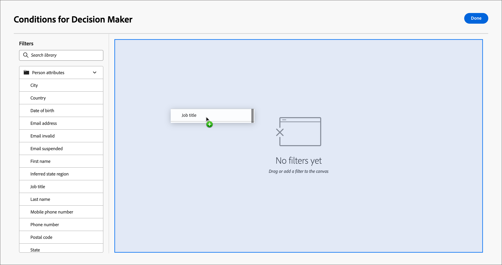

# Modèles de rôles du groupe d’achat

Dans un marché B2B, les décisions d’achat sont généralement prises par plusieurs personnes. Ces personnes participent au processus décisionnel en fonction de leur rôle au sein de l&#39;organisation. Créez des modèles de rôle Groupe d&#39;achats qui contiennent un groupe de définitions de rôle en fonction de chaque type d&#39;offre de produit ou de cas d&#39;utilisation de compte.

{width="30"} [Regarder la vidéo de présentation](#overview-video)

## Accès et navigation dans les modèles de rôle

1. Dans le volet de navigation de gauche, cliquez sur **[!UICONTROL Achats de groupes]**.

1. Sur la page _[!UICONTROL Groupes d’achat]_, sélectionnez l’onglet **[!UICONTROL Modèles de rôles]**.

   {width="800" zoomable="yes"}

   L’onglet fournit une liste d’inventaire de tous les modèles de rôles existants et affiche les informations suivantes au format de colonne :

   * [!UICONTROL Nom]
   * [!UICONTROL Statut]
   * [!UICONTROL Date de création]
   * [!UICONTROL Créé par]
   * [!UICONTROL Dernière mise à jour]
   * [!UICONTROL Dernière mise à jour par]
   * [!UICONTROL Publié sur]
   * [!UICONTROL Publié par]

   La liste est triée par défaut selon la _[!UICONTROL Dernière mise à jour]_. Tous les modèles de rôle ont le statut `Draft` ou `Live`.

1. Pour filtrer la liste par nom, utilisez le champ de recherche situé en haut de la liste.

   Saisissez les premiers caractères du nom pour réduire la liste affichée aux éléments correspondants.

   {width="700" zoomable="yes"}

## Création d’un modèle de rôles

1. Dans l’onglet _[!UICONTROL Modèles de rôles]_, cliquez sur **[!UICONTROL Créer un modèle]** dans le coin supérieur droit.

1. Dans la boîte de dialogue, saisissez un **[!UICONTROL Nom]** (obligatoire) et un **[!UICONTROL Description]** (facultatif) uniques pour le modèle.

   {width="400"}

1. Cliquez sur **[!UICONTROL Créer]**.

### Ajouter les rôles de modèles

Une fois le modèle créé, il s’ouvre dans l’espace de travail et vous êtes invité à ajouter les rôles. La première carte de rôle s’affiche par défaut.

Chaque rôle que vous définissez pour le modèle utilise un ensemble de filtres, ou _conditions_, pour déterminer les membres affectés au rôle. Utilisez les types de filtres suivants pour définir les conditions d’un rôle :

| Type | Condition |
| ---- | --------- |
| Attributs de la personne | <li>Adresse e-mail <li>E-mail non valide <li>E-mail interrompu <li>Numéro de fax <li>Prénom <li>Région déduite <li>Titre du traitement <li>Nom <li>Nom intermédiaire <li>Numéro téléphone mobile <li>Score d’engagement de la personne <li>Numéro de téléphone <li>Code postal <li>État <li>Désabonné <li>Raison désabonnement |
| Filtres spéciaux | <li>Membre de la liste <li>Membre du programme |
| Données d’intention | Intention de la catégorie <li>Intention du produit <li>Intention du mot-clé  [en savoir plus sur les données d’intention](../admin/intent-data.md). |

1. Pour la première carte de rôle, définissez les propriétés du rôle.

   * Choisissez le **[!UICONTROL rôle du groupe d&#39;achat]** dans la liste.

     Il existe six rôles par défaut : `Decision Maker`, `Influencer`, `Practitioner`, `Executive Steering Committee`, `Champion` et `Other`. La liste inclut également les [rôles personnalisés définis dans la liste _Rôles_](./default-custom-roles.md#custom-roles).

     {width="700" zoomable="yes"}

   * Définissez la **[!UICONTROL pondération]** pour le rôle, qui est utilisée pour calculer le score d’engagement.

     La valeur de chaque option est traduite en pourcentage pour le calcul du score : [!UICONTROL Trivial] = 20, [!UICONTROL Mineur] = 40, [!UICONTROL Normal] = 60, [!UICONTROL Important] = 80 et [!UICONTROL Vital] = 100.

     Par exemple, un modèle de rôle avec des rôles utilisant Vital, Important et Normal est ensuite converti en 100/240, 80/240, 60/240.

   * **[!UICONTROL Ajouter des conditions pour l&#39;affectation automatique]** - Cochez cette case pour ajouter des conditions pour l&#39;affectation automatique de membres au groupe d&#39;achats qui correspondent à la condition. Si la case n’est pas cochée, il n’est PAS nécessaire d’ajouter des conditions.

   * **[!UICONTROL Obligatoire pour le score d&#39;exhaustivité]** - Cochez cette case pour le rôle si vous souhaitez qu&#39;il soit obligatoire pour le calcul d&#39;un score d&#39;exhaustivité.

1. Cliquez sur **[!UICONTROL Ajouter une condition]** et définissez la règle conditionnelle pour le rôle.

   * Dans la boîte de dialogue _[!UICONTROL Condition]_, développez la liste des **[!UICONTROL attributs de personne]** et recherchez un attribut que vous souhaitez utiliser pour correspondre au rôle. Faites-la glisser vers la droite et déposez-la dans l’espace de filtrage.

     {width="700" zoomable="yes"}

     >[!NOTE]
     >
     >Si des champs de personne personnalisés sont définis dans le schéma d’audience du compte dans Experience Platform, ces champs peuvent également être utilisés en tant qu’attributs de personne dans des conditions.

   * Utilisez l’attribut pour créer un filtre correspondant à l’aide d’une ou de plusieurs valeurs.

     Dans l’exemple suivant, l’attribut Titre de la fonction est utilisé pour identifier une correspondance pour le décideur. Toute valeur pour le titre commençant par `Director` ou `Sr Director` est évaluée comme vraie pour la condition.

     {width="700" zoomable="yes"}

   * Si nécessaire, ajoutez un autre attribut et une autre condition qui affine davantage les critères d’une correspondance avec le rôle.

   * Cliquez sur **[!UICONTROL Terminé]**.

1. Pour chaque rôle supplémentaire que vous souhaitez inclure pour le modèle, cliquez sur **[!UICONTROL Ajouter un autre rôle]** et répétez les étapes 1 et 2 pour définir le rôle.

   {width="700" zoomable="yes"}

>[!BEGINSHADEBOX « Appartenance à une liste Marketo Engage »]

Dans Marketo Engage, les _campagnes intelligentes_ vérifient l’adhésion aux programmes pour vous assurer que les prospects ne reçoivent pas d’e-mails en double et ne sont pas membres de plusieurs flux d’e-mails en même temps. Dans Journey Optimizer B2B, vous pouvez vérifier l’appartenance à la liste Marketo Engage en tant que condition de votre modèle de rôles afin d’éliminer la duplication dans l’appartenance à un groupe d’achat et les activités de parcours.

Pour utiliser l’appartenance à une liste comme condition de rôle, développez **[!UICONTROL Filtres spéciaux]** et faites glisser la condition **[!UICONTROL Membre de la liste]** dans l’espace de filtrage. Renseignez ensuite la définition du filtre pour évaluer votre appartenance à une ou plusieurs listes Marketo Engage.

{width="700" zoomable="yes"}

>[!ENDSHADEBOX]

Vos modifications sont enregistrées automatiquement au statut _Brouillon_. Si vous n’êtes pas prêt à publier le modèle de rôles, cliquez sur la flèche de gauche (arrière) en haut de la page et revenez à la liste _[!UICONTROL Modèles de rôles]_.

### Publication du modèle de rôles

Si le modèle est prêt à l’emploi, cliquez sur **[!UICONTROL Publier]** en haut à droite.

La publication du modèle définit le statut sur _Actif_ et permet de l’associer à une solution qui présente un intérêt. Au moins un rôle défini doit être défini pour publier le modèle de rôles.

## Modifier un modèle de rôles de brouillon

Lorsqu’un modèle de rôles est à l’état _Brouillon_, vous pouvez continuer à modifier les rôles définis. Toutes les modifications que vous apportez sont automatiquement enregistrées.

Modifiez l’un des paramètres de l’en-tête de la carte de rôle, y compris le rôle du groupe d’achats, la pondération, l’affectation automatique et l’exigence de score d’exhaustivité.

{width="600"}

### Modifier les conditions d’un rôle

Pour modifier la logique de condition/filtrage de l’un des rôles, cliquez sur l’icône _Modifier_ (  ) en haut à droite de la carte de rôle. Cette action ouvre l’espace de travail _[!UICONTROL Conditions]_ dans lequel vous pouvez modifier un filtre existant, ajouter ou supprimer un filtre ou modifier la logique du filtre.

### Supprimer une carte de rôle

Si vous souhaitez supprimer un rôle du modèle, cliquez sur l’icône _Supprimer_ (  ) dans la vignette de rôle.

### Définir la priorité des rôles

Vous pouvez réorganiser les rôles au sein du modèle, ce qui détermine la priorité d’affectation des prospects à un rôle. Un contrôleur **[!UICONTROL Priorité]** est affiché à droite de chaque carte de rôle. Cliquez sur la flèche _Haut_ ou _Bas_ à droite pour déplacer la carte de rôle vers le haut ou vers le bas en priorité.

{width="700"}

## Suppression d’un modèle de rôles

Vous pouvez supprimer un modèle de rôles s’il a le statut _Brouillon_.

1. Sélectionnez le modèle de rôles dans la liste pour l’ouvrir.

1. Cliquez sur **[!UICONTROL Supprimer]** en haut à droite.

   {width="700"}

1. Dans la boîte de dialogue, cliquez sur **[!UICONTROL Supprimer]** pour confirmer.

## Vidéo de vue d’ensemble

>[!VIDEO](https://video.tv.adobe.com/v/3453301/?learn=on&captions=fre_fr)
