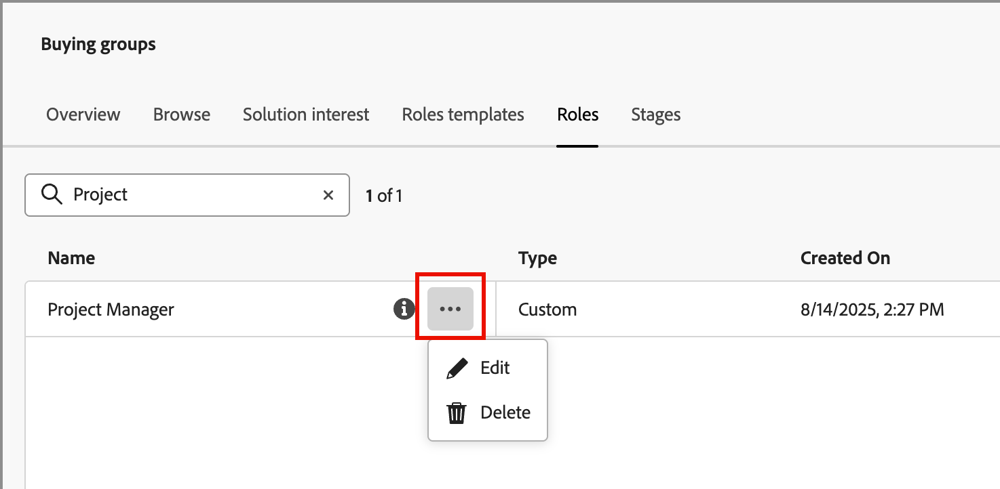

# Rôles par défaut et personnalisés

Journey Optimizer B2B edition comprend un ensemble de rôles par défaut qui sont utilisés dans les modèles de rôles pour les groupes d&#39;achat. Cependant, de nombreuses entreprises ont besoin de rôles personnalisés qu’elles peuvent définir en fonction de leurs objectifs et stratégies métier. Vous pouvez utiliser la liste _[!UICONTROL Rôles]_ pour créer vos propres définitions de rôle qui prennent en charge vos groupes d&#39;achats.

## Accéder aux rôles

1. Dans le volet de navigation de gauche, cliquez sur **[!UICONTROL Achats de groupes]**.

1. Sur la page _[!UICONTROL Groupes d&#39;achat]_, sélectionnez l&#39;onglet **[!UICONTROL Rôles]**.

   {width="700" zoomable="yes"}

   L’onglet fournit une liste d’inventaire de tous les rôles existants et affiche les informations suivantes au format de colonne :

   * [!UICONTROL Name] - Nom du rôle.
   * [!UICONTROL Type] - Tous les rôles ont un type `Default` ou `Custom`.
   * [!UICONTROL Créé le] - Pour un rôle personnalisé, date et heure de création du rôle.
   * [!UICONTROL Créé par] - Pour un rôle personnalisé, il s’agit de l’utilisateur qui a créé le rôle.
   * [!UICONTROL Dernière mise à jour le] - Pour un rôle personnalisé, date et heure de la dernière mise à jour du rôle.
   * [!UICONTROL Mis à jour par] - Pour un rôle personnalisé, dernier utilisateur à avoir mis à jour le rôle.

   La liste affiche les rôles par défaut en haut :

   * Décisionnaire
   * Personne influente
   * Spécialiste
   * Comité directeur exécutif
   * Champion
   * Autres

   >[!NOTE]
   >
   >Vous ne pouvez pas modifier ni supprimer les rôles par défaut. Il existe une limite maximale de 20 rôles, y compris les rôles par défaut et personnalisés.

## Créer un rôle personnalisé

1. Dans l’onglet _[!UICONTROL Rôles]_, cliquez sur **[!UICONTROL Créer un rôle]** dans le coin supérieur droit.

1. Dans la boîte de dialogue, saisissez un **[!UICONTROL Nom]** (obligatoire) et un **[!UICONTROL Description]** (facultatif) uniques pour le rôle.

   {width="400"}

1. Cliquez sur **[!UICONTROL Créer]**.

## Gestion des rôles personnalisés

Vous pouvez gérer vos rôles personnalisés dans l’onglet _[!UICONTROL Rôles]_ qui comprend la modification du nom et de la description du rôle, ainsi que la suppression d’un rôle de la liste des rôles. Cliquez sur l’icône du menu _Plus_ (**...**) à côté du nom du modèle de phases et choisissez **[!UICONTROL Modifier]** ou **[!UICONTROL Supprimer]**.

{width="600"}
