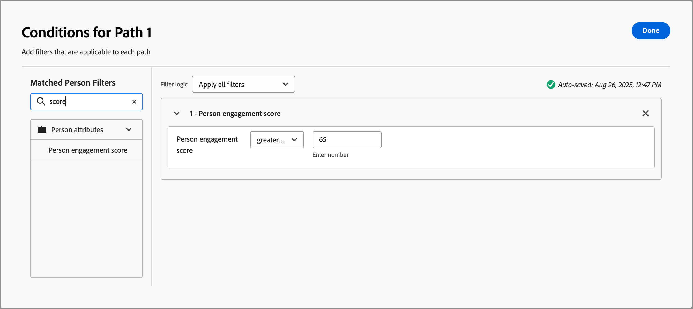

# Scores d’engagement {#engagement-scores}

>[!CONTEXTUALHELP]
>id="ajo-b2b_buying_group_engagement_score"
>title="Score d’engagement"
>abstract="Les scores d’engagement déterminent le niveau d’engagement des membres du groupe d’achat."

Un score d’engagement est un nombre qui indique le niveau d’engagement des membres d’un groupe d’achat. Ces scores sont basés sur les activités des membres du groupe d&#39;achat, les actions pondérées et les rôles pondérés. Les scores obtenus sont normalisés au sein d’un client (instance) afin de permettre une comparaison cohérente et de disposer d’informations exploitables. Le calcul de la note débute dès la création du groupe d&#39;achat. Le système de hub de données Journey Optimizer B2B edition calcule les scores quotidiennement et les charge dans le système MySQL de marketing multiniveau (MLM) à l’aide du service d’ingestion.

Il existe deux types de scores d’engagement :

* **Score d’engagement du groupe d’achat** - Le score d’engagement du groupe d’achat est un score normalisé compris entre 0 et 100 et est basé sur le score d’engagement calculé au niveau de la personne.

  Le score de l&#39;engagement du groupe d&#39;achats est affiché sur la page [ Détails du groupe d&#39;achats ](./buying-group-details.md). Vous pouvez également afficher les groupes d&#39;achats les plus engagés dans le tableau de bord Intelligent.

  {width="700" zoomable="yes"}

* **Score d’engagement de la personne** - Le score d’engagement de la personne est basé sur les activités d’un membre individuel du groupe d’achats.

  Le score d&#39;engagement de la personne pour chaque membre du groupe d&#39;achats est affiché dans la page des détails du groupe d&#39;achats [_[!UICONTROL onglet Membres ]_](./buying-group-details.md#buying-group-members). Ces scores sont également affichés dans les pages et les tableaux de bord qui incluent les membres les plus engagés et les informations de contacts qui se chevauchent.

  {width="550" zoomable="yes"}

>[!BEGINSHADEBOX]

Le score d’engagement de la personne est un attribut disponible à utiliser pour le filtrage dans les [modèles de rôles](./buying-groups-role-templates.md#add-the-template-roles) et les [nœuds de chemin fractionné par parcours ](../journeys/split-merge-paths-nodes.md#people-path-filters).

{width="550" zoomable="yes"}

>[!ENDSHADEBOX]

Toute activité pondérée par l&#39;engagement effectuée par les membres du groupe d&#39;achat au cours des 30 derniers jours est utilisée pour calculer les scores. Avec cette fenêtre de 30 jours, les occurrences d’activité expirent et les scores peuvent descendre (décroissance du score). Les scores affichés sont arrondis (par exemple, un score de 75,89999 s’affiche en tant que 76).

## Activités utilisées pour la notation de l’engagement

La notation du groupe d&#39;achats n&#39;est pas _basée sur le déclenchement_. Il s&#39;agit d&#39;un processus quotidien qui évalue l&#39;activité de l&#39;ensemble des membres du groupe d&#39;achat et recalcule le score. Les activités utilisent _poids_ pour informer la notation du groupe d’achats en fonction du modèle de pondération actif, qui détermine la pondération de chaque activité.

La limite de fréquence quotidienne est de 20 pour chaque activité. Si un membre d&#39;un groupe d&#39;achat effectue la même activité plus de 20 fois au cours d&#39;une seule journée, le nombre pour l&#39;activité est plafonné à 20.

| Nom de l’activité | Description | Type d’engagement | Fréquences quotidiennes maximales | Poids d’activité du modèle par défaut |
|---------------|-------------|-----------------|---------------------------|-------------------------------|
| Participer à l’événement | Un membre a participé à un événement. | Événement | 20 | 60 |
| E-mail sur lequel l’utilisateur a cliqué | Un membre clique sur un lien dans un e-mail. | E-mail | 20 | 30 |
| E-mail ouvert | Un membre ouvre un e-mail. | E-mail | 20 | 30 |
| Formulaire rempli | Un membre remplit et envoie un formulaire sur une page web. | Web | 20 | 40 |
| Moment intéressant | Un membre vit un moment significatif. | Organisé | 20 | 60 |
| Clics sur les liens | Un membre clique sur un lien d’une page web. | Web | 20 | 40 |
| Pages vues | Un membre consulte une page web | Web | 20 | 40 |
| S’inscrire à l’événement | Un membre inscrit à un événement | Événement | 20 | 60 |

<!-- old list

| Activity name | Description | Engagement type | Max daily frequency count | Activity weight |
| --- | --- | --- | --- | --- |
| [!UICONTROL Visit Webpage]| A member visits a web page | Web | 20 | 40 |
| [!UICONTROL Fill Out Form]| A member fills and submits a form on a web page | Web | 20 | 40 |
| [!UICONTROL Click Link] | A member clicks a link on a web page | Web | 20 | 40 |
| [!UICONTROL Open Email] | A member opens an email | Email | 20 | 30 |
| [!UICONTROL Click Email] | A member clicks a link in an email | Email | 20 | 30 |
| [!UICONTROL Open Sales Email] | A member opens a sales email | Email | 20 | 30 |
| [!UICONTROL Click Sales Email] | A member clicks a link in a sales email | Email | 20 | 30 |
| [!UICONTROL Interesting Moment] | A member has an interesting moment | Curated | 20 | 60 |
| [!UICONTROL Tap Push Notification] | A member receives a push notification | Mobile | 20 | 30 |
| [!UICONTROL Mobile App Activity] | A member performs an activity on a mobile app | Mobile | 20 | 30 |
| [!UICONTROL Mobile App Session] | A member is active on a mobile app session | Mobile | 20 | 30 |
| [!UICONTROL Fill Out Facebook Lead Ads Form] | A member fills and submits a Lead Ads form on a Facebook page | Social | 20 | 30 |
| [!UICONTROL Click RTP Call to Action] | A member clicks a personalized call to action | Web | 20 | 60 |
| [!UICONTROL View In-App Message] | A member views an in-app message | Mobile | 20 | 30 |
| [!UICONTROL Tap In-App Message] | A member taps an in-app message | Mobile | 20 | 30 |
| [!UICONTROL Subscribe SMS] | A member subscribes to SMS communications | SMS | 20 | 90 |
| [!UICONTROL Reply to Sales Email] | A member replies to a sales email | Email | 20 | 30 |
| [!UICONTROL Engaged with a Dialogue] | A member engages with a Dynamic Chat dialogue | Chat | 20 | 90 |
| [!UICONTROL Interacted with Document in Dialogue] | A member interacts with a document in a Dynamic Chat dialogue | Chat | 20 | 90 |
| [!UICONTROL Scheduled Meeting in Dialogue] | A member schedules an appointment in a Dynamic Chat dialogue | Chat | 20 | 90 |
| [!UICONTROL Reached Dialogue Goal] | A member reaches a goal in a Dynamic Chat dialogue |  |20 | 90 |
| [!UICONTROL Responded to a poll in webinar] | A member responds to a poll in a webinar event | Chat | 20 | 90 |
| [!UICONTROL Call to action clicked in webinar] | A member clicks a call-to-action link in a webinar event | Call | 20 | 30 |
| [!UICONTROL Asset downloads in webinar] | A member downloads a file/asset in a webinar event | Event | 20 | 60 |
| [!UICONTROL Asks questions in webinar] | A member asks questions in a webinar event | Event | 20 | 60 |
| [!UICONTROL Has attended event] | A member attended an event | Event | 20 | 60 |
| [!UICONTROL Engaged with an Agent in Dialogue] | A member engages with an agent in a Dynamic Chat dialogue | Chat | 20 | 90 |
| [!UICONTROL Clicked Link in Chat in Dialogue] | A member clicks a link in a Dynamic Chat dialogue | Chat | 20 | 90 |
| [!UICONTROL Engaged with a Conversational Flow] | A member engages with a Dynamic Chat conversational flow | Chat | 20 | 90 |
| [!UICONTROL Scheduled Meeting in Conversational Flow] | A member schedules an appointment in a Dynamic Chat conversational flow | Chat | 20 | 90 |
| [!UICONTROL Reached Conversational Flow Goal] | A member reaches a goal in a Dynamic Chat conversational flow | Chat | 20 | 90 |
| [!UICONTROL Interacted with Document in Conversational Flow] | A member interacts with a document in a Dynamic Chat conversational flow | Chat | 20 | 90 |
| [!UICONTROL Engaged with an Agent in Conversational Flow] | A member engages with an Agent in a Dynamic Chat conversational flow | Chat | 20 | 90 |
| [!UICONTROL Clicked Link in Chat in Conversational Flow] | A member clicks a link in a Dynamic Chat conversational flow | Chat | 20 | 90 |
| [!UICONTROL Click Link in SMS V2] | A member clicks a link in an SMS message | SMS | 20 | 90 | -->

>[!NOTE]
>
>Les activités Score d’engagement sont enregistrées dans le journal d’activité Marketo Engage d’une personne. Vous pouvez accéder à ce journal dans l’instance Marketo Engage connectée. Pour plus d’informations, voir [Rechercher le journal d’activité d’une personne](https://experienceleague.adobe.com/fr/docs/marketo/using/product-docs/core-marketo-concepts/smart-lists-and-static-lists/managing-people-in-smart-lists/locate-the-activity-log-for-a-person){target="_blank"} dans la documentation de Marketo Engage.

## Pondération du modèle de rôle {#engagement-score-weighting}

>[!CONTEXTUALHELP]
>id="ajo-b2b_buying_group_engagement_score_weighting"
>title="Pondération du rôle du score d’engagement"
>abstract="Utilisez la pondération du rôle pour personnaliser le calcul du score d’engagement."

Les utilisateurs et utilisatrices peuvent attribuer _pondération_ à chaque rôle dans le [modèle de rôles](./buying-groups-role-templates.md) afin d’attribuer différents poids à un rôle.

{width="700" zoomable="yes"}

Chaque niveau de pondération se traduit par une valeur, qui est utilisée pour calculer le score d’engagement :

* [!UICONTROL Anodin] = 20
* [!UICONTROL Mineur] = 40
* [!UICONTROL Normal] = 60
* [!UICONTROL Important] = 80
* [!UICONTROL Vital] = 100

Un modèle de rôles avec trois rôles dont la pondération est _[!UICONTROL Vital]_, _[!UICONTROL Important]_ et _[!UICONTROL Normal]_ se traduit par les pourcentages pondérés suivants :

| Rôle | Pondération | Valeur du système | Calcul de la valeur | Pourcentage |
|-------------- |--------- |------------- |------------------ |---------- |
|               |          |              |                   |           |
| Décisionnaire | Vital | 100 | 100/240 | 41,67 % |
| Personne influente | Important | 80 | 80/240 | 33,33 % |
| Spécialiste | Normal | 60 | 60/240 | 25 % |
|               | Total | 240 |                   |           |

## Exemple de calcul de score

L’exemple suivant illustre le calcul du score d’engagement. Il utilise le pourcentage de poids du rôle indiqué, le nombre d&#39;activités entrantes pour chaque membre du groupe d&#39;achats et une limite quotidienne de 20 pour chaque occurrence de l&#39;événement.

| Rôle | Membre | Type d’activité | Nombre d’hier | Nombre d’aujourd’hui | Calcul | Score total |
|-------------- |--------- |-------------|-----------------|-------------|------|-----------|
|               |          |             |                 |             |      |           |
| Décisionnaire | Adam | Site web consulté | 37 | 15 | 20 + 15 | 35 |
|               |          | E-mail faisant l’objet d’un clic | 1 | 1 | 1 + 1 | 2 |
|               |          |             |                 |             |      |           |
|               | Marque | Site web consulté | 5 | 3 | 5 + 3 | 8 |
|               |          | E-mail faisant l’objet d’un clic | 1 | 1 | 1 + 1 | 2 |
|               |          | Pub téléchargée | 3 | 2 | 3 + 2 | 5 |
| **Score total des décisionnaires** |         |             |                 |             |      | **52** |
|               |          |             |                 |             |      |           |
| Personne influente | John | Site web consulté | 19 | 9 | 19 + 9 | 28 |
| **Score total des personnes influentes** |         |             |                 |             |      | **28** |
|               |          |             |                 |             |      |           |
| Spécialiste | Bob | E-mail faisant l’objet d’un clic | 1 | 1 | 1 + 1 | 2 |
|               |          |             |                 |             |      |           |
|               | Paul | E-mail faisant l’objet d’un clic | 1 | 1 | 1 + 1 | 2 |
|               |          |             |                 |             |      |           |
|               | Calvin | E-mail faisant l’objet d’un clic | 1 | 1 | 1 + 1 | 2 |
|               |          | Site web consulté | 1 | 7 | 1 + 7 | 8 |
|               |          | Pub téléchargée | 1 | 2 | 1 + 2 | 3 |
| **Score total des spécialistes** |         |             |                 |             |      | **17** |

Le score d’engagement final est calculé en appliquant la pondération à chacun des scores de rôle :

| Rôle | Score total du rôle | Poids du rôle (%) | Score x poids (%) |
|-------------- |---------------- |------------- |---------------- |
| Décisionnaires | 52 | 41,67 % | 21,67 |
| Personnes influentes | 28 | 33,33 % | 9,33 |
| Spécialistes | 17 | 25 % | 4,25 |
| **Score d’engagement final** |                |             | **35,25** |

## Logique de notation

Outre la logique de calcul décrite dans l’exemple de calcul, une normalisation très complexe des scores se produit dans le système, pour toutes les personnes, tous les groupes d’achats et tous les comptes de votre instance. Un score d’engagement de groupe d’achats dépend des scores d’engagement de personne, selon la logique ordonnée suivante :

### Logique de calcul du score de l’engagement des personnes

1. Identifier tous les types d’activité _pondérés par l’engagement_ associés à un poids et à un quota quotidien, tels que les visites de site web, les clics par e-mail et la participation à des webinaires.

1. Identifiez toutes les actions _pondérées en fonction de l’engagement_ exécutées dans l’intervalle de recherche en amont de l’activité, qui est actuellement codé en dur à 30 jours.

1. Normalisez les poids des types d’activité sur tous les poids de type d’activité _pondérés par l’engagement_ identifiés à l’étape 1, en ignorant ceux qui ne se sont pas produits dans l’intervalle de recherche en amont.

   Cette étape tire parti de la normalisation _Min-Max_ et réduit considérablement la dilution artificielle du poids de type d’activité pour un client qui n’en utilise pas la plupart.

1. Appliquez le filtrage par quota journalier par personne et type d&#39;activité.

   Cette étape permet de réduire le nombre de valeurs aberrantes très élevées en évitant les activités à faible valeur/volume élevé qui faussent les scores.

1. Calculez le score d’engagement de la personne brute en additionnant l’activité quotidienne par type d’activité, en la multipliant par le poids associé, puis en additionnant les résultats pour tous les jours de l’intervalle de recherche en amont.

1. Utilisez une transformation _Transformation de puissance_ (racine carrée) pour stabiliser la variance en réduisant les valeurs aberrantes possibles.

   Ces transformations permettent de réduire les asymétries et de rendre les motifs des données plus linéaires.

1. Appliquez une transformation supplémentaire _Normalisation mise à l’échelle_ pour vous assurer que les scores exploitent toute la plage de 0 à 100.

### Logique de calcul du score d&#39;engagement du groupe d&#39;achat

1. Appliquez un poids normalisé à chaque membre du groupe d&#39;achat par rôle, en fonction du poids configuré dans le modèle de rôles.

1. Normalisez le poids du rôle de groupe d&#39;achats pour chaque groupe d&#39;achats.

   Cette normalisation évite une dilution inutile du poids des rôles si un groupe d&#39;achat n&#39;utilise pas tous les rôles.

1. Agrégez tous les scores d&#39;engagement de la personne membre du groupe d&#39;achat en multipliant le score d&#39;engagement de la personne par le poids du rôle normalisé de la personne, puis additionnez-les.

1. Appliquez une transformation _Transformation de puissance_ (racine carrée) pour stabiliser la variance en réduisant les valeurs aberrantes possibles, en particulier pour les très grands groupes d’achat.

1. Appliquez une transformation supplémentaire _Normalisation mise à l’échelle_ pour vous assurer que les scores exploitent toute la plage de 0 à 100.
