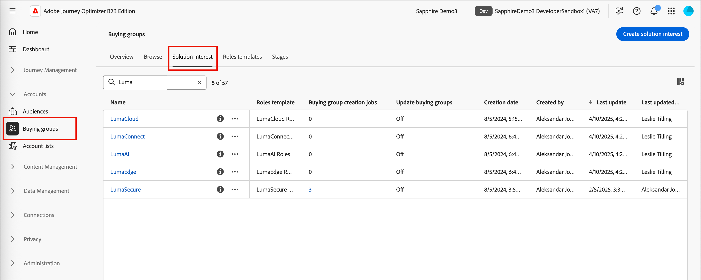

# Intérêts des solutions

Avant de créer des groupes d’achat, vous devez savoir ce que vous vendez et qui vous souhaitez cibler. Votre stratégie de marketing et de vente doit être alignée afin que vous puissiez ajouter l’ intérêt de solution pour les groupes d’achat.

{width="30"} [Regardez la vidéo de présentation](#overview-video)

## Accès et navigation dans les centres d’intérêt des solutions

1. Sur la page d’accueil de Adobe Experience Platform, cliquez sur Adobe Journey Optimizer B2B Edition.

1. Dans le volet de navigation de gauche, cliquez sur **[!UICONTROL Groupes d’achat]**.

1. Sur la page Groupes d’achats, sélectionnez l’onglet **[!UICONTROL Centre d’intérêt pour les solutions]** .

   {width="700" zoomable="yes"}

   L’onglet fournit une liste de tous les centres d’intérêt de solution existants. Il fournit des informations sous la forme _[!UICONTROL Nom]_, _[!UICONTROL Modèle de rôles]_, _[!UICONTROL Tâches de création de groupe d’achat]_, _[!UICONTROL Dernière mise à jour le]_, _[!UICONTROL Mis à jour par]_, _[!UICONTROL Créé le]_ et _[!UICONTROL Créé par]_ au format de colonne.

   La liste est triée par défaut par la colonne _[!UICONTROL Dernière mise à jour le]_ . Cliquez sur le titre de la colonne dans l’en-tête pour faire basculer le tri entre croissant et décroissant.

## Affichage et suppression de tâches de groupe d’achat

Dans l’onglet _[!UICONTROL Centre d’intérêt des solutions]_, la colonne **[!UICONTROL Tâches de création de groupe d’achats]** affiche le nombre de tâches créées pour chaque intérêt de solution. Le numéro est un lien. Un clic dessus ouvre une boîte de dialogue qui affiche la liste des tâches créées pour l’intérêt de la solution.

{width="700" zoomable="yes"}

Vous pouvez supprimer une tâche de groupe d’achat en cliquant sur les points de suspension (...) en regard du nom de la tâche et en choisissant **[!UICONTROL Supprimer]**.

## Créer un intérêt pour une solution

Avant de créer un intérêt pour une solution, vous devez disposer d’un modèle de rôles actif (publié) qui définit les rôles que vous souhaitez cibler. Pour plus d’informations sur la création d’un modèle de rôles et la publication d’un modèle de rôles, reportez-vous à la section [Modèles de rôles de groupe d’achat](./buying-groups-role-templates.md) .

1. Dans l’onglet _[!UICONTROL Solution Interest]_, cliquez sur **[!UICONTROL Create solution interest]** en haut à droite.

1. Saisissez un **[!UICONTROL Nom]** unique (obligatoire) et une **[!UICONTROL Description]** (facultatif).

1. Sélectionnez un **[!UICONTROL modèle de rôles]** (obligatoire).

   Cliquez sur le sélecteur et choisissez un modèle de rôles en direct dans la liste affichée. Vous ne pouvez associer qu’un seul modèle de rôles actif avec un intérêt de solution.

   {width="700" zoomable="yes"}

1. Cliquez sur **[!UICONTROL Créer]** dans le coin supérieur droit.

   Votre nouvel intérêt pour les solutions s’affiche dans les intérêts des solutions.

## Modifier un intérêt pour une solution

À tout moment, vous pouvez modifier le nom et la description d’un intérêt pour une solution. Le modèle de rôles ne peut pas être modifié en raison de la dépendance des groupes d’achat en fonction de l’intérêt de la solution et de l’association des modèles de rôles. Dans ce cas, vous devez créer un intérêt de solution à l’aide d’un autre modèle de rôles.

1. Dans l’onglet _[!UICONTROL Centre d’intérêt de la solution]_, utilisez l’une des méthodes suivantes pour ouvrir les propriétés de l’intérêt de la solution que vous souhaitez modifier :

   * Cliquez sur le nom des centres d’intérêt de la solution.
   * Cliquez sur les points de suspension (**...**) en regard et sélectionnez **[!UICONTROL Modifier]**.

   {width="500" zoomable="no"}

1. Si nécessaire, mettez à jour le nom (obligatoire et unique) et la description (facultatif).

1. Si nécessaire, modifiez le paramètre **[!UICONTROL Mettre à jour les groupes d’achat existants]** .

   Lorsque cette option est activée, tous les groupes d’achat existants associés aux centres d’intérêt de la solution sont mis à jour tout au long du cycle de synchronisation 24 heures.

1. Cliquez sur **[!UICONTROL Enregistrer]**.

## Suppression d’un intérêt de solution

Les intérêts de solution actuellement utilisés par une tâche de groupe d’achat ou un parcours de compte ne peuvent pas être supprimés. En outre, un intérêt de solution supprimé ne peut pas être récupéré.

1. Dans l’onglet _[!UICONTROL Centre d’intérêt de la solution]_, cliquez sur les points de suspension (**...**) en regard de l’intérêt de la solution et sélectionnez **[!UICONTROL Supprimer]**.

   Cette action ouvre une boîte de dialogue de confirmation.

   Si l’intérêt de la solution est actuellement utilisé par un parcours de compte ou une tâche de groupe d’achat, l’action ouvre une boîte de dialogue d’information vous informant qu’il ne peut pas être supprimé. Cliquez sur [!UICONTROL OK] pour abandonner la suppression.

1. Cliquez sur **[!UICONTROL Supprimer]** pour confirmer la suppression ou vous pouvez interrompre le processus en cliquant sur _[!UICONTROL Annuler]_.

## Vidéo Aperçu

>[!VIDEO](https://video.tv.adobe.com/v/3433080/?learn=on)
