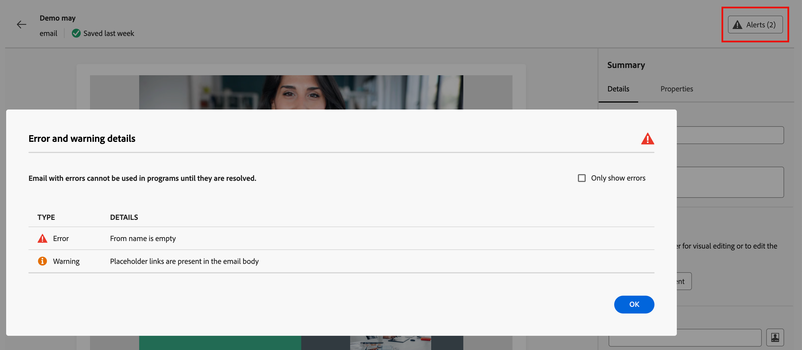

# Ajouter un e-mail à votre parcours

Utilisez Adobe Journey Optimizer B2B edition pour envoyer des e-mails à vos clients par le biais de parcours de compte. Vous pouvez choisir de créer, de personnaliser et de prévisualiser des messages dans l’espace de conception d’e-mail. Vous pouvez également choisir d’envoyer un e-mail déjà défini dans l’instance Marketo Engage connectée.

>[!NOTE]
>
>Si vous envoyez un e-mail pour la première fois, assurez-vous que le canal e-mail est configuré depuis Adobe Marketo Engage. Pour en savoir plus, voir [Protocoles de tracking et de diffusion e-mail](../start/email-protocols.md).

## Ajout d’un nœud d’action d’e-mail dans un parcours

Vous pouvez configurer des diffusions e-mail dans un parcours lorsque vous [ajoutez un nœud _[!UICONTROL Prendre une action]_ ](../journeys/action-nodes.md) et que vous effectuez les opérations suivantes :

1. Pour la cible _[!UICONTROL Action sur]_, choisissez **[!UICONTROL Personnes]**.

1. Pour l’_[!UICONTROL Action sur les personnes]_, choisissez **[!UICONTROL Envoyer un e-mail]**.

1. Pour l’option _[!UICONTROL Source de l’e-mail]_, choisissez la manière dont vous souhaitez générer l’e-mail à envoyer.

   {width="700" zoomable="yes"}

   * Choisissez **[!UICONTROL Créer un e-mail]** pour créer l’e-mail en mode natif dans Journey Optimizer B2B edition.

     Cette option permet de gérer le contenu de l’e-mail de manière native dans Journey Optimizer B2B edition. Cliquez sur **[!UICONTROL Créer un e-mail]** pour ouvrir la boîte de dialogue _Créer un e-mail_. Vous pouvez créer une ressource de contenu d’e-mail ou dupliquer une ressource de contenu d’e-mail existante.

     +++Nouvel email

     Lorsque vous souhaitez créer un e-mail à l’aide d’une zone de travail vide ou d’un modèle d’e-mail, utilisez l’option _[!UICONTROL Nouvel e-mail]_.

      1. Dans la boîte de dialogue, choisissez **[!UICONTROL Nouvel e-mail]**.

      1. Saisissez un **[!UICONTROL Nom]** unique pour l’e-mail et un **[!UICONTROL Objet]**.

         {width="400"}

      1. Cliquez sur **[!UICONTROL Créer]**.

         Dans la section _[!UICONTROL Propriétés de l’e-mail]_ de la page de contenu de l’e-mail, les champs _[!UICONTROL De l’e-mail]_ et _[!UICONTROL Répondre à l’adresse]_ sont déjà configurés. Vous pouvez saisir des valeurs pour les champs _[!UICONTROL Nom de l’expéditeur]_ et _[!UICONTROL Description]_ (facultatif).

      1. Cliquez sur **[!UICONTROL Modifier l’e-mail]** pour définir les [paramètres](#define-the-email-settings) de l’e-mail et concevoir le [contenu](./email-authoring.md).

     +++

     +++Dupliquer l’e-mail existant

     Lorsque vous souhaitez créer un e-mail à partir d’un e-mail existant du parcours actuel ou d’un autre parcours, utilisez l’option _[!UICONTROL Dupliquer l’e-mail existant]_. Vous pouvez apporter des modifications à l’e-mail dupliqué en fonction de votre objectif pour le nœud de parcours.

      1. Dans la boîte de dialogue _[!UICONTROL Créer un e-mail]_, choisissez **[!UICONTROL Dupliquer l’e-mail existant]**.

      1. Pour **[!UICONTROL E-mail existant à dupliquer]**, cliquez sur l’icône _Sélection_ (  ) et sélectionnez l’e-mail à dupliquer et à utiliser pour le nœud de parcours.

         Vous pouvez filtrer la liste des e-mails en saisissant une chaîne de texte dans le champ de recherche pour correspondre au nom de l’e-mail.

         {width="600" zoomable="yes"}

         Cochez la case de l’e-mail à dupliquer et cliquez sur **[!UICONTROL Sélectionner]**.

      1. Saisissez un **[!UICONTROL Nom]** unique pour l’e-mail et un **[!UICONTROL Objet]**.

         {width="400"}

      1. Cliquez sur **[!UICONTROL Créer]**.

         Dans la section _[!UICONTROL Propriétés de l’e-mail]_ de la page de contenu de l’e-mail, les champs _[!UICONTROL De l’e-mail]_ et _[!UICONTROL Répondre à l’adresse]_ sont déjà configurés. Vous pouvez saisir des valeurs pour les champs _[!UICONTROL Nom de l’expéditeur]_ et _[!UICONTROL Description]_ (facultatif).

      1. Si nécessaire, cliquez sur **[!UICONTROL Modifier l’e-mail]** pour modifier les e-mails [paramètres](#define-the-email-settings) et [contenu](./email-authoring.md).

     +++

   * Choisissez **[!UICONTROL Sélectionner un e-mail dans Adobe Marketo Engage]** pour utiliser l’un des e-mails précréés dans Marketo Engage et l’envoyer dans le cadre du parcours.

     Si plusieurs espaces de travail sont disponibles dans l’instance Market Engage connectée, sélectionnez-les. Sélectionnez ensuite l’e-mail approuvé que vous souhaitez envoyer pour le nœud de parcours.

     {width="500" zoomable="yes"}

     Avec cette option, le nœud est défini et le contenu de l’e-mail n’a pas besoin d’être défini davantage dans le parcours.

## Définition des paramètres d’e-mail

Une fois l’onglet **[!UICONTROL Détails]** sélectionné dans le panneau _Résumé_ à droite, faites défiler l’écran vers le bas pour afficher et définir les paramètres de l’e-mail.

{width="700" zoomable="yes"}

| Option | Description |
| ------ | ----------- |
| [!UICONTROL À partir du nom] | Nom de l’expéditeur utilisé dans l’en-tête de l’e-mail. Saisissez le nom de l’expéditeur tel que vous souhaitez qu’il apparaisse au destinataire. Cliquez sur l’icône _Personnaliser_ (  ) pour utiliser un jeton de personnalisation dans le champ. |
| [!UICONTROL E-mail de l’expéditeur] | Adresse expéditeur utilisée dans l’en-tête de l’e-mail. La valeur par défaut est renseignée à partir des [ paramètres de diffusion du canal e-mail ](../admin/configure-channels-emails.md#delivery-settings). Cliquez sur l’icône _Personnaliser_ (  ) pour utiliser un jeton de personnalisation dans le champ. |
| [!UICONTROL &#x200B; Adresse de réponse &#x200B;] | Adresse expéditeur utilisée dans l’en-tête de l’e-mail. La valeur par défaut est renseignée à partir des [paramètres de diffusion du canal e-mail](../admin/configure-channels-emails.md#delivery-settings) ([!UICONTROL libellé de l’expéditeur]). Saisissez l’adresse e-mail à renseigner si le destinataire utilise la fonction de réponse (il peut s’agir d’une adresse différente ou identique à l’adresse expéditeur). Cliquez sur l’icône _Personnaliser_ (  ) pour utiliser un jeton de personnalisation dans le champ. |
| [!UICONTROL Objet] | Texte affiché dans le champ Objet de l’e-mail. La valeur par défaut est renseignée à partir du texte que vous avez saisi dans la boîte de dialogue _[!UICONTROL Créer un e-mail]_. Vous pouvez modifier le texte si nécessaire. Cliquez sur l’icône _Personnaliser_ (  ) pour utiliser un jeton de personnalisation dans le champ.<!-- Click the AI Assistant button ( {width="30" zoomable="no"} ) to generate the subject line based on the current email content.--> |
| [!UICONTROL Domaine de branding] | Si plusieurs domaines de branding [ sont définis dans le système](../admin/configure-channels-emails.md#branding-domains) sélectionnez le domaine de branding à utiliser pour envoyer l’e-mail. Utilisez un domaine de marque spécifique pour envoyer des e-mails qui semblent provenir de votre marque plutôt que de la société dans son ensemble. Il établit la confiance avec la marque, personnalise l’expérience par e-mail et augmente les taux d’ouverture et de réponse. |
| [!UICONTROL Adresse IP dédiée] | Si plusieurs adresses IP dédiées sont définies, sélectionnez une adresse IP dédiée à utiliser pour l’envoi de l’e-mail. Lorsque vous utilisez une adresse IP dédiée spécifique pour vos programmes, vous pouvez suivre et surveiller plus étroitement la délivrabilité et répondre rapidement à toute modification de vos mesures de diffusion. Pour plus d’informations sur l’ajout d’une adresse IP dédiée pour l’instance Marketo Engage connectée, consultez la documentation de [Marketo Engage](https://experienceleague.adobe.com/fr/docs/marketo/using/product-docs/email-marketing/deliverability/use-your-dedicated-ip-addresses-to-send-emails){target="_blank"}. |
| Résolution de problèmes - Il est plus facile de rechercher, de comprendre et de résoudre les problèmes de diffusion. |
| [!UICONTROL &#x200B; E-mail opérationnel &#x200B;] | Cochez la case si vous souhaitez désigner l’e-mail comme opérationnel. Les e-mails opérationnels sont exclus des listes de désinscription et des limites de communication. Sélectionnez cette option uniquement lorsque le destinataire ne peut pas considérer l’e-mail comme un message commercial non sollicité (SPAM). |
| [!UICONTROL Inclure l’affichage en tant que page web] | Cochez la case pour inclure un lien vers une page web générée à partir du contenu de l’e-mail. Les e-mails disposent de fonctionnalités plus limitées que les pages web. Ils sont donc utiles pour JavaScript, les feuilles CSS étendues et les formulaires. Le texte utilisé pour générer le lien est configuré dans les [paramètres de diffusion du canal e-mail](../admin/configure-channels-emails.md#delivery-settings) ([!UICONTROL Afficher en tant qu&#39;HTML de page web] et [!UICONTROL Afficher en tant que texte de page web]). |
| [!UICONTROL Désactiver le suivi des ouvertures] | Cochez la case lorsque vous ne souhaitez pas suivre l’activité d’ouverture des e-mails. Lorsque la fonction est désactivée, le nombre d’activités d’ouverture d’e-mail est incrémenté uniquement lorsqu’une personne unique ouvre l’e-mail. Vous pouvez [gérer le suivi des liens de contenu d’e-mail](./email-authoring.md#content-authoring---link-tracking) lorsque vous concevez le contenu du corps de l’e-mail. |
| [!UICONTROL Preheader] | Cochez la case pour inclure un pré-titre. Un pré-titre est le texte de résumé court affiché après la ligne d&#39;objet dans certains clients de messagerie. Il fournit généralement un bref résumé de l’e-mail et se compose généralement d’une seule phrase. Saisissez le texte récapitulatif dans le champ<!-- , or click the AI Assistant button ( {width="30" zoomable="no"} ) to generate summary text based on the current email content -->. |
| [!UICONTROL Champs utilisés comme adresses CC] | Le cas échéant, sélectionnez jusqu’à 25 champs Lead ou Société configurés dans Marketo Engage à l’aide du type de `Email`. |

## Vérifier les alertes

Lorsque vous concevez le contenu de votre e-mail, des alertes s’affichent dans l’interface (en haut à droite de la page) lorsque des paramètres clés sont manquants. Si ce bouton ne s’affiche pas, aucun problème n’est détecté.

{width="600" zoomable="yes"}

Deux types d’alertes peuvent être détectés :

* **_avertissements_** qui se rapportent aux recommandations et aux bonnes pratiques telles que :

   * `The opt-out link is not present in the email body` : une bonne pratique consiste à ajouter un lien de désinscription dans le corps de votre e-mail.

     >[!NOTE]
     >
     >Les e-mails de style marketing doivent inclure un lien d’opt-out, qui n’est pas obligatoire pour les messages transactionnels.

   * `Text version of HTML is empty` : n’oubliez pas de définir une version texte du corps de votre email, qui est utilisée lorsque le contenu HTML ne peut pas être affiché.

   * `Empty link is present in email body` : vérifiez que tous les liens de votre e-mail sont corrects.

   * `Email size has exceeded the limit of 100KB` : pour une diffusion optimale, veillez à ce que la taille de votre e-mail ne dépasse pas 100KB.

* **_Erreurs_** qui vous empêchent de tester ou d’activer le parcours/la campagne tant qu’elles ne sont pas corrigées, telles que :

   * `From name is empty` : le champ e-mail _De_ (obligatoire) n’est pas défini.

   * `The subject line is missing` : l’objet de l’e-mail (obligatoire) n’est pas défini.

   * `The email version of the message is empty` : le contenu de l’e-mail n’est pas défini.
