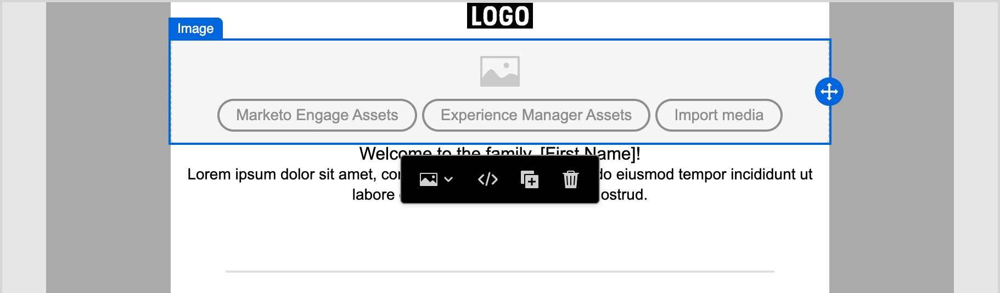
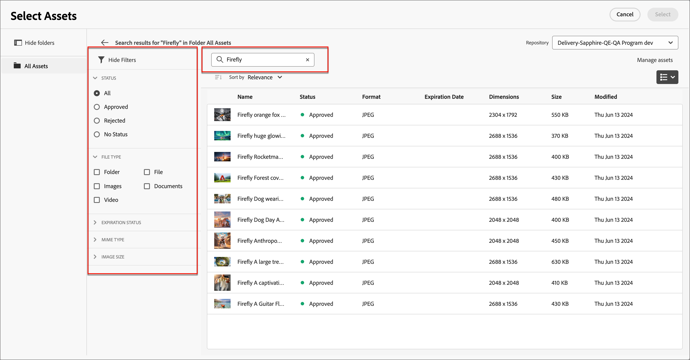

# Utilisation des ressources Experience Manager

Lorsqu’Adobe Experience Manager Assets as a Cloud Service est intégré à Adobe Journey Optimizer B2B edition, vous pouvez facilement découvrir et accéder aux ressources numériques à utiliser dans votre contenu marketing. Lorsque vous créez votre contenu, les ressources sont accessibles à partir de l’élément _Experience Manager Assets_ sur la navigation de gauche, ainsi que lors de la création de contenu d’e-mail pour un parcours de compte.

{{aem-assets-licensing-note}}

Lorsque vous utilisez ces ressources numériques, les dernières modifications apportées à Assets as a Cloud Service se propagent automatiquement aux campagnes par e-mail actives par le biais de références liées. Si des images sont supprimées dans Adobe Experience Manager Assets as a Cloud Service, les images s’affichent avec une référence rompue dans les e-mails. Lorsque des ressources actuellement utilisées dans les parcours de compte sont modifiées ou supprimées, les auteurs de parcours sont informés des modifications apportées à l’image et de la liste des parcours qui utilisent l’image. Toutes les modifications apportées aux ressources doivent être effectuées dans le référentiel central d’Adobe Experience Manager Assets.

Lorsque votre environnement dispose d’une ou de plusieurs [connexions au référentiel Assets](../admin/configure-aem-repositories.md), les auteurs de contenu peuvent utiliser AEM Assets comme source de ressources lors de la création d’un e-mail, d’un modèle d’e-mail ou d’un fragment visuel.

>[!IMPORTANT]
>
>Un administrateur doit ajouter les utilisateurs qui doivent accéder à Assets aux profils de produit Utilisateurs consommateurs d’Assets et/ou Utilisateurs Assets . [En savoir plus](https://experienceleague.adobe.com/fr/docs/experience-manager-cloud-service/content/security/ims-support#managing-products-and-user-access-in-admin-console){target="_blank"}

## Accès aux images AEM Assets

Dans l’éditeur de contenu visuel, cliquez sur l’icône _Experience Manager Assets_ (  ) dans la barre latérale gauche. Le panneau Outils devient alors une liste des ressources disponibles dans le référentiel sélectionné.

{width="700" zoomable="yes"}

>[!NOTE]
>
>Actuellement, seules les ressources d’image d’Adobe Experience Manager Assets sont prises en charge dans Adobe Journey Optimizer B2B edition. Les modifications apportées aux ressources doivent être effectuées à partir du référentiel central d’Adobe Experience Manager Assets. [En savoir plus](https://experienceleague.adobe.com/fr/docs/experience-manager-cloud-service/content/assets/manage/manage-digital-assets){target="_blank"}

### Modifier le référentiel affiché

Si plusieurs référentiels AEM sont connectés, cliquez sur la flèche de menu correspondant à **[!UICONTROL Référentiel]** pour choisir le référentiel à afficher dans le panneau de gauche.

{width="700" zoomable="yes"}

Il existe plusieurs méthodes pour ajouter une ressource d’image à la zone de travail visuelle.

### Faire glisser et déposer une image

1. Parcourez les miniatures affichées dans le panneau de gauche.

1. Faites glisser la miniature de l’image et déposez-la dans la zone de travail où vous souhaitez ajouter le nouveau composant d’image.

   {width="700" zoomable="yes"}

## Rechercher et sélectionner une image

1. Ajoutez un composant image à la zone de travail et cliquez sur **[!UICONTROL Experience Manager Assets]** pour ouvrir la boîte de dialogue _[!UICONTROL Sélectionner Assets]_.

   {width="600" zoomable="yes"}

1. Dans la boîte de dialogue, choisissez une image à l’aide des outils disponibles pour localiser la ressource dont vous avez besoin :

   * Modifiez le **[!UICONTROL Référentiel]** en haut à droite.

   * Cliquez sur **[!UICONTROL Gérer les ressources]** en haut à droite pour ouvrir le référentiel Assets dans un autre onglet du navigateur et utiliser les outils de gestion d’AEM Assets.

   * Cliquez sur le sélecteur _Type de vue_ en haut à droite pour remplacer l’affichage par **[!UICONTROL Vue Liste]**, **[!UICONTROL Vue Grille]**, **[!UICONTROL Vue Galerie]** ou **[!UICONTROL Vue Cascade]**.

   * Cliquez sur l’icône _Ordre de tri_ pour modifier l’ordre de tri entre croissant et décroissant.

     {width="700" zoomable="yes"}

   * Cliquez sur la flèche du menu **[!UICONTROL Trier par]** pour remplacer les critères de tri par **[!UICONTROL Nom]**, **[!UICONTROL Taille]** ou **[!UICONTROL Modifié]**.

   * Cliquez sur l’icône _Filtrer_ en haut à gauche pour filtrer les éléments affichés en fonction de vos critères.

   * Saisissez du texte dans le champ Rechercher pour filtrer les éléments affichés afin qu’ils correspondent au nom de la ressource.

   {width="700" zoomable="yes"}

1. Cliquez sur **[!UICONTROL Sélectionner]**.
<!-- 

## Upload assets

To import files to Assets as a Cloud Service, you first need to browse or create the folder to be used for storage. You can then import an asset and add it to your email content. After assets are uploaded, you can [use the image assets as you author content](./assets-overview.md#add-assets-to-your-content).

1. While authoring your content in the email designer, drag an image element into the canvas. 

   The properties on the right reflect the image element selection. 

1. Click **[!UICONTROL Import media]** to open the _[!UICONTROL Upload image]_ dialog.

1. If your file system is open to your image file, drag and drop the file on the box in the dialog.

   {width="700" zoomable="yes"}

   You can also click the **[!UICONTROL Select a file from your computer]** link and use your file system to locate and select the image file. Click Open and the image file is displayed in the box.

1. Click **[!UICONTROL Import]**.
-->
