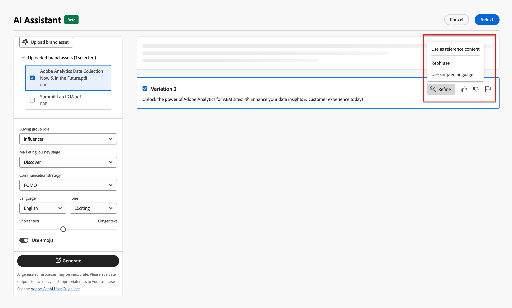

# Assistant IA pour la création d’e-mails

Alors que le secteur du marketing devient plus compétitif, les marques cherchent des moyens efficaces de générer rapidement et efficacement du contenu percutant. L’assistant AI pour la création d’email dans Adobe Journey Optimizer B2B edition est une fonctionnalité de génération de contenu optimisée par l’IA d’Adobe qui révolutionne la façon dont les spécialistes marketing créent du contenu d’email professionnel et cohérent pour la marque. Grâce aux modèles GenAI avancés et à une compréhension approfondie des directives de la marque, AI Assistant génère automatiquement du contenu personnalisé, attrayant et efficace en fonction de l’objectif marketing avec du contenu optimisé pour les styles de contour de la marque, les mises en page, le ton, etc. L’assistant AI rend la création et l’exécution des campagnes de marketing par e-mail intuitives, simples et sans tracas. L’ajout de cette fonctionnalité à vos workflows peut vous faire gagner du temps, améliorer l’efficacité et générer de meilleurs résultats.

Cette nouvelle fonctionnalité fournit une génération de texte basée sur les invites, une génération complète des e-mails et une génération de contenu dans les structures d&#39;e-mail. Les images ne sont pas générées, mais sont recommandées à partir du catalogue d’images dans la ressource de marque d’entrée du modèle. Vous pouvez également utiliser cette fonctionnalité pour générer des lignes d’objet et des pré-titres optimaux afin d’affecter le taux d’ouverture.

>[!NOTE]
>
>Cette fonctionnalité est disponible dans sa version Beta et peut être modifiée sans préavis.

## Instructions et restrictions

Avant de commencer à utiliser l’assistant AI dans Adobe Journey Optimizer B2B edition pour la génération de contenu d’e-mail, consultez ces instructions :

* L’objectif/invite marketing que vous définissez est un déterminant clé de la qualité du contenu généré. Utilisez une invite bien définie pour que le modèle GenAI l’interprète avec précision.
* Chargez des ressources de marque pour obtenir du contenu de marque précis. Sans ces ressources, le contenu est basé sur des informations accessibles au public.
   * Les ressources chargées peuvent se présenter sous les formats suivants : PDF, JPEG, PNG ou fichiers ZIP (contenant les formats de fichiers pris en charge).
   * La taille maximale d’une ressource de marque chargée est de 50 Mo. Des fichiers plus volumineux ou de grandes quantités d’images peuvent fonctionner, mais le temps de traitement est augmenté.
* Utilisez les modèles d’e-mail créés par Adobe Journey Optimizer B2B edition, de préférence les modèles intégrés ou d’exemple, un modèle spécifique à la marque ou un modèle personnalisé, pour créer le contenu de votre e-mail. Il est recommandé d’utiliser des modèles d’e-mail contenant jusqu’à huit à dix images.
* Veillez à signaler tout résultat problématique à l’aide de la touche Bas ou des icônes d’indicateur par rapport à une variante générée.
* Votre utilisation de l’assistant AI est soumise aux [instructions d’utilisation de l’IA générative d’Adobe](https://www.adobe.com/fr/legal/licenses-terms/adobe-gen-ai-user-guidelines.html).

Les restrictions suivantes s’appliquent à l’assistant AI dans Adobe Journey Optimizer B2B edition pour la génération de contenu d’e-mail :

* L’anglais est la seule langue prise en charge.
* Il n’est disponible que pour le canal e-mail.
* Le contenu de GenAI n’est peut-être pas exact. Partagez vos commentaires afin que les ingénieurs Adobe puissent affiner les modèles.
* Vous pouvez charger plusieurs ressources de marque, mais ne pouvez en exploiter qu’une seule pour une génération spécifique.

>[!BEGINSHADEBOX]

## Bibliothèque d&#39;invites

Une invite efficace est essentielle pour générer le meilleur contenu possible. Si vous avez besoin d&#39;aide pour concevoir votre invite, accédez à la _bibliothèque d&#39;invites_. Cette bibliothèque fournit un large éventail d’idées pour améliorer la génération de contenu.

{width="500" zoomable="no"}

Sélectionnez l’invite qui reflète le mieux vos objectifs prévus et ajoutez les valeurs nécessaires pour spécifier votre marque, votre offre, votre campagne et vos cas d’utilisation.

>[!ENDSHADEBOX]

## Rôles du groupe d’achat

Adobe Journey Optimizer B2B edition offre cinq rôles de groupe d’achat B2B standard prêts à l’emploi. Chaque rôle de groupe d&#39;achat a un objectif de messagerie distinct :

| Rôle | Thème de la messagerie |
| ---- | --------------- |
| Comité directeur exécutif | Informations sur le produit  Tarification  Informations sur l’intégration technique  Fonctionnalités du produit |
| Personne influente | Preuve de la qualité  Facilité de mise en œuvre  Expertise en la matière  Avantages concurrentiels |
| Décideur | Retour sur investissement  Valeur financière (RoI)  Témoignages clients |
| Spécialiste | Facilité d’utilisation  Fonctionnalités du produit  Compatibilité du produit  Facilité d’intégration du produit |
| Champion | Contenu pédagogique  Contenu de leadership éclairé  Témoignages de clients |

Le choix d&#39;un de ces rôles de groupe d&#39;achat personnalise automatiquement la sortie en fonction des caractéristiques et des sujets d&#39;intérêt de chacun de ces rôles.

## Générer des propriétés d’e-mail avec l’assistant AI

Lorsque vous [ajoutez une action E-mail](./add-email.md#add-an-email-action-node-in-a-journey) à un parcours de compte, vous définissez un ensemble de propriétés d’e-mail utilisées pour envoyer l’e-mail. L’assistant AI peut vous aider à améliorer l’engagement des e-mails en générant du contenu recommandé pour l’e-mail **objet** et **pré-titre**.

1. Créez un e-mail à partir d’un parcours de compte ou ouvrez un e-mail existant à partir d’un nœud de parcours.

   La page de prévisualisation de l’e-mail s’affiche avec l’_[!UICONTROL Propriétés de l’e-mail]_ à droite.

1. Sélectionnez l’un des onglets suivants pour savoir comment utiliser l’assistant AI dans la création de propriétés d’e-mail.

>[!BEGINTABS]

>[!TAB Génération de l’objet]

Les étapes suivantes décrivent la séquence de tâches pour l’utilisation de l’assistant AI afin de générer une ligne d’objet optimisée pour votre e-mail :

1. Dans les _[!UICONTROL Propriétés de l’e-mail]_, cliquez sur l’icône de l’assistant AI ( {width="30" zoomable="no"} ) à droite du champ **[!UICONTROL Objet]**.

   {width="600" zoomable="yes"}

   Le pop-up de l’assistant AI s’ouvre avec les paramètres de génération de l’objet de l’e-mail.

   Selon le contenu de l’e-mail associé à l’e-mail ou la manière dont vous souhaitez utiliser la ligne d’objet pour l’adapter à votre objectif, il existe plusieurs options pour générer le texte de la ligne d’objet :

   * Vous pouvez immédiatement cliquer sur **[!UICONTROL Générer]** sans invite ni ressource de marque pour utiliser le corps de l’e-mail existant comme contexte de génération de l’objet.

   * (Recommandé) Vous pouvez fournir une invite, une ressource de marque et d’autres valeurs de paramètre pour fournir un contexte afin de générer le texte de ligne d’objet le plus optimal pour vos besoins. (Étapes 2 à 7)

1. Dans le champ **[!UICONTROL Invite]**, saisissez une description de ce que vous souhaitez générer.

   Utilisez la [bibliothèque d&#39;invites](#prompt-library) si vous avez besoin d&#39;aide pour concevoir une invite efficace.

1. Spécifiez une ressource de marque qui contient le contenu à servir de source pour la génération de texte.

   * Sélectionnez la ressource dans le catalogue.

   * Cliquez sur **[!UICONTROL Charger une ressource de marque]** pour ajouter le fichier de ressource de marque.

   {width="600" zoomable="yes"}

1. Faites défiler l’écran si nécessaire et sélectionnez le rôle **[!UICONTROL Groupe d’achats]** à utiliser comme audience cible pour le texte généré.

1. Si nécessaire, utilisez les options de messagerie pour personnaliser votre contenu :

   * **[!UICONTROL Stratégie de communication]** - Choisissez le style de communication le plus adapté à votre texte généré.
   * **[!UICONTROL Langue]** - Sélectionnez la langue dans laquelle vous souhaitez que votre contenu soit généré.
   * **[!UICONTROL Ton]** - Choisissez un ton qui résonne avec votre audience. Si vous spécifiez que vous souhaitez donner un son informatif, ludique ou persuasif, l’assistant AI peut adapter le message en conséquence.

1. Si nécessaire, utilisez le curseur pour définir la longueur souhaitée du texte à générer.

1. Modifiez l’option **[!UICONTROL Utiliser des émoticônes]** (activée ou désactivée) en fonction de vos préférences.

1. Lorsque l’invite et les paramètres sont prêts, cliquez sur **[!UICONTROL Générer]**.

1. Faites défiler le panneau de l’assistant d’IA et parcourez les variations générées pour déterminer celle qui convient le mieux.

   * Cliquez sur **[!UICONTROL Aperçu]** pour afficher une version en plein écran d’une variation sélectionnée.

   * Faites des commentaires sur les variantes générées en cliquant sur l’icône _Pouces vers le haut_, _Pouces vers le bas_ ou _Indicateur_ et sélectionnez la raison qui résume le mieux vos commentaires.

1. Accédez aux options _Affiner_ dans la fenêtre Aperçu pour accéder à d’autres fonctionnalités de personnalisation :

   * **[!UICONTROL Utiliser comme contenu de référence]** - Sélectionnez cette option pour utiliser la variante comme contenu de référence pour générer d’autres résultats.

   * **[!UICONTROL Reformuler]** - L’assistant d’IA peut reformuler votre message de différentes manières, ce qui vous permet d’écrire des textes frais et attrayants pour diverses audiences.

   * **[!UICONTROL Utiliser un langage plus simple]** - Tirez parti de l’assistant d’IA pour simplifier votre langue, tout en assurant la clarté et l’accessibilité pour une audience plus large.

   {width="600" zoomable="yes"}

1. Cliquez sur **[!UICONTROL Sélectionner]** pour remplacer le texte de l’objet par la variante sélectionnée et revenir aux propriétés de l’e-mail.

>[!TAB Génération du pré-titre]

Un pré-titre d’e-mail est le texte de résumé court qui suit l’objet d’un e-mail lorsqu’il est affiché dans la boîte de réception. Il s’agit d’un élément facultatif pour un e-mail, mais d’une excellente occasion d’améliorer l’engagement. Les étapes suivantes décrivent la séquence de tâches pour l’utilisation de l’assistant AI afin de générer un pré-titre optimisé pour votre e-mail :

1. Dans les propriétés de l’e-mail, cochez la case **[!UICONTROL Pré-titre]** et cliquez sur l’icône de l’assistant AI ( {width="30" zoomable="no"} ) à droite.

   {width="600" zoomable="yes"}

   Le pop-up de l’assistant AI s’ouvre avec les paramètres de génération du pré-titre de l’e-mail.

   Selon le contenu de l’e-mail associé à l’e-mail ou la manière dont vous souhaitez cibler l’e-mail, il existe plusieurs options pour générer le pré-titre :

   * Vous pouvez cliquer immédiatement sur **[!UICONTROL Générer]** sans invite ni ressource de marque pour utiliser le corps de l’e-mail existant comme contexte de génération de pré-titre.

   * (Recommandé) Vous pouvez fournir une invite, une ressource de marque et d’autres valeurs de paramètre pour fournir un contexte afin de générer le pré-titre le plus optimal pour vos besoins. (Étapes 2 à 7)

1. Dans le champ **[!UICONTROL Invite]**, saisissez une description de ce que vous souhaitez générer.

   Utilisez la [bibliothèque d&#39;invites](#prompt-library) si vous avez besoin d&#39;aide pour concevoir une invite efficace.

1. Spécifiez une ressource de marque qui contient le contenu à servir de source pour la génération de texte.

   * Sélectionnez la ressource dans le catalogue.

   * Cliquez sur **[!UICONTROL Charger une ressource de marque]** pour ajouter le fichier de ressource de marque.

   {width="600" zoomable="yes"}

1. Faites défiler l’écran si nécessaire et sélectionnez le rôle **[!UICONTROL Groupe d’achats]** à utiliser comme audience cible pour le texte généré.

1. Si nécessaire, utilisez les options de messagerie pour personnaliser votre contenu :

   * **[!UICONTROL Stratégie de communication]** - Choisissez le style de communication le plus adapté à votre texte généré.
   * **[!UICONTROL Langue]** - Sélectionnez la langue dans laquelle vous souhaitez que votre contenu soit généré.
   * **[!UICONTROL Ton]** - Choisissez un ton qui résonne avec votre audience. Si vous spécifiez que vous souhaitez donner un son informatif, ludique ou persuasif, l’assistant AI peut adapter le message en conséquence.

1. Si nécessaire, utilisez le curseur pour définir la longueur souhaitée du texte à générer.

1. Modifiez l’option **[!UICONTROL Utiliser des émoticônes]** (activée ou désactivée) en fonction de vos préférences.

1. Lorsque l’invite et les paramètres sont prêts, cliquez sur **[!UICONTROL Générer]**.

1. Faites défiler le panneau de l’assistant d’IA et parcourez les variations générées pour déterminer celle qui convient le mieux.

   * Cliquez sur **[!UICONTROL Aperçu]** pour afficher une version en plein écran d’une variation sélectionnée.

   * Faites des commentaires sur les variantes générées en cliquant sur l’icône _Pouces vers le haut_, _Pouces vers le bas_ ou _Indicateur_ et sélectionnez la raison qui résume le mieux vos commentaires.

1. Accédez aux options _Affiner_ dans la fenêtre Aperçu pour accéder à d’autres fonctionnalités de personnalisation :

   * **[!UICONTROL Utiliser comme contenu de référence]** - Sélectionnez cette option pour utiliser la variante comme contenu de référence pour générer d’autres résultats.

   * **[!UICONTROL Reformuler]** - L’assistant d’IA peut reformuler votre message de différentes manières, ce qui vous permet d’écrire des textes frais et attrayants pour diverses audiences.

   * **[!UICONTROL Utiliser un langage plus simple]** - Tirez parti de l’assistant d’IA pour simplifier votre langue, tout en assurant la clarté et l’accessibilité pour une audience plus large.

   {width="600" zoomable="yes"}

1. Cliquez sur **[!UICONTROL Sélectionner]** pour remplacer le pré-titre par la variante sélectionnée et revenir aux propriétés de l’e-mail.

>[!ENDTABS]

## Générer le contenu du corps de l’e-mail avec l’assistant AI

Une fois que vous avez [créé et personnalisé votre e-mail](./email-authoring.md), utilisez l’assistant AI dans Adobe Journey Optimizer B2B edition, optimisé par l’IA générative pour élever le contenu de votre corps d’e-mail au niveau supérieur.

Dans le concepteur d’e-mail, l’assistant AI peut vous aider à optimiser l’impact de vos diffusions en générant le corps complet de l’e-mail, le contenu de texte ciblé et des recommandations pour les images qui résonnent avec votre audience. Cette optimisation de vos campagnes par e-mail est conçue pour produire un meilleur engagement.

1. Créez un e-mail à partir d’un parcours de compte et cliquez sur **[!UICONTROL Ouvrir le Designer d’e-mail]** ou **[!UICONTROL Ajouter du contenu d’e-mail]**.

1. Sélectionnez et ouvrez un modèle d’e-mail dans le concepteur visuel d’e-mail.

1. Personnalisez l’e-mail selon vos besoins pour le nœud de parcours.

1. Sélectionnez l’un des onglets suivants pour savoir comment utiliser l’assistant AI dans la création de contenu de corps d’e-mail.

>[!BEGINTABS]

>[!TAB Génération d’e-mail complet]

Les étapes suivantes décrivent la séquence de tâches pour l’utilisation de l’assistant AI afin d’affiner un modèle d’e-mail existant :

1. Dans le concepteur d’e-mail, accédez au menu Assistant AI en cliquant sur l’icône ( {width="30" zoomable="no"} ) à droite.

   {width="600" zoomable="yes"}

   Les paramètres de l’assistant AI à droite reflètent _paramètres de génération (e-mail complet)_.

1. Dans le champ **[!UICONTROL Invite]**, saisissez une description de ce que vous souhaitez générer.

   Utilisez la [bibliothèque d&#39;invites](#prompt-library) si vous avez besoin d&#39;aide pour concevoir une invite efficace.

   {width="600" zoomable="yes"}

1. Spécifiez une ressource de marque qui contient du contenu pouvant fournir un contexte supplémentaire pour l’assistant AI.

   * Sélectionnez la ressource dans le catalogue.

   * Cliquez sur **[!UICONTROL Charger une ressource de marque]** pour ajouter le fichier de ressource de marque.

   Cette ressource d’entrée sert de source pour la génération de contenu et la recommandation d’images dans l’e-mail.

1. Sélectionnez le **[!UICONTROL rôle du groupe d’achat]** à utiliser comme audience cible pour la communication par e-mail.

1. Si nécessaire, utilisez les options de messagerie pour personnaliser votre contenu :

   * **[!UICONTROL Stratégie de communication]** - Choisissez le style de communication le plus adapté à votre texte généré.
   * **[!UICONTROL Langue]** - Sélectionnez la langue dans laquelle vous souhaitez que votre contenu soit généré.
   * **[!UICONTROL Ton]** - Choisissez un ton qui résonne avec votre audience. Si vous spécifiez que vous souhaitez donner un son informatif, ludique ou persuasif, l’assistant AI peut adapter le message en conséquence.
   * **Type de contenu** - Sélectionnez une option qui reflète la nature des éléments visuels. Ce paramètre fait la distinction entre différentes formes de représentation visuelle telles que des photos, des graphiques ou des œuvres d’art.

1. Lorsque l’invite est prête, cliquez sur **[!UICONTROL Générer]**.

1. Faites défiler le panneau de l’assistant d’IA et parcourez les variations générées pour déterminer celle qui convient le mieux.

   * Cliquez sur **[!UICONTROL Aperçu]** pour afficher une version en plein écran d’une variation sélectionnée.

   * Faites des commentaires sur les variantes générées en cliquant sur l’icône _Pouces vers le haut_, _Pouces vers le bas_ ou _Indicateur_ et sélectionnez la raison qui résume le mieux vos commentaires.

     {width="600" zoomable="yes"}

1. Cliquez sur **[!UICONTROL Sélectionner]** pour remplacer le contenu du modèle par la variante sélectionnée et revenir au Concepteur d’e-mail.

   Dans le concepteur d’e-mail, vous pouvez utiliser les outils d’édition et de mise en forme de la zone de travail pour modifier le contenu, ainsi que les options _[!UICONTROL Paramètres]_ et _[!UICONTROL Style]_ à droite.

>[!TAB Génération de texte]

Les étapes suivantes décrivent la séquence de tâches pour l’utilisation de l’assistant AI afin d’affiner ou d’améliorer le contenu textuel d’un e-mail existant :

1. Dans le concepteur d’e-mail, accédez au menu Assistant AI en cliquant sur l’icône ( {width="30" zoomable="no"} ) à droite.

   {width="600" zoomable="yes"}

1. Sélectionnez un composant _Texte_ pour cibler le contenu spécifique.

   Les paramètres de l’assistant d’IA sur la droite reflètent _Paramètres de génération (texte)_.

1. Dans le champ **[!UICONTROL Invite]**, saisissez une description de ce que vous souhaitez générer.

   {width="600" zoomable="yes"}

   Utilisez la [bibliothèque d&#39;invites](#prompt-library) si vous avez besoin d&#39;aide pour concevoir une invite efficace.

1. Spécifiez une ressource de marque qui contient le contenu à servir de source pour la génération de texte.

   * Sélectionnez la ressource dans le catalogue.

   * Cliquez sur **[!UICONTROL Charger une ressource de marque]** pour ajouter le fichier de ressource de marque.

1. Sélectionnez le **[!UICONTROL rôle du groupe d’achat]** à utiliser comme audience cible pour le texte généré.

1. Si nécessaire, utilisez les options de langue et de messagerie pour personnaliser votre contenu :

   * **[!UICONTROL Stratégie de communication]** - Choisissez le style de communication le plus adapté à votre texte généré.
   * **[!UICONTROL Langue]** - Sélectionnez la langue dans laquelle vous souhaitez que votre contenu soit généré.
   * **[!UICONTROL Ton]** - Choisissez un ton qui résonne avec votre audience. Si vous spécifiez que vous souhaitez donner un son informatif, ludique ou persuasif, l’assistant AI peut adapter le message en conséquence.

1. Si nécessaire, utilisez le curseur pour définir la longueur souhaitée du texte à générer.

1. Lorsque l’invite est prête, cliquez sur **[!UICONTROL Générer]**.

1. Parcourez les _Variations_ générées et cliquez sur **[!UICONTROL Aperçu]** pour afficher une version en plein écran de la variation sélectionnée.

1. Accédez aux options _Affiner_ dans la fenêtre Aperçu pour accéder à d’autres fonctionnalités de personnalisation :

   * **[!UICONTROL Utiliser comme contenu de référence]** - Sélectionnez cette option pour utiliser la variante comme contenu de référence pour générer d’autres résultats.

   * **[!UICONTROL Développer]** - L’assistant d’IA peut vous aider à développer des sujets spécifiques, en fournissant des détails supplémentaires pour une meilleure compréhension et un meilleur engagement.

   * **[!UICONTROL Résumer]** - La longueur des informations peut surcharger les destinataires des e-mails. Utilisez l’assistant d’IA pour condenser les points clés en résumés clairs et concis qui attirent l’attention et les encouragent à lire davantage.

   * **[!UICONTROL Reformuler]** - L’assistant d’IA peut reformuler votre message de différentes manières, ce qui vous permet d’écrire des textes frais et attrayants pour diverses audiences.

   * **[!UICONTROL Utiliser un langage plus simple]** - Tirez parti de l’assistant d’IA pour simplifier votre langue, tout en assurant la clarté et l’accessibilité pour une audience plus large.

   {width="700" zoomable="yes"}

1. Lorsque vous disposez du contenu souhaité, cliquez sur **[!UICONTROL Sélectionner]** pour remplacer le texte par la variante sélectionnée et revenir au concepteur d’e-mail.

   Dans le concepteur d’e-mail, vous pouvez utiliser les outils d’édition et de mise en forme de la zone de travail pour modifier le texte, ainsi que les options _[!UICONTROL Paramètres]_ et _[!UICONTROL Style]_ à droite.

>[!TAB Recommandations relatives aux images]

Vous pouvez utiliser l’assistant d’IA pour optimiser et améliorer vos ressources et garantir une expérience plus conviviale. Les étapes suivantes décrivent la séquence de tâches pour l’utilisation de l’assistant AI afin d’améliorer le contenu image de l’e-mail :

1. Accédez au menu Assistant AI en cliquant sur l’icône ( {width="30" zoomable="no"} ) à droite.

   {width="600" zoomable="yes"}

1. Sélectionnez un composant _Image_ pour cibler le contenu spécifique et accéder au menu de l’assistant d’IA.

   Les paramètres sur la droite reflètent _[!UICONTROL Paramètres de génération (image)]_.

1. Pour affiner la ressource, saisissez une description de ce que vous souhaitez dans le champ **[!UICONTROL Invite]**.

   {width="600" zoomable="yes"}

   Utilisez la [bibliothèque d&#39;invites](#prompt-library) si vous avez besoin d&#39;aide pour concevoir une invite efficace.

1. Cliquez sur **[!UICONTROL Charger une ressource de marque]** pour ajouter une ressource de marque contenant du contenu qui peut fournir un contexte supplémentaire pour l’assistant d’IA.

   Si la ressource nécessaire est déjà disponible, développez **[!UICONTROL Ressources de marque chargées]** et sélectionnez la ressource.

   Votre invite doit toujours être liée à une ressource existante.

1. Utilisez les paramètres de l’image pour affiner l’invite :

   * **[!UICONTROL Format]** - Ce paramètre détermine la largeur et la hauteur de la ressource. Vous avez la possibilité de choisir parmi les ratios courants tels que 16:9, 4:3, 3:2 ou 1:1, ou vous pouvez saisir une taille personnalisée.
   * **[!UICONTROL Couleur et ton]** - Ce paramètre influence l’aspect général des couleurs dans une image et l’ambiance ou l’atmosphère qu’elle véhicule.
   * **[!UICONTROL Type de contenu]** - Ce paramètre classe la nature de l’élément visuel, en distinguant différentes formes de représentation visuelle, telles que des photos, des graphiques ou des illustrations.
   * **[!UICONTROL Éclairage]** - Ce paramètre ajuste l’éclairage présent dans une image, ce qui façonne son atmosphère et met en évidence des éléments spécifiques.
   * **[!UICONTROL Composition]** - Ce paramètre détermine la disposition des éléments dans le cadre d’une image.

1. Lorsque vous êtes satisfait(e) de la configuration de l’invite, cliquez sur **[!UICONTROL Générer]**.

   L’assistant AI traite la demande et recommande les images les mieux adaptées depuis la ressource de marque d’entrée, en fonction de l’invite et d’autres entrées.

   >[!IMPORTANT]
   >
   >Si la ressource de marque d’entrée ne contient aucune image ou s’il n’existe aucune image pertinente pour l’invite d’entrée, la sortie est vide.

1. Parcourez les _[!UICONTROL Variations]_ et sélectionnez celle qui convient le mieux à l’e-mail.

   Pour afficher une version en plein écran de la variation sélectionnée, cliquez sur **[!UICONTROL Aperçu]**.

1. Mettez en surbrillance l’image souhaitée et cliquez sur **[!UICONTROL Sélectionner]** pour remplacer l’image ou l’espace réservé par l’élément sélectionné et revenir au Concepteur d’e-mail.

   Dans le concepteur d’e-mail, vous pouvez utiliser les outils d’édition et de mise en forme de la zone de travail pour modifier le contenu, ainsi que les options _[!UICONTROL Paramètres]_ et _[!UICONTROL Style]_ à droite.

>[!ENDTABS]
