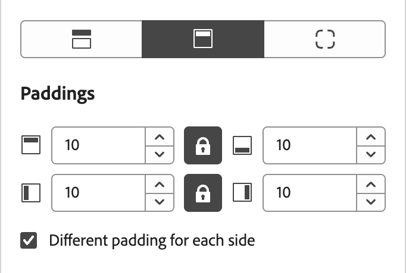
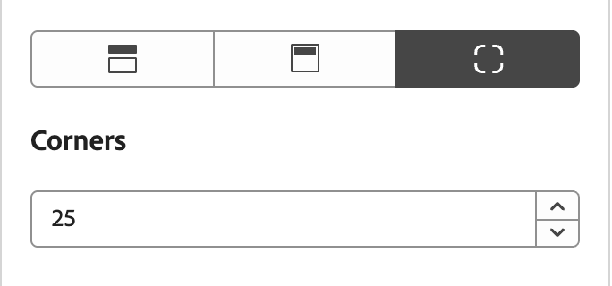
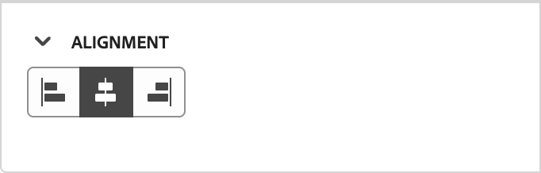

# Utiliser des thèmes de marque pour le contenu des e-mails {#email-brand-themes}

>[!CONTEXTUALHELP]
>id="ajo-b2b_email_brand_theme"
>title="Appliquer un thème de marque à votre e-mail ou modèle d’e-mail"
>abstract="Sélectionnez un thème pour votre e-mail ou votre modèle d’e-mail afin d’appliquer un style spécifique adapté à votre marque et à votre conception."

Grâce aux thèmes, les concepteurs non techniques ont la possibilité de créer des directives de conception de contenu d’e-mail réutilisables qui s’alignent sur une marque et un style spécifiques. Les thèmes permettent aux spécialistes du marketing d’utiliser plus rapidement et à moindre effort des e-mails visuellement attrayants et cohérents avec la marque, et fournissent des options de personnalisation avancées pour des besoins de conception uniques.

## Directives et limites du thème {#themes-guidelines}

Lorsque vous utilisez des thèmes, gardez à l’esprit les instructions et limites suivantes :

* Lorsque vous créez un e-mail ou un modèle d’e-mail à partir d’une zone de travail vierge (_conception en partant de zéro_), vous pouvez choisir le _mode Thème_ pour commencer à créer votre contenu à l’aide d’un thème afin d’appliquer un style spécifique adapté à votre marque et à votre conception. Si vous choisissez _mode manuel_, vous ne pouvez pas appliquer un thème, sauf si vous réinitialisez la conception de l’e-mail ou du modèle d’e-mail.

* Les [fragments](./fragments.md) ne sont pas compatibles entre le _mode Thème_ et le _mode Manuel_ dans le contenu de l’e-mail. Pour utiliser un fragment dans le contenu d’e-mail auquel un thème est appliqué, le fragment doit également être créé en _mode Thème_.

* Les modifications apportées à un thème personnalisé ne sont pas automatiquement répercutées en cascade sur tous les e-mails ou modèles d’e-mail qui l’utilisent déjà. Modifiez le contenu de chaque pour actualiser le thème.

* Si vous supprimez un thème, cela n’a aucune incidence sur les e-mails ou les modèles d’e-mail auxquels il a déjà été appliqué.
<!-- 
* If using a content created in HTML, you will be in [compatibility mode](existing-content.md) and you cannot apply themes to this content.
-->

## Créer un thème de marque {#create-theme}

Définissez votre propre thème de marque que vous pouvez appliquer à votre contenu d’e-mail et de modèle d’e-mail dans le contenu de votre futur e-mail.

1. Accédez aux outils de thème à l’aide de l’une des méthodes suivantes :

   * [Créez un modèle d’e-mail](./email-templates.md#create-an-email-template) puis cliquez sur **[!UICONTROL Modifier le modèle d’e-mail]** pour lancer la page _[!UICONTROL Concevoir votre modèle]_.

   * Cliquez sur **[!UICONTROL ... Plus]** en haut à droite de l’espace de conception du contenu d’e-mail et choisissez **[!UICONTROL Modifier votre conception]**.

     {width="700" zoomable="yes"}

     Dans la boîte de dialogue de confirmation, cliquez sur **[!UICONTROL Modifier le modèle]** pour ouvrir la page de conception.

1. Dans la page de conception, choisissez **[!UICONTROL Créer ou modifier des thèmes]**.

   {width="800" zoomable="yes"}

1. Sélectionnez le thème par défaut ou utilisez l’un des thèmes Adobe à utiliser comme point de départ.

   >[!NOTE]
   >
   >Si vous souhaitez utiliser l’un de vos thèmes personnalisés (_[!UICONTROL Mes thèmes]_) comme point de départ, vous pouvez [le dupliquer](#delete-or-duplicate-a-theme) et modifier le nom du thème lorsque vous [modifiez le thème](#edit-a-theme).

1. Cliquez sur **[!UICONTROL Créer]**.

   {width="750" zoomable="yes"}

   La page _[!UICONTROL Créer un thème]_ fournit une zone de travail avec les éléments existants de tous les types de texte, boutons et conteneurs à partir du thème de départ.

1. Utilisez le volet de navigation de droite pour accéder aux différents onglets de style de thème et modifier les paramètres de thème :

   * [Paramètres généraux](#general-settings)
   * [Couleurs](#colors)
   * [Paramètres de texte](#text-settings)
   * [Espacement et bordure](#spacing-and-border)
   * [Bouton](#button)
   * [Diviseur](#divider)
   * [Tableau](#grid)

   Les éléments visuels changent sur la zone de travail lorsque vous définissez les nouveaux paramètres de thème. Si le résultat ne vous convient pas, vous pouvez cliquer sur l’icône _Annuler_ ( {width="16"} ) en bas du panneau de droite. Cliquez sur l’icône _Rétablir_ ( {width="16"} ) pour appliquer à nouveau la modification.

1. Une fois la définition du thème terminée, cliquez sur **[!UICONTROL Enregistrer]**.

1. Cliquez sur **[!UICONTROL Fermer]** pour revenir à la page _[!UICONTROL Créer un thème]_, puis sur **[!UICONTROL Annuler]** pour revenir à la page de conception.

   Vous pouvez ensuite choisir **[!UICONTROL Créer en partant de zéro]** pour ouvrir l’espace de conception visuelle et [utiliser le thème](#use-your-theme-for-email-content-authoring) pour l’e-mail ou le modèle.

### Paramètres généraux

Dans l’onglet **[!UICONTROL Paramètres généraux]** définissez les paramètres de base de votre thème :

* Saisissez un **[!UICONTROL Nom du thème]** unique.

* Ajustez la **[!UICONTROL largeur de la fenêtre d’affichage]** pour le contenu (corps) de l’e-mail. Utilisez les flèches vers le haut et vers le bas pour augmenter ou réduire la largeur, ou saisissez la valeur (en pixels).

{width="450"}
<!--  and also export the current theme to [share it across sandboxes](../configuration/copy-objects-to-sandbox.md).-->

### Couleurs

Sélectionnez l’onglet **[!UICONTROL Couleurs]** et utilisez les paramètres pour définir la palette de couleurs du thème.

{width="450"}

* Cliquez sur **[!UICONTROL Modifier]** pour afficher la palette de couleurs qui comprend les couleurs de votre thème.

  Choisissez un **[!UICONTROL Paramètre prédéfini]** pour utiliser un jeu de couleurs pour le thème ou ajustez chaque couleur de la visionneuse. Vous pouvez également utiliser une combinaison des deux.

  {width="350"}

  Pour le carré de couleur sélectionné en haut, vous pouvez définir la couleur en entrant une valeur RGB, HSL, HSB ou hexadécimale connue. Vous pouvez également utiliser le curseur de couleur et le champ de couleur pour sélectionner la couleur.

  Cliquez sur la flèche _Précédent_ pour fermer les outils de palette de couleurs.

* Cliquez sur **[!UICONTROL Ajouter une variante]** pour créer plusieurs variantes de couleurs, telles qu’un mode _clair_ et _sombre_, où chaque variante a sa propre palette de couleurs et ses propres commandes de nuance. Vous pouvez avoir jusqu’à six variantes.

  Pour chaque variante, cliquez sur l’icône _Modifier_ (  ). Vous pouvez utiliser la palette par défaut ou n’importe quelle couleur personnalisée.

  {width="450"}

  Pour chaque couleur à modifier pour la variante, déplacez le bouton (bascule) vers la gauche ou la droite pour le désactiver ou l’activer. Pour un paramètre de couleur activé, cliquez sur le carré de couleur pour choisir la couleur.

  {width="450"}

  +++Paramètres des variantes de couleurs

  Les paramètres sont regroupés en fonction de leur type :

  | Type | Paramètres | Description |
  | ---- | -------- | ----------- |
  | [!UICONTROL Général] | {width="300"} | Ces paramètres vous permettent de définir des couleurs pour le corps, les structures, les conteneurs, les arrière-plans, les liens, les grilles et les bordures. |
  | [!UICONTROL En-têtes] | {width="300"} | Ces paramètres s’appliquent aux éléments de `Heading`, où vous pouvez définir le texte et les couleurs de bordure pour chacun des six niveaux d’en-tête. Développez chaque niveau d’en-tête pour lequel vous souhaitez définir la couleur de la variante. |
  | [!UICONTROL Paragraphes] | {width="300"} | Ces paramètres s’appliquent aux éléments de `Paragraph`, où vous pouvez définir le texte et les couleurs de bordure pour chacun des trois types de paragraphe. Développez chaque type de paragraphe dont vous souhaitez définir la couleur pour la variante. |
  | [!UICONTROL  Boutons ] | {width="300"} | Les paramètres s’appliquent aux éléments de bouton, où vous pouvez définir la couleur de remplissage, la couleur de bordure et la couleur de texte pour chacun des trois paramètres prédéfinis de bouton : _Principal_, _Secondaire_ et _Tertiaire_. |

  +++

### Paramètres de texte

Dans l’onglet **[!UICONTROL Paramètres de texte]**, vous pouvez définir les types, styles et tailles de polices globaux que vous souhaitez utiliser pour votre thème. Pour un contrôle plus granulaire, vous pouvez également modifier ces paramètres pour les types d’en-tête et de paragraphe.

{width="450"}

+++Paramètres de texte par type

| Type | Paramètres | Description |
| ---- | -------- | ----------- |
| [!UICONTROL Global] | {width="300"} | Définissez la **[!UICONTROL Bibliothèque de polices]** sur _[!UICONTROL Standard]_ ou _[!UICONTROL Polices Google]_. Choisissez ensuite la famille de polices à utiliser. Ces paramètres de texte globaux s’appliquent à l’ensemble du texte, sauf si vous définissez différents styles de texte pour les niveaux d’en-tête et les types de paragraphe. |
| [!UICONTROL En-têtes] | {width="300"} | Pour le niveau d’en-tête que vous souhaitez définir, sélectionnez **[!UICONTROL H1]**, **[!UICONTROL H2]**, etc. Définissez la **[!UICONTROL Bibliothèque de polices]** sur _[!UICONTROL Standard]_ ou _[!UICONTROL Polices Google]_. Choisissez ensuite la famille, la taille et le style de la police. Choisissez le **[!UICONTROL Alignement du texte]** : _Gauche_, _Centré_, _Droite_ ou _Justifié_. |
| [!UICONTROL Paragraphes] | {width="300"} | Pour le niveau d’en-tête que vous souhaitez définir, sélectionnez **[!UICONTROL P1]**, **[!UICONTROL HP]**, etc. Définissez la **[!UICONTROL Bibliothèque de polices]** sur _[!UICONTROL Standard]_ ou _[!UICONTROL Polices Google]_. Choisissez ensuite la famille, la taille et le style de la police. Ajustez la **[!UICONTROL Hauteur de la ligne]** selon vos besoins. Choisissez le **[!UICONTROL Alignement du texte]** : _Gauche_, _Centré_, _Droite_ ou _Justifié_. |

+++

### Espacement et bordure

Dans l&#39;onglet **[!UICONTROL Espacement]**, vous pouvez définir la marge intérieure et la marge des différents types d&#39;éléments. Pour **[!UICONTROL Sélectionner un type]**, choisissez le type de contenu. Définissez ensuite la marge intérieure, les marges, les coins et les bordures applicables à ce type d’élément.

{width="450"}

+++Paramètres d’espacement

| Type | Paramètres | Description |
| ---- | -------- | ----------- |
| [!UICONTROL  Marges ] | {width="300"} | Sélectionnez l’icône _Marge_ pour afficher les paramètres qui répliquent le paramètre de `margin` CSS, qui contrôle l’espace en dehors d’une bordure de composant et le sépare des autres composants/éléments. Cela crée un espace autour du composant afin d’influencer son positionnement et la mise en page du contenu environnant. Définissez les valeurs de marge en pixels en fonction de vos besoins de conception. Vous pouvez définir la marge pour tous les côtés, le coin supérieur inférieur, le coin gauche droit ou chaque côté du composant indépendamment. Cliquez sur les icônes _Verrouiller_ et _Déverrouiller_ pour synchroniser ou désynchroniser les valeurs des marges supérieure inférieure et gauche-droite. |
| [!UICONTROL Marges Intérieures] | {width="300"} | Sélectionnez l’icône _Marge intérieure_ pour afficher les paramètres qui répliquent le paramètre de `padding` CSS, à savoir l’espace entre le contenu d’un composant/élément et sa bordure. La marge intérieure fournit un espacement interne que vous pouvez utiliser pour contrôler la distance entre le contenu et la bordure du composant. Définissez les valeurs de marge intérieure en pixels en fonction de vos besoins de conception. Vous pouvez définir la marge intérieure pour tous les côtés, le haut-bas, la gauche-droite ou chaque côté du composant indépendamment. Cliquez sur les icônes _Verrouiller_ et _Déverrouiller_ pour synchroniser ou désynchroniser les valeurs de marge intérieure supérieure inférieure et gauche-droite. |
| [!UICONTROL Coins] | {width="300"} | Sélectionnez l’icône _Coins_ pour afficher les paramètres qui répliquent le paramètre de `border-radius` CSS, qui définit le rayon des coins du composant/de l’élément. Définissez la valeur numérique en fonction de la courbe que vous souhaitez pour les coins. Une valeur de 0 (par défaut) génère un coin carré. |

+++

+++Paramètres de bordure

Déplacez le bouton bascule **[!UICONTROL Bordure]** vers la droite pour activer les options d’affichage des bordures et les définir en fonction de vos critères de conception :

* Pour définir la **[!UICONTROL Taille de la bordure]** (largeur de ligne), cliquez sur les icônes de flèche vers le haut et vers le bas pour augmenter ou réduire le nombre de pixels.

* Pour définir le **[!UICONTROL Style de bordure]**, choisissez une valeur dans la liste des valeurs de `border-style` CSS standard, telles que _Continu_, _Pointillé_ et _Tiret_.

* Pour déterminer l’emplacement d’affichage de la bordure, cochez chaque case **[!UICONTROL Position de la bordure]**.

{width="250"}

+++

### Boutons

Dans l’onglet **[!UICONTROL Boutons]**, vous pouvez définir différents attributs (autres que la couleur) pour les éléments de bouton, tels que le rayon de la bordure (forme), le texte et la taille. Vous pouvez modifier les paramètres de chacun des trois paramètres prédéfinis de bouton : _[!UICONTROL Principal]_, _[!UICONTROL Secondaire]_ et _[!UICONTROL Tertiaire]_.

{width="450"}

+++Paramètres des boutons

| Type | Paramètres | Description |
| ---- | -------- | ----------- |
| [!UICONTROL Texte] | {width="300"} | Définissez la **[!UICONTROL Bibliothèque de polices]** sur _[!UICONTROL Standard]_ ou _[!UICONTROL Polices Google]_. Choisissez ensuite la famille, la taille et le style de la police. Choisissez le **[!UICONTROL Alignement du texte]** : _Gauche_, _Centré_, _Droite_ ou _Justifié_. |
| [!UICONTROL  Bordure ] | {width="300"} | Déplacez le bouton bascule **[!UICONTROL Bordure]** vers la droite pour activer les options d’affichage des bordures des boutons et les définir en fonction de vos critères de conception. Définissez la **[!UICONTROL Taille de la bordure]** (largeur de ligne) en augmentant ou en réduisant le nombre de pixels. Définissez le **[!UICONTROL Style de bordure]** en choisissant une valeur dans la liste des valeurs de `border-style` CSS standard, telles que _Continu_, _Pointillé_ et _Tiret_. |
| [!UICONTROL Taille] | {width="300"} | Pour l’option **[!UICONTROL Hauteur]**, cliquez sur les icônes fléchées vers le haut et vers le bas pour augmenter ou réduire le nombre de pixels. Une valeur vide (Auto) est la valeur par défaut et mesure la hauteur du bouton en fonction de son contenu. Pour l’option **[!UICONTROL Largeur]**, utilisez le bouton (bascule) pour définir la largeur en pixels ou en pourcentage. Pour un pourcentage de largeur, utilisez le curseur pour définir la valeur de pourcentage. Le pourcentage détermine la taille du bouton en fonction de la zone de contenu du bloc conteneur, ce qui exclut la marge intérieure et les bordures. Par exemple, une valeur de 50 définit la largeur du bouton sur 50 % de celle du contenu du bloc qui le contient. Pour une largeur en pixels, cliquez sur les icônes fléchées vers le haut et vers le bas pour augmenter ou réduire le nombre de pixels. Une valeur vide (_Auto_) est la valeur par défaut et mesure la largeur du bouton en fonction de son contenu. |

+++

### Diviseur

Dans l’onglet **[!UICONTROL Diviseur]**, vous pouvez définir le style de ligne et les paramètres de conteneur d’un composant de division.

{width="450"}

+++Paramètres du séparateur

| Type | Paramètres | Description |
| ---- | -------- | ----------- |
| [!UICONTROL Ligne] | {width="300"} | Définissez le **[!UICONTROL Style de bordure]** en choisissant une valeur dans la liste des valeurs de `border-style` CSS standard, telles que _Continu_, _Pointillé_ et _Tiret_. |
| [!UICONTROL  Taille du conteneur ] | {width="300"} | Pour l’option **[!UICONTROL Hauteur]**, cliquez sur les icônes fléchées haut et bas pour augmenter ou réduire le nombre de pixels pour le composant/l’élément. Une valeur vide (Auto) est la valeur par défaut et dimensionne la hauteur en fonction de son contenu (style de ligne). Pour l’option **[!UICONTROL Largeur]**, utilisez le bouton (bascule) pour définir la largeur en pixels ou en pourcentage. Pour un pourcentage de largeur, utilisez le curseur pour définir la valeur de pourcentage. Le pourcentage détermine la largeur de l’élément en fonction de la zone de contenu du bloc conteneur. Par exemple, une valeur de 50 définit la largeur du séparateur sur 50 % de la largeur du contenu du bloc qui le contient. Pour une largeur en pixels, cliquez sur les icônes fléchées vers le haut et vers le bas pour augmenter ou réduire le nombre de pixels. Une valeur vide (_Auto_) est la valeur par défaut et mesure la largeur du séparateur en fonction de son contenu. |
| [!UICONTROL Alignement] | {width="300"} | Sélectionnez l’alignement horizontal dans le bloc conteneur : _Gauche_, _Centré_ ou _Droite_. |

+++

### Tableau

Dans l’onglet **[!UICONTROL Grille]**, vous pouvez contrôler les espaces entre les colonnes et les lignes pour un élément de grille :

* **[!UICONTROL Écart entre les colonnes]** - Cliquez sur les icônes fléchées vers le haut et vers le bas pour augmenter ou réduire le nombre de pixels de l’écart entre les colonnes de la grille. Vous pouvez également saisir un nombre dans le champ .

* **[!UICONTROL Écart entre les lignes]** - Cliquez sur les icônes fléchées vers le haut et vers le bas pour augmenter ou réduire le nombre de pixels de l’écart entre les lignes de la grille. Vous pouvez également saisir un nombre dans le champ .

{width="700" zoomable="yes"}

## Modification d’un thème

Vous pouvez modifier un thème à l’aide du même workflow et des mêmes outils que ceux que vous utilisez lors de la création d’un thème. La différence est que vous sélectionnez l’onglet **[!UICONTROL Mes thèmes]** et sélectionnez le thème personnalisé que vous souhaitez modifier.

{width="750" zoomable="yes"}

Utilisez le rail à droite pour parcourir les différents onglets et modifier les paramètres de thème :

* [Paramètres généraux](#general-settings)
* [Couleurs](#colors)
* [Paramètres de texte](#text-settings)
* [Espacement et bordure](#spacing-and-border)
* [Bouton](#button)
* [Diviseur](#divider)
* [Tableau](#grid)

{width="800" zoomable="yes"}

Les éléments visuels affichés changent lorsque vous modifiez les paramètres. Si le résultat affiché sur la zone de travail n’est pas celui que vous souhaitez, vous pouvez cliquer sur l’icône _Annuler_ ( {width="16"} ) dans la partie inférieure du panneau de droite. Cliquez sur l’icône _Rétablir_ ( {width="16"} ) pour appliquer à nouveau la modification.

Une fois les modifications du thème effectuées, cliquez sur **[!UICONTROL Enregistrer]**.

>[!NOTE]
>
>Les modifications enregistrées ne sont pas automatiquement répercutées en cascade sur tous les e-mails ou modèles d’e-mail qui utilisent actuellement le thème. Modifiez le contenu de chaque pour actualiser le thème et faire correspondre les styles mis à jour.

## Gestion des thèmes personnalisés

Vous pouvez gérer vos thèmes personnalisés à l’aide du même workflow et des mêmes outils que ceux utilisés lors de la création d’un thème. La différence est que vous sélectionnez l’onglet **[!UICONTROL Mes thèmes]** et gérez vos thèmes dans la liste affichée.

Si vous disposez d’une liste volumineuse de thèmes personnalisés, utilisez le champ _Rechercher_ et d’autres filtres pour réduire la liste affichée. À mesure que vous gérez votre liste de thèmes disponibles, vous pouvez modifier, supprimer ou dupliquer un thème personnalisé à tout moment.

{width="750" zoomable="yes"}

### Modification d’un thème

1. Sélectionnez le thème à modifier, puis cliquez sur **[!UICONTROL Modifier]** en haut à droite.

   {width="750" zoomable="yes"}

1. Utilisez la navigation à droite pour utiliser les différents onglets de style et modifier les paramètres de thème :

   * [Paramètres généraux](#general-settings)
   * [Couleurs](#colors)
   * [Paramètres de texte](#text-settings)
   * [Espacement et bordure](#spacing-and-border)
   * [Bouton](#button)
   * [Diviseur](#divider)
   * [Tableau](#grid)

   {width="800" zoomable="yes"}

   Les éléments visuels affichés changent lorsque vous modifiez les paramètres. Si le résultat sur la zone de travail n’est pas celui que vous souhaitez, vous pouvez cliquer sur l’icône _Annuler_ dans la partie inférieure du rail de droite. Cliquez sur l’icône _Rétablir_ pour appliquer à nouveau la modification.

1. Une fois les modifications du thème effectuées, cliquez sur **[!UICONTROL Enregistrer]**.

>[!NOTE]
>
>Les modifications du thème enregistrées ne sont pas automatiquement répercutées en cascade sur tous les e-mails ou modèles d’e-mail qui utilisent actuellement le thème. Modifiez le contenu de chaque pour actualiser le thème et faire correspondre les styles mis à jour.

### Supprimer ou dupliquer un thème

Lorsque vous localisez le thème, cliquez sur l’icône _Plus de menu_ (**...**) en bas à droite de la carte du thème et sélectionnez l’action à entreprendre :

{width="220"}

* **[!UICONTROL Dupliquer]** - Sélectionnez cette action pour dupliquer le thème. Le nouveau thème est identique à la _Copie de_ ajoutée au nom de l’original. Vous pouvez modifier le nom lorsque vous [modifiez le thème](#edit-a-theme).

* **[!UICONTROL Supprimer]** - Sélectionnez cette action pour supprimer le thème personnalisé. Dans la boîte de dialogue de confirmation, cliquez sur **[!UICONTROL Supprimer]**.

  >[!NOTE]
  >
  >La suppression du thème n’a aucune incidence sur les e-mails ou les modèles d’e-mail déjà appliqués.

## Utiliser un thème pour la création de contenu d’e-mail {#use-email-theme}

Lorsque vous créez un e-mail ou un modèle d’e-mail, vous pouvez choisir d’utiliser un thème de marque qui simplifie le processus de création de contenu et s’assure que la conception s’aligne sur les normes définies. Pour un nouveau fragment, vous pouvez également appliquer un thème avant d’enregistrer le fragment. Le fragment reste en _mode Thème_ à partir de ce point et est compatible avec les e-mails et les modèles d’e-mail qui sont également en _mode Thème_.

1. Sélectionnez l’une des actions suivantes :

   * Sélectionnez un modèle d’e-mail qui incorpore un thème (créé dans _mode Thème_). Le thème spécifique à chaque modèle est automatiquement appliqué.

   * Utilisez l’option _[!UICONTROL Créer en partant de zéro]_ et sélectionnez **[!UICONTROL Utiliser les thèmes]** pour commencer avec un thème de style prédéfini.

     {width="450"}

     >[!IMPORTANT]
     >
     >Si vous choisissez le mode _[!UICONTROL Style manuel]_, vous devez réinitialiser la conception de l’e-mail pour appliquer un thème.
     >
     >Si vous choisissez le mode _[!UICONTROL Thèmes]_, seuls les [fragments](./fragments.md) également créés en mode _Thèmes_ peuvent être ajoutés au contenu de l’e-mail.

1. Dans l’espace de conception d’e-mail, cliquez sur l’icône _Thèmes_ (  ) à droite.

   {width="600" zoomable="yes"}

   Le thème par défaut ou le thème appliqué au modèle s’affiche. Vous pouvez basculer entre les variantes de couleur pour ce thème.

1. Cliquez sur la flèche en regard du thème affiché pour afficher la liste des thèmes personnalisés et Adobe disponibles.

1. Cliquez sur **[!UICONTROL Mes thèmes]** et sélectionnez votre thème personnalisé.

   {width="325"}

1. Cliquez en dehors de la liste.

   Le thème personnalisé nouvellement sélectionné applique les styles à tous les composants d’e-mail dans la zone de travail. Vous pouvez basculer entre les variantes de couleur.

1. Si vous devez remplacer les styles de thème d’un composant sélectionné, cliquez sur l’icône _Déverrouiller les styles de composant_ (  ).

   {width="600" zoomable="yes"}

   Dans la boîte de dialogue de confirmation, cliquez sur **[!UICONTROL Déverrouiller]**.

   Sélectionnez l’onglet **[!UICONTROL Styles]** dans le panneau de droite pour modifier les paramètres du composant.

   {width="600" zoomable="yes"}

## Modifier le thème du contenu de votre e-mail

Pour un e-mail ou un modèle d’e-mail créé en _mode Thème_, vous pouvez modifier le thème à tout moment. Le contenu de l’e-mail reste inchangé, mais les styles sont mis à jour pour refléter le nouveau thème.

1. Ouvrez l’e-mail ou le modèle d’e-mail dans l’espace de conception.

1. Cliquez sur l’icône _Thèmes_ (  ) à droite.

   Le thème appliqué s’affiche dans le panneau de droite.

1. Cliquez sur la flèche en regard du thème affiché pour afficher la liste des thèmes personnalisés et Adobe disponibles.

1. Sélectionnez un autre thème.

1. Cliquez en dehors de la liste.

   Le thème sélectionné applique les styles à tous les composants d’e-mail dans la zone de travail. Vous pouvez basculer entre les variantes de couleur.

<!--
>[!NOTE]
> - Themes apply styles globally. Ensure your theme is finalized before applying it to multiple emails.
> - Switching themes may override custom styles applied to individual components.

>[!CAUTION]
> - When using fragments, the email's theme will override the fragment's styles. A warning will be displayed in the editor if there is a conflict.

## Example Use Cases {#example-use-cases}

### 1. Creating a New Theme
- A designer creates a theme with their brand's colors, fonts, and button styles.
- The theme is saved and reused by marketers to author multiple emails.

### 2. Switching Themes
- A marketer applies a holiday-themed design to an existing email by switching to a pre-designed holiday theme.-->
