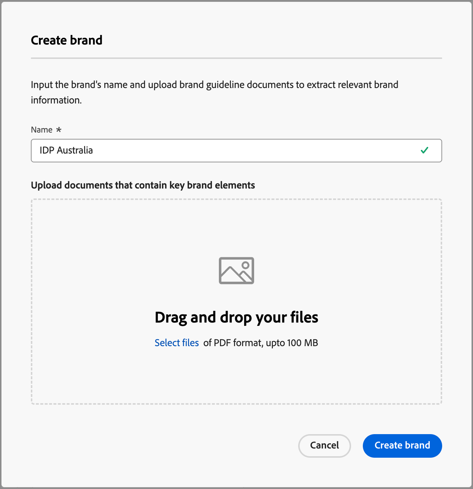

# Créer et gérer vos marques {#brand-library}

Définissez une marque afin de fournir un ensemble détaillé de règles et de normes qui établissent une identité visuelle et verbale. Ces directives fournissent une référence pour maintenir une représentation cohérente de la marque sur toutes les plateformes de marketing et de communication. En s’appuyant sur des directives de marque bien définies, les entreprises peuvent s’assurer que tous les efforts de création de contenu sont alignés sur les objectifs stratégiques et l’identité de marque globale. Cette cohérence améliore non seulement la reconnaissance et la confiance de la marque, mais contribue également à une expérience client plus cohérente et plus percutante à tous les points de contact.

Dans Journey Optimizer B2B edition, vous pouvez définir et organiser manuellement vos ressources et définitions de marque ou charger des documents de directives de marque pour obtenir des informations automatiques et extraire visuellement des ressources.

>[!AVAILABILITY]
>
>Cette fonctionnalité est actuellement disponible en version bêta privée et une disponibilité progressive est prévue pour tous les clients dans les prochaines versions.
>
> 
>
>Un [contrat d’utilisateur](https://www.adobe.com/legal/licenses-terms/adobe-dx-gen-ai-user-guidelines.html){target="_blank"} est requis avant de pouvoir utiliser les fonctionnalités optimisées par l’IA dans Adobe Journey Optimizer B2B edition. Pour plus d’informations, contactez votre représentant ou représentante Adobe.
>
> 
>
>Consultez [Autorisations liées aux marques](./brands-overview.md#brand-related-permissions) pour plus d’informations sur la manière dont les administrateurs et administratrices de produit peuvent activer ces fonctionnalités.

## Accéder à votre bibliothèque de marques

Pour accéder aux kits de marques dans Adobe Journey Optimizer B2B edition, accédez au volet de navigation de gauche et cliquez sur **[!UICONTROL Gestion de contenu]** > **[!UICONTROL Marques]**. Cette action ouvre une page où les marques créées sont affichées sous forme de cartes.

{width="800" zoomable="yes"}

Si aucune marque n’a encore été créée, un seul graphique s’affiche avec un bouton pour [créer votre première marque](#create-and-define-a-brand).

### Actions de Brand Management

Pour chaque carte, vous pouvez cliquer sur l’icône _Plus de menu_ (  ) et choisir une action pour la marque :

* **[!UICONTROL Afficher la marque]** - Ouvrez la page de marque et affichez les définitions.
* **[!UICONTROL Marquer comme marque par défaut]** (en direct uniquement) - [Marquer la marque comme marque par défaut](#default-brand) pour l’alignement et la génération du contenu.
* **[!UICONTROL Modifier]** - Ouvrez la page de marque et modifiez les directives, les exclusions et les exemples de la marque.
* **[!UICONTROL Dupliquer]** - Créez une copie en tant que nouveau brouillon de marque.
* **[!UICONTROL Publier]** (brouillon uniquement) - [Publier la marque](#publish-the-brand) pour la rendre disponible pour une utilisation avec l’alignement et la génération du contenu.
* **[!UICONTROL Dépublier]** (en direct uniquement) - Dépubliez la marque pour la supprimer de l’utilisation pour l’alignement et la génération de contenu.
* **[!UICONTROL Supprimer]** - Supprimez la marque de votre bibliothèque de marques.

{width="440"}

### Marque par défaut

Vous pouvez désigner une marque par défaut à appliquer automatiquement lors de la génération du contenu et du calcul des scores d’alignement lors de la création du contenu. Seule une marque publiée (_en direct_) peut être la marque par défaut.

Dans la bibliothèque de marques, la vignette de marque par défaut est affichée avec un indicateur .

{width="200"}

Vous pouvez définir n’importe quelle marque publiée (_en direct_) comme marque par défaut. Sur la carte de marque, cliquez sur l’icône _Plus de menu_ (  ) et choisissez **[!UICONTROL Marquer comme marque par défaut]**.

{width="350"}

## Créer et définir une marque {#create-brand}

>[!CONTEXTUALHELP]
>id="ajo-b2b_brands_create"
>title="Créer votre marque"
>abstract="Saisissez votre nom de marque et chargez votre fichier de directives de marque. L’outil extrait automatiquement les détails clés, ce qui facilite le maintien de l’identité de votre marque."

Pour créer et définir vos directives de marque, vous pouvez saisir les détails ou charger vos documents de directives de marque à utiliser pour l’extraction automatique.

### Ajouter la marque

1. Dans le coin supérieur droit de la page _[!UICONTROL Marques]_, cliquez sur **[!UICONTROL Créer une marque]**.

1. Saisissez le **[!UICONTROL Nom]** de votre marque.

1. Effectuez un glisser-déposer ou sélectionnez votre fichier pour charger les directives de votre marque et extraire automatiquement les informations pertinentes sur la marque.

   {width="500"}

   >[!NOTE]
   >
   >Si aucun document n’est enregistré au format PDF, vous pouvez ajouter manuellement les directives et charger des ressources visuelles individuelles après la création de la marque.

1. Cliquez sur **[!UICONTROL Créer une marque]**.

   Si vous incluez un ou plusieurs fichiers pour créer la marque, le processus d’extraction des informations commence. Cela peut prendre plusieurs minutes.

   Une fois le processus d’extraction terminé, vos normes de création de contenu et visuelles sont automatiquement renseignées.

   {width="700" zoomable="yes"}

### Affiner et mettre à jour les directives de la marque

1. Parcourez les différents onglets pour vous adapter et définir des informations plus détaillées si nécessaire.

   * [!UICONTROL Vue d’ensemble]

   * [[!UICONTROL À propos de la marque]](#about-the-brand)

   * [[!UICONTROL Style d&#39;écriture]](#writing-style)

   * [[!UICONTROL Contenu visuel]](#visual-content)

   Si vous avez inclus un ou plusieurs documents lors de la création de la marque, le processus d’extraction des informations a créé des définitions pour les onglets et les sections. L’exhaustivité dépend de la portée et des détails inclus dans les documents. En examinant le résultat, vous pouvez modifier ou supprimer n’importe quelle information.

   Dans le menu _Plus_ (  ) pour chaque onglet ou catégorie, vous pouvez ajouter des documents pour extraire automatiquement les informations de marque pertinentes. Vous pouvez également effacer le contenu existant.

   {width="500" zoomable="yes"}

   Si vous souhaitez consulter la source des informations extraites dans une sous-section, cliquez sur le lien **[!UICONTROL Afficher la source]**.

   {width="700" zoomable="yes"}

1. Dans chaque onglet de détails, passez en revue les catégories et améliorez la marque en ajoutant, en supprimant et en modifiant vos définitions.

   Une sous-section intitulée **[!UICONTROL À faire]** présente les instructions relatives à cette catégorie. Utilisez cette zone pour ajouter des descriptions et des exemples de consignes.

   {width="500" zoomable="yes"}

   Une sous-section intitulée **[!UICONTROL Ne pas]** décrit les exclusions. Utilisez cette zone pour ajouter des descriptions et des exemples d&#39;exclusions.

   {width="500" zoomable="yes"}

   * **Ajoutez une directive ou une exclusion**.

     Dans la section où vous souhaitez ajouter une directive, cliquez sur l’icône _Ajouter_ (  ) à droite. Dans la boîte de dialogue contextuelle, saisissez la consigne et cochez les cases pour désigner les canaux et les éléments auxquels s’applique la consigne. Cliquez ensuite sur **[!UICONTROL Ajouter]**.

     {width="600" zoomable="yes"}

   * **Modifier une directive ou une exclusion**.

     Dans la section où vous souhaitez supprimer une directive, cliquez sur le widget de directive. Dans la boîte de dialogue contextuelle, modifiez le contenu de la directive et les cases à cocher sélectionnées selon les besoins. Cliquez ensuite sur **[!UICONTROL Mettre à jour]**.

     {width="600" zoomable="yes"}

   * **Supprimer une directive ou une exclusion**.

     Dans la section où vous souhaitez supprimer une directive, cliquez sur le widget de directive. Dans la boîte de dialogue contextuelle, cliquez sur l’icône _Supprimer_ (  ) en haut.

   * **Ajoutez ou révisez des exemples de vos directives et exclusions**.

     Dans la mosaïque d’exemple affichée, cliquez sur l’icône _Modifier_ (  ) pour modifier l’exemple ou cliquez sur l’icône _Supprimer_ (  ) pour le supprimer.

1. Lorsque tout est défini, cliquez sur **[!UICONTROL Enregistrer]**.

   Vous pouvez continuer à apporter des modifications au brouillon de marque jusqu’à ce que vous décidiez qu’il est prêt à être publié.

### Publier la marque

Lorsque votre marque comprend un ensemble complet de définitions et répond à vos exigences, cliquez sur **[!UICONTROL Publier]** pour rendre vos directives de marque disponibles pour l’alignement et la génération du contenu.

Les marques publiées sont accessibles à partir de l’option **[!UICONTROL Marque]** dans l’IA [alignement des marques](./brand-alignment.md) et les outils de génération de contenu. <!-- [Learn more about content generation](gs-generative.md) -->

{width="300"}

## Définitions de marque

Les définitions de marque sont organisées en trois catégories, affichées sous forme d’onglets. Sélectionnez chaque onglet pour remplir et mettre à jour les directives de la marque.

### À propos de la marque {#about-brand}

Utilisez l’onglet **[!UICONTROL À propos de la marque]** pour établir l’identité de base de votre marque. Ces informations décrivent son objectif, sa personnalité, son slogan et d’autres attributs de haut niveau.

1. Ajoutez les informations de base de votre marque dans la catégorie **[!UICONTROL Détails clés]** :

   * **[!UICONTROL Marque du kit]** - Mettez à jour la marque.

   * **[!UICONTROL Quand utiliser]** - Spécifiez les scénarios ou les contextes où cette marque doit être appliquée.

   * **[!UICONTROL Nom de la marque]** - Saisissez le nom officiel de la marque.

   * **[!UICONTROL Description de cette marque]** - Donnez un aperçu de ce que cette marque représente.

   * **[!UICONTROL Ligne de balise (par défaut)]** - Ajoutez la ligne de balise principale associée à la marque.

   {width="600" zoomable="yes"}

1. Dans la catégorie **[!UICONTROL Principes directeurs]**, clarifiez l’orientation principale et la philosophie de votre marque :

   * **[!UICONTROL Mission]** - Détaillez l’objectif de la marque.

   * **[!UICONTROL Vision]** - Décrivez l’objectif à long terme ou l’état futur souhaité.

   * **[!UICONTROL Positionnement sur le marché]** - Expliquez comment la marque se positionne sur le marché.

   {width="600" zoomable="yes"}

   Dans la catégorie **[!UICONTROL Valeurs de marque principales]** passez en revue les valeurs de marque définies et ajustez-les si nécessaire.

   * Pour définir une nouvelle valeur de base, cliquez sur l’icône _Ajouter_ (  ) à droite et renseignez les détails :

     {width="500" zoomable="yes"}

      * **[!UICONTROL Valeur]** - Saisissez le nom de la valeur de marque principale.

      * **[!UICONTROL Description]** - Expliquez ce que cette valeur signifie pour votre marque.

      * **[!UICONTROL Comportements]** - Décrivez les actions ou attitudes qui reflètent cette valeur dans la pratique.

      * **[!UICONTROL Manifestations]** - Fournissez des exemples de la manière dont cette valeur est exprimée dans l’image de marque du monde réel.

   * Pour modifier ou supprimer une valeur de base, cliquez sur l’icône _Modifier_ (  ) pour mettre à jour ou supprimer une valeur de marque de base.

     {width="500" zoomable="yes"}

     Modifiez les détails et cliquez sur **[!UICONTROL Mettre à jour]**. Ou cliquez sur l’icône _Supprimer_ (  ) en haut pour supprimer la valeur de base.

1. Dans la catégorie **[!UICONTROL Documents de directives sur les marques]**, passez en revue les documents utilisés pour générer les directives sur les marques.

   Cliquez sur l’icône du menu Plus et sélectionnez une option pour mettre à jour les directives de la marque à l’aide des documents de référence chargés :

   * **[!UICONTROL Instructions de réextraction]** - Sélectionnez cette action pour exécuter une tâche d’extraction à l’aide des documents actuels.
   * **[!UICONTROL Ajouter une référence pour l’extraction]** - Sélectionnez cette action pour charger un autre document et exécuter une tâche d’extraction.

   {width="600" zoomable="yes"}

Vous pouvez affiner le [style d’écriture](#writing-style) ou le [contenu visuel](#visual-content) les instructions, les exclusions et les exemples, ou vous pouvez [publier votre marque](#publish-the-brand).

### Règle de style {#writing-style}

>[!CONTEXTUALHELP]
>id="ajo_brand_writing_style"
>title="Score d’alignement du style d’écriture"
>abstract="La section Style d’écriture définit des normes de langue, de mise en forme et de structure pour garantir un contenu clair et cohérent. Le score d’alignement, noté d’élevé à faible, montre dans quelle mesure votre contenu suit ces directives et met en évidence les domaines à améliorer."

Les définitions _[!UICONTROL Style d’écriture]_ décrivent les normes d’écriture du contenu et expliquent comment la langue, le formatage et la structure doivent être utilisés pour garantir la clarté, la cohérence et l’homogénéité de l’ensemble des ressources.

Sélectionnez l’onglet **[!UICONTROL Style d’écriture]** et passez en revue chaque catégorie.

{width="600" zoomable="yes"}

| Catégorie | Sous-catégorie | Exemple de directives | Exemple d’exclusions |
|----------------------------|----------------|-----------------------|-----------------------|
| [!UICONTROL Style de communication de la marque] | [!UICONTROL Caractéristiques de personnalité de la marque] | Amical et accessible. | Ne soyez pas défaitiste. |
|                            | [!UICONTROL Mécanique de l&#39;écriture] | Gardez les phrases courtes et percutantes. | N’utilisez pas trop de jargon. |
|                            | [!UICONTROL Ton situationnel] | Maintenez un ton professionnel dans les communications de crise. | Ne soyez pas dédaigneux dans les communications d’assistance. |
|                            | [!UICONTROL Consignes relatives au choix de mots] | Utilisez des mots comme _innovant_ et _intelligent_. | Évitez les mots comme _pas cher_ ou _hack_. |
|                            | [!UICONTROL &#x200B; Normes linguistiques &#x200B;] | Respectez les conventions françaises. | Faites attention à l’orthographe. |
| [!UICONTROL Normes de message de marque] | [!UICONTROL Normes de message de marque] | Mettez l’accent sur l’innovation et orientez les messages sur la clientèle. | Ne faites pas de promesses irréalistes sur les capacités du produit. |
|                            | [!UICONTROL Utilisation des balises] | Placez le slogan sous le logo sur toutes les ressources marketing numériques. | Ne modifiez ni ne traduisez le slogan. |
|                            | [!UICONTROL Messages principaux] | Mettez l&#39;accent sur l&#39;énoncé des principaux avantages, comme l&#39;amélioration de la productivité. | N’utilisez pas des propositions de valeur sans rapport. |
|                            | [!UICONTROL Normes de dénomination] | Utilisez des noms simples et descriptifs tels que _ProScheduler_. | N’utilisez ni des termes complexes ni des caractères spéciaux. |
| [!UICONTROL Normes de conformité légales] | [!UICONTROL Normes relatives aux marques] | Utilisez toujours le symbole ™ ou ®. | N’omettez pas les symboles légaux si nécessaire. |
|                            | [!UICONTROL Normes relatives aux droits d’auteur] | Incluez les avis de copyright sur les supports marketing. | N’utilisez pas de contenu tiers sans autorisation. |
|                            | [!UICONTROL Normes de non-responsabilité] | Affichez clairement les mentions légales sur les ressources numériques. | Ne masquez pas les mentions légales dans des zones non visibles. |

<!-- #### Preferred and avoided terms

Supplement your work choice guidelines by adding preferred and avoided terms. 

#### Primary tagline and variations

#### Brand names and variations

#### Approved and restricted statements
-->

### Contenu visuel {#visual-content}

>[!CONTEXTUALHELP]
>id="ajo-b2b_brand_imagery"
>title="Score d’alignement du contenu visuel"
>abstract="Le score d’alignement du contenu visuel indique dans quelle mesure votre contenu correspond aux directives configurées de votre marque. Noté d’élevé à faible, il vous permet d’évaluer l’alignement en un seul coup d’œil. Explorez les différentes catégories pour identifier les domaines à améliorer et déterminer les éléments qui peuvent ne pas être conformes à la marque."

Les définitions _[!UICONTROL Contenu visuel]_ décrivent les normes en matière d’imagerie et de conception, et détaillent les spécifications nécessaires pour conserver une apparence de marque unifiée et cohérente.

Sélectionnez l’onglet **[!UICONTROL Contenu visuel]** et passez en revue chaque catégorie.

{width="600" zoomable="yes"}

| Catégorie | Exemple de directives | Exemple d’exclusions |
|------------------------|---------------------|---------------------|
| [!UICONTROL Normes de photographie] | Utilisez l’éclairage naturel pour les prises de vue extérieures. | Évitez les images trop modifiées ou pixellisées. |
| [!UICONTROL Normes d’illustration] | Utilisez des styles épurés et minimalistes. | Optez pour la simplicité. |
| [!UICONTROL Normes des icônes] | Utilisez un système de grille cohérent de 24 px. | Ne mélangez pas les dimensions des icônes, n’utilisez pas d’épaisseurs de trait incohérentes et ne vous écartez pas des règles de grille. |
| [!UICONTROL Instructions d’utilisation] | Choisissez des images de style de vie qui représentent des clientes et clients réels utilisant le produit dans des environnements professionnels. | N’utilisez pas d’images qui contredisent le ton de la marque ou semblent hors contexte. |

<!-- #### Styles

To define the overall style for the category, click **[!UICONTROL Add style]**. In the popup dialog, enter the style type and description. 

{width="500" zoomable="yes"}

#### Specifications

-->

#### Exemples d’images

Pour ajouter une image présentant une utilisation correcte ou incorrecte, choisissez **[!UICONTROL Exemple]** dans la boîte de dialogue contextuelle _[!UICONTROL Ajouter une directive]_ ou _[!UICONTROL Ajouter une exclusion]_. Cliquez sur **[!UICONTROL Sélectionner une image]** pour choisir un fichier image de votre système. Cliquez sur **[!UICONTROL Ajouter]** pour charger l’image et afficher la miniature de la zone.

{width="500" zoomable="yes"}

## Modifier une marque publiée

Vous ne pouvez pas apporter de modifications à une marque publiée (en direct), mais vous pouvez créer un brouillon à modifier. Lorsque vous publiez le brouillon avec vos modifications, cette version remplace la version active.

1. Ouvrez la page de marque et cliquez sur **[!UICONTROL Modifier la marque]** en haut à droite.

1. Dans la boîte de dialogue de confirmation, cliquez sur **[!UICONTROL Modifier la marque]**.

   Cette action crée un brouillon de la marque.

1. Parcourez les différents onglets pour mettre à jour les informations de marque si nécessaire.

   * Vue d’ensemble

   * [À propos de la marque](#about-the-brand)

   * [Règle de style](#writing-style)

   * [Contenu visuel](#visual-content)

1. Cliquez sur **[!UICONTROL Enregistrer]** lorsque vous travaillez avec les mises à jour des brouillons, puis sur **[!UICONTROL Publier]** lorsque vous êtes prêt à remplacer la version _en direct_.
